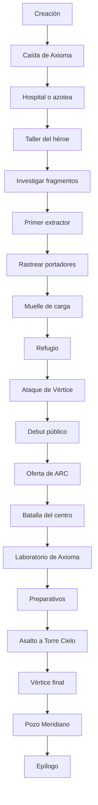

# Campaña híbrida 05 — El día que Axioma cayó

> Documento de diseño narrativo para una campaña completa de superhéroes.
>
> Género: acción superheroica urbana, ciencia fantástica y drama de identidad.
>
> Duración objetivo: 9 a 13 horas de lectura interactiva.
>
> Estructura: prólogo, cinco capítulos, diecinueve nodos principales y seis familias de cierre.

---

## 0. Cómo utilizar este documento

Este archivo define una campaña jugable completa para el sistema descrito en `GDD-RPG-Narrativo-IA.md`. No es una novela cerrada ni una colección de prompts sueltos. Es la fuente de verdad para el motor narrativo, el sistema de tiradas y el narrador de IA.

La campaña combina escenas escritas, decisiones delimitadas y corredores generativos. Las elecciones cambian relaciones, recursos, acceso a pruebas, dificultad de los combates, estado de la ciudad y forma del final. Los hitos centrales son fijos porque sostienen el arco dramático; la ruta para alcanzarlos y el costo pagado sí pertenecen al jugador.

### 0.1 Orden de autoridad

Ante una contradicción, aplicar este orden:

1. Resultado determinista producido por el motor.
2. Estado persistente y flags canónicos.
3. Definición del nodo actual.
4. Canon de campaña.
5. Contrato del narrador.
6. Texto generado.

La IA no puede conceder poderes, eliminar heridas, cambiar una tirada, matar un personaje protegido ni revelar una verdad antes de tiempo. Puede elegir detalles sensoriales, diálogos, ritmo de una persecución y consecuencias locales compatibles con el estado.

### 0.2 Convenciones

- Los identificadores entre backticks son canónicos.
- `PC` significa protagonista.
- `ARC` significa Agencia de Respuesta a Crisis Meta.
- Una opción marcada como **[Tirada]** requiere resolución del motor.
- Una opción marcada como **[Costo]** se ejecuta si el recurso existe y no requiere tirada.
- Una opción marcada como **[Principio]** invoca el principio heroico elegido.
- “Fragmento” significa una porción estable de la Matriz Axioma alojada en un ser vivo.
- “Portador” designa a cualquier persona que haya recibido un fragmento.
- “Núcleo” designa la fuente de energía completa que Axioma dispersó antes de morir.
- “Guardia” es la resistencia abstracta de un adversario durante combate.

---

## 1. Visión

### 1.1 Premisa

Durante quince años, Ciudad Meridiano tuvo algo que ninguna otra metrópolis podía comprar: Axioma, un héroe capaz de detener trenes con las manos, volar por encima de la tormenta y mantener a raya a seres que obligaban al ejército a evacuar provincias enteras.

La ciudad se acostumbró a que él llegara.

La campaña comienza el día en que no llega a tiempo.

En plena hora pico, una criatura blindada llamada Brontes ataca el Puente Celeste. Axioma vence, pero descubre que el combate fue una maniobra para abrir el Pozo Meridiano, el reactor gravitacional enterrado bajo la ciudad. Herido y sin margen para contener la reacción, toma una decisión que nadie entiende: divide su propia Matriz entre las doscientas diecisiete personas a las que salva durante sus últimos sesenta segundos.

El PC es una de ellas.

Axioma muere ante miles de cámaras. Durante las horas siguientes, algunos supervivientes despiertan fuerza imposible, vuelo, velocidad, campos de fuerza o sentidos que no saben controlar. Otros no manifiestan nada. La ciudad celebra un milagro durante media tarde. Después comienzan las explosiones, las detenciones y las desapariciones.

Gabriel Vey, antiguo compañero de Axioma y exsuperhéroe conocido como Vértice, sabe que el Pozo Meridiano colapsará en setenta y dos horas. También sabe cómo recomponer la Matriz: extraer cada fragmento, aunque el portador no sobreviva. Para Vértice, doscientas diecisiete personas asustadas no son héroes. Son piezas sueltas de la única arma capaz de salvar a millones.

El PC deberá aprender a usar su poder en días, no años; decidir qué clase de héroe quiere ser; sobrevivir a quienes pretenden registrarlo, estudiarlo o vaciarlo; y escoger si Ciudad Meridiano necesita un nuevo Axioma, una constelación de protectores o el fin definitivo de la era superheroica.

### 1.2 Gancho

El mayor héroe del mundo murió salvándote, y ahora su asesino necesita arrancarte del cuerpo la parte que te dejó.

### 1.3 Fantasía del jugador

La campaña debe permitir:

- vivir un origen superheroico completo, desde la primera manifestación hasta una batalla de escala metropolitana;
- elegir un conjunto de poderes reconocible y hacerlo evolucionar;
- crear nombre, traje, símbolo, identidad civil y estilo de combate;
- salvar personas en medio de peleas, no solo reducir enemigos;
- enfrentarse a villanos con tácticas propias y fases visualmente distintas;
- ganar o perder la confianza pública;
- sostener, revelar o sacrificar la identidad secreta;
- formar un pequeño equipo de portadores;
- decidir qué significa “salvar la ciudad” cuando ninguna salida es inocente;
- terminar como héroe público, vigilante, líder de equipo, protector absoluto, persona sin poderes o fugitivo.

### 1.4 Tema central

**El poder no convierte a nadie en héroe. Lo hace la forma en que reparte el peso.**

La ciudad construyó su seguridad alrededor de un único hombre y luego confundió gratitud con dependencia. Axioma era generoso, pero su existencia permitió que instituciones, empresas y ciudadanos dejaran decisiones imposibles en sus manos. Su último acto no fue nombrar un heredero: fue repartir la responsabilidad.

Vértice representa la respuesta seductora. Cuando el peligro es real y el tiempo escaso, concentrar el poder parece más eficiente. La campaña no lo ridiculiza. Sus cálculos son correctos; su conclusión moral no es obligatoria.

### 1.5 Pregunta dramática

Cuando podrías convertirte en la persona más poderosa de la ciudad, ¿seguirías aceptando que otros decidan contigo?

### 1.6 Tono

Acción cinematográfica, lectura ágil, humor de carácter y consecuencias físicas visibles. Hay vuelos entre rascacielos, golpes que atraviesan paredes, rescates a último segundo, ruedas de prensa, laboratorios secretos y villanos que anuncian su entrada arrancando media avenida.

La violencia puede ser más intensa que en las campañas anteriores: fracturas, sangre, quemaduras, heridas penetrantes no gráficas, personas atrapadas bajo escombros y muertes durante extracciones. Nunca debe recrearse en el sufrimiento. Cada impacto importa porque alguien vive en el edificio que acaba de romperse.

Los personajes pueden bromear bajo presión, pero nadie hace chistes mientras una víctima muere. La ligereza nace de la voz, no de negar el peligro.

### 1.7 Lo que no es

- No utiliza personajes, lugares, organizaciones ni continuidad de editoriales existentes.
- No es una parodia de superhéroes.
- No es una historia nihilista donde todo heroísmo es propaganda.
- No es una sucesión de combates sin decisiones.
- No presupone que la agencia gubernamental sea malvada ni que el vigilante siempre tenga razón.
- No trata la destrucción urbana como decoración sin costo.
- No convierte a Axioma en una conciencia digital que resuelve la trama.
- No declara un final “verdadero”.

---

## 2. Experiencia objetivo

### 2.1 Ritmo

La estructura alterna tres pulsos:

1. **Impacto:** combate, persecución, rescate o manifestación de poderes.
2. **Reacción:** vínculo personal, investigación, costo público o decisión de identidad.
3. **Escalada:** una revelación cambia el significado del siguiente conflicto.

El prólogo entrega poder y pérdida en menos de veinte minutos. El primer combate completo ocurre al cierre del capítulo I. El capítulo II introduce al antagonista en persona. El capítulo III convierte al PC en figura pública y contiene la batalla más destructiva antes del final. El capítulo IV revela la decisión de Axioma y permite preparar una estrategia. El capítulo V encadena asalto, duelo y resolución del Pozo.

Objetivo por sesión corta:

- al menos una decisión con consecuencia persistente;
- al menos un uso creativo del poder;
- al menos una relación que cambie;
- ningún bloque expositivo superior a 350 palabras sin interacción;
- ningún combate principal resuelto como una sola tirada.

### 2.2 Accesibilidad de lectura

- Párrafos de dos a cinco oraciones.
- Vocabulario directo salvo términos de mundo definidos en contexto.
- Objetivos activos visibles al abrir cada nodo.
- Opciones concretas antes de la acción libre.
- Recapitulación diegética al retomar una partida.
- El nombre civil y el nombre heroico nunca deben confundirse en interfaz.
- Las reglas nuevas se introducen cuando se vuelven útiles.

### 2.3 Contenido sensible

Contenido presente:

- violencia superheroica moderada;
- muerte pública de una figura admirada;
- secuestro y experimentación;
- daño urbano y víctimas civiles;
- amenazas a familiares o personas cercanas;
- abuso de poder institucional;
- decisiones sobre sacrificio personal;
- posibilidad de matar a un antagonista en circunstancias explícitas.

Límites de presentación:

- no describir gore;
- no dañar menores en primer plano;
- no sexualizar violencia;
- no utilizar crueldad animal;
- no presentar tortura como minijuego;
- no convertir una elección letal en sorpresa;
- ofrecer una alternativa no letal en cada resolución planificada;
- aplicar doble confirmación antes de sacrificar al PC, abandonar la ciudad o ejecutar a Vértice.

---

## 3. Canon

### 3.1 Ciudad Meridiano

Meridiano es una metrópolis costera de once millones de habitantes, construida alrededor de una bahía circular y atravesada por tres niveles de transporte. Sus barrios antiguos se apoyan contra colinas de ladrillo; el centro nuevo crece en agujas de vidrio alrededor de la Torre Cielo; y bajo ambos existe una red de túneles industriales que no figura completa en ningún plano público.

La ciudad aprendió a reparar rápido. Las fachadas tienen persianas antiimpacto, los puentes incorporan corredores de evacuación y los colegios realizan simulacros meta junto con los de incendio. Los seguros llaman “incidencia extraordinaria” a una pelea entre personas superhumanas.

Meridiano ama a sus héroes como otras ciudades aman a sus equipos deportivos. También los culpa con la misma facilidad.

### 3.2 La era meta

Las primeras personas con capacidades imposibles aparecieron veintitrés años antes de la campaña. No existe una causa única. Mutaciones, tecnología experimental, artefactos extraterrestres y accidentes energéticos conviven sin una teoría capaz de explicarlos todos.

Hay menos de seiscientos metahumanos confirmados en el mundo. La mayoría posee habilidades limitadas: piel térmica, percepción ampliada, salto anómalo o control de una pequeña cantidad de materia. Solo una docena ha alcanzado escala estratégica.

Axioma fue el primero capaz de intervenir en una catástrofe nacional sin apoyo militar.

### 3.3 Axioma

Su nombre civil era Elian Voss. La información permanece clasificada al comienzo.

Quince años antes, Elian sobrevivió al encendido fallido del Pozo Meridiano. La exposición imprimió en su sistema nervioso una estructura energética autorregulada: la Matriz Axioma. Podía absorber fuerza cinética, transformarla y expresarla como vuelo, resistencia, fuerza, emisión lumínica o manipulación vectorial.

Fue un buen héroe, no un santo. Salvó miles de vidas, ocultó verdades por orden de ARC y aceptó ser el rostro de un sistema que dependía demasiado de él. En sus últimos dos años comenzó a preparar una alternativa.

Canon obligatorio:

- Axioma murió en el Puente Celeste.
- No fingió su muerte.
- No vive dentro del PC.
- Los mensajes que dejó son grabaciones resonantes, no una conciencia.
- Dispersó su Matriz de forma deliberada.
- No eligió al PC por destino, sangre ni superioridad moral.
- Su plan requería cooperación entre portadores, no un sucesor único.

### 3.4 El Puente Celeste

El puente de tres niveles conecta el centro con Puerto Norte. La batalla inicial destruye su arco oriental, deja un tren suspendido sobre la bahía y abre una cicatriz visible en el horizonte durante toda la campaña.

Axioma salva a doscientas diecisiete personas en sesenta segundos. Cada contacto deposita una semilla distinta de la Matriz. El PC recibe la suya cuando Axioma sostiene una sección del puente con una mano y lo empuja hacia un corredor de mantenimiento con la otra.

Sus últimas palabras audibles para el PC son:

> “No esperes a sentirte listo.”

No son una profecía. Son la frase de un hombre que sabe que va a morir.

### 3.5 Los fragmentos

Un fragmento se enlaza al sistema nervioso, responde a la personalidad del huésped y adopta una expresión estable durante las primeras veinticuatro horas. Por eso los portadores manifiestan poderes diferentes.

Reglas:

- no puede transferirse mediante sangre;
- no puede clonarse;
- una extracción forzada causa daño neurológico catastrófico y puede matar;
- un portador puede cederlo voluntariamente en el Pozo, bajo condiciones finales;
- fragmentos próximos sincronizan mejor sus poderes;
- doce portadores entrenados pueden formar una Constelación estable;
- el conjunto completo puede reconstruir una Matriz centralizada;
- doscientas diecisiete personas fueron tocadas, pero solo treinta y nueve manifiestan poderes fuertes durante la campaña;
- el resto conserva fragmentos latentes y no debe convertirse en ejército improvisado.

### 3.6 ARC

La Agencia de Respuesta a Crisis Meta es una institución federal de intervención, rescate, análisis y custodia. Cuenta con especialistas honestos, unidades militarizadas, hospitales adaptados y un historial de secretos.

La capitana Mara Reyes dirige la respuesta en Meridiano. Tiene autoridad para registrar portadores, declarar zonas rojas y ordenar fuerza letal ante amenazas de clase estratégica. Su prioridad real es minimizar víctimas. Puede convertirse en aliada o antagonista institucional según el comportamiento del PC.

ARC sabía que el Pozo dependía de Axioma. No conocía su plan completo. Ocultó la fragilidad del reactor para evitar pánico y proteger el programa energético que abastece al treinta y ocho por ciento de la ciudad.

### 3.7 El Pozo Meridiano

El Pozo es una singularidad artificial confinada a tres kilómetros bajo la Torre Cielo. Se construyó como reactor de energía limpia. El accidente que creó a Axioma también lo convirtió en estabilizador viviente.

Tras su muerte:

- faltan setenta y dos horas para una pérdida de confinamiento;
- no explotará como una bomba convencional;
- comprimirá primero el centro y luego liberará una onda gravitatoria;
- el escenario sin intervención mata a millones;
- evacuar reduce víctimas, pero no evita la destrucción;
- la Matriz completa puede estabilizarlo;
- una Constelación puede distribuir la carga;
- destruir el reactor a tiempo elimina la amenaza a costa de un pulso electromagnético y pérdida permanente de poderes cercanos.

El reloj avanza por hitos narrativos, no por minutos reales.

### 3.8 Vértice

Gabriel Vey fue ingeniero del Pozo y compañero de Axioma durante nueve años. Su exotraje le permite manipular vectores gravitacionales: aumentar peso, invertir caída, crear planos de compresión y doblar trayectorias.

Se retiró después de una misión en la que Axioma obedeció a ARC y priorizó el cierre de una brecha sobre un edificio ocupado. Gabriel perdió allí a su esposo, Tomás. Nunca perdonó a la agencia; tampoco dejó de creer que Axioma había elegido el mal menor.

Vértice posee simulaciones auténticas del colapso. Está convencido de que una red de civiles inexpertos fallará. Sus extractores matan portadores, pero él contabiliza cada muerte contra los millones que pretende salvar.

No desea gobernar el mundo. Quiere reconstruir la Matriz, alojarla en sí mismo y convertirse en el protector que no necesita permiso. Cuanto más brutal es su campaña, más necesita creer que ya cruzó el punto donde detenerse sería convertir sus víctimas en muertes inútiles.

### 3.9 La Constelación

Axioma descubrió que su Matriz funcionaba mejor cuando repartía carga entre sistemas vivos. Diseñó un protocolo para doce portadores:

- ninguno sostiene más del doce por ciento de la tensión;
- las capacidades se complementan;
- cada integrante conserva voluntad y poder;
- la red requiere confianza, entrenamiento y sincronía;
- una persona no puede imponer la conexión sin desestabilizarla.

La Constelación no es automáticamente la opción más segura. Prepararla en menos de tres días exige encontrar portadores, convencerlos y realizar pruebas bajo presión. Sin preparativos suficientes puede fracasar.

### 3.10 El ciclo actual

La campaña abarca aproximadamente setenta y dos horas:

| Tramo | Estado público | Estado real |
|---|---|---|
| Horas 0–6 | duelo y rescate | los fragmentos despiertan |
| Horas 6–24 | registro de supervivientes | comienzan las extracciones |
| Horas 24–42 | aparición de nuevos héroes | Vértice reúne la Matriz |
| Horas 42–60 | disturbios y evacuaciones parciales | el Pozo pierde confinamiento |
| Horas 60–72 | batalla por Torre Cielo | decisión final |

---

## 4. Reparto

### 4.1 Doctora Lena Sorel — la mujer que enseñó a respirar a Axioma

**Función:** mentora científica, médica y guardiana de la verdad incompleta.

Lena tiene cincuenta y seis años, una prótesis en la pierna izquierda y el hábito de explicar una crisis mientras prepara café demasiado fuerte. Diseñó los primeros reguladores de Axioma y fue su médica durante una década. Renunció a ARC al descubrir que la agencia pretendía replicar la Matriz.

Quiere proteger a los portadores, pero tiende a tratarlos como pacientes antes que como adultos. Sabe que Axioma preparó “una red”, no cuántas personas requiere ni cómo activarla. Conserva un taller clandestino bajo un cine cerrado.

**Deseo:** completar el plan de Elian sin fabricar otro ídolo.

**Temor:** haber ayudado a convertir a un hombre cansado en infraestructura pública.

**Límite:** no extraerá un fragmento a la fuerza.

**Voz:** seca, precisa, afectuosa cuando nadie la mira.

**Relación inicial:** 0.

**Puede morir:** solo en `c5_n01_asalto_torre_cielo`, si el PC abandona el laboratorio y falla una defensa crítica. Su muerte no es obligatoria ni se decide por generación libre.

### 4.2 Capitana Mara Reyes — la mujer que debe firmar cada desastre

**Función:** rostro de ARC, rival legal y posible aliada táctica.

Reyes no tiene poderes. Usa una armadura de respuesta capaz de sobrevivir pocos segundos contra un meta de alto nivel. Dirige desde el frente porque desconfía de oficiales que miden bajas desde una pantalla.

Sabe que ARC mintió sobre el Pozo. Cree que revelar todo durante el pánico puede matar más gente, pero no defiende la mentira por comodidad. Juzga al PC por sus acciones concretas: civiles salvados, daños evitados, acuerdos cumplidos.

**Deseo:** sostener el orden suficiente para evacuar la ciudad.

**Temor:** que el próximo Axioma sea alguien a quien nadie pueda detener.

**Límite:** no entregará portadores a experimentación letal.

**Voz:** breve, frontal, sin amenazas decorativas.

**Relación inicial:** -1 si el PC huye de ARC; +1 si se registra; 0 en otro caso.

### 4.3 Nico Vale — el héroe que ya eligió su nombre

**Función:** par, rival, aliado de combate y espejo de la fama.

Nico tiene veintidós años y trabajaba de mensajero aéreo con drones. Su fragmento se expresa como combustión fotónica: puede volar, disparar plasma y envolver los puños en luz blanca. A los cuarenta minutos de despertar decide llamarse Bengala.

Es valiente, impulsivo y mucho mejor frente a una cámara de lo que admite. Quiere ser héroe porque Axioma lo salvó de niño. También quiere que la gente lo vea siendo héroe.

**Deseo:** demostrar que no fue un accidente.

**Temor:** ser uno más entre cientos cuando creía haber sido elegido.

**Límite inicial:** no mata.

**Voz:** rápida, burlona, con chistes que empeoran cuando tiene miedo.

**Relación inicial:** 0.

Nico puede convertirse en compañero estable, rival controlado por ARC o segundo antagonista del final. No traiciona al PC sin flags previos.

### 4.4 Gabriel Vey / Vértice — el hombre que hizo las cuentas

**Función:** antagonista principal.

Gabriel es ancho de hombros, canoso y físicamente ordinario fuera de su exotraje. Vértice se ve como una figura negra cruzada por líneas rojas, con seis anillos gravitacionales flotando detrás de la espalda. Nunca lleva capa; dice que la gravedad ya ofrece suficientes formas de morir.

No miente sobre el colapso. Sí oculta que Axioma rechazó explícitamente su solución centralizada. Intenta reclutar al PC antes de decidir extraerlo. Puede sentir el uso de sobrecarga y lo interpreta como prueba de que el fragmento busca reunirse.

**Deseo:** alojar la Matriz completa y estabilizar el Pozo.

**Temor:** que confiar en otros vuelva a costarle una ciudad.

**Límite inicial:** evita muertes no necesarias para su plan.

**Degradación:** cada revés lo vuelve más dispuesto a comprimir edificios, herir aliados y extraer portadores conscientes.

**Voz:** serena, técnica, nunca grandilocuente. Cuando se enfurece, baja el volumen.

### 4.5 Amalia Cruz / Cizalla — la herida convertida en oficio

**Función:** lugarteniente móvil y rival recurrente.

Cizalla puede extender filos de energía sólida desde brazos y piernas. Antes trabajó para ARC en operaciones encubiertas. Un regulador defectuoso le destruyó ambos antebrazos; Vértice construyó los soportes que le permiten controlar su poder.

Ella cree en Gabriel, pero no comparte todas sus dudas. Disfruta los combates difíciles y considera hipócrita que los héroes rompan costillas mientras condenan una ejecución.

**Guardia base:** 4.

**Rasgo:** si una escena termina sin que sea capturada, regresa con una adaptación contra la técnica más usada por el PC.

**Puede cambiar de bando:** si se demuestra `evidence_arc_sabotage` y Vértice intenta sacrificarla.

### 4.6 Damián Rook / Mastín — el hombre imposible de mover

**Función:** lugarteniente pesado y prueba de rescate.

Mastín aumenta su densidad hasta convertir su piel en una cerámica oscura. A máxima masa pesa cuarenta toneladas, golpea como un vehículo y destruye el suelo bajo sus pies. No es brillante, pero entiende geometría de combate y utiliza columnas, puentes y multitudes como restricciones tácticas.

Fue rescatista. Perdió a su equipo esperando una intervención que Axioma no pudo realizar. Vértice le ofreció un plan donde nadie espera a un héroe.

**Guardia base:** 6.

**Rasgo:** el daño directo rara vez basta; el entorno y la movilidad son decisivos.

**Límite:** no ataca deliberadamente a niños ni equipos médicos.

### 4.7 Axioma / Elian Voss — el ausente

**Función:** legado en disputa.

Axioma aparece en noticias, murales, recuerdos públicos y cuatro grabaciones resonantes. Cada persona lo recuerda distinto: salvador, arma estatal, vecino amable, símbolo comercial o hombre que no llegó.

Las grabaciones no responden preguntas. Fueron preparadas para circunstancias concretas y deben sonar cansadas, honestas y breves. Elian admite errores. No ordena un final.

Su presencia dramática debe disminuir después de `c4_n01_laboratorio_axioma`. La última decisión pertenece a quienes siguen vivos.

### 4.8 El vínculo civil

Durante creación, el jugador define una persona importante. Puede ser familiar, pareja, amistad, colega o vecino. El sistema propone el nombre `Eva Luján`, pero debe permitir reemplazarlo.

El vínculo civil:

- conoce la vida cotidiana del PC;
- no conoce la identidad heroica al inicio, salvo elección explícita;
- tiene una necesidad concreta ajena a la trama;
- puede resultar herido, nunca morir por improvisación de IA;
- no es rehén más de una vez;
- puede rechazar que el PC decida por él o ella;
- representa aquello que salvar la ciudad debería preservar.

---

## 5. Creación

### 5.1 Datos libres

El jugador define:

- nombre civil;
- pronombres;
- edad adulta;
- aspecto;
- ocupación;
- barrio de residencia;
- vínculo civil y relación;
- una razón para estar en el Puente Celeste;
- un miedo que el poder no resuelve.

El nombre heroico se elige en `c1_n01_taller_heroe`, después de usar el poder. Puede cambiarse una vez sin costo antes del debut público.

### 5.2 Atributos

Todos comienzan en 1. Distribuir 4 puntos adicionales, máximo 3 al crear.

| Atributo | Uso |
|---|---|
| `potencia` | fuerza, resistencia, impacto, romper, sostener |
| `movilidad` | reflejos, vuelo, velocidad, persecución, esquiva |
| `control` | precisión, manejo de energía, análisis del fragmento |
| `vinculo` | empatía, liderazgo, intimidación, coordinación |

El atributo describe cómo actúa el PC, no su profesión. Un periodista puede tener Potencia 3; una bombera puede destacar en Vínculo.

### 5.3 Trasfondos

Elegir uno. Cada trasfondo otorga +1 circunstancial cuando su experiencia sea claramente relevante y una opción exclusiva.

#### Primera respuesta

Bombero, paramédico, policía de rescate o voluntario.

- Etiqueta: `training_emergency`.
- Equipo: botiquín compacto.
- Ventaja narrativa: reconocer estructuras inestables y protocolos.
- Opción exclusiva: asumir mando temporal de civiles o rescatistas.

#### Ingeniería de ciudad

Arquitectura, transporte, energía o mantenimiento.

- Etiqueta: `training_infrastructure`.
- Equipo: multiherramienta.
- Ventaja: leer planos y fallas estructurales.
- Opción exclusiva: improvisar un soporte, derivación o trampa física.

#### Periodismo de calle

Prensa, documental, radio o investigación independiente.

- Etiqueta: `training_media`.
- Equipo: grabador cifrado.
- Ventaja: fuentes, archivos y control del relato público.
- Opción exclusiva: publicar una prueba sin depender de ARC.

#### Red comunitaria

Docencia, organización barrial, defensa pública o comercio local.

- Etiqueta: `training_community`.
- Equipo: red de contactos.
- Ventaja: refugios, rumores y confianza local.
- Opción exclusiva: movilizar ayuda civil sin convertirla en fuerza de combate.

### 5.4 Principio heroico

Elegir uno. Una vez por capítulo, el PC puede invocarlo antes de una tirada coherente para obtener ventaja. Si luego actúa deliberadamente contra él, pierde 1 Moralidad y el uso queda bloqueado hasta reconocer la contradicción en una escena de reacción.

#### “Nadie muere para que yo gane”

Ventaja al proteger una vida cuando hacerlo complica el objetivo principal.

#### “La ciudad merece la verdad”

Ventaja al exponer una mentira asumiendo una consecuencia personal.

#### “Mi identidad también protege a los míos”

Ventaja al sostener un límite entre la vida civil y heroica sin abandonar a alguien.

#### “Si tengo poder, voy a usarlo”

Ventaja al intervenir ante un peligro que sería más seguro ignorar.

### 5.5 Estado inicial

```yaml
campaign_id: CH05_AXIOMA
current_node: p0_creacion
chapter: 0
hero_name: null
power_archetype: null
axioma_prior_view: null
origin_emotion: null
power_level: 0
hero_xp: 0
vitality: null
energy: null
public_trust: 0
morality: 0
identity_exposure: 0
city_threat: 0
overcharge: 0
total_collateral: 0
arc_status: unknown
axioma_fragments_recovered: 0
hours_remaining: 72
```

---

## 6. Mecánicas

### 6.1 Chequeo

Cuando hay incertidumbre significativa:

`d20 + atributo + modificadores` contra Dificultad.

El motor elige el atributo según la acción validada. El narrador puede sugerir otro enfoque, pero no sustituirlo después de conocer el dado.

### 6.2 Dificultades

| DC | Lectura |
|---:|---|
| 10 | acción exigente para una persona común |
| 13 | desafío superheroico controlado |
| 16 | riesgo serio bajo presión |
| 19 | hazaña extraordinaria |
| 22 | límite actual del personaje |

Un poder adecuado habilita acciones imposibles, pero no elimina siempre la tirada. Volar permite alcanzar un helicóptero; atraparlo durante una tormenta todavía exige control.

### 6.3 Bandas

- **Falla:** total menor que DC.
- **Éxito:** total igual o mayor que DC.
- **Crítico:** 20 natural o total al menos 5 sobre DC.

Un 1 natural introduce una complicación adicional cuando existe riesgo, pero no borra información imprescindible ni mata al PC.

### 6.4 Ventaja y desventaja

- Ventaja: tirar 2d20 y conservar el mayor.
- Desventaja: tirar 2d20 y conservar el menor.
- No se acumulan.
- Si ambas existen, se cancelan.

Ayuda de un aliado pertinente, preparación específica, uso inteligente del entorno o prueba correcta pueden otorgar ventaja. Heridas, exposición pública, conflicto emocional o entorno adverso pueden imponer desventaja.

### 6.5 Cuándo tirar

Tirar cuando:

- existe un costo claro por fallar;
- el resultado cambia estado o ruta;
- hay oposición competente;
- se usa un poder al límite;
- una persona importante puede resultar herida;
- el PC intenta reducir consecuencias ya desatadas.

No tirar para:

- recordar canon ya descubierto;
- usar un poder en calma;
- hablar con un aliado sin agenda contraria;
- caminar, vestirse o trasladarse sin peligro;
- elegir un valor moral;
- ejecutar una acción cuyo costo ya fue pagado.

### 6.6 Falla hacia delante

Una falla nunca detiene la campaña. Puede:

- reducir Vitalidad o Energía;
- aumentar Exposición, Amenaza o Daño Colateral;
- perder posición en un combate;
- cerrar una ruta secundaria;
- deteriorar una relación;
- entregar una prueba incompleta;
- permitir que el antagonista avance;
- forzar una elección más costosa.

Las pistas obligatorias se obtienen con precio, no se pierden.

### 6.7 Vitalidad

`Vitalidad máxima = 12 + (Potencia × 2)`

Daño orientativo:

| Fuente | Daño |
|---|---:|
| golpe humano o caída menor | 1 |
| arma, impacto meta ligero | 2 |
| ataque de villano, caída grave | 3 |
| golpe de fase o colapso directo | 4 |

A 50% de Vitalidad, el PC queda `herido`: la primera acción física sin apoyo en cada escena sufre -1.

A 0:

- queda fuera de combate;
- recibe una lesión seria definida por el nodo;
- el enemigo obtiene su objetivo inmediato o la escena avanza con costo;
- no muere salvo elección final explícita.

Curación:

- pausa segura y atención: recuperar 3;
- atención de Lena entre capítulos: recuperar a máximo, salvo lesión de trama;
- habilidad específica: según arquetipo;
- no curarse por narración libre.

### 6.8 Energía

`Energía máxima = 6 + (Control × 2)`

Los usos básicos cuestan 0. Técnicas de nivel cuestan entre 1 y 3.

A 0 Energía:

- se conservan capacidades pasivas;
- técnicas con costo quedan bloqueadas;
- el PC puede usar Sobrecarga;
- recuperar al tomar una pausa segura: `2 + Control`;
- recuperar 1 al aceptar una complicación heroica vinculada a proteger civiles.

### 6.9 Nivel de poder

| Nivel | Nombre | Momento |
|---:|---|---|
| 0 | Latente | antes del puente |
| 1 | Despertar | final de `p1_caida_de_axioma` |
| 2 | Control | `c1_n01_taller_heroe` |
| 3 | Firma | tras `c2_n02_muelle_de_carga` |
| 4 | Heroico | tras `c3_n03_batalla_centro` |
| 5 | Cenit | durante `c5_n02_vertice_final` |

El nivel habilita técnicas; no suma automáticamente a todas las tiradas.

### 6.10 Confianza pública

Escala de -3 a +3.

| Valor | Estado | Efecto |
|---:|---|---|
| -3 | amenaza pública | ARC recibe autorización letal; ayuda civil bloqueada |
| -2 | temido | desventaja en apelaciones públicas |
| -1 | cuestionado | medios hostiles |
| 0 | desconocido | sin efecto |
| +1 | reconocido | información espontánea de civiles |
| +2 | querido | una ayuda pública por capítulo |
| +3 | símbolo | ventaja en coordinación masiva |

La confianza se gana salvando, asumiendo responsabilidad y diciendo verdades verificables. No se gana solo derrotando villanos.

### 6.11 Moralidad

Escala de -3 a +3. No representa “bondad objetiva”; mide coherencia con una ética heroica de vida, consentimiento y responsabilidad.

Ganar:

- asumir costo para proteger;
- evitar una ejecución cuando existe alternativa real;
- compartir poder o decisión;
- reconocer un daño propio.

Perder:

- matar por conveniencia;
- usar civiles como presión;
- extraer un fragmento sin consentimiento;
- ocultar una catástrofe para conservar reputación;
- abandonar deliberadamente a alguien después de prometer ayuda.

Efectos:

- +2 o más: ventaja al invitar portadores a la Constelación.
- -2 o menos: ventaja en intimidación, desventaja al sincronizar.
- -3: el final Constelación requiere una reparación explícita o queda bloqueado.

### 6.12 Exposición de identidad

Escala 0–6:

| Valor | Estado |
|---:|---|
| 0 | identidad intacta |
| 1–2 | indicios |
| 3 | una facción puede sospechar |
| 4 | ARC confirma |
| 5 | Vértice o prensa confirma |
| 6 | identidad pública |

La Exposición sube al usar poderes sin cobertura, dejar evidencia, fallar coartadas o revelar la verdad. A 6 no se castiga automáticamente al vínculo civil; cambia escenas, apoyo público y epílogos.

### 6.13 Amenaza de ciudad

Escala 0–6 y reloj dramático.

- Sube en transiciones fijas.
- Puede subir por Sobrecarga extrema, fallas en infraestructura o decisiones finales.
- Puede reducirse una vez mediante `stabilized_reactor`.
- A 4 comienzan anomalías gravitatorias.
- A 5 se evacúa el centro.
- A 6 comienza el colapso y solo quedan resoluciones finales.

El motor mantiene además `hours_remaining`, usado para interfaz y tono.

### 6.14 Sobrecarga

La Sobrecarga permite liberar más Matriz de la que el cuerpo controla.

Una vez por nodo, elegir uno:

- repetir una tirada de poder;
- convertir una falla no crítica en éxito con costo;
- infligir 2 Guardia adicional;
- recuperar 4 Energía;
- realizar por pocos segundos una proeza de un nivel superior.

Costo:

- +1 `overcharge`;
- elegir +1 Daño Colateral, recibir 3 daño o aumentar en 1 la señal detectable por Vértice;
- en `overcharge` 3, Vértice conoce la zona aproximada;
- en 5, el PC sufre `fracture_instability`;
- en 6, usar Sobrecarga exige chequeo de Control DC 19 y puede precipitar el Pozo.

La Sobrecarga nunca concede una habilidad no perteneciente al arquetipo.

### 6.15 Daño colateral

Cada combate principal inicia su propio contador 0–6. Al finalizar se suma a `total_collateral`.

| Valor | Consecuencia |
|---:|---|
| 0 | daño controlado |
| 1–2 | vehículos, fachadas, heridos leves |
| 3–4 | estructura perdida, heridos graves, confianza en riesgo |
| 5 | víctimas mortales posibles según nodo |
| 6 | desastre local, flag permanente |

Una acción de rescate exitosa reduce 1, mínimo 0. Ignorar una amenaza civil para atacar aumenta 1. La IA no decide víctimas mortales sin que el nodo lo permita.

### 6.16 Conflictos extendidos

Un conflicto extendido utiliza:

- objetivo;
- progreso necesario;
- presión;
- consecuencias de falla.

Éxito suma 1 Progreso; crítico suma 2. Falla suma 1 Presión. Al alcanzar el objetivo, se resuelve. Si Presión llega al límite, ocurre una consecuencia y el conflicto puede continuar en peor posición.

Ejemplo:

```yaml
objective: estabilizar_el_tren
progress: 0
progress_required: 3
pressure: 0
pressure_limit: 2
pressure_consequence: cae_un_vagon
```

### 6.17 Combate superheroico

Los enemigos tienen Guardia, rasgos y ataques. Una acción ofensiva exitosa reduce 1 Guardia; un crítico reduce 2. Técnicas pueden modificarlo.

Al llegar a 0 Guardia:

- enemigo menor queda derrotado;
- villano de fase cambia de estado;
- el PC elige remate no letal permitido;
- una ejecución requiere opción explícita, capacidad concreta y confirmación.

Los combates mayores tienen tres frentes:

1. **Amenaza civil:** quién necesita ayuda ahora.
2. **Control del espacio:** posición, entorno y movilidad.
3. **Villano:** Guardia y objetivo enemigo.

Atacar siempre al villano puede ganar el duelo y perder la ciudad.

### 6.18 Heridas de villano y letalidad

La violencia debe sentirse física:

- Guardia 75%: cortes, armadura dañada, respiración pesada;
- Guardia 50%: fractura o sistema comprometido;
- Guardia 25%: combate desesperado, técnicas peligrosas;
- Guardia 0: incapacidad clara.

No describir cabezas arrancadas, vísceras ni mutilación gráfica. Un golpe puede quebrar costillas, perforar un hombro o dejar sangre en los dientes. El objetivo es intensidad, no explotación.

---

## 7. Progresión y poderes

### 7.1 Experiencia heroica

Ganar EXP:

- +1 por completar un nodo principal;
- +1 por proteger a alguien con costo real;
- +1 por descubrir una prueba clave;
- +1 por resolver creativamente un peligro con el entorno;
- +1 por sostener o revisar honestamente el Principio;
- máximo +3 por nodo.

Umbrales orientativos:

| EXP | Beneficio |
|---:|---|
| 0 | nivel 1 |
| 5 | +1 atributo, máximo 4 |
| 11 | técnica de nivel 3 |
| 18 | +2 Energía máxima o +2 Vitalidad máxima |
| 26 | mejora de técnica |
| 35 | acceso pleno a nivel 5 |

Los hitos de nivel narrativo siguen los nodos aunque el EXP sea menor. El EXP personaliza la amplitud y resistencia del PC.

### 7.2 Arquetipo A — Titán cinético

La Matriz convierte impacto en fuerza, resistencia y ondas de choque.

**Fantasía:** sostener edificios, atravesar blindaje, pelear de cerca y ser el muro entre el peligro y la gente.

**Pasiva de nivel 1 — Estructura reforzada**

- reducir en 1 el primer daño físico de cada ronda;
- levantar hasta un vehículo sin tirada en calma;
- los golpes básicos pueden afectar armadura meta.

**Nivel 2 — Interceptar**
Costo 1 Energía. Recibir un ataque dirigido a un aliado o civil. Reducir daño en `1 + Potencia`. Si queda en 0, desplazar al atacante o proteger una zona.

**Nivel 3 — Golpe sísmico**
Costo 2. Atacar a todos los enemigos menores de una zona o reducir 2 Guardia. Aumenta 1 Colateral salvo que se use sobre terreno preparado.

**Nivel 4 — No pasa de aquí**
Costo 2. Crear una barrera corporal durante una fase. Aliados detrás obtienen cobertura; el PC no puede perseguir.

**Nivel 5 — Cargar el mundo**
Costo 3. Sostener una masa imposible, detener un impacto de escala urbana o devolver un ataque de Vértice. Requiere Potencia DC 19; en falla funciona con 4 daño y lesión.

**Mejoras de firma:**

- `ancla`: inmunidad a desplazamiento mientras protege;
- `rebote`: almacenar el primer gran impacto y sumar +2 a un ataque;
- `manos_suaves`: usar fuerza máxima en rescate sin aumentar Colateral.

### 7.3 Arquetipo B — Vector lumínico

La Matriz expresa vuelo, rayos, absorción y escudos de luz sólida.

**Fantasía:** combatir en el aire, cruzar la ciudad en segundos, desviar artillería y dibujar la pelea con energía.

**Pasiva de nivel 1 — Ascenso**

- vuelo estable a velocidad urbana;
- luz controlada;
- disparo básico a distancia.

**Nivel 2 — Pantalla prismática**
Costo 1. Reducir en 2 un ataque o proteger hasta tres personas. Con Control 4 puede curvar un proyectil hacia una zona vacía.

**Nivel 3 — Línea de amanecer**
Costo 2. Rayo penetrante que reduce 2 Guardia o corta una estructura. Contra seres vivos debe elegirse potencia no letal salvo confirmación.

**Nivel 4 — Dominio aéreo**
Costo 2. Durante una fase, obtiene ventaja en movilidad y puede llevar a un aliado sin penalizador.

**Nivel 5 — Segunda salida del sol**
Costo 3. Absorber una descarga masiva y liberarla como pulso, escudo de barrio o impulso de vuelo extremo. Control DC 19; una falla suma 2 Colateral o deja al PC a 0 Energía.

**Mejoras de firma:**

- `espectro`: variar frecuencia para atravesar sensores y barreras;
- `halo`: escudo pasivo de 1 daño mientras conserve Energía;
- `rescate_orbital`: vuelo preciso con múltiples pasajeros.

### 7.4 Arquetipo C — Corredor de fase

La Matriz altera inercia, percepción temporal y contacto material.

**Fantasía:** moverse antes del disparo, evacuar salas completas, atravesar paredes y atacar desde ángulos imposibles.

**Pasiva de nivel 1 — Instante largo**

- velocidad sobrehumana en distancias cortas;
- reacción automática ante peligros visibles;
- correr por paredes durante pocos segundos.

**Nivel 2 — Paso hueco**
Costo 1. Atravesar una barrera o ataque. Llevar a otra persona exige Control DC 13.

**Nivel 3 — Cien golpes, un latido**
Costo 2. Reducir 2 Guardia o neutralizar hasta cuatro enemigos menores. Contra blindaje pesado requiere encontrar un punto débil.

**Nivel 4 — Evacuación relámpago**
Costo 2. Reducir Colateral en 2 o completar un Progreso de rescate adicional.

**Nivel 5 — Entre dos segundos**
Costo 3. Actuar durante una detención local del tiempo: mover personas, alterar trayectorias o alcanzar un dispositivo. No permite matar indefensos. Movilidad DC 19; falla causa 3 daño y `phase_burn`.

**Mejoras de firma:**

- `eco`: dejar una posimagen que distrae;
- `sin_friccion`: trasladarse sin destruir superficies;
- `pulso_compartido`: otorgar reacción mejorada a un aliado.

### 7.5 Arquetipo D — Nexo resonante

La Matriz crea campos telecinéticos y sincroniza impulsos nerviosos.

**Fantasía:** levantar escombros, contener explosiones, unir un equipo y vencer con control más que con fuerza.

**Pasiva de nivel 1 — Mano invisible**

- mover hasta 300 kg a corta distancia;
- sentir fragmentos activos próximos;
- amortiguar una caída visible.

**Nivel 2 — Burbuja de fuerza**
Costo 1. Proteger una zona pequeña; absorbe 3 daño antes de romperse.

**Nivel 3 — Vector negado**
Costo 2. Inmovilizar o arrojar a un enemigo. Reduce 2 Guardia si se usa contra el entorno; Vínculo o Control contra defensa.

**Nivel 4 — Mente de equipo**
Costo 2. Hasta tres aliados comparten posición e intención durante una fase. Todos obtienen +1; el PC recibe 1 daño si uno cae.

**Nivel 5 — Campo soberano**
Costo 3. Controlar por segundos un espacio de escala urbana: sostener edificios, detener proyectiles o romper una prisión gravitatoria. Control DC 19; en falla elige qué parte del campo cede.

**Mejoras de firma:**

- `escucha`: detectar miedo o intención hostil, nunca leer pensamientos;
- `arquitecto`: campos con formas complejas;
- `red`: una persona protegida puede gastar la Energía del PC para resistir.

### 7.6 Técnica combinada

Desde nivel 3, si Nico u otro portador aliado está presente, el PC puede ejecutar una maniobra combinada una vez por combate.

Requisitos:

- relación +1 o mayor;
- ambos con al menos 1 Energía;
- objetivo declarado antes de tirar.

Efecto:

- ventaja y +1 Guardia si es ofensiva;
- o reducir Colateral en 2 si es rescate;
- una falla no daña al aliado, pero consume ambos recursos.

La narración debe nombrar la maniobra después de verla en acción. El jugador puede aceptar o escribir otro nombre.

### 7.7 Técnica final — El peso compartido

Se desbloquea en `c5_n02_vertice_final` si el PC mantiene al menos una relación +2.

El PC permite que un aliado canalice parte de su fragmento durante una acción:

- ambos actúan en la misma tirada;
- usar el mayor atributo pertinente y +2;
- el costo de daño o Energía se reparte;
- si el resultado es crítico, ambos expresan brevemente una propiedad complementaria;
- no transfiere propiedad permanente del poder.

Es la expresión mecánica del tema: el cenit no consiste solo en volverse más fuerte.

---

## 8. Estado persistente

### 8.1 Flags canónicos

```yaml
flags:
  survived_skybridge: false
  saved_train: false
  saved_bridge_workers: false
  accepted_arc_registration: false
  fled_arc: false
  trusted_lena: false
  told_civilian_bond: false
  chose_hero_name: false
  built_costume: false
  first_public_rescue: false
  rescued_samir: false
  spared_cizalla: false
  captured_cizalla: false
  mastin_defeated: false
  mastin_convinced: false
  rescued_porter: false
  refuge_attacked: false
  accepted_vertex_offer: false
  rejected_vertex_offer: false
  arc_alliance: false
  arc_hunt: false
  identity_public: false
  nico_ally: false
  nico_rival: false
  nico_injured: false
  nico_joined_vertex: false
  laboratory_found: false
  axioma_plan_known: false
  vertex_plan_known: false
  tower_breach_support: false
  killed_enemy: false
  killed_vertex: false
  fracture_instability: false
  central_district_lost: false
```

### 8.2 Relaciones

Escala -3 a +3:

```yaml
relationships:
  lena_sorel: 0
  mara_reyes: 0
  nico_vale: 0
  fragment_bearers: 0
  civilian_bond: 1
  vertex: -1
  cizalla: -1
  mastin: -1
```

Lectura:

- -3: enemigo personal;
- -2: hostil;
- -1: desconfianza;
- 0: neutral;
- +1: respeto;
- +2: confianza;
- +3: vínculo decisivo.

Una relación no cambia más de un punto por una sola conversación salvo traición, sacrificio o revelación prevista.

### 8.3 Pruebas

```yaml
evidence:
  evidence_sink_anomaly_partial: false
  evidence_extraction_kills: false
  evidence_sink_collapse_real: false
  evidence_axioma_distributed_willingly: false
  evidence_constellation_viable: false
  evidence_arc_sabotage: false
  evidence_vertex_extracted_himself: false
```

Uso:

- `evidence_extraction_kills`: impide que Vértice describa el proceso como reversible.
- `evidence_sink_collapse_real`: permite convencer a portadores y público de evacuar.
- `evidence_axioma_distributed_willingly`: debilita la legitimidad moral de Vértice.
- `evidence_constellation_viable`: habilita el final Constelación.
- `evidence_arc_sabotage`: permite reformar ARC y cambiar a Cizalla.
- `evidence_vertex_extracted_himself`: revela que Gabriel implantó un fragmento robado y también está muriendo.

### 8.4 Preparativos

```yaml
preparations:
  trained_constellation: false
  evacuated_core_districts: false
  stabilized_reactor: false
  secured_arc_support: false
  secured_public_signal: false
  mapped_tower_access: false
```

En `c4_n02_preparativos` hay tiempo para tres acciones. Relaciones, trasfondo y pruebas pueden conceder una cuarta. No es posible completar todo en una partida normal.

### 8.5 Inventario canónico

Objetos posibles:

- `axioma_broken_emblem`;
- `lena_regulator`;
- `arc_beacon`;
- `vertex_extractor_key`;
- `skybridge_recording`;
- `axioma_resonance_map`;
- `tower_maintenance_pass`;
- `civilian_bond_token`.

Los objetos no aparecen por improvisación. Cada uno tiene nodo de adquisición.

---

## 9. Arquitectura narrativa

### 9.1 Modo híbrido

Cada nodo declara:

- tipo;
- objetivo;
- entrada;
- hechos obligatorios;
- opciones;
- tiradas;
- actualizaciones;
- memoria;
- salida.

Tipos:

- **Fijo:** la escena central ocurre.
- **Corredor:** el jugador elige enfoque y la IA desarrolla dentro de límites.
- **Hub:** varias acciones en orden libre.
- **Combate:** fases y estado táctico.
- **Resolución:** elección irreversible y epílogo.

La acción libre debe mapearse a la intención válida más cercana. Si queda fuera de alcance, el narrador explica la restricción dentro del mundo y presenta alternativas.

### 9.2 Grafo



Las bifurcaciones cambian contenido y estado dentro del recorrido principal. El diseño evita ramas muertas imposibles de mantener.

### 9.3 Índice de nodos

| ID | Tipo | Función |
|---|---|---|
| `p0_creacion` | fijo/UI | crear protagonista |
| `p1_caida_de_axioma` | combate tutorial | origen y muerte pública |
| `p2_hospital_o_azotea` | corredor | ARC, Lena e identidad |
| `c1_n01_taller_heroe` | hub | poder, nombre, traje, entrenamiento |
| `c1_n02_investigar_fragmentos` | corredor | primera investigación |
| `c1_n03_primer_extractor` | combate | Cizalla y Sobrecarga |
| `c2_n01_rastrear_portadores` | corredor | desapariciones |
| `c2_n02_muelle_de_carga` | combate | rescate contra Mastín |
| `c2_n03_refugio_fragmentos` | fijo | comunidad y Constelación incipiente |
| `c2_n04_ataque_de_vertice` | combate/escape | presentación del antagonista |
| `c3_n01_debut_publico` | combate/rescate | nacimiento público del héroe |
| `c3_n02_oferta_arc` | fijo | legalidad, verdad y control |
| `c3_n03_batalla_centro` | combate mayor | derrota, victoria y destrucción |
| `c4_n01_laboratorio_axioma` | fijo | verdad del legado |
| `c4_n02_preparativos` | hub | construir el final |
| `c5_n01_asalto_torre_cielo` | combate | entrada al Pozo |
| `c5_n02_vertice_final` | combate mayor | duelo ideológico y físico |
| `c5_n03_pozo_meridiano` | resolución | destino del poder |
| `epilogo` | resolución | consecuencias |

---
## 10. Prólogo — El minuto en que la ciudad miró hacia arriba

### 10.1 `p0_creacion`

**Tipo:** fijo con interfaz de creación.

**Objetivo dramático:** presentar una vida que existe antes del traje.

**Entrada:** pantalla negra, sonido de tránsito elevado y una notificación de emergencia descartada como simulacro.

**Secuencia:**

1. Solicitar datos libres.
2. Elegir atributos.
3. Elegir trasfondo.
4. Elegir Principio.
5. Definir vínculo civil.
6. Preguntar por qué el PC cruza el Puente Celeste.
7. Mostrar una escena cotidiana de 250 a 400 palabras.

La escena cotidiana debe incluir:

- una tarea incompleta;
- un intercambio con el vínculo civil por mensaje o llamada;
- una referencia natural a Axioma;
- algo que el PC espera hacer al día siguiente.

No anticipar que el PC “está destinado”. No describir una sensación de poder latente.

**Opciones de actitud ante Axioma:**

- admiración;
- gratitud distante;
- crítica a su dependencia con ARC;
- indiferencia cansada;
- una respuesta libre.

La actitud no bloquea contenido. Se guarda como `axioma_prior_view`.

**Salida:** Brontes cae del cielo sobre el carril superior y el puente se inclina ocho grados.

**Memoria larga:**

```json
{
  "event": "character_created",
  "civilian_life": "{{occupation}} en {{district}}",
  "civilian_bond": "{{bond_name}}",
  "principle": "{{hero_principle}}",
  "axioma_prior_view": "{{choice}}"
}
```

### 10.2 `p1_caida_de_axioma`

**Tipo:** combate tutorial y origen fijo.

**Objetivo dramático:** hacer que el jugador salve antes de saber pelear.

**Imagen de apertura:** un autobús queda vertical contra la baranda. Brontes, una masa de placas minerales y seis extremidades, arrastra a Axioma por el asfalto. El héroe deja una zanja roja con la espalda, se levanta y vuelve a entrar al golpe.

**Canon obligatorio:**

- Brontes fue dirigido al puente por una baliza de Vértice, dato aún oculto.
- Axioma llega ya debilitado por una falla del Pozo.
- el PC está en el nivel medio;
- hay un tren suspendido, trabajadores en un corredor y decenas de vehículos;
- Axioma muere al final;
- el fragmento despierta antes de su muerte, no después.

#### Fase 1 — Persona común

Presentar tres peligros:

1. un coche con una familia se desliza hacia el borde;
2. dos trabajadores quedan tras una puerta contra incendios deformada;
3. una conductora está inconsciente dentro de un autobús que comienza a arder.

El PC puede atender uno de inmediato. Con trasfondo pertinente, un segundo queda accesible.

Tiradas:

- Potencia DC 13 para mover metal;
- Control DC 13 para localizar mecanismo o combustible;
- Vínculo DC 10 para coordinar pánico;
- Movilidad DC 13 para cruzar el tráfico que cae.

En falla, la persona se salva con costo: 2 Vitalidad inicial futura, equipo perdido o separación del vínculo. Nadie muere en tutorial por una sola tirada.

#### Fase 2 — El contacto

Brontes golpea el soporte principal. Axioma sostiene el arco oriental mientras cientos corren. Ve al PC intentando volver por otra persona.

Diálogo obligatorio, adaptado sin cambiar sentido:

> AXIOMA: “¿Podés caminar?”
>
> PC: respuesta libre.
>
> AXIOMA: “Bien. Entonces ayudame a que ellos también.”

Al tocar al PC, la Matriz se activa. La elección de arquetipo puede hacerse ahora como manifestación instintiva:

- Titán: el PC recibe sobre los hombros una viga que debía aplastarlo.
- Vector: cae del puente y se detiene a centímetros del agua.
- Corredor: el mundo se ralentiza mientras un cable se rompe.
- Nexo: escucha doscientas voces aterradas y sostiene tres vehículos con un campo.

Asignar:

```yaml
power_level: 1
vitality: 12 + potencia * 2
energy: 6 + control * 2
```

#### Fase 3 — Primer rescate con poder

Conflicto extendido:

```yaml
objective: salvar_el_sector_oriental
progress_required: 3
pressure_limit: 2
```

Acciones sugeridas:

- sostener el tren;
- despejar el corredor;
- atacar a Brontes para apartarlo;
- coordinar evacuación;
- acción libre compatible con poder.

En presión 2, cae un vagón. El PC debe elegir entre atraparlo o ayudar a Axioma. Atraparlo concede `saved_train`, +1 Moralidad y deja a Axioma solo contra Brontes. Ayudar permite ver que algo bajo el puente está drenando su energía, concede `evidence_sink_anomaly_partial`, pero los rescatistas salvan el vagón con heridos graves.

#### Fase 4 — La caída

Axioma perfora el núcleo de Brontes. La criatura se petrifica y se parte sobre la bahía. No hay celebración. Las líneas de luz del traje de Axioma se apagan una por una. Sobre la Torre Cielo, una columna oscura dobla las nubes.

Elian comprende que no puede cerrar el Pozo y sostener la Matriz. Vuela por el puente, toca supervivientes y divide su poder.

La IA debe describir seis rescates breves, no una enumeración heroica abstracta. En el último, Axioma vuelve junto al PC, entrega el emblema roto y dice:

> “No esperes a sentirte listo.”

Luego asciende hacia la columna. La luz no explota hacia afuera: se pliega. Axioma cae como un cuerpo, no como un símbolo. Impacta en la cubierta superior.

No describir música, créditos ni frases de tráiler.

**Actualizaciones:**

```yaml
survived_skybridge: true
city_threat: 1
hours_remaining: 71
inventory_add: axioma_broken_emblem
axioma_fragments_recovered: 1
```

Sumar flags de rescate. Confianza +1 si el PC fue visto salvando; Exposición +1 si usó poder ante cámaras.

**Cierre:** cientos de teléfonos graban el cuerpo de Axioma. A pocos metros, las manos del PC siguen brillando.

### 10.3 `p2_hospital_o_azotea`

**Tipo:** corredor.

**Objetivo dramático:** elegir la primera relación con autoridad, secreto y legado.

ARC cerca el puente y traslada supervivientes al Hospital San Telmo. Lena intercepta al PC mediante el emblema, que proyecta coordenadas a una azotea cercana. El jugador elige:

#### Ruta A — Registrarse con ARC

Reyes dirige el triaje. Solicita nombre, contacto y una prueba no invasiva.

- aceptar: `accepted_arc_registration`, relación Reyes +1, `arc_status: provisional`, Exposición +1;
- exigir garantías **[Vínculo DC 13]**: mismo acceso sin Exposición si éxito;
- ocultar el poder **[Control DC 16]**: falla produce sospecha y Exposición +1;
- preguntar por el Pozo: respuesta evasiva, pero leer la reacción **[Vínculo DC 13]** concede indicio.

Reyes no encarcela al PC. Le entrega una baliza y ordena no usar poderes en público hasta evaluación.

#### Ruta B — Seguir el emblema

El PC huye o evita el hospital y llega a una azotea donde Lena espera con un regulador.

- confiar: `trusted_lena`, relación +1, obtener `lena_regulator`;
- exigir respuestas primero: Lena demuestra que el fragmento está sobrecargando el pulso;
- acusarla por la muerte de Axioma: relación -1, pero ella acepta la culpa parcial;
- rechazarla: conserva coordenadas del taller, sin regulador.

ARC registra la fuga: `fled_arc`, relación Reyes -1.

#### Ruta C — Volver por el vínculo civil

El PC prioriza localizar a su persona importante.

- evita aumento de relación negativo;
- puede confesar el poder: `told_civilian_bond`, relación +1, Exposición no cambia;
- puede mentir **[Vínculo DC 13]**: éxito conserva secreto; falla relación -1 y Exposición +1;
- Lena aparece al final porque el emblema rastrea inestabilidad.

**Encuentro con Nico:**

En todas las rutas, Nico pierde control de su combustión y atraviesa una ventana o aterriza sobre una ambulancia. El PC puede ayudarlo:

- estabilizarlo **[Control DC 13]**: relación Nico +1;
- burlarse y luego ayudar: relación 0, tono ligero;
- entregarlo a ARC: relación -1, Reyes +1;
- ignorarlo: no hay cambio.

**Revelación:** Lena explica que Axioma no transfirió “su poder” entero. El PC es uno entre muchos. Antes de ampliar, una pantalla muestra la primera noticia de un superviviente desaparecido.

**Salida:** `c1_n01_taller_heroe`.

---

## 11. Capítulo I — Nadie entrega un manual con la capa

### 11.1 `c1_n01_taller_heroe`

**Tipo:** hub de personalización y tutorial avanzado.

**Localización:** Cine Aurora, cerrado desde hace nueve años. Bajo la sala 3, Lena conserva un laboratorio lleno de piezas de los primeros trajes de Axioma. En la pantalla aún cuelga una mancha de humedad con forma de continente.

**Objetivos:**

- alcanzar nivel 2;
- definir lenguaje visual;
- elegir nombre heroico;
- establecer límites de poder;
- introducir daño colateral.

#### Estación 1 — Control

Lena pide repetir la manifestación sin adrenalina.

Prueba por arquetipo DC 13:

- Titán sostiene una prensa sin deformar la moneda debajo;
- Vector vuela entre focos colgantes;
- Corredor cruza la sala sin mover el polvo marcado;
- Nexo separa piezas metálicas mezcladas.

Éxito: +1 EXP y recuperar toda Energía.
Crítico: seleccionar una mejora de firma temprana.
Falla: funciona, pero rompe equipo y enseña +1 Colateral simulado.

Lena debe decir:

> “Fuerza no es cuánto podés romper. Eso lo aprende cualquiera. Control es saber qué no romper cuando acertás.”

#### Estación 2 — Traje

El jugador elige:

- silueta: deportiva, blindada, urbana, ceremonial;
- colores principales;
- rostro: visible, máscara parcial, máscara completa;
- símbolo;
- capa: sí o no, con advertencia práctica de Lena;
- integración del emblema de Axioma: visible, oculto o no usarlo.

Efectos:

- rostro visible: Confianza +1 al primer debut, Exposición +2;
- máscara completa: ventaja en primera defensa de identidad, posible Confianza -1 si actúa amenazante;
- emblema visible: acceso emocional con público, Vértice detecta resonancia;
- sin emblema: refuerza identidad propia, Nico aprueba.

No asignar bonificadores por colores.

#### Estación 3 — Nombre

La IA propone tres nombres breves basados en arquetipo, Principio y estética. Debe evitar:

- nombres de héroes existentes reconocibles;
- palabras excesivamente solemnes;
- nombres de más de tres palabras;
- copiar “Axioma II”.

El jugador puede escribir uno. Lena prueba cómo suena en una llamada de emergencia. Nico puntúa nombres sin autoridad mecánica.

Guardar `hero_name` y `chose_hero_name`.

#### Estación 4 — Combate de prueba

Drones del taller simulan:

- un atacante;
- un civil móvil;
- un soporte estructural;
- un objetivo de rescate.

Vencer solo al dron produce éxito parcial. Salvar, controlar y vencer concede 2 EXP. Se presenta Interceptar/Pantalla/Paso/Burbuja según arquetipo.

**Escena de reacción:**

Lena pregunta qué sintió el PC cuando Axioma cayó. No ofrece respuestas prefabricadas como “triste” o “enojado” solamente. Opciones:

- miedo de no estar a la altura;
- rabia por recibir un problema no pedido;
- emoción culpable por tener poder;
- duelo;
- respuesta libre.

Esto se guarda como `origin_emotion` y orienta voz, no estadísticas.

**Actualizaciones:**

```yaml
power_level: 2
built_costume: true
hours_remaining: 62
city_threat: 2
```

**Salida:** Lena muestra una lista de siete supervivientes con picos de Matriz. Tres ya desaparecieron.

### 11.2 `c1_n02_investigar_fragmentos`

**Tipo:** corredor de investigación.

**Objetivo:** obtener `evidence_extraction_kills` y localizar al primer equipo extractor.

Elegir una ruta principal. Una relación +1 con Nico permite cubrir una secundaria con él.

#### Ruta A — Escena del puente

Requisitos: acceso por ARC o infiltración.

Obstáculos:

- cordón de seguridad;
- inestabilidad estructural;
- residuos que reaccionan al fragmento.

Tiradas:

- Movilidad DC 13 para entrar;
- Control DC 16 para reconstruir el patrón;
- trasfondo Ingeniería reduce DC en 2.

Hallazgo: una marca gravitatoria debajo del punto donde Axioma se debilitó y una cuchilla de extracción con tejido neural. Obtener `skybridge_recording` si se revisan cámaras.

#### Ruta B — Hospital San Telmo

El primer desaparecido, Julián Porter, fue retirado por personal con credenciales falsas.

Enfoques:

- hablar con personal **[Vínculo DC 13]**;
- auditar registro **[Control DC 13]**;
- entrar en depósito **[Movilidad DC 16]**;
- usar contacto periodístico sin tirada y aumentar Exposición 1.

Hallazgo: otro portador llegó sin fragmento y murió por edema cerebral. ARC clasificó el caso, pero no causó la extracción.

#### Ruta C — Redes y cámaras

El PC o Nico reconstruye rutas urbanas.

- Control DC 16;
- Periodismo obtiene ventaja;
- Confianza +1 permite recibir videos ciudadanos.

Hallazgo: furgones con logotipo de mantenimiento inexistente convergen en Subestación 14.

#### Acción libre válida

Se aceptan:

- seguir la resonancia con poder;
- preguntar a supervivientes;
- tender una trampa anunciando un fragmento;
- consultar a Reyes o Lena.

Una idea competente alcanza el mismo destino con costo coherente.

**Resultado obligatorio:** `evidence_extraction_kills: true`.

En falla acumulada, Cizalla detecta la investigación y prepara emboscada; inicia siguiente combate con Guardia +1.

### 11.3 `c1_n03_primer_extractor`

**Tipo:** combate de dos fases.

**Localización:** Subestación 14, entre transformadores, lluvia y pasarelas metálicas.

**Objetivo:** impedir una extracción, presentar un villano competente y enseñar Sobrecarga.

El portador objetivo es Samir Ko, conductor del tren del puente. Su poder crea pulsos electromagnéticos involuntarios. Cizalla lo inmoviliza dentro de una silla de extracción mientras cuatro mercenarios aíslan la subestación.

#### Fase 1 — Entrar antes del pulso

Reloj:

```yaml
extraction_progress: 1
extraction_limit: 4
```

Cada acción fallida aumenta 1. Opciones:

- irrumpir de frente;
- apagar la estación;
- infiltrarse por cableado;
- atraer a Cizalla;
- enviar a Nico por Samir;
- acción libre.

Salvar a Samir antes de límite concede `rescued_samir` y Moralidad +1. En límite, sobrevive con daño permanente y no puede integrar Constelación.

#### Fase 2 — Cizalla

```yaml
enemy: cizalla
guard: 4
trait: filos_adaptativos
arena_hazard: transformadores
collateral: 0
```

Ataques:

- **Corte cruzado:** 2 daño; en falla defensiva, traje rasgado y Exposición +1 si máscara.
- **Línea de separación:** corta soporte y aumenta Colateral 1 si no se responde.
- **Paso de hoja:** reposiciona; próxima defensa con desventaja.

A 2 Guardia, Cizalla perfora el costado del PC con una hoja corta. Infligir 3 daño narrativo si el ataque acierta. La sangre en el traje marca el cambio de tono: tener poder no evita ser herido.

Lena introduce Sobrecarga por comunicador. El jugador puede usarla o vencer de forma convencional.

Resoluciones:

- incapacitar y capturar: `captured_cizalla`, Reyes +1 si es entregada;
- perdonarla cuando puede escapar: `spared_cizalla`, Moralidad +1, relación Cizalla +1;
- permitir huida para salvar a Samir: Confianza +1, sin penalizador;
- intentar matar: doble confirmación; Moralidad -2, `killed_enemy`, Vértice hostil -1; Cizalla muere solo con éxito ofensivo.

Antes de escapar o caer, Cizalla dice:

> “Axioma repartió una bomba entre desconocidos. Nosotros somos los únicos que trajimos una caja.”

**Cierre:** Vértice habla por un canal de la silla:

> “Tu pulso está fuera de escala. Si volvés a abrirlo así, voy a encontrarte.”

**Actualizaciones:**

- `hours_remaining: 48`;
- `city_threat: 3`;
- +1 nivel de relación con Nico si cooperaron;
- obtener `vertex_extractor_key` si capturan equipo.

---

## 12. Capítulo II — Los herederos que nadie consultó

### 12.1 `c2_n01_rastrear_portadores`

**Tipo:** corredor.

**Objetivo:** localizar a Julián Porter y descubrir la red de Vértice.

El extractor contiene coordenadas incompletas. La investigación puede centrarse en:

#### Resonancia

El PC utiliza su fragmento como brújula.

- Control DC 16;
- +1 `overcharge` si fuerza alcance sin regulador;
- Nexo obtiene ventaja;
- éxito localiza un convoy hacia Puerto Norte.

#### Dinero

Rastrear empresas pantalla, combustible y alquileres.

- Control DC 13;
- Periodismo o Red comunitaria obtiene +1;
- revela que Vértice compra equipo médico, no armamento masivo.

#### Prisionera

Si Cizalla está capturada, hablar con ella.

- mostrar prueba de muertes: relación +1;
- amenazar extracción inversa: Moralidad -1, ventaja inmediata;
- prometer investigar a ARC: requiere cumplir después;
- Vínculo DC 16 para obtener la frase “Muelle Nueve”.

#### ARC

Reyes comparte satélite si relación 0 o mayor. Exige incorporar una baliza. Aceptar concede `arc_beacon` y +1 relación; rechazar no cierra el nodo.

**Complicación:** el vínculo civil llama por un problema cotidiano o por sospechas. El PC debe elegir una respuesta:

- hablar con honestidad;
- inventar una coartada;
- cortar la llamada para seguir convoy;
- pedir ayuda práctica.

No convertir la llamada en melodrama genérico. Debe referirse a la tarea o promesa de `p0_creacion`.

**Salida:** Muelle Nueve, donde un portador es cargado en un contenedor blindado.

### 12.2 `c2_n02_muelle_de_carga`

**Tipo:** combate mayor de tres fases.

**Objetivos:** rescatar a Porter, vencer a Mastín y alcanzar nivel 3.

**Arena:** grúas automáticas, contenedores apilados, combustible, agua negra y trabajadores atrapados en una garita.

#### Fase 1 — El contenedor

Porter posee regeneración celular. Vértice lo mantiene vivo para calibrar extracciones, lo que ha dejado su cuerpo cubierto de heridas que cierran y vuelven a abrirse. La descripción es dura, no gráfica.

Progreso 3 antes de Presión 3.

Acciones:

- abrir contenedor;
- desactivar bloqueo;
- rescatar trabajadores;
- detener grúa;
- enfrentar a mercenarios.

Cada ronda ignorada aumenta la extracción. Si Presión llega a 3, Porter sobrevive pero queda incapacitado permanentemente. Si se completa, `rescued_porter`.

#### Fase 2 — Mastín

```yaml
enemy: mastin
guard: 6
mass_stages:
  - 2_tons
  - 12_tons
  - 40_tons
collateral: 0
```

Rasgos:

- a Guardia 6–5, Mastín es móvil;
- a 4–3, aumenta densidad y reduce en 1 daño de Guardia directo;
- a 2–1, se ancla al muelle y cada golpe amenaza estructura.

Ataques:

- **Carga de rompeolas:** 3 daño o desplazamiento.
- **Peso muerto:** inmoviliza al PC bajo masa; Potencia o Movimiento DC 16.
- **Golpe de cimentación:** +1 Colateral y peligro para garita.

Vías de victoria:

- reducir Guardia;
- lanzar su masa al agua cuando baja defensa;
- romper el muelle de forma controlada;
- convencerlo de que Vértice sacrificará a Porter **[Vínculo DC 19 con prueba]**;
- usar grúas y magnetismo.

Si el PC solo intercambia golpes, el muelle colapsa a Colateral 4. Debe aparecer una decisión de rescate.

#### Fase 3 — Elegir la persecución

Vértice observa desde un transporte aéreo y se retira con tres fragmentos. El PC puede:

- perseguirlo, dejando a Nico/ARC con heridos;
- asegurar a Porter y trabajadores;
- marcar la nave;
- lanzar un ataque arriesgado.

Perseguir permite ver el refugio aproximado de Vértice pero suma 1 Colateral si quedan peligros sin resolver. Salvar concede Confianza +1 y Moralidad +1.

**Nivel 3:** el poder adquiere firma. Describir una manifestación nacida de la decisión del combate, no un brillo arbitrario.

**Recompensas:**

- técnica de nivel 3;
- `evidence_vertex_extracted_himself` si se analiza sangre en el contenedor;
- relación Nico +1 si el PC compartió protagonismo;
- `mastin_convinced` o `mastin_defeated`.

### 12.3 `c2_n03_refugio_fragmentos`

**Tipo:** fijo con escenas de vínculo.

**Localización:** estación de metro Mirador, clausurada y convertida por vecinos en refugio.

Nico ha reunido a portadores:

- **Samir Ko**, pulsos electromagnéticos, asustado de tocar equipos médicos;
- **June Arce**, diecinueve años, piel de cristal flexible;
- **Porter**, regeneración, si fue rescatado;
- **Omar Dels**, duplica durante segundos un objeto pequeño;
- **Luz Ferreyra**, oye patrones gravitacionales como música;
- tres latentes sin poderes útiles.

La escena debe permitir al PC ser persona, no comandante automático.

Actividades, elegir dos:

- ayudar a alguien a controlar poder **[Control DC 13]**;
- cocinar o repartir suministros sin tirada;
- contar la verdad sobre extracciones;
- ocultarla para evitar pánico, Moralidad -1 si ya posee prueba;
- entrenar con Nico;
- llamar al vínculo civil;
- discutir si deben registrarse.

**Debate de nombre colectivo:** Nico propone “Los Herederos”. June lo detesta. El PC puede nombrar al grupo o dejarlo sin nombre. “Constelación” no debe aparecer aún como término técnico.

**Relaciones:**

- compartir la prueba: relación con `fragment_bearers` +1;
- prometer que nadie será obligado: Moralidad +1;
- ordenar por poder: Nico rival +1;
- aceptar votación: preparación futura más fácil.

**Revelación de Luz:** escucha una nota bajo la ciudad que pierde tono cada hora. Esto concede la primera prueba directa de que el colapso es real si se combina con datos de Lena.

**Interrupción:** todas las luces se inclinan hacia un mismo punto. Vértice encontró el refugio.

### 12.4 `c2_n04_ataque_de_vertice`

**Tipo:** combate de supervivencia y conversación.

**Objetivo:** presentar a Vértice como amenaza superior y obligar una decisión colectiva.

Vértice baja por el túnel caminando sobre la pared. No trae ejército: Cizalla si vive y está libre, seis drones gravitacionales y el peso de la estación entera bajo control.

#### Fase 1 — Demostración

Vértice inmoviliza al PC elevando la gravedad alrededor de sus huesos. No es una derrota arbitraria: es una fase para identificar patrón.

Conflicto:

```yaml
objective: romper_campo_gravitatorio
progress_required: 2
pressure_limit: 3
```

Opciones:

- potencia bruta;
- alterar anillos del traje;
- coordinar portadores;
- atacar soporte;
- Sobrecarga;
- hablar.

Cada falla causa 2 daño o amenaza a un portador, a elección.

#### Fase 2 — La oferta

Vértice detiene el combate y proyecta la simulación auténtica del Pozo. Explica que necesita los fragmentos y ofrece:

- sedación;
- compensación a familias;
- posibilidad incierta de supervivencia;
- alojar él mismo la Matriz;
- salvar la ciudad.

Debe hablar sin eufemismo si el PC muestra `evidence_extraction_kills`.

Respuestas:

- rechazar y defender consentimiento;
- aceptar escuchar condiciones;
- fingir acuerdo;
- proponer una red de portadores;
- acusarlo de usar a Axioma;
- preguntar por Tomás si se descubrió archivo.

Aceptar de manera provisional marca `accepted_vertex_offer`, no entrega fragmento todavía. Rechazar marca `rejected_vertex_offer`.

#### Fase 3 — El costo

Vértice extrae a un portador secundario si no es detenido. La víctima será Omar, nunca el vínculo civil ni Nico. El PC elige:

- proteger a Omar;
- cubrir evacuación de todos;
- atacar a Vértice;
- perseguir a Cizalla;
- Sobrecarga de área.

Salvar a Omar requiere Progreso 2. Si falla, muere fuera de descripción gráfica y Vértice obtiene un fragmento. Esto aumenta Moralidad solo si el PC asumió riesgo, no por resultado.

Vértice se retira al detectar movimiento de ARC. Antes, revela:

> “El Pozo no necesita esperanza. Necesita una sola respuesta.”

**Actualizaciones:**

```yaml
refuge_attacked: true
hours_remaining: 36
city_threat: 4
```

Si `overcharge >= 3`, Vértice llama al PC “el fragmento axial” y lo prioriza.

**Salida:** una anomalía gravitatoria derriba un helicóptero de noticias sobre Avenida Fundación. El PC es la única persona capaz de llegar a tiempo.

---

## 13. Capítulo III — La ciudad aprende tu nombre

### 13.1 `c3_n01_debut_publico`

**Tipo:** rescate con combate breve.

**Objetivo:** convertir la identidad heroica en hecho público.

Un helicóptero cae hacia una avenida atestada durante la vigilia por Axioma. Al mismo tiempo, un autobús pierde frenos y fragmentos de fachada se elevan por gravedad invertida.

Conflicto extendido:

```yaml
objective: contener_desastre_avenida
progress_required: 4
pressure_limit: 3
```

Cada arquetipo tiene acciones naturales, pero ninguna resuelve todo:

- Titán puede atrapar helicóptero, no llegar a los tres frentes;
- Vector domina aire, debe descargar rotor;
- Corredor evacúa, pero no sostiene fachada mucho tiempo;
- Nexo contiene varios objetos a costo alto.

Nico aparece y pide instrucciones. Si relación +1:

- confiarle un frente concede un Progreso automático;
- tratarlo como asistente reduce relación;
- combinar poderes reduce Colateral.

En Presión 3 ocurre una muerte civil no gráfica y Confianza -1. Con 0–1 Presión, no hay víctimas.

Después del rescate, cámaras rodean al PC. Elegir:

- presentarse por nombre heroico;
- huir;
- mostrar rostro;
- exigir evacuación antes de hablar;
- dedicar rescate a Axioma;
- aclarar que hay más portadores;
- respuesta libre.

Efectos:

- declaración responsable: Confianza +1;
- huida tras salvar: sin penalizador, Exposición -1 posible;
- prometer que reemplazará a Axioma: Confianza +1 ahora, presión pública futura;
- revelar existencia de portadores: facilita evacuación, ARC relación -1;
- acusar a Vértice con prueba: `secured_public_signal`.

Marcar `first_public_rescue`.

**Momento humano:** una niña entrega al PC una figura vieja de Axioma y pregunta si él volverá. La respuesta no se tira. Guardar una síntesis en memoria larga.

### 13.2 `c3_n02_oferta_arc`

**Tipo:** escena política fija.

**Localización variable:** centro de mando ARC si existe cooperación; azotea cercada si hay persecución.

Reyes ofrece:

- reconocimiento temporal como agente meta;
- acceso a evacuación y datos del Pozo;
- protección del vínculo civil;
- equipo y comunicaciones;
- inmunidad por daños previos razonables.

A cambio:

- baliza permanente;
- obedecer mando durante la crisis;
- entregar datos biométricos;
- no publicar el origen del Pozo hasta después de evacuar.

#### Opciones

**Aceptar completo**

- `arc_alliance`;
- Reyes +1;
- `secured_arc_support` automático;
- Exposición +1;
- en el final, ARC puede ordenar priorizar Matriz centralizada.

**Negociar**

Vínculo DC 16. Pruebas o Confianza +2 otorgan ventaja.

Éxito: elegir dos condiciones que se eliminan.
Falla: elegir una y relación sin cambio.

**Rechazar**

Si Confianza pública 0 o mayor, Reyes permite retirarse y deja un canal. Si negativa, activa `arc_hunt`.

**Exponer la verdad**

Con `evidence_sink_collapse_real`, obligar a iniciar evacuación. Si se hace en privado, Reyes +1. Si se transmite sin coordinar, Confianza +1, Reyes -1 y caos suma Colateral futuro.

**Entregarse**

El PC acepta custodia para proteger a otros portadores. Esto abre una fuga o acuerdo, no game over.

#### Secreto de ARC

Con Control o Vínculo DC 16, descubrir:

- directivos de ARC sabotearon un regulador de Cizalla durante pruebas ilegales;
- Reyes no lo sabía;
- Axioma encubrió el expediente por orden superior.

Obtener `evidence_arc_sabotage`. La prueba no convierte a toda ARC en villana.

**Cierre:** Vértice interrumpe todas las pantallas. Anuncia que comenzará la extracción de la Torre Cielo en una hora y pide a los portadores que se entreguen. Para demostrar capacidad, levanta tres manzanas del centro veinte centímetros del suelo.

### 13.3 `c3_n03_batalla_centro`

**Tipo:** combate mayor, cuatro fases.

**Objetivo:** detener la cosecha masiva de fragmentos y decidir cuánto vale la victoria.

Esta es la pelea más extensa antes del final. Debe ocupar 25–40 minutos, variar objetivos y producir heridas visibles.

**Arena:** Plaza Meridiano, hospital de campaña, monorraíl elevado, tres edificios flotando y la estatua de Axioma rota a la altura del torso.

#### Estado inicial

```yaml
enemies:
  cizalla: 4
  mastin: 6
  gravity_drones: 4
vertex_presence: remote
civilian_fronts: 3
collateral: 1
```

Eliminar enemigos muertos, capturados o convencidos. Vértice reemplaza ausencia con drones, no resucita personajes.

#### Fase 1 — La avenida se levanta

Los civiles caen hacia fachadas y techos. Objetivo de rescate Progreso 3.

Opciones:

- estabilizar gravedad;
- evacuar;
- derribar drones;
- pedir apoyo a ARC;
- coordinar portadores;
- perseguir transmisor.

Ignorar rescate suma 2 Colateral. Completarlo da posición favorable contra lugartenientes.

#### Fase 2 — Dos villanos, un hospital

Cizalla ataca sistemas de soporte. Mastín se ancla sobre la entrada. El PC no debe pelear con ambos de manera idéntica.

Eventos:

- a primera falla, un filo atraviesa hombro o muslo: 3 daño;
- a Colateral 3, el monorraíl se desprende;
- a Colateral 4, Nico recibe un golpe que fractura costillas;
- a Guardia total reducida a mitad, se habilita una rendición o cambio de bando según flags.

Opciones morales:

- salvar a un lugarteniente de su propio derrumbe;
- usar el hospital para atraer un ataque, Moralidad -1;
- revelar sabotaje a Cizalla;
- recordar pasado de rescate a Mastín;
- ordenar a Nico un ataque potencialmente letal.

#### Fase 3 — Vértice entra

Gabriel cae desde Torre Cielo y aterriza sin sonido. Su Guardia es 8, pero en esta escena solo puede reducirse a 4. Después activa un campo que empieza a comprimir la plaza.

Ataques:

- **Horizonte:** todos son arrastrados al centro, 2 daño.
- **Columna cero:** encierra a una persona; rescate o 3 daño.
- **Órbita rota:** devuelve proyectiles y objetos.
- **Peso del edificio:** amenaza estructura, no al PC.

El PC alcanza nivel 4 cuando elige proteger una vida en vez de perseguir la victoria, o cuando asume públicamente el costo de una acción. Si el jugador evita ambas, el nivel llega al concluir, pero sin recuperación de Energía.

#### Fase 4 — La elección del monorraíl

Vértice arranca el monorraíl lleno de evacuados y lo lanza hacia el hospital mientras abre una ruta de escape con los fragmentos reunidos.

Elegir:

- detener el monorraíl;
- perseguir a Vértice;
- confiar el rescate a Nico;
- confiarlo a ARC;
- dividir el poder con Sobrecarga;
- una solución creativa.

Resultados:

- rescate propio: Confianza +1, Vértice escapa con más fragmentos;
- persecución con aliado confiable: depende de relación y heridas;
- persecución sin cobertura: `central_district_lost`, Moralidad -1;
- Sobrecarga: puede lograr ambos, +2 overcharge y lesión;
- crítico combinado: ambos objetivos parciales, Vértice pierde `vertex_extractor_key`.

Vértice no puede ser derrotado definitivamente aquí.

**Consecuencias de Colateral:**

- 0–2: Confianza +1;
- 3–4: sin aumento y acusaciones públicas;
- 5: Confianza -1, 4 muertos confirmados;
- 6: `central_district_lost`, Confianza -2, 23 muertos.

Los números son canónicos para evitar variación irresponsable.

**Actualizaciones:**

```yaml
power_level: 4
hours_remaining: 18
city_threat: 5
```

**Cierre:** entre los restos de la estatua, el emblema roto proyecta una ruta que solo aparece ante varios fragmentos sincronizados. Conduce al laboratorio privado de Axioma.

---

## 14. Capítulo IV — El héroe que no quiso un sucesor

### 14.1 `c4_n01_laboratorio_axioma`

**Tipo:** revelación fija y descanso.

**Localización:** una casa modesta bajo el nombre de Elian Voss, en un barrio sin torres. El laboratorio ocupa el sótano. Arriba hay platos sin lavar, una bicicleta reparada a medias y quince años de regalos que Axioma nunca supo dónde guardar.

El objetivo visual es devolver humanidad al ícono.

#### Exploración

El jugador puede examinar tres de cinco elementos:

1. **Trajes dañados:** cada uno tiene una fecha y nombres de víctimas, no de victorias.
2. **Mensajes sin enviar:** disculpas a personas que no pudo salvar.
3. **Planos del Pozo:** prueba del colapso.
4. **Doce reguladores:** diseño de Constelación.
5. **Expediente Tomás Vey:** verdad sobre la ruptura con Gabriel.

Ningún elemento debe tener más de 250 palabras.

#### Grabación uno — La confesión

Elian, sin traje:

> “Si estás viendo esto, hice lo único que juré no hacer: dejarle mi problema a desconocidos. Lo siento. También significa que Gabriel tenía razón sobre el Pozo y que yo me quedé sin tiempo.”

Revela que ARC lo usó como estabilizador y retrasó una solución permanente.

#### Grabación dos — La decisión

> “Podría poner la Matriz en una sola persona. Es rápido. Es eficiente. Y dentro de diez años volveríamos a pedirle permiso a un ser humano para sentirnos seguros. No quiero otro yo. Quiero gente capaz de sostenerse cuando uno caiga.”

Obtener:

- `evidence_axioma_distributed_willingly`;
- `evidence_constellation_viable`;
- `axioma_plan_known`;
- `axioma_resonance_map`.

#### Grabación tres — Para Gabriel

Solo aparece si se investigó a Tomás.

Elian admite que priorizó cerrar una brecha y que Tomás murió. No pide perdón en abstracto; reconoce que Gabriel tenía derecho a odiarlo. Luego explica que la Matriz centralizada degrada el juicio por aislamiento sensorial y presión.

Esto no vuelve loco a Vértice automáticamente. Da al PC una verdad que puede usar.

#### Escena de descanso

El PC puede:

- dormir una hora y recuperar todo;
- hablar con Lena;
- hablar con Nico;
- llamar o traer al vínculo civil;
- reparar traje;
- cambiar nombre heroico por última vez;
- decidir revelar identidad.

Lena confiesa que ayudó a Elian a diseñar la dispersión, pero creyó que tendrían meses. Relación cambia según respuesta.

Nico pregunta:

> “Si él no quería un reemplazo, ¿qué se supone que estamos intentando ser?”

No hay respuesta correcta. Guardar en memoria larga.

### 14.2 `c4_n02_preparativos`

**Tipo:** hub estratégico.

**Tiempo:** doce horas narrativas; tres acciones, cuatro si se cumple alguna:

- Reyes +2;
- Nico +2;
- vínculo civil +2;
- trasfondo perfectamente aplicable y Confianza +2;
- aceptar una lesión permanente menor por no descansar.

#### Preparativo A — Entrenar la Constelación

Requiere `evidence_constellation_viable`.

Control o Vínculo DC 16. Moralidad +2 da ventaja.

Éxito: `trained_constellation`.
Crítico: además elegir un portador que actúa como respaldo.
Falla: se completa, pero Nico o June recibe 2 daño y la sincronía final tiene +1 DC.

Escena: los portadores sostienen una esfera de metal sin que nadie controle más de una dirección. El desafío es ceder, no dominar.

#### Preparativo B — Evacuar distritos centrales

Vínculo DC 16.

Modificadores:

- Confianza +2: ventaja;
- `secured_public_signal`: +2;
- ARC hostil: desventaja;
- Red comunitaria: +1.

Éxito: `evacuated_core_districts`.
Falla: se evacúa parcialmente; reduce víctimas pero no habilita versión óptima.

#### Preparativo C — Estabilizar el reactor

Control DC 19.

Requiere planos o cooperación ARC. Ingeniería obtiene ventaja.

Éxito: `stabilized_reactor`, Amenaza -1.
Crítico: además 1 Energía extra al inicio final.
Falla: información útil, pero 2 daño o Amenaza +1.

#### Preparativo D — Asegurar apoyo ARC

Vínculo DC 16 con Reyes.

Reyes exige una cadena de mando para evacuación, no control moral del final.

Éxito: `secured_arc_support`.
Falla: una unidad leal ayuda, pero directivos ordenan capturar fragmentos.

Si `evidence_arc_sabotage`, el PC puede hacerla pública. Reyes arresta a su superior y el apoyo se obtiene, pero ARC queda dividido.

#### Preparativo E — Asegurar señal pública

Control o Vínculo DC 13.

Periodismo obtiene éxito automático con prueba.

Permite transmitir la batalla, exponer la verdad y evitar que el vencedor reescriba lo ocurrido. Marca `secured_public_signal`.

#### Preparativo F — Mapear Torre Cielo

Movilidad o Control DC 16.

Ingeniería, llave extractora o apoyo de Cizalla da ventaja.

Éxito: `mapped_tower_access`; omitir un frente del asalto.
Crítico: comenzar con posición sobre el núcleo de extracción y obtener `tower_maintenance_pass`.

#### Preparativo G — Proteger la vida civil

No requiere tirada.

Mover al vínculo civil, despedirse o revelar identidad. Relación +1. Obtener `civilian_bond_token`, un objeto elegido por jugador.

Este preparativo no mejora números del Pozo. Sí puede evitar que el PC se pierda a sí mismo en el final de Matriz centralizada.

**Cierre del hub:** las estrellas sobre Meridiano parecen girar alrededor de Torre Cielo. Quedan seis horas.

---

## 15. Capítulo V — Ninguna ciudad debería necesitar un dios

### 15.1 `c5_n01_asalto_torre_cielo`

**Tipo:** combate y avance multirruta.

**Objetivo:** alcanzar el ascensor del Pozo mientras Vértice completa la Matriz.

**Estado de la torre:**

- gravedad lateral;
- civiles de mantenimiento atrapados;
- drones;
- portadores conectados a anillos de extracción;
- ARC dividido entre Reyes y orden superior;
- Lena intenta abrir el sistema desde laboratorio móvil.

Elegir dos frentes; `mapped_tower_access` permite omitir uno.

#### Frente 1 — Vestíbulo invertido

Mercenarios y gravedad hacen del techo el suelo.

Progreso 3, Presión 2.

Éxito limpio conserva Energía. Falla produce 2 daño y Exposición irrelevante ya en crisis.

#### Frente 2 — Sala de portadores

Doce personas están conectadas. Liberarlas reduce poder final de Vértice y suma aliados.

- Control DC 16;
- romper equipo con Potencia DC 16;
- llave de extractor da ventaja;
- Sobrecarga libera a todos pero hiere al PC.

Falla: elegir liberar a seis o salvar la vida de una persona en extracción.

#### Frente 3 — ARC contra ARC

El director Havel ordena requisar la Matriz. Reyes se niega.

Opciones:

- apoyar a Reyes;
- transmitir evidencia;
- intimidar ambos bandos;
- ignorar;
- entregar custodia provisional.

Con `secured_arc_support`, el frente se resuelve a favor de Reyes. Sin él, ignorarlo provoca fuego cruzado en el Pozo.

#### Frente 4 — Cizalla final

Si vive y sigue con Vértice, bloquea el ascensor.

Guardia 5 por adaptaciones. Está herida y uno de sus soportes falla.

Puede ser:

- derrotada;
- convencida con evidencia del sabotaje;
- salvada cuando Vértice sobrecarga su implante;
- matada con confirmación.

Si cambia de bando, corta el blindaje del Pozo y concede `tower_breach_support`.

#### Riesgo de Lena

Si Presión total alcanza 4 y Lena está presente, un anillo la atraviesa contra una consola. El PC puede interrumpir avance para salvarla.

- salvar: pierde una ronda y Vértice obtiene +1 Guardia;
- confiar en Reyes/Nico con relación +2: la salvan;
- abandonar: Lena muere y deja canal abierto.

La escena no debe forzar muerte para fabricar emoción.

**Salida:** el ascensor no baja. Cae. Durante tres kilómetros, el PC y aliados pelean contra gravedad variable mientras el contador llega a noventa segundos.

### 15.2 `c5_n02_vertice_final`

**Tipo:** combate final de cuatro fases.

**Arena:** una esfera hueca alrededor del Pozo. Pasarelas suspendidas, anillos de confinamiento y un punto negro del tamaño de un puño que curva toda la luz. Vértice flota ante él con fragmentos orbitando dentro de ampollas.

**Guardia base:** 10.

Modificadores:

- -1 por portadores liberados;
- -1 si Cizalla cambia de bando;
- -1 si Mastín fue convencido;
- +1 si Vértice obtuvo a Omar;
- +1 si `overcharge >= 5`;
- mínimo 7, máximo 12.

#### Fase 1 — El hombre dentro de la armadura

Vértice usa técnicas controladas y vuelve el poder del PC contra el entorno.

Ataques:

- **Gravedad espejo:** la próxima técnica ofensiva amenaza un aliado.
- **Plano de aplastamiento:** 3 daño, defensa Potencia o Movilidad.
- **Órbita cautiva:** separa al PC del equipo.

Objetivo adicional: destruir dos de seis anillos. Cada anillo destruido reduce una defensa, pero aumenta Amenaza si se hace sin Control.

Diálogo adaptativo:

- si el PC mató, Vértice cuestiona su superioridad moral;
- si tiene alta Moralidad, lo acusa de apostar millones por pureza;
- si aceptó su oferta, recuerda el acuerdo;
- si lleva emblema, dice que Elian nunca supo soltar el escenario.

#### Fase 2 — La primera extracción

A Guardia 7 o 70%, Vértice captura al PC y activa una aguja sobre el fragmento.

Conflicto Progreso 3, Presión 3.

Acciones:

- romper sujeción;
- desviar aguja;
- pedir ayuda;
- usar técnica combinada;
- mostrar grabación de Axioma;
- aceptar extracción parcial para sabotear desde dentro.

En cada Presión:

1. perder 2 Energía;
2. perder una técnica de nivel 3 hasta final de fase;
3. quedar a 1 Vitalidad y Vértice gana +2 Guardia.

No quitar permanentemente el arquetipo antes de resolución.

#### Fase 3 — El argumento

A Guardia 4, el traje de Vértice se abre. Gabriel sangra por nariz y oídos; su fragmento robado está destruyendo tejido. Revelar `evidence_vertex_extracted_himself` si no se obtuvo.

El combate se detiene por seis segundos de gravedad nula. El PC puede:

- ofrecer Constelación;
- exigir rendición;
- prometer salvarlo;
- decir que Axioma eligió la dispersión;
- aceptar que Gabriel cargue la Matriz;
- atacar mientras está vulnerable;
- respuesta libre.

Chequeo Vínculo DC variable:

| Condición | Modificador |
|---|---:|
| grabación para Gabriel | -3 DC |
| pruebas de Constelación y entrenamiento | -2 DC |
| Cizalla/Mastín abandonó su causa | -1 DC |
| PC mató a un lugarteniente | +2 DC |
| relación Vértice -3 | +2 DC |
| PC aceptó oferta y traicionó sin explicación | +1 DC |

Éxito no termina automáticamente la pelea. Vértice vacila y ofrece una salida negociada. Falla lo lleva a absorber todos los fragmentos.

#### Fase 4 — Vértice absoluto

Si no se rinde, Gabriel integra la Matriz incompleta.

Manifestación:

- la armadura se desarma;
- las heridas cierran con luz negra;
- la esfera del Pozo parece caer hacia él;
- sus palabras llegan antes de mover los labios.

Recupera Guardia 4. El PC desbloquea nivel 5 y `El peso compartido`.

Peligros por ronda:

1. pasarela colapsa;
2. aliado queda en órbita letal;
3. confinamiento cae un nivel;
4. colapso.

El PC debe vencer o convencer antes del cuarto.

Remates posibles a Guardia 0:

- separar Matriz y salvar a Gabriel **[Control DC 19]**;
- incapacitarlo y dejar que el Pozo decida después;
- permitir que Cizalla/Reyes lo detenga;
- matarlo para cortar conexión **[confirmación doble]**;
- compartir fragmento y forzar sincronía **[Vínculo DC 19, relación o preparación]**.

Si el PC mata a Vértice:

- `killed_vertex`;
- Moralidad -2 salvo que fuera única forma tras fallos definidos;
- la Matriz queda libre;
- no se presenta como fracaso automático.

Si lo salva, Gabriel queda gravemente herido y puede testificar. No se reconcilia de inmediato.

**Cierre:** el Pozo se abre. Todos los poderes de la sala se orientan hacia él. El motor congela acción y presenta las resoluciones habilitadas con costos completos.

### 15.3 `c5_n03_pozo_meridiano`

**Tipo:** resolución irreversible.

**Regla:** mostrar todas las opciones habilitadas, requisitos, riesgos y consecuencias conocidas. Solicitar confirmación para:

- absorción completa;
- entrega a Vértice;
- destrucción del Pozo;
- liberación global;
- abandono.

#### Opción A — Formar la Constelación

Requisitos:

- `evidence_constellation_viable`;
- al menos seis portadores libres;
- Moralidad mayor que -3;
- Vértice derrotado o cooperando.

Resolución:

Los portadores forman una red. El PC no ordena; coordina. Conflicto extendido:

```yaml
objective: estabilizar_pozo_en_red
progress_required: 5
pressure_limit: 3
primary: control_o_vinculo
dc: 16
```

Modificadores:

- `trained_constellation`: un Progreso inicial;
- `stabilized_reactor`: Presión límite +1;
- Nico +2: repetir una tirada;
- ARC apoyo: evitar una consecuencia externa;
- Moralidad +2: +1 a primera sincronía.

Consecuencias de presión:

- un portador se desconecta;
- todos reciben 2 daño;
- el PC debe ceder parte permanente de su poder.

Éxito: Pozo estable y red heroica.
Éxito con Presión máxima: el PC queda nivel 3 permanentemente.
Falla: se ofrece convertir en opción B, D o evacuación; no termina sin elección.

#### Opción B — Convertirse en el nuevo Axioma

Requisitos: ninguno, salvo Matriz accesible.

El PC absorbe fragmentos con consentimiento si es posible. Si toma los de portadores contra su voluntad, Moralidad cae a -3 y final se vuelve autoritario.

Chequeo Control DC 19.

Apoyos:

- `civilian_bond_token`: ventaja;
- Lena viva: +1;
- overcharge 5+: desventaja;
- Vértice cooperando: +1 y riesgo de influencia técnica, no mental.

Éxito: estabiliza Pozo y alcanza poder estratégico.
Falla: estabiliza, pero pierde parte de identidad emocional; el epílogo muestra distancia, no “locura”.

Costo fijo:

- demás portadores pierden poder si ceden;
- el PC queda vinculado a Meridiano;
- Confianza sube, autonomía baja;
- ARC y mundo lo consideran activo estratégico.

#### Opción C — Dar la Matriz a Vértice

Requisitos: Vértice vivo y capaz.

Puede ser elección voluntaria o consecuencia de acuerdo.

Variantes:

- Gabriel intacto: salva ciudad y se declara protector;
- Gabriel convencido: acepta reguladores y supervisión compartida;
- Gabriel hostil: impone estado de excepción meta;
- señal pública activa: sus actos quedan expuestos y limitados.

El PC pierde poderes total o parcialmente. No es presentado como cobardía: puede ser confianza, cansancio o cálculo.

#### Opción D — Romper el Pozo

Requisitos:

- conocer planos;
- técnica capaz o apoyo de Lena/Reyes/Cizalla.

La singularidad se apaga mediante colapso controlado. Chequeo extendido Control/Potencia.

Efectos fijos:

- pulso electromagnético regional;
- pérdida de poderes de los portadores en la zona;
- apagón de semanas;
- caída económica y hospitalaria;
- fin de la dependencia del reactor.

Preparativos:

- `evacuated_core_districts`: reduce muertes drásticamente;
- `stabilized_reactor`: evita pérdida total del centro;
- ARC apoyo: mantiene hospitales;
- sin evacuación: muerte de miles, debe mostrarse antes de confirmar.

El PC puede conservar una chispa de poder solo con crítico o sacrificando 2 puntos de atributo de manera permanente.

#### Opción E — Liberar la Matriz

Requisitos:

- `overcharge >= 4` o Nexo nivel 5;
- aceptar consecuencias impredecibles.

El PC abre la Matriz al campo global. Millones reciben semillas minúsculas; miles manifiestan poderes durante los meses siguientes. El Pozo se estabiliza al descargar energía.

Efectos:

- termina monopolio;
- inicia una era meta caótica;
- algunas personas son salvadas por nuevos poderes y otras mueren en accidentes;
- ARC pierde capacidad de registro;
- el PC conserva nivel 4 y se vuelve símbolo polémico.

No describirlo como libertad pura ni apocalipsis automático.

#### Opción F — Evacuar y abandonar Meridiano

Requisitos: ninguno.

Doble confirmación:

1. “El Pozo destruirá gran parte de Meridiano. ¿Querés priorizar la evacuación y abandonar la estabilización?”
2. Mostrar estimación según preparativos.

El PC dedica el tiempo restante a sacar personas. Vértice puede continuar su intento si vive. El final depende de quién conserva Matriz.

Este es un final degradado, pero jugable. Puede expresar rechazo del sacrificio impuesto.

---

## 16. Finales

### 16.1 Final A — Constelación de Meridiano

La ciudad sobrevive sin un protector único. Doce o más portadores rotan guardias, deciden protocolos y responden con ARC sin pertenecerle.

Variantes:

- **Red luminosa:** entrenamiento, apoyo público y Moralidad positiva.
- **Red herida:** éxito con pérdidas o poder reducido.
- **Red vigilada:** ARC controla legalmente parte de la estructura.
- **Red clandestina:** confianza pública negativa, trabajo desde barrios.

Pregunta de epílogo: ¿qué regla propone el PC para impedir que el equipo se convierta en una nueva autoridad sin control?

### 16.2 Final B — La nueva figura en el cielo

El PC se convierte en el ser más poderoso de Meridiano.

Variantes:

- **Protector humano:** vínculo civil fuerte y ficha de ancla.
- **Activo de ARC:** alianza completa y obediencia.
- **Soberano amable:** baja Moralidad, alta Confianza; la gente lo ama aunque nadie puede contradecirlo.
- **Guardián exhausto:** absorción fallida, distancia emocional.

La última imagen no debe ser una pose. Debe mostrar una llamada de emergencia mientras el PC intentaba hacer algo cotidiano.

### 16.3 Final C — El orden de Vértice

Gabriel salva la ciudad. Suspenden registros civiles, patrullas meta y protestas durante la reconstrucción. Puede abrir lentamente el poder o aferrarse a él.

Variantes:

- supervisado por Constelación;
- controlado por ARC;
- protector autoritario;
- mártir: muere estabilizando y deja poderes sin dueño.

El PC puede quedar como consejero, opositor, persona sin poderes o primer prisionero de la nueva era.

### 16.4 Final D — La ciudad sin milagros

El Pozo desaparece y con él los fragmentos activos. La gente reconstruye sin esperar una figura en el cielo.

Variantes según evacuación:

- apagón con pocas víctimas;
- centro perdido;
- crisis humanitaria;
- reforma energética impulsada por el PC civil.

Si el PC conserva chispa, debe decidir si ocultarla.

### 16.5 Final E — Todos pueden caer hacia arriba

La Matriz se dispersa por el mundo. Los siguientes años mezclan maravilla, miedo y regulación imposible.

Variantes:

- señal pública explica la decisión;
- sin señal, Vértice o ARC culpa al PC de una catástrofe;
- alta Confianza crea movimiento de entrenamiento comunitario;
- baja Moralidad inspira grupos que confunden poder con permiso.

### 16.6 Final F — La bahía donde estuvo Meridiano

La ciudad se pierde parcial o totalmente. La campaña no castiga con texto moralizante. Cuenta:

- cuántas personas fueron evacuadas;
- quién sobrevivió;
- qué hizo el PC durante el último minuto;
- qué versión de la historia circula.

El héroe puede fracasar en salvar una ciudad y aun salvar vidas. También puede haber usado la evacuación como excusa para no elegir. El epílogo se basa en hechos.

### 16.7 `epilogo`

**Tipo:** resolución narrativa.

**Objetivo:** devolver la escala de la historia a una vida concreta.

El epílogo ocurre en tres tiempos:

1. **La mañana siguiente:** rescate, duelo y primera consecuencia de la decisión.
2. **Tres meses después:** destino del reparto, situación legal e identidad.
3. **Un año después:** nueva normalidad de Meridiano y última escena del PC.

Debe recuperar:

- la tarea que quedó incompleta en `p0_creacion`;
- la respuesta dada a la niña durante el debut;
- una herida o pérdida material;
- el destino del vínculo civil;
- el estado del poder;
- una consecuencia que el PC no controló.

La última escena ofrece una decisión breve sin tirada, destinada a cerrar carácter y no a abrir otra campaña:

- responder una llamada de auxilio;
- dejar que otro miembro de la red responda;
- volver a una obligación civil;
- guardar o mostrar el símbolo;
- una acción libre compatible con el final.

No terminar con una amenaza poscréditos obligatoria. Si se desea semilla de continuación, debe surgir de la nueva distribución de poder y ocupar una sola oración después del cierre emocional.

---

## 17. Consecuencias

### 17.1 Matriz de epílogo

| Variable | Baja | Media | Alta |
|---|---|---|---|
| Confianza | miedo y persecución | debate público | símbolo y apoyo |
| Moralidad | aislamiento/control | ética disputada | cooperación |
| Exposición | vida doble | sospecha estable | identidad pública |
| Colateral | reconstrucción rápida | investigaciones | duelo y rechazo |
| Relación Nico | rival/ausente | aliado ocasional | compañero fundador |
| Relación Reyes | orden de captura | respeto profesional | reforma conjunta |
| Relación vínculo | ruptura o distancia | convivencia difícil | ancla íntima |

### 17.2 Destinos del reparto

#### Lena

- viva y Constelación: dirige clínica de portadores y se niega a llamarla cuartel;
- viva y nuevo Axioma: impone revisiones y conserva un interruptor que el PC conoce;
- Pozo destruido: vuelve a medicina pública;
- muerta: sus notas impiden que ARC patente la Matriz.

#### Reyes

- con prueba de sabotaje: encabeza depuración de ARC;
- aliada sin prueba: crea unidad civil-meta;
- hostil: persigue al PC aun reconociendo que salvó la ciudad;
- Vértice autoritario: lidera oposición legal o es detenida.

#### Nico

- +2 o más: adopta Bengala como nombre definitivo y comparte liderazgo;
- 0 a +1: héroe independiente, amigo competitivo;
- negativo: firma con ARC o abandona Meridiano;
- unido a Vértice: se convierte en rostro joven del nuevo orden;
- herido: puede perder vuelo, no su deseo de ayudar.

#### Cizalla

- capturada: testifica sobre operaciones de Vértice;
- redimida: trabaja en rescate estructural bajo otro nombre;
- hostil y viva: desaparece con tecnología de extracción;
- muerta: su muerte pesa sobre Gabriel y el PC según autoría.

#### Mastín

- convencido: vuelve a rescate pesado;
- derrotado: enfrenta juicio y coopera;
- libre: protege evacuados durante el final aunque no se una al PC;
- muerto: equipos de emergencia recuerdan primero al rescatista, luego al villano.

#### Vértice

- salvado: juicio médico, testimonio y responsabilidad; no absolución rápida;
- cooperante: puede ayudar a estabilizar bajo vigilancia;
- con Matriz: destino según final C;
- muerto: su simulación sigue siendo correcta y su método sigue siendo criminal.

### 17.3 Identidad

Si Exposición 0–2:

- el PC conserva secreto;
- el vínculo puede saberlo por elección;
- futuras campañas incluyen tensión de investigación.

Si 3–5:

- ARC y al menos una facción conocen;
- la prensa tiene hipótesis;
- no se publica nombre sin evento canónico.

Si 6:

- se narra impacto laboral, familiar y legal;
- alta Confianza brinda protección comunitaria;
- baja Confianza produce acoso y desplazamiento;
- el PC elige si continúa usando nombre civil públicamente.

### 17.4 Cicatrices

El epílogo debe recordar al menos una herida o pérdida material:

- lesión;
- barrio destruido;
- relación dañada;
- traje reparado;
- promesa cotidiana incumplida;
- monumento modificado.

Salvar la ciudad no la reinicia.

---

## 18. Contrato del narrador de IA

### 18.1 Responsabilidad

El narrador transforma el estado resuelto en prosa. No simula reglas ocultas ni decide el resultado. Debe:

- narrar únicamente el nodo actual;
- respetar resultado, daño, costos y flags;
- conservar voz de personajes;
- ofrecer opciones autorizadas;
- aceptar acciones libres y mapear intención;
- utilizar memoria sin repetir resúmenes;
- diferenciar nombre civil y heroico;
- tratar el entorno como parte del combate;
- terminar cada turno con una situación accionable.

### 18.2 Prohibiciones

No puede:

- alterar un dado;
- otorgar ventaja después de tirar;
- inventar una nueva técnica para resolver una escena;
- permitir vuelo a un Titán sin fuente narrativa;
- declarar muerte de un personaje protegido;
- resucitar a Axioma;
- convertir sus grabaciones en diálogo interactivo;
- revelar el Pozo antes del momento permitido;
- introducir un villano secreto superior a Vértice;
- decir que el PC fue elegido por linaje o profecía;
- decidir nombre, traje, identidad o moralidad por el jugador;
- cerrar una opción final porque “no es heroica”;
- ignorar Colateral;
- describir a ARC como bloque moral único;
- usar referencias directas a universos superheroicos existentes.

### 18.3 Voz narrativa

Características:

- tercera persona próxima o segunda persona, según configuración general;
- presente para acción, pasado inmediato para recapitulación;
- verbos concretos;
- detalles físicos antes que adjetivos emocionales;
- humor apoyado en personaje;
- máximo una metáfora fuerte por párrafo;
- evitar frases que anuncian importancia: “sin saberlo”, “todo cambiaría”, “el destino”.

La prosa debe reconocer escalas. Un puñetazo que mueve un camión tiene retroceso, sonido, polvo y trayectorias. Un vuelo rápido altera aire y conversación. Un edificio no es una caja vacía.

### 18.4 Ritmo de combate

Cada turno de combate contiene:

1. cambio visible del campo;
2. consecuencia del turno anterior;
3. amenaza inmediata;
4. oportunidad legible;
5. opciones.

Extensión orientativa: 140–240 palabras. En remates o cambios de fase: hasta 350.

No enumerar puntos de daño dentro de la prosa salvo interfaz separada. Traducir:

- 1 daño: golpe menor, aire perdido;
- 2: impacto que obliga a retroceder;
- 3: herida seria o caída violenta;
- 4: golpe devastador, lesión visible.

Después, el bloque de estado muestra números.

### 18.5 Humor

Permitido:

- Nico comenta la impracticidad de un nombre;
- Lena se queja del costo del equipo destruido;
- Reyes responde con sequedad a una entrada teatral;
- el PC improvisa una frase.

No permitido:

- bromear sobre muertos;
- chistes constantes durante una evacuación;
- referencias meta a “tiradas”, “boss”, “NPC” o “guion” dentro del mundo;
- sarcasmo que destruya una confesión emocional;
- copiar cadencias reconocibles de personajes protegidos.

### 18.6 Violencia

La descripción puede incluir:

- sangre en boca o ropa;
- articulaciones dislocadas;
- costillas fracturadas;
- quemaduras;
- empalamientos no gráficos con supervivencia plausible;
- muerte por colapso o extracción sin detalle anatómico.

Debe evitar:

- descripción de órganos;
- insistencia sensorial en heridas abiertas;
- violencia sexual;
- sufrimiento prolongado como espectáculo.

Cuando alguien queda fuera de combate, narrar incapacidad. No seguir golpeándolo salvo que una decisión de crueldad sea parte explícita de la escena.

### 18.7 Personajes

#### Lena

- llama al PC por nombre civil en privado;
- no usa discursos inspiracionales;
- explica con analogías materiales;
- admite incertidumbre;
- su afecto aparece en acciones prácticas.

#### Reyes

- usa nombre heroico en operación y civil en custodia;
- da números concretos;
- no amenaza lo que no puede ejecutar;
- cambia de postura cuando recibe prueba.

#### Nico

- usa humor para regular miedo;
- pide participar, no espera siempre órdenes;
- puede equivocarse por impulso;
- no es incompetente para hacer lucir al PC.

#### Vértice

- no grita su plan;
- presenta costos numéricos;
- responde al argumento real del PC;
- recuerda las muertes causadas por ambos bandos;
- cuando pierde control, sus campos se vuelven más precisos y crueles, no más ruidosos.

### 18.8 Acción libre

Proceso:

1. extraer intención;
2. identificar objetivo;
3. comprobar poder, posición y recursos;
4. mapear a acción del nodo o variante;
5. solicitar tirada si corresponde;
6. rechazar solo lo imposible o fuera de alcance;
7. explicar la restricción en una oración;
8. proponer dos alternativas próximas.

Ejemplo:

Jugador: “Quiero lanzar a Mastín contra Vértice para romperle los anillos.”

Si ambos están presentes y Mastín tiene densidad alta, es válido como uso del entorno: Potencia o Nexo contra DC según estado. Si Vértice no está presente, no fingir que sí; ofrecer lanzar a Mastín contra la grúa o inmovilizarlo.

### 18.9 Salida estructurada

El narrador devuelve solo JSON válido al orquestador:

```json
{
  "node_id": "c2_n02_muelle_de_carga",
  "scene_text": "Texto narrativo visible.",
  "speaker": null,
  "options": [
    {
      "id": "protect_workers",
      "label": "Proteger la garita",
      "intent": "rescue",
      "check": {
        "attribute": "potencia",
        "dc": 16
      },
      "cost": null
    }
  ],
  "free_action_allowed": true,
  "state_view": {
    "vitality": 11,
    "energy": 6,
    "enemy_guard": 4,
    "collateral": 2
  },
  "memory_candidate": null
}
```

No incluir Markdown fuera de los strings. No incluir comentarios. No crear claves no definidas por contrato de implementación.

### 18.10 Entrada mínima

```json
{
  "campaign_id": "CH05_AXIOMA",
  "node": {},
  "resolved_event": {},
  "state": {},
  "short_memory": [],
  "medium_summary": "",
  "long_memory": [],
  "tone": {
    "action": "cinematica_fisica",
    "violence": "moderada",
    "reading": "directa"
  }
}
```

El campo `resolved_event` es obligatorio cuando hubo tirada. Si falta, no narrar resultado; solicitar resolución al motor mediante error controlado.

---

## 19. Contratos de contenido

### 19.1 Esquema de nodo

```yaml
id: c1_n03_primer_extractor
chapter: 1
type: combat
entry_conditions:
  - evidence_extraction_kills == true
objectives:
  - rescue_samir
  - resolve_cizalla
mandatory_beats:
  - extraction_in_progress
  - cizalla_wounds_pc_or_proves_threat
  - overcharge_introduced
  - vertex_speaks
allowed_exits:
  - c2_n01_rastrear_portadores
protected_characters:
  - lena_sorel
  - nico_vale
forbidden_reveals:
  - axioma_constellation_plan
```

### 19.2 Esquema de opción

```yaml
id: cut_power
label: Cortar la energía de la subestación
intent: sabotage
requirements:
  any:
    - attribute.control >= 1
    - tag.training_infrastructure
check:
  attribute: control
  dc: 13
on_failure:
  extraction_progress: 1
on_success:
  enemy_advantage: false
on_critical:
  extraction_progress: -1
```

### 19.3 Esquema de combate

```yaml
combat_id: dock_mastin
phase: 2
round: 1
enemies:
  - id: mastin
    guard: 6
    max_guard: 6
    status: active
hazards:
  - id: fuel_line
    pressure: 0
    limit: 2
civilian_front:
  progress: 0
  required: 2
collateral: 0
```

### 19.4 Catálogo de intenciones

| Intent | Significado |
|---|---|
| `attack` | reducir Guardia |
| `defend` | mitigar amenaza |
| `rescue` | proteger o evacuar |
| `control` | cambiar posición o entorno |
| `investigate` | obtener información |
| `persuade` | cambiar conducta mediante argumento |
| `deceive` | crear creencia falsa |
| `sabotage` | afectar sistema |
| `recover` | restaurar recurso con condición |
| `overcharge` | usar recurso de tentación |
| `lethal` | acción explícitamente mortal |
| `freeform` | pendiente de mapeo |

### 19.5 Actualizaciones atómicas

El motor aplica cambios, no la IA:

```json
{
  "operations": [
    {"op": "increment", "path": "public_trust", "value": 1},
    {"op": "set", "path": "flags.first_public_rescue", "value": true},
    {"op": "add", "path": "inventory", "value": "arc_beacon"},
    {"op": "append", "path": "long_memory", "value": "El PC se presentó como Faro."}
  ]
}
```

Validar límites después de cada operación:

- atributos 1–5;
- relaciones -3–3;
- Confianza -3–3;
- Moralidad -3–3;
- Exposición 0–6;
- Amenaza 0–6;
- Sobrecarga 0–6;
- recursos 0–máximo.

### 19.6 Protección contra revelaciones

| Revelación | Primer nodo permitido |
|---|---|
| extracción puede matar | `c1_n02_investigar_fragmentos` |
| Vértice dirige extractores | `c1_n03_primer_extractor` |
| Pozo colapsará | `c2_n04_ataque_de_vertice` |
| ARC ocultó dependencia | `c3_n02_oferta_arc` |
| Axioma dispersó a propósito | `c4_n01_laboratorio_axioma` |
| Constelación viable | `c4_n01_laboratorio_axioma` |
| Matriz centralizada aísla | `c4_n01_laboratorio_axioma` |

La deducción del jugador puede adelantarse. Los personajes no confirman sin prueba.

### 19.7 Protección de personajes

| Personaje | Regla |
|---|---|
| Axioma | muere únicamente en `p1_caida_de_axioma` |
| vínculo civil | no muere en campaña base |
| Lena | riesgo letal solo en `c5_n01_asalto_torre_cielo` |
| Reyes | no muere; puede quedar herida |
| Nico | no muere; puede perder poder o quedar incapacitado |
| Cizalla | muerte solo por opción letal confirmada |
| Mastín | muerte solo por opción letal confirmada o Colateral 6 definido |
| Vértice | muerte solo en `c5_n02_vertice_final` con confirmación |

---

## 20. Presentación

### 20.1 Pantalla de lectura

Prioridad móvil:

1. capítulo y localización;
2. texto narrativo;
3. estado crítico;
4. opciones;
5. acción libre;
6. acceso expandible a ficha.

No mostrar más de cuatro opciones principales. Si existen más, agrupar bajo “Otros enfoques”.

### 20.2 Ficha compacta

```text
FARO · Nivel 3
Vitalidad 14/18 · Energía 5/10
Confianza +1 · Moralidad +2
Exposición 2 · Amenaza 4
```

En combate:

```text
MASTÍN · Guardia 3/6
Garita: peligro
Daño colateral: 2
```

El color no debe ser el único indicador. Añadir icono y etiqueta.

### 20.3 Tirada

Animación breve:

1. mostrar atributo;
2. lanzar d20;
3. sumar modificadores;
4. comparar DC;
5. mostrar banda;
6. pasar resultado al narrador.

Ejemplo:

```text
CONTROL +3
d20: 12
Regulador de Lena: +1
Total: 16 contra DC 16
ÉXITO
```

No ocultar DC después de tirar si era conocida. Modificadores secretos deben evitarse; si existen por información desconocida, etiquetar “factor oculto” antes del resultado.

### 20.4 Selección de poder

Mostrar los cuatro arquetipos con:

- verbo principal;
- rol de combate;
- ejemplo de rescate;
- riesgo de Colateral;
- clip textual de manifestación.

No presentar uno como recomendado. Permitir leer árbol completo antes de elegir.

### 20.5 Constructor de traje

El constructor es narrativo, no editor visual obligatorio. Debe producir una descripción canónica de máximo 300 caracteres:

```json
{
  "silhouette": "urbana",
  "primary_color": "azul petróleo",
  "secondary_color": "blanco",
  "mask": "parcial",
  "cape": false,
  "symbol": "línea quebrada",
  "axioma_emblem": "oculto"
}
```

La IA reutiliza rasgos sin redescribir el traje entero cada escena.

### 20.6 Accesibilidad

- opción para reducir animación de dados;
- fuente ampliable;
- contraste alto;
- texto alternativo para ilustraciones;
- aviso antes de escenas de extracción;
- modo de violencia atenuada que conserva consecuencias;
- recapitulación de controles después de pausas largas;
- nombres y pronombres personalizables sin alterar gramática de forma errática.

---

## 21. Ejemplos de tono

### 21.1 Apertura

El primer golpe no suena como un trueno. Suena como un edificio cerrando una puerta.

El autobús se levanta sobre las ruedas de atrás. Durante un segundo absurdo, todos adentro siguen sentados y miran por las ventanas el cielo donde antes estaba la avenida. Después llegan los gritos, el vidrio y el cinturón que te corta el pecho.

Algo enorme atraviesa el carril superior. Tiene placas de piedra encajadas sobre músculos rojos y una mano cerrada alrededor de la capa azul de Axioma.

Axioma golpea primero.

La onda hunde seis techos de autos y te llena la boca de polvo. El héroe sale despedido, rebota contra una columna y queda de rodillas. Lo has visto detener huracanes desde una pantalla. Nunca lo habías visto comprobar si todavía podía ponerse de pie.

Puede.

Lo hace justo cuando el puente comienza a inclinarse.

### 21.2 Primer poder — Titán

La viga baja sin darte tiempo a pensar en palabras como toneladas.

Levantás los brazos porque es el gesto que conoce tu cuerpo. El metal te golpea las palmas. El pavimento se quiebra alrededor de tus zapatos, las rodillas ceden unos centímetros y algo caliente corre desde tus hombros hasta la base de la columna.

Pero la viga se detiene.

Debajo, un hombre te mira desde el suelo con las dos manos sobre la cabeza. Vos también mirás tus manos. La pintura amarilla de la viga se ha impreso en la piel.

—Después —dice Axioma, sosteniendo el resto del puente—. Primero sacalo.

### 21.3 Humor en entrenamiento

Nico aterriza sobre la butaca 46, atraviesa la tela y queda sentado dentro del respaldo.

Lena ni siquiera levanta la vista de la tableta.

—Control de descenso: pendiente.

—La intención era caer ahí.

—La butaca estaba ahí.

—Entonces estamos discutiendo porcentajes.

El humo que sale de sus zapatillas activa el rociador. Lena te entrega un extintor sin mirarlo.

—Tu compañero —dice—. Tu porcentaje.

### 21.4 Violencia

Cizalla no busca el centro del pecho. Gira la muñeca al último instante y la hoja entra por debajo de tu brazo, donde el traje no tiene placa.

El frío llega antes que el dolor.

La punta sale cubierta de rojo. Ella retira el filo con un paso limpio y te patea contra el transformador. Las luces de la subestación parpadean al ritmo de tu pulso.

—Eso —dice, mientras la hoja vuelve a crecer— es la diferencia entre resistente e intocable.

Podés cerrar la mano. Podés respirar. No estás fuera.

Samir grita desde la silla cuando la extracción avanza otro nivel.

### 21.5 Vértice

—Hice la simulación ciento ochenta y cuatro veces —dice Gabriel.

Alrededor de ustedes, las herramientas flotan con los mangos orientados hacia él. No necesita mirarlas.

—Doce portadores entrenados sobreviven en cuarenta y tres. Doce portadores asustados sobreviven en nueve. Una Matriz centralizada, incluso incompleta, en ciento setenta y uno.

—¿Y cuántos sobreviven a tus extracciones?

Gabriel tarda en responder. No porque no sepa.

—Menos de los que quiero. Más de los que quedarán si no termino.

### 21.6 Rescate en batalla

Mastín carga.

Podrías apartarte. Detrás de vos, la garita tiene tres paredes, una puerta trabada y cinco trabajadores intentando no respirar demasiado fuerte.

Plantás un pie.

El choque te desplaza seis metros. El muelle se abre bajo las botas y una costilla cede con un chasquido seco. Mastín tiene la frente contra la tuya. Su piel pesa como una locomotora.

—No podés sostener todo —gruñe.

La garita sigue en pie.

—No —decís, buscando apoyo con el otro pie—. Pero esto sí.

### 21.7 Revelación de Axioma

En la grabación, Elian no lleva el símbolo. Tiene una camiseta gris, ojeras y una venda alrededor de la mano derecha.

—La gente va a decir que elegí herederos. Suena mejor que admitir que choqué con desconocidos en un puente y les dejé una parte de algo que no entiendo del todo.

Mira fuera de cuadro. Durante varios segundos solo se oye una heladera.

—No los elegí porque fueran especiales. Van a tener que decidir serlo después. Todos los días, me temo.

### 21.8 Lo que debe evitarse

No escribir:

> Una energía indescriptible recorrió cada fibra de su ser mientras aceptaba finalmente el destino para el cual había nacido.

Problemas:

- abstracción;
- destino no canónico;
- emoción decidida por el narrador;
- cadencia genérica;
- ausencia de cuerpo y entorno.

Preferir:

> La luz le cerró los dedos alrededor del cable. Cuando intentó soltarse, el cable subió con la mano. También subió el ascensor de doce toneladas que colgaba debajo.

---

## 22. QA

### 22.1 Continuidad

- [ ] Axioma muere una sola vez y no regresa.
- [ ] El PC recibe el fragmento en el puente.
- [ ] Vértice no conoce ubicación exacta sin señal o Sobrecarga.
- [ ] El Pozo se revela de forma gradual.
- [ ] La Constelación no se nombra como plan antes del laboratorio.
- [ ] Personajes muertos no reaparecen.
- [ ] Cizalla capturada no combate libre sin escena de escape.
- [ ] Mastín convencido no vuelve como enemigo sin ruptura explícita.
- [ ] Nico cambia de bando solo con relación y flags compatibles.
- [ ] Exposición 6 actualiza identidad pública.
- [ ] El reloj nunca aumenta sin explicación.

### 22.2 Mecánicas

- [ ] Toda tirada tiene atributo, DC y consecuencia.
- [ ] La IA recibe resultado resuelto.
- [ ] Vitalidad y Energía no superan máximos.
- [ ] Sobrecarga se usa máximo una vez por nodo.
- [ ] Colateral se reinicia por combate y se suma al total.
- [ ] Guardia nunca es negativa.
- [ ] Crítico reduce Guardia según regla.
- [ ] Nivel correcto habilita técnica.
- [ ] Relaciones y ejes respetan límites.
- [ ] Una falla no bloquea pista obligatoria.

### 22.3 Combates

- [ ] Existe amenaza civil o espacial además del enemigo.
- [ ] Los lugartenientes se sienten tácticamente distintos.
- [ ] Vértice usa gravedad, no poderes arbitrarios.
- [ ] Cada cambio de fase altera arena u objetivo.
- [ ] Hay vía no letal.
- [ ] La opción letal muestra consecuencia y confirmación.
- [ ] Daño se refleja en prosa y estado.
- [ ] Los aliados actúan con competencia.
- [ ] El entorno destruido permanece en escenas posteriores.

### 22.4 Narración

- [ ] Párrafos legibles en móvil.
- [ ] No hay frases de destino.
- [ ] No se repite el traje completo.
- [ ] No hay chistes durante muerte.
- [ ] Vértice argumenta según estado.
- [ ] Axioma no monopoliza el capítulo final.
- [ ] El vínculo civil tiene vida propia.
- [ ] Las opciones describen intención, no resultado garantizado.
- [ ] La acción termina en una pregunta concreta.

### 22.5 Finales

- [ ] Se muestran requisitos.
- [ ] No existe etiqueta de final verdadero.
- [ ] Constelación puede tener costo.
- [ ] Nuevo Axioma reconoce concentración de poder.
- [ ] Vértice puede salvar la ciudad sin quedar moralmente absuelto.
- [ ] Destruir el Pozo muestra apagón y víctimas estimadas.
- [ ] Liberar Matriz muestra beneficios y riesgos.
- [ ] Abandonar solicita doble confirmación.
- [ ] Epílogo usa relaciones, identidad y Colateral.

---

## 23. Implementación

### 23.1 Orden recomendado

1. Implementar estado y validadores.
2. Implementar creación y arquetipos.
3. Implementar tiradas y conflictos.
4. Implementar nodos sin generación.
5. Añadir contrato del narrador.
6. Añadir memoria.
7. Probar rutas extremas.
8. Ajustar longitud y repetición.

### 23.2 Pruebas de ruta mínimas

#### Héroe cooperativo

- se registra;
- confía en Lena;
- salva civiles;
- alía ARC;
- entrena Constelación;
- final A.

#### Vigilante desconfiado

- huye;
- máscara completa;
- baja Exposición;
- rechaza ARC;
- destruye Pozo;
- final D.

#### Poder centralizado

- Sobrecarga frecuente;
- alta Confianza, Moralidad media;
- absorbe Matriz;
- final B.

#### Caída autoritaria

- mata lugarteniente;
- intimida portadores;
- baja Moralidad;
- toma Matriz sin consentimiento;
- final B oscuro.

#### Acuerdo con antagonista

- acepta oferta;
- prueba plan;
- entrega Matriz;
- final C supervisado u hostil.

#### Fracaso de preparación

- pierde pruebas;
- ignora evacuación;
- llega herido;
- abandona Pozo;
- final F coherente.

### 23.3 Casos límite

- nombre heroico vacío: solicitar entrada, no inventar definitivo;
- vínculo con mismo nombre que NPC: guardar ID distinto;
- PC intenta llamarse Axioma: permitir solo si entiende reacción pública; no bloquear por gusto;
- matar Cizalla antes de su información: llave y registros reemplazan pista;
- no rescatar a Porter: otro portador ocupa lugar mecánico, no su historia;
- Nico relación -3: no participa en técnica combinada;
- Vértice muerto antes de resolución: opciones C bloqueada;
- todos los portadores incapacitados: Constelación bloqueada;
- Amenaza 6 antes del capítulo V: saltar preparativos restantes y entrar en final de emergencia;
- PC a 0 Vitalidad al abrir Pozo: un aliado lo estabiliza a 1; aplicar lesión y costo, no negar resolución.

### 23.4 Métricas de balance

Objetivos de prueba:

| Métrica | Rango |
|---|---:|
| tiradas por nodo de acción | 2–5 |
| turnos de combate menor | 3–5 |
| turnos de combate mayor | 7–12 |
| usos de Sobrecarga por campaña | 1–6 |
| Confianza final habitual | -1 a +2 |
| preparativos completados | 2–4 |
| finales alcanzables por partida | 3–5 |
| mortalidad civil evitable | visible, nunca aleatoria |

Si más del 70% de pruebas elige Constelación, revisar si sus costos se comunican. Si menos del 20% considera Vértice, mejorar la evidencia de colapso, no volverlo más simpático con discursos.

### 23.5 Memoria

#### Corto plazo

Últimos 6–10 turnos:

- posición;
- amenaza;
- daño reciente;
- promesa inmediata;
- objeto en uso.

#### Mediano plazo

Resumen por nodo de máximo 180 palabras:

- objetivo;
- enfoque;
- resultado;
- costo;
- relación alterada;
- nueva pregunta.

#### Largo plazo

Solo hechos con retorno:

- actitud inicial hacia Axioma;
- Principio y contradicciones;
- nombre y estética;
- vínculo civil;
- rescates o muertes;
- acuerdos;
- pruebas;
- postura ante concentración de poder;
- respuesta a la niña;
- respuesta a Nico en laboratorio.

No guardar cada golpe ni línea de diálogo.

### 23.6 Recapitulación

Plantilla:

> Axioma murió en el Puente Celeste y una parte de su poder despertó en {{hero_name}}. Desde entonces, {{major_rescue}}. Vértice ha reunido {{fragment_estimate}} fragmentos para estabilizar el Pozo Meridiano, que colapsará en {{hours_remaining}} horas. {{relationship_summary}}. Ahora, {{immediate_objective}}.

Debe sonar natural y variar sintaxis. Los datos no varían.

---

## 24. Resumen canónico

### 24.1 En cien palabras

Axioma, el mayor héroe de Ciudad Meridiano, muere durante un ataque al Puente Celeste y dispersa su poder entre las personas que salva. El protagonista despierta como uno de esos portadores. Mientras aprende a controlar habilidades, construir identidad y proteger civiles, descubre que Vértice —antiguo compañero de Axioma— extrae fragmentos para recomponer una Matriz capaz de evitar el colapso del reactor gravitacional bajo la ciudad. Axioma no quería sucesor: diseñó una red de portadores. En setenta y dos horas, el protagonista debe decidir entre compartir el peso, concentrarlo, entregarlo, destruir su fuente, liberarlo al mundo o salvar a quienes pueda.

### 24.2 Pilares

1. El origen nace durante un rescate.
2. El poder ofrece formas de actuar, no resultados automáticos.
3. Cada combate incluye personas y espacio.
4. La identidad tiene consecuencias, no un castigo único.
5. Vértice tiene razón sobre el peligro y no sobre el consentimiento.
6. Axioma dejó una responsabilidad, no una corona.
7. El final decide cómo se distribuye el poder.

### 24.3 Hechos inmutables

- Meridiano está sobre el Pozo.
- Axioma fue Elian Voss.
- Elian murió.
- Los fragmentos fueron dispersados a propósito.
- Vértice fue Gabriel Vey y amó a Tomás.
- Las extracciones forzadas pueden matar.
- El colapso es real.
- La Constelación es viable con preparación.
- Ninguna solución carece de costo.

---

## 25. Checklist de producción

### Diseño

- [ ] Crear datos de los 19 nodos.
- [ ] Implementar cuatro arquetipos.
- [ ] Implementar mejoras de firma.
- [ ] Configurar cinco ejes persistentes.
- [ ] Configurar seis pruebas y seis preparativos.
- [ ] Configurar Guardia y fases.
- [ ] Añadir doble confirmación.

### Escritura

- [ ] Escribir aperturas fijas.
- [ ] Escribir grabaciones de Axioma.
- [ ] Escribir variaciones de Vértice por flags.
- [ ] Escribir reacciones a 12 estilos de traje.
- [ ] Escribir vínculos de Nico.
- [ ] Escribir consecuencias de Colateral.
- [ ] Escribir seis familias de epílogo.

### IA

- [ ] Validar JSON.
- [ ] Reintentar salida inválida sin duplicar escena.
- [ ] Filtrar poderes no habilitados.
- [ ] Filtrar revelaciones tempranas.
- [ ] Limitar longitud.
- [ ] Probar acción libre.
- [ ] Probar pronombres y nombres.

### QA narrativo

- [ ] Leer ruta sin Sobrecarga.
- [ ] Leer ruta con Sobrecarga máxima.
- [ ] Leer ruta ARC aliada.
- [ ] Leer ruta ARC hostil.
- [ ] Leer ruta Nico rival.
- [ ] Leer ruta letal.
- [ ] Leer cada final con baja y alta preparación.
- [ ] Verificar que el humor no trivialice víctimas.

### QA técnico

- [ ] Validar YAML.
- [ ] Validar JSON.
- [ ] Validar IDs únicos.
- [ ] Validar salidas existentes.
- [ ] Validar límites.
- [ ] Validar condiciones imposibles.
- [ ] Validar guardado/carga en cada capítulo.

---

## 26. Cierre autoral

La imagen más importante de esta campaña no es el PC sobre Torre Cielo.

Es Axioma en el puente, herido, sosteniendo demasiado peso y usando el último minuto de su vida para repartirlo.

Todo lo que sigue discute ese gesto. Vértice lo considera un error de cálculo. ARC lo considera una pérdida de control. Nico lo confunde al principio con una selección de elegidos. La ciudad quiere convertirlo en otro monumento. El PC es quien decide si aquello fue una condena, una oportunidad o una pregunta.

La acción debe ser grande: un tren que cae, edificios sin gravedad, una pelea dentro de un ascensor que desciende tres kilómetros, costillas rotas y luz capaz de partir una plaza. Pero la escala no reemplaza la elección. El golpe final solo importa si el jugador entiende a quién está protegiendo, qué está dispuesto a romper y quién tendrá derecho a decidir cuando termine.

No hace falta desmontar el género para escribir buenos superhéroes. Hace falta tomar en serio su promesa más sencilla: alguien ve a otra persona en peligro, podría mirar hacia otro lado y no lo hace.

Axioma cayó.

La historia comienza con lo que el jugador hace antes de sentirse listo.
