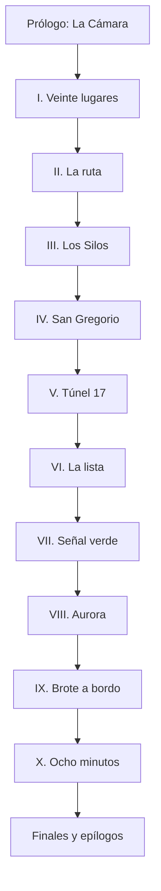
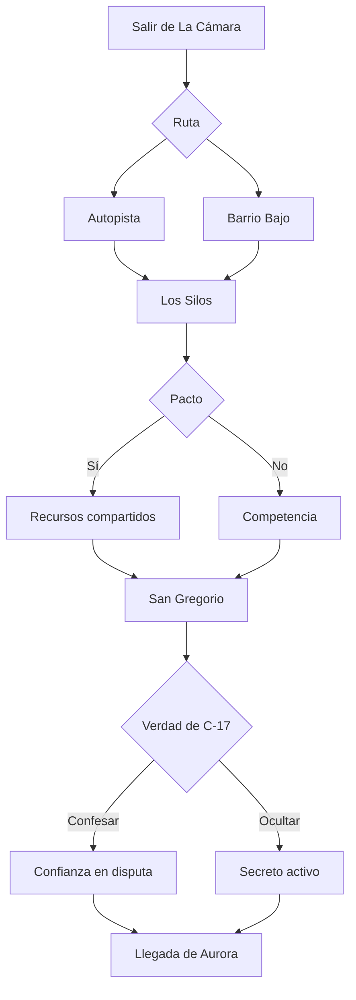

# Historia completa 01 — El último tren no espera a los vivos

> **Mundo:** Post-apocalipsis zombi — Corredor Sur
>
> **Formato:** historia curada, cerrada y completamente predefinida
>
> **Modo comercial:** contenido base del free tier
>
> **Participación de IA durante la partida:** ninguna
>
> **Interacción:** opciones diseñadas, gates, tiradas deterministas y texto authored

---

## 0. Cómo utilizar este documento

Este archivo define una historia interactiva completa para el modo **Historia Pre-armada** de `GDD-RPG-Narrativo-IA.md`. Está pensado para que un equipo de desarrollo pueda transformarlo en contenido ejecutable sin pedirle a un modelo generativo que escriba, interprete o complete escenas durante la partida.

No es una campaña híbrida. No contiene corredores generativos. No admite texto libre. No depende de `NarratorPort`, de una conexión de red ni de un proveedor de IA. Todas las escenas, opciones, consecuencias, tiradas, condiciones, rutas y familias de epílogo se encuentran delimitadas en este documento.

El motor realiza cuatro tareas:

1. muestra el bloque de texto correspondiente al estado;
2. habilita las opciones cuyas condiciones se cumplen;
3. resuelve costos y tiradas;
4. navega al bloque de resultado o al siguiente nodo.

La prosa visible se obtiene mediante `copy_key`. Una tirada nunca genera texto nuevo: selecciona entre las variantes `failure`, `success` y `critical` ya escritas.

### 0.1 Alcance de “historia completa”

El documento incluye:

- protagonista fijo y tres perfiles mecánicos;
- canon del brote;
- reglas de infección y comportamiento zombi;
- comunidad inicial y reparto;
- recursos, atributos, tiradas y combate;
- 51 nodos authored;
- prólogo, diez capítulos y desenlaces;
- texto de apertura de cada nodo;
- todas las opciones seleccionables;
- resultado narrativo de cada opción;
- consecuencias inmediatas y diferidas;
- gates y rutas de reconvergencia;
- contenido condicional por relaciones y decisiones;
- seis finales principales;
- dos cierres de fracaso;
- epílogos combinatorios acotados;
- esquema compilable;
- contratos de UI y funcionamiento offline;
- matrices de continuidad y QA.

No quedan transiciones para improvisar. Las futuras tareas de producción son conversión del contenido a JSON/Ink/Yarn, corrección editorial, localización, ilustración, sonido y pruebas.

### 0.2 Orden de autoridad

Ante una contradicción:

1. resultado resuelto por el motor;
2. estado persistido;
3. condición y efecto declarados en el nodo;
4. canon de este documento;
5. bloque de texto authored;
6. presentación audiovisual.

El texto no puede contradecir el estado. Si una variante describe a Yago vivo, su condición debe exigir `yago_alive == true`.

### 0.3 Convenciones

- IDs persistibles en `snake_case`.
- `PC` designa a Damián Salvatierra.
- **[Tirada]** utiliza d20 y bandas.
- **[Costo]** requiere un recurso y no tira.
- **[Gate]** solo aparece si se cumple la condición.
- **[Irreversible]** solicita confirmación.
- **Texto base** siempre se muestra.
- **Inserto condicional** se intercala únicamente si su gate se cumple.
- Los valores entre llaves, como `{{ammo}}`, son interpolaciones del estado.
- “Quietos” es el nombre común de los infectados; no significa que todos sean inmóviles.
- Un nodo puede contener varias decisiones consecutivas, pero solo una decisión principal por pantalla.

### 0.4 Principio de autoría

El grafo es dirigido y reconvergente. Una elección puede cambiar:

- qué escena se ve;
- quién acompaña al PC;
- la dificultad;
- los recursos disponibles;
- una relación;
- la interpretación de un diálogo;
- una opción posterior;
- el desenlace.

No toda elección crea un capítulo nuevo. La agencia también se expresa cuando la misma escena ocurre con personas, costos y posibilidades diferentes.

### 0.5 Métrica de extensión

Para evitar que “cuarenta páginas” dependa del editor:

- objetivo de diseño: más de 20.000 palabras;
- equivalencia editorial de referencia: 450–500 palabras por página;
- mínimo verificable: 40 páginas a 500 palabras;
- el conteo final debe registrarse en QA;
- los bloques YAML, tablas y listas forman parte del documento de diseño, pero no sustituyen la prosa de campaña.

---

## 1. Visión de la historia

### 1.1 Premisa

Trece meses después de que los muertos empezaran a levantarse, sesenta y tres personas sobreviven dentro de un depósito frigorífico junto a las vías del Corredor Sur. Lo llaman **La Cámara**. Sus muros son gruesos, el agua todavía corre y el generador mantiene el invierno del otro lado de las puertas.

El combustible alcanzará para treinta y nueve días.

Una noche, la radio ferroviaria recibe una señal imposible: el **Convoy Aurora**, un tren blindado que transporta supervivientes hacia Faro Sur, cruzará la región dentro de cuatro días. Se detendrá ocho minutos en la Estación Central de San Gregorio si la vía queda despejada y la vieja señal puede encenderse en verde.

Aurora dispone de veinte plazas.

Para reparar la línea, alguien debe entrar en San Gregorio, reactivar la torre, abrir un puente de agujas y atravesar el Túnel 17. Damián Salvatierra es el único en La Cámara que sabe hacerlo. Antes del brote era operador de señales. Durante la primera noche recibió una orden y desvió un tren de evacuación hacia ese túnel para dejar libre la vía principal.

El tren nunca salió.

En sus vagones viajaban cuatrocientas ochenta y seis personas, entre ellas el hermano de Damián, su cuñada y Abril, la sobrina que ahora cree que un fallo automático mató a sus padres.

Aurora no trae una cura. No tiene lugar para todos. Para llegar a Faro Sur necesita seis mil litros del diésel que mantiene viva a La Cámara. Cada paso hacia la salvación obliga a decidir quién paga el viaje, quién merece un asiento y qué significa sobrevivir cuando la puerta solo puede cerrarse de un lado.

### 1.2 Gancho

**El último tren hacia un refugio seguro ofrece veinte plazas para sesenta y tres supervivientes, y la única persona capaz de abrirle el paso fue quien condenó el tren anterior.**

### 1.3 Fantasía del jugador

La historia busca que el jugador:

- sobreviva a espacios cerrados donde un ruido puede despertar a cientos de muertos;
- administre munición, suministros, combustible y tiempo;
- tome decisiones sin una respuesta perfecta;
- construya o rompa la confianza de una comunidad;
- repare infraestructura bajo presión;
- decida cuándo luchar, esconderse, distraer o huir;
- se responsabilice por un pasado que no puede corregir;
- elija quién recibe una oportunidad limitada;
- descubra que el convoy es una comunidad, no un premio;
- llegue a un final determinado por acciones acumuladas y no por una pregunta aislada.

### 1.4 Tema central

**Sobrevivir no es subir a tiempo. Es decidir qué parte de uno queda en el andén.**

Temas secundarios:

- culpa frente a responsabilidad;
- selección bajo escasez;
- verdad que puede fracturar una comunidad;
- la diferencia entre salvar personas y administrar lugares;
- obediencia durante una catástrofe;
- confianza como recurso material;
- el peligro de convertir a los vulnerables en una cifra;
- memoria de los muertos frente a necesidades de los vivos.

### 1.5 Pregunta dramática

**Si solo podés salvar a una parte de tu gente, ¿tenés derecho a elegirla?**

La historia no responde que toda selección sea monstruosa ni que el sacrificio sea siempre noble. Obliga a considerar capacidad, consentimiento, promesas, vínculos y consecuencias.

### 1.6 Promesa de tono

Suspenso de supervivencia, violencia seca y lectura directa. Los quietos no pronuncian discursos ni desarrollan inteligencia colectiva. El miedo nace de:

- una puerta que no cierra;
- una linterna con poca carga;
- cuerpos inmóviles cuya condición no se distingue;
- un túnel donde el sonido viaja más rápido que una persona;
- un compañero que oculta una mordida;
- un tren que cumple horario aunque el andén esté lleno;
- gente razonable defendiendo decisiones incompatibles.

La acción es frecuente, pero breve y costosa. Disparar resuelve el cuerpo que está enfrente y llama a los que todavía no se ven.

### 1.7 Accesibilidad narrativa

- La causa y las reglas del brote son claras.
- No hay conspiración científica global.
- No existe inmunidad secreta.
- No hay variantes con poderes.
- El conflicto ferroviario se explica mediante acciones visibles.
- Los personajes tienen objetivos concretos.
- Los flashbacks son cortos y siempre activados por objetos o lugares.
- Cada capítulo expone un objetivo inmediato.
- Las decisiones usan lenguaje sencillo.

### 1.8 Lo que esta historia no es

- No es una búsqueda de cura.
- No convierte a Damián en elegido.
- No revela que los infectados sean conscientes.
- No es una guerra entre un buen refugio y una banda sádica.
- No ofrece sesenta y tres asientos ocultos como recompensa ideal.
- No permite conservar todo el combustible y mover el tren sin costo.
- No vuelve irrelevante la culpa de Damián porque “solo obedecía”.
- No obliga a Abril a perdonarlo.
- No utiliza IA durante la partida.
- No habilita acción libre.
- No reemplaza un fracaso con generación improvisada.
- No mata a un personaje principal por una tirada aislada sin advertencia.

---

## 2. Experiencia objetivo y alcance

| Elemento | Objetivo |
|---|---|
| Duración | 7 a 10 horas |
| Turnos | 85 a 115 |
| Estructura | Prólogo + 10 capítulos + epílogo |
| Nodos authored | 51 |
| Decisiones principales | 70–90 según ruta |
| Tiradas | 35–55 |
| Combates obligatorios | 4 |
| Conflictos evitables | 8 |
| Finales principales | 6 |
| Finales de fracaso | 2 |
| Rutas de viaje | 2 |
| Compañeros de expedición | 2 de 4 posibles |
| Rejugabilidad | 3–5 partidas |
| Conexión requerida | ninguna después de instalar contenido |

### 2.1 Ritmo por tramo

| Tramo | Sensación | Función |
|---|---|---|
| Prólogo | intrusión y urgencia | tutorial, ataque, señal del tren |
| Capítulo I | esperanza incómoda | consejo, equipo, costo inicial |
| Capítulo II | intemperie | ruta y presentación del mundo |
| Capítulo III | desconfianza | rival, pacto o enemigo |
| Capítulo IV | ciudad silenciosa | infiltración y reparación |
| Capítulo V | claustrofobia | Túnel 17, verdad y duelo |
| Capítulo VI | fractura humana | confesión y lista de pasajeros |
| Capítulo VII | asedio | reparar señal durante una horda |
| Capítulo VIII | negociación | llegada y precio real |
| Capítulo IX | caos móvil | brote dentro del convoy |
| Capítulo X | decisión | ocho minutos y desenlace |
| Epílogo | consecuencia | quién vive y qué comunidad queda |

### 2.2 Curva de tensión

La campaña alterna:

1. amenaza visible;
2. respiro corto;
3. información que empeora la elección;
4. decisión;
5. consecuencia material.

No encadenar más de dos escenas de consejo sin peligro físico. No encadenar más de dos combates sin una conversación que recontextualice lo ocurrido.

### 2.3 Contenido sensible

- violencia zombi;
- sangre, heridas y amputación no gráfica;
- muerte de adultos;
- duelo familiar;
- multitudes atrapadas;
- selección de pasajeros;
- ocultamiento de mordida;
- suicidio sacrificial opcional;
- culpa por obedecer una orden letal;
- posibilidad de que el protagonista muera o se infecte;
- menores en peligro indirecto.

Límites:

- no hay violencia sexual;
- no hay tortura;
- no hay daño gráfico a menores;
- no hay crueldad animal;
- no hay canibalismo humano;
- no hay gore prolongado;
- las decisiones irreversibles muestran advertencia;
- una amputación solo ocurre con consentimiento explícito y condiciones claras.

### 2.4 Sesión y guardado

Puntos de guardado automático:

- al entrar a cada nodo;
- después de resolver una tirada;
- antes de toda confirmación irreversible;
- al cerrar capítulo;
- antes de seleccionar final.

La campaña puede jugarse por sesiones de 25–45 minutos. Cada capítulo incluye recapitulación authored de dos variantes: estándar y retorno después de más de 24 horas.

---

## 3. Canon del mundo

### 3.1 La Caída

El brote comenzó trece meses antes. Los primeros reportes hablaron de una fiebre hemorrágica y ataques violentos. En menos de una semana, hospitales y rutas de evacuación colapsaron.

La población conoce el agente como **Fiebre Lázaro**. La historia no confirma si es virus, bacteria o combinación. Esa respuesta no es necesaria para sobrevivir y no aparece como revelación.

Hechos:

- se transmite por mordida o contacto directo de saliva y sangre infectada con una herida;
- una persona mordida desarrolla fiebre entre cuatro y dieciocho horas;
- después de morir, reanima entre dos y siete minutos;
- destruir el cerebro o la parte alta de la médula impide reanimación;
- los muertos no necesitan alimentarse para seguir activos;
- el frío intenso reduce movilidad, no mata;
- todos los infectados obedecen las mismas reglas.

### 3.2 Los quietos

“Quieto” es el término de La Cámara para cualquier infectado reanimado. Surgió porque durante el primer invierno muchos quedaron inmóviles bajo heladas y atacaron cuando cambió la temperatura.

Estados observables:

| Estado | Descripción | Regla |
|---|---|---|
| reciente | reanimó hace menos de 48 horas | rápido, Guardia 2 |
| errante | degradación habitual | lento, Guardia 1 |
| dormido | frío, oscuridad o falta de estímulo | parece cadáver hasta activación |
| atrapado | sujeto por escombros/cinturón/estructura | alcance limitado |
| multitud | veinte o más | se trata como amenaza ambiental |

No son clases evolutivas. No escupen, no explotan, no trepan paredes y no coordinan.

### 3.3 Percepción

Los quietos responden principalmente a:

1. sonido;
2. vibración;
3. movimiento cercano;
4. olor a sangre a distancia corta.

No pueden rastrear una persona durante kilómetros por olor. Pierden interés si el estímulo desaparece y otra fuente domina.

Escala de Ruido:

| Ruido | Ejemplo | Alcance narrativo |
|---:|---|---|
| 0 | respiración, gesto | misma habitación |
| 1 | conversación baja, herramienta manual | edificio |
| 2 | vidrio, golpe, motor pequeño | manzana |
| 3 | disparo, alarma | varias manzanas |
| 4 | bocina ferroviaria, explosión | distrito |
| 5 | señal sostenida | horda regional |

### 3.4 San Gregorio

Ciudad ferroviaria de ciento ochenta mil habitantes antes de la Caída. Está dividida por vías, talleres y un río angosto. La evacuación concentró a miles en la Estación Central. Cuando se cancelaron trenes, los andenes se convirtieron en un foco de infección.

Trece meses después:

- los barrios altos están quemados;
- el centro conserva edificios intactos;
- la lluvia arrastra cuerpos hacia alcantarillas;
- los quietos se concentran en estaciones, hospitales y centros comerciales;
- el corredor ferroviario sigue físicamente conectado;
- nadie mantiene el sistema desde la caída.

### 3.5 La Cámara

Antiguo depósito frigorífico a dieciocho kilómetros de San Gregorio. Sus paneles aislantes, cisternas y patio cercado lo volvieron refugio.

Población inicial: 63.

Recursos:

```yaml
community:
  population: 63
  children: 9
  elderly: 7
  injured_or_chronic: 6
  diesel_liters: 7200
  food_days: 31
  winter_heat_days: 39
  medical_stock: strained
  gate_integrity: 3
```

El generador consume unos 180 litros diarios con calefacción mínima. Sin diésel:

- la cisterna se congela en nueve días;
- el invernadero pierde cultivos;
- enfermos crónicos mueren primero;
- la comunidad puede trasladarse a Los Silos si existe pacto.

### 3.6 Los Silos

Comunidad de veintiocho personas en una cooperativa cerealera.

Ventajas:

- 2.500 litros de diésel;
- grano para meses;
- torre de observación;
- médica estable.

Problemas:

- pozo contaminado;
- cercado débil;
- cinco personas con enfermedad respiratoria;
- desconfianza hacia La Cámara por un intercambio fallido.

Los Silos no es una banda. Sus recursos pueden completar el combustible de Aurora, pero entregarlos sin acuerdo deja a ambas comunidades vulnerables.

### 3.7 Convoy Aurora

Aurora es un tren de mantenimiento reforzado con:

- dos locomotoras diésel;
- cuatro coches de pasajeros;
- un coche médico;
- dos vagones de carga;
- un taller;
- placas soldadas y pasarelas superiores.

Transporta 107 personas al entrar en la campaña. Busca Faro Sur, una instalación portuaria fortificada con energía mareomotriz.

La señal promete “hasta veinte plazas”. Es cierta. No promete transporte gratuito.

Necesidades:

- 6.000 litros para alcanzar Faro Sur con margen;
- vía despejada;
- señal verde manual;
- ocho minutos máximos en Estación Central;
- no arrastrar una horda hasta el puente costero.

Aurora no puede aceptar sesenta personas sin reducir velocidad y combustible por debajo del margen seguro. Puede transformarse en una línea regional solo con reparación, pacto y decisión de su gente.

### 3.8 Faro Sur

Faro Sur existe. No es una trampa ni un paraíso.

Datos conocidos:

- unas novecientas personas;
- muros portuarios;
- electricidad intermitente;
- pesca y desalinización;
- cuarentena estricta;
- trabajo obligatorio;
- cupos limitados;
- ningún tratamiento curativo.

Los epílogos no convierten su llegada en “vivieron felices”. Es una comunidad viable con normas duras.

### 3.9 Túnel 17 y tren C-17

El Túnel 17 es un paso de mantenimiento de 1,8 kilómetros. Durante la primera noche, el tren de evacuación C-17 fue desviado hacia él. Una puerta de obra estaba cerrada. La locomotora descarriló; los coches traseros se plegaron; algunos pasajeros sobrevivieron al impacto y fueron atacados.

Canon:

- Damián ejecutó el cambio de señal;
- recibió una orden auténtica de Protección Civil;
- sabía que el túnel no figuraba confirmado como libre;
- aceptó el riesgo para despejar la vía principal;
- falsificó después la bitácora;
- el convoy que salvó aquella maniobra fue precursor de Aurora;
- Dávila conserva copia de la orden;
- Abril viajaba en C-17 y fue retirada antes de la salida por Damián, sin saber lo que ocurriría;
- los padres de Abril permanecieron a bordo;
- Elena, esposa de Damián, subió para ayudar como enfermera;
- Elena sigue como quieta, atrapada en un vagón.

### 3.10 Cronología

| Tiempo | Evento |
|---|---|
| Día -395 | primeros reportes regionales |
| Día -391 | evacuación de San Gregorio |
| Día -391, 22:14 | Damián desvía C-17 |
| Día -390 | caída de la Estación Central |
| Día -370 | formación de La Cámara |
| Día -210 | primer contacto con Los Silos |
| Día -38 | último intercambio entre comunidades |
| Día 0 | ataque al depósito y mensaje de Aurora |
| Día 1 | partida hacia San Gregorio |
| Día 2 | contacto con Los Silos |
| Día 3 | Túnel 17 |
| Día 4 | reparación y llegada de Aurora |

---

## 4. Protagonista y reparto

### 4.1 Damián Salvatierra — protagonista fijo

Edad: 41.

Antes de la Caída: operador de señales y mantenimiento del Corredor Sur.

Después: responsable de generadores, cierres y radio en La Cámara.

Damián no es un combatiente profesional. Sabe reparar, leer infraestructura, mantener la calma durante procedimientos y cargar con más trabajo del que pide a otros. Cuando una situación se vuelve moralmente insoportable, tiende a convertirla en problema técnico.

Rasgos authored:

- habla poco;
- observa salidas;
- cuenta segundos cuando tiene miedo;
- conserva la llave maestra ferroviaria;
- no promete “todo va a estar bien”;
- ama a Abril, pero le ha quitado el derecho de conocer qué ocurrió;
- puede transformarse en líder, confesor, fugitivo, usurpador o sacrificio.

El jugador decide cómo sobrevivió Damián durante los trece meses, no su biografía.

### 4.2 Abril Salvatierra — la persona que merece la verdad

Edad: 17.

Rol: aprendiz de mecánica, sobrina del PC y vínculo central.

Abril desmonta radios para comprenderlas y vuelve a armarlas con tornillos sobrantes. Quiere abandonar La Cámara porque teme pasar la vida esperando que algo se rompa. Cree que sus padres murieron por un error automático. Idealiza a Damián menos de lo que él imagina, pero confía en que nunca le mentiría sobre ellos.

No es carga pasiva:

- puede acompañar;
- repara;
- usa ballesta;
- salva al PC en rutas concretas;
- puede rechazar un asiento;
- puede exponer el secreto;
- no muere durante la campaña base;
- puede cortar relación de manera permanente.

Relación inicial: +2.

### 4.3 Lucía Ferreyra — quien cuenta a todos

Edad: 36.

Rol: enfermera, coordinadora civil de La Cámara.

Lucía administra raciones, turnos y conflictos. No quiere irse a cualquier precio. Defiende que los cupos se asignen con criterios públicos y se niega a reducir personas a utilidad laboral. Conoce parte del pasado ferroviario de Damián, no la falsificación.

Deseo: que La Cámara siga siendo una comunidad cuando termine la crisis.

Temor: que la esperanza de veinte asientos destruya a sesenta y tres personas antes de que llegue el tren.

Límite: no encubrir una mordida.

Relación inicial: +1.

### 4.4 Ramiro Vivas — seguridad como selección

Edad: 45.

Rol: jefe de guardia.

Ramiro era agente de tránsito. Durante la Caída perdió a su hijo esperando un autobús que aceptaba solo heridos transportables. Aprendió la conclusión equivocada y útil: una puerta que intenta ser justa termina abierta.

Quiere tomar los veinte asientos para personas capaces de defender el tren. No disfruta la violencia, pero prepara la lista antes de que el consejo se reúna.

Deseo: que sobreviva la gente que puede sostener lo que venga.

Temor: volver a quedar fuera porque otro dudó.

Límite inicial: no mata a alguien desarmado. Puede cruzarlo si el PC legitima la fuerza.

Relación inicial: 0.

### 4.5 Saúl Benítez — el hombre que arregla una vez más

Edad: 64.

Rol: mecánico ferroviario retirado, mentor.

Saúl enseñó a Damián. Tiene fibrosis pulmonar y necesita medicación. Sabe que no superaría la cuarentena de Faro Sur, pero es la segunda persona capaz de reparar el relevo.

Deseo: dejar la vía funcionando para alguien que todavía no nació.

Temor: que Damián confunda pagar una culpa con asumirla.

Límite: no acepta un asiento que desplace a un menor.

Relación inicial: +1.

### 4.6 Nadia Acosta — la exploradora

Edad: 28.

Rol: rastreadora, cazadora y opción de compañera.

Nadia llegó a La Cámara tres meses antes y aún duerme cerca de una salida. Es eficaz con armas, desconfía de decisiones colectivas lentas y no tiene interés en liderar.

Deseo: llegar a un lugar donde nadie conozca su pasado.

Secreto: abandonó a su grupo anterior cuando uno ocultó una mordida.

Límite: si descubre una mordida, exige actuar de inmediato.

Relación inicial: 0.

### 4.7 Yago Ríos — el rival que trae agua vacía

Edad: 30.

Rol: explorador de Los Silos.

Yago aparece defendiendo una subestación. Cree que La Cámara robó antibióticos en el último intercambio; Ramiro ocultó que el paquete se perdió durante un ataque.

Deseo: conseguir filtros o un acuerdo antes de que el pozo de Los Silos enferme a todos.

Límite: no entrega diésel sin garantía de agua.

Relación inicial: -1.

Puede vivir, morir, ser aliado o quedar prisionero. Su destino modifica el pacto.

### 4.8 Doctora Celia Ordóñez — la otra comunidad

Edad: 52.

Rol: líder de Los Silos.

Celia fue médica rural. Negocia con dureza porque conoce la cantidad exacta de días que puede sostener a sus enfermos. No quiere veinte asientos; quiere un sistema de agua y una defensa común.

Relación inicial: 0.

### 4.9 Capitana Vera Dávila — el tren ya está lleno

Edad: 48.

Rol: autoridad del Convoy Aurora.

Dávila no es militar; era conductora de carga y organizó el convoy con personal ferroviario. Protege a ciento siete personas que ya pagaron su lugar con trabajo y pérdidas.

Conserva la orden que Damián obedeció. No lo considera inocente ni único culpable.

Deseo: llegar a Faro Sur con suficiente combustible.

Temor: detener el tren y repetir la catástrofe de los primeros días.

Límite: no abandona coches con su gente para aceptar extraños, salvo que esa gente elija otra misión.

Relación inicial: 0.

### 4.10 Elena Márquez — el abrigo rojo

Edad al morir: 39.

Rol: esposa de Damián y verdad corporal del Túnel 17.

Elena era enfermera. Subió al C-17 para asistir a evacuados. Damián le pidió que esperara otro convoy; ella se negó porque faltaba personal.

Trece meses después, está atrapada por el cinturón de un asiento, convertida en quieta. No reconoce a Damián. No habla. No recupera humanidad. La escena consiste en lo que él hace, no en una señal sobrenatural.

---

## 5. Configuración del protagonista

### 5.1 Identidad fija

No se permite cambiar:

- nombre;
- edad;
- empleo anterior;
- parentesco con Abril;
- responsabilidad en C-17;
- matrimonio con Elena.

La historia depende de esa especificidad.

### 5.2 Perfil de supervivencia

Elegir uno en `p0_perfil`. Todos suman 9 puntos.

#### Manos de taller

```yaml
attributes:
  cuerpo: 2
  tecnica: 4
  instinto: 2
  humanidad: 1
starting_item: multiherramienta_ferroviaria
passive: reparacion_precisa
```

Una vez por capítulo, reducir en 2 la DC de una reparación.

Lectura: Damián sobrevivió volviéndose indispensable y evitando decisiones personales.

#### Corazón de guardia

```yaml
attributes:
  cuerpo: 2
  tecnica: 2
  instinto: 1
  humanidad: 4
starting_item: botiquin_compacto
passive: nadie_atras
```

Una vez por capítulo, repetir una tirada para proteger o convencer a otra persona.

Lectura: Damián intenta compensar su pasado cuidando a cada persona que tiene delante.

#### Ojos de ruta

```yaml
attributes:
  cuerpo: 3
  tecnica: 2
  instinto: 4
  humanidad: 0
starting_item: revolver_servicio
passive: salida_mas_cercana
```

Una vez por capítulo, cancelar el primer aumento de Ruido o evitar una emboscada.

Lectura: Damián sobrevivió esperando siempre que todo refugio fallara.

Humanidad 0 como atributo no equivale a Moralidad negativa. Significa dificultad para conectar bajo presión.

### 5.3 Recuerdo conservado

Elegir un objeto. No otorga poder; habilita texto y una opción final.

| Objeto | Significado |
|---|---|
| `reloj_elena` | Damián aún cuenta el tiempo con el reloj de Elena |
| `boleto_abril` | conserva el boleto que retiró a Abril del C-17 |
| `placa_operador` | no se permite olvidar qué cargo ocupaba |

### 5.4 Postura inicial

Pregunta: “Cuando alguien menciona el tren C-17, ¿qué hace Damián?”

- dice que el sistema falló;
- cambia de tema;
- reconoce que estaba de turno, no la orden;
- guarda silencio.

Se persiste en `initial_lie_style`. Modifica la confesión.

### 5.5 Estado inicial

```yaml
campaign_id: curated_zombie_01_ultimo_tren
current_node: p0_perfil
chapter: 0
turn: 0
hours_remaining: 96
health: null
max_health: null
supplies: 8
ammo: 0
noise: 0
infection: 0
humanity_axis: 0
community_trust: 0
group_cohesion: 3
diesel_liters: 7200
population_camara: 63
population_silos: 28
aurora_population: 107
repair_progress: 0
passenger_slots: 20
```

---

## 6. Sistema mecánico

### 6.1 Atributos

| Atributo | Resuelve |
|---|---|
| `cuerpo` | fuerza, resistencia, combate cercano, cargar, correr |
| `tecnica` | reparar, abrir, diagnosticar, primeros auxilios |
| `instinto` | observar, esconderse, disparar, orientarse |
| `humanidad` | convencer, contener, confesar, coordinar |

### 6.2 Regla base

`d20 + atributo + modificadores` contra DC.

El motor muestra atributo y DC antes de confirmar, salvo una única categoría de “riesgo desconocido” marcada en el nodo.

### 6.3 Dificultades

| DC | Significado |
|---:|---|
| 9 | acción controlada |
| 12 | riesgo común |
| 15 | desafío serio |
| 18 | extremo |
| 21 | desesperado |

### 6.4 Bandas

- **Falla:** total menor que DC.
- **Éxito:** total igual o superior.
- **Crítico:** 20 natural o total al menos 5 sobre DC.

Un 1 natural activa la complicación adicional declarada. No inventar otra.

### 6.5 Chequeos authored

Cada opción de tirada define tres `copy_key`:

```yaml
check:
  attribute: tecnica
  dc: 15
outcomes:
  failure:
    copy_key: c4_tower_repair_failure
    effects:
      supplies: -1
      hours_remaining: -2
  success:
    copy_key: c4_tower_repair_success
    effects:
      repair_progress: 1
  critical:
    copy_key: c4_tower_repair_critical
    effects:
      repair_progress: 1
      hours_remaining: 1
```

El motor no solicita narración.

### 6.6 Salud

`Salud máxima = 10 + Cuerpo × 2`

Daño:

| Fuente | Daño |
|---|---:|
| golpe o corte menor | 1 |
| caída, arma improvisada | 2 |
| mordida evitada por poco, disparo superficial | 3 |
| ataque directo, aplastamiento | 4 |

Estados:

- 50% o menos: `wounded`, -1 a Cuerpo;
- 25% o menos: `critical_health`, no puede correr sin costo;
- 0: cierre de fracaso o rescate authored si el nodo lo permite.

Curación:

- 1 suministro médico: recuperar 3;
- descanso de capítulo: recuperar 2;
- atención de Lucía: recuperar 4, una vez;
- no superar máximo.

### 6.7 Suministros

Unidad abstracta que representa:

- comida de marcha;
- batería;
- vendas;
- cuerda;
- herramientas consumibles;
- combustible menor.

No representa diésel comunitario.

Se gasta mediante opciones visibles. A 0:

- no usar curación;
- desventaja en noches a la intemperie;
- reparaciones improvisadas aumentan DC en 2.

### 6.8 Munición

Cada unidad equivale a una secuencia útil de disparos, no una bala.

- disparo controlado: -1;
- fuego de cobertura: -2;
- crítico con arma puede no consumir;
- a 0 todavía existen armas cuerpo a cuerpo;
- cada uso genera Ruido 3 salvo silenciador improvisado.

### 6.9 Ruido

El valor es local a escena, 0–5. Se reinicia al cambiar de zona, pero puede trasladar una horda mediante flag.

Efectos:

- 0–1: sin atracción externa;
- 2: aparece amenaza menor al final;
- 3: +1 quieto o presión;
- 4: horda se mueve hacia ubicación;
- 5: evento de multitud obligatorio.

Reducir Ruido requiere tiempo, alejar estímulo o cerrar barreras. No baja por esperar en una habitación insegura.

### 6.10 Infección

| Nivel | Estado |
|---:|---|
| 0 | sin exposición |
| 1 | contacto dudoso; observación |
| 2 | herida contaminada; riesgo |
| 3 | mordida confirmada |
| 4 | muerte/reanimación |

La mordida no proviene de una tirada común. Solo eventos marcados `bite_risk: explicit` pueden llevar a 3 y muestran advertencia antes de elegir.

En nivel 2, Técnica DC 15 y botiquín pueden volver a 1 si la herida no fue mordida.

En nivel 3:

- una amputación es posible dentro de tres minutos si la zona lo permite;
- requiere opción explícita, herramienta y tirada;
- puede salvar, herir permanentemente o fallar;
- si no, el final queda limitado.

### 6.11 Humanidad frente a supervivencia

Eje `humanity_axis`, de -3 a +3.

Valores positivos:

- transparencia;
- consentimiento;
- proteger a vulnerables;
- compartir costo.

Valores negativos:

- selección por utilidad;
- coerción;
- ocultar riesgos para sostener control;
- abandonar deliberadamente.

No equivale a “bien/mal”. Efectos:

- +2: ventaja al proponer pacto comunitario;
- +3: final `linea_de_los_vivos` más accesible;
- -2: Ramiro coopera y Lucía desconfía;
- -3: opciones de toma violenta más fáciles; reconciliación bloqueada.

### 6.12 Confianza comunitaria

Escala -3 a +3:

- -3: motín activo;
- -2: se ocultan recursos;
- -1: obediencia mínima;
- 0: autoridad técnica;
- +1: apoyo;
- +2: liderazgo legítimo;
- +3: la comunidad acepta una decisión costosa.

La confianza no sustituye combustible ni asientos. Permite coordinar.

### 6.13 Cohesión del grupo

Valor 0–6 para la expedición.

- 0: separación forzada;
- 1–2: desventaja en maniobras conjuntas;
- 3–4: normal;
- 5: una ayuda automática por capítulo;
- 6: desbloquea rescate de compañero.

### 6.14 Tiempo

Comienza en 96 horas.

El reloj baja por:

- viaje;
- descanso;
- falla;
- desvío;
- reparación.

Umbrales:

- 48 horas: Aurora confirma aproximación;
- 24: horda migra hacia San Gregorio;
- 8: se bloquean preparativos secundarios;
- 0: Aurora pasa sin detenerse o entra con señal incompleta.

No utilizar tiempo real del dispositivo.

### 6.15 Combate

Enemigos individuales tienen Guardia.

- ataque exitoso: -1 Guardia;
- crítico: -2;
- arma apropiada puede +1;
- Guardia 0: neutralizado.

Un quieto individual:

```yaml
guard: 1
attack_damage: 2
bite_on: explicit_event_only
noise_on_firearm: 3
```

Multitud:

- no se derrota reduciendo Guardia;
- exige barrera, ruta, distracción o escape;
- cada ronda aumenta Presión;
- llegar al límite produce consecuencia authored.

### 6.16 Compañeros

Cada compañero puede:

- otorgar ventaja una vez por nodo si su especialidad aplica;
- recibir una orden predefinida;
- negarse según relación y límite;
- quedar herido por consecuencias declaradas;
- no morir por improvisación.

### 6.17 Filosofía de falla

La falla:

- consume;
- hiere;
- hace ruido;
- quita tiempo;
- deteriora relación;
- cambia quién debe actuar;
- cierra una opción ventajosa.

Nunca:

- borra una pista principal;
- reinicia capítulo;
- exige IA;
- crea un callejón sin salida no declarado;
- mata a Abril.

---

## 7. Progresión

### 7.1 Reputación

La progresión post-apocalíptica se denomina Reputación.

Ganar:

- +1 por nodo principal;
- +1 por resolver sin gasto crítico;
- +1 por asumir responsabilidad;
- +1 por salvar a alguien con costo;
- máximo +3 por nodo.

### 7.2 Rangos

| Reputación | Rango | Beneficio |
|---:|---|---|
| 0 | mantenedor | perfil inicial |
| 6 | explorador | +1 Salud máxima o +1 Suministro máximo |
| 14 | referente | especialidad secundaria |
| 24 | conductor | +1 atributo, máximo 5 |
| 36 | fundador | talento final |

### 7.3 Especialidades secundarias

Elegir una al llegar a Referente:

#### Paso silencioso

Una vez por capítulo, convertir Ruido 2 en 1.

#### Mano firme

El primer disparo del capítulo no consume munición con éxito.

#### Remiendo imposible

Gastar 1 Suministro para repetir Técnica.

#### Palabra sostenida

Después de una falla de Humanidad, evitar pérdida de relación aceptando -1 Confianza.

### 7.4 Talentos finales

Al llegar a Fundador, elegir:

#### Nadie decide solo

Si dos aliados apoyan una opción comunitaria, tratar Confianza como +3 para ese gate.

#### Último en cerrar

Una vez, convertir una consecuencia letal para otro adulto en 4 daño al PC.

#### La vía todavía sirve

Completar automáticamente una reparación final si se poseen herramientas y al menos 1 Suministro.

### 7.5 Lesiones persistentes

Posibles:

- `damaged_hand`: -1 Técnica manual, anulable con Saúl;
- `broken_rib`: -1 Cuerpo al correr;
- `hearing_loss`: desventaja para detectar, ventaja contra señuelos sonoros no aplica;
- `amputated_forearm`: no usar armas largas, +1 relación con quien ayudó;
- `fevered`: Salud máxima -2 hasta final.

No acumular más de dos. Una tercera convierte el siguiente daño grave en cierre de fracaso o rescate.

---

## 8. Estado persistente

### 8.1 Flags

```yaml
flags:
  chamber_alarm_survived: false
  saved_medicine: false
  saved_diesel_pump: false
  saved_north_gate: false
  horde_trapped_prologue: false
  saul_medicine_low: false
  medical_stock_critical: false
  aurora_message_heard: false
  verify_aurora: false
  capacity_disclosed_early: false
  fuel_price_disclosed_early: false
  fuel_requirement_unknown: false
  aurora_not_empty: false
  promised_twenty: false
  partial_public_confession: false
  team_has_abril: false
  team_has_nadia: false
  team_has_ramiro: false
  team_has_saul: false
  route_highway: false
  route_low_district: false
  ambulance_looted: false
  pharmacy_looted: false
  stranded_family_saved: false
  stranded_family_abandoned: false
  highway_horde_moving: false
  bell_pattern_known: false
  depot_fire_trap: false
  yago_alive: true
  yago_helped: false
  yago_captured: false
  yago_killed: false
  silos_pact: false
  silos_hostile: false
  silos_filters_promised: false
  granary_defended: false
  station_entered_silent: false
  market_survivor_saved: false
  station_video_found: false
  bell_lure_used: false
  signal_tower_mapped: false
  tunnel_entered: false
  tunnel_escape_known: false
  c17_truth_found: false
  c17_log_recovered: false
  elena_found: false
  elena_released: false
  elena_left_bound: false
  used_elena_as_lure: false
  grief_shock: false
  confessed_to_abril: false
  lied_to_abril_again: false
  abril_forgave: false
  abril_broke_trust: false
  tunnel_cleared: false
  tunnel_horde_released: false
  returned_to_chamber: false
  public_confession: false
  ramiro_list_exposed: false
  passenger_vote_held: false
  mutiny_prevented: false
  mutiny_active: false
  bridge_repaired: false
  relay_repaired: false
  horde_diverted: false
  saul_sacrificed: false
  signal_green: false
  signal_green_unstable: false
  aurora_arrived: false
  davila_knows_truth: false
  diesel_deal: false
  aurora_outbreak: false
  infected_car_detached: false
  aurora_medical_saved: false
  ramiro_attempted_takeover: false
  final_choice_locked: false
  damian_dead: false
```

### 8.2 Relaciones

```yaml
relationships:
  abril: 2
  lucia: 1
  ramiro: 0
  saul: 1
  nadia: 0
  yago: -1
  celia: 0
  davila: 0
```

Límites -3 a +3. No cambiar más de 1 por decisión salvo:

- confesión;
- traición;
- muerte causada;
- sacrificio;
- abandono.

### 8.3 Inventario

Objetos exclusivos iniciales:

- `multiherramienta_ferroviaria`;
- `botiquin_compacto`;
- `revolver_servicio`.

Objetos de campaña:

- `llave_maestra_ferroviaria` — siempre;
- `radio_portatil`;
- `mapa_corredor`;
- `fusible_industrial`;
- `cable_cobre`;
- `filtros_agua`;
- `antibioticos`;
- `anticoagulantes`;
- `ballesta_abril`;
- `silenciador_artesanal`;
- `registro_c17`;
- `station_video`;
- `orden_proteccion_civil`;
- `reloj_elena`, `boleto_abril` o `placa_operador`;
- `bengala_roja`;
- `detonador_vial`;
- `lista_ramiro`;
- `manivela_puente`;
- `acople_aurora`.

### 8.4 Reparaciones

```yaml
repairs:
  tower_power: false
  signal_relay: false
  bridge_switch: false
  tunnel_clearance: false
  aurora_coupling: false
```

La señal verde exige las primeras cuatro o una sustitución declarada.

### 8.5 Lista de pasajeros

No persistir nombres como texto libre. Utilizar IDs:

```yaml
passenger_policy: null
selected_passengers: []
possible_ids:
  - abril
  - lucia
  - ramiro
  - saul
  - nadia
  - children_group
  - medical_group
  - skilled_group
  - lottery_group
  - silos_group
  - damian
```

Las políticas predefinidas generan listas:

- `vulnerables_primero`;
- `sorteo_publico`;
- `capacidades_esenciales`;
- `familias_unidas`;
- `lista_ramiro`;
- `sin_lista`.

### 8.6 Hechos y pruebas

```yaml
evidence:
  proof_aurora_real: false
  proof_fuel_requirement: false
  proof_c17_manual_diversion: false
  proof_civil_defense_order: false
  proof_ramiro_stole_medicine: false
  proof_faro_sur_real: false
  proof_aurora_infected: false
```

### 8.7 Recursos y contadores auxiliares

```yaml
auxiliary_state:
  shared_diesel_liters: 0
  station_timer_seconds: null
  tunnel_pressure: 0
  horde_pressure: 0
  aurora_outbreak_pressure: 0
  secondary_casualties: 0
  winter_survivors: null
  selected_profile_id: null
  selected_memory_item_id: null
  initial_lie_style: null
  session_seed: null
```

Los contadores de Presión se reinician al abandonar su conflicto. `shared_diesel_liters` pertenece a Los Silos y solo puede sumarse al trato si el pacto o intercambio sigue vigente.

---

## 9. Arquitectura narrativa

### 9.1 Regla del modo curado

En esta campaña:

```yaml
runtime:
  narrator_adapter: curated_copy_adapter
  ai_calls: 0
  free_text_input: false
  dynamic_option_generation: false
  procedural_plot: false
  local_graph_required: true
  local_copy_required: true
```

`CuratedCopyAdapter` no genera. Recibe una `copy_key`, interpola valores seguros y devuelve el string localizado.

### 9.2 Grafo general



### 9.3 Ramas estructurales



### 9.4 Índice de nodos

| # | ID | Tipo | Salidas principales |
|---:|---|---|---|
| 1 | `p0_perfil` | configuración | `p1_alarma_camara` |
| 2 | `p1_alarma_camara` | tutorial | `p2_voz_aurora` |
| 3 | `p2_voz_aurora` | revelación | `c1_n01_consejo` |
| 4 | `c1_n01_consejo` | decisión | `c1_n02_elegir_equipo` |
| 5 | `c1_n02_elegir_equipo` | selección | `c1_n03_inventario` |
| 6 | `c1_n03_inventario` | recursos | `c1_n04_salir` |
| 7 | `c1_n04_salir` | vínculo | `c2_n01_bifurcacion` |
| 8 | `c2_n01_bifurcacion` | ruta | autopista / barrio |
| 9 | `c2_n02_autopista` | peligro | `c2_n04_deposito_vial` |
| 10 | `c2_n03_barrio_bajo` | exploración | `c2_n04_deposito_vial` |
| 11 | `c2_n04_deposito_vial` | recursos | `c2_n05_noche_taller` |
| 12 | `c2_n05_noche_taller` | descanso | `c3_n01_subestacion` |
| 13 | `c3_n01_subestacion` | encuentro | `c3_n02_yago_herido` |
| 14 | `c3_n02_yago_herido` | moral | `c3_n03_pacto_silos` |
| 15 | `c3_n03_pacto_silos` | negociación | `c3_n04_ataque_granero` |
| 16 | `c3_n04_ataque_granero` | combate | `c4_n01_entrada_san_gregorio` |
| 17 | `c4_n01_entrada_san_gregorio` | infiltración | `c4_n02_supermercado_mudo` |
| 18 | `c4_n02_supermercado_mudo` | suspenso | `c4_n03_campanario` |
| 19 | `c4_n03_campanario` | distracción | `c4_n04_estacion_central` |
| 20 | `c4_n04_estacion_central` | exploración | `c4_n05_torre_senales` |
| 21 | `c4_n05_torre_senales` | reparación | `c5_n01_tunel_17` |
| 22 | `c5_n01_tunel_17` | entrada | `c5_n02_vagon_equipajes` |
| 23 | `c5_n02_vagon_equipajes` | supervivencia | `c5_n03_registro_negro` |
| 24 | `c5_n03_registro_negro` | prueba | `c5_n04_elena_rojo` |
| 25 | `c5_n04_elena_rojo` | duelo | `c5_n05_confesion_abril` |
| 26 | `c5_n05_confesion_abril` | relación | `c5_n06_abrir_via` |
| 27 | `c5_n06_abrir_via` | reparación | `c6_n01_regreso_camara` |
| 28 | `c6_n01_regreso_camara` | retorno | `c6_n02_verdad_publica` |
| 29 | `c6_n02_verdad_publica` | política | `c6_n03_lista_veinte` |
| 30 | `c6_n03_lista_veinte` | política | `c6_n04_noche_motin` |
| 31 | `c6_n04_noche_motin` | conflicto | `c7_n01_puente_quebrado` |
| 32 | `c7_n01_puente_quebrado` | reparación | `c7_n02_rele_manual` |
| 33 | `c7_n02_rele_manual` | reparación | `c7_n03_horda_vias` |
| 34 | `c7_n03_horda_vias` | multitud | `c7_n04_ultimo_relevo` |
| 35 | `c7_n04_ultimo_relevo` | sacrificio | `c7_n05_senal_verde` |
| 36 | `c7_n05_senal_verde` | hito | `c8_n01_llegada_aurora` |
| 37 | `c8_n01_llegada_aurora` | llegada | `c8_n02_precio_diesel` |
| 38 | `c8_n02_precio_diesel` | negociación | `c8_n03_capitana_davila` |
| 39 | `c8_n03_capitana_davila` | verdad | `c8_n04_ocho_minutos` |
| 40 | `c8_n04_ocho_minutos` | reloj | `c9_n01_golpes_vagon` |
| 41 | `c9_n01_golpes_vagon` | suspenso | `c9_n02_brote_aurora` |
| 42 | `c9_n02_brote_aurora` | combate | `c9_n03_separar_vagones` |
| 43 | `c9_n03_separar_vagones` | técnica | `c9_n04_quien_cierra_puerta` |
| 44 | `c9_n04_quien_cierra_puerta` | costo | `c10_n01_anden_dividido` |
| 45 | `c10_n01_anden_dividido` | confrontación | `c10_n02_decision_final` |
| 46 | `c10_n02_decision_final` | selector | finales |
| 47 | `end_faro_sur` | final | `epilogo` |
| 48 | `end_los_que_suben` | final | `epilogo` |
| 49 | `end_linea_vivos` | final | `epilogo` |
| 50 | `end_tomar_aurora` | final | `epilogo` |
| 51 | `end_quedarse` | final | `epilogo` |
| 52 | `end_ultimo_relevo` | final | `epilogo` |
| 53 | `fail_anden` | fracaso | cierre |
| 54 | `fail_infeccion` | fracaso | cierre |
| 55 | `epilogo` | combinatorio | fin |

**Nota de conteo:** los 51 nodos authored declarados en metadata cuentan 46 nodos de recorrido, seis finales principales menos el selector compartido y los bloques de epílogo como composición. Los dos cierres de fracaso son overlays terminales. Para implementación se recomienda conservar los 55 IDs del índice; la métrica de contenido principal excluye overlays.

---

## 10. Prólogo — El frío conserva más que la comida

### 10.1 `p0_perfil`

**Tipo:** configuración authored.

**Objetivo:** presentar a Damián antes de que aparezca la promesa del tren.

**Copy base — `p0_opening`:**

> A las 03:12, Damián Salvatierra despierta porque el generador deja de vibrar.
>
> No es un sonido lo que lo saca del sueño. Es la ausencia.
>
> Abre los ojos en la cabina de mantenimiento, vestido y con las botas puestas. La lámpara de emergencia tiñe de rojo las tuberías. Sobre la pared, el termómetro marca cuatro grados. Del otro lado del panel aislante duermen sesenta y dos personas que todavía creen que la electricidad es una comodidad.
>
> Damián sabe cuánto tardará en convertirse en agua congelada, comida podrida y tos.
>
> Cuenta hasta cinco. El generador vuelve con un golpe asmático. Las luces se encienden. Alguien aplaude desde el dormitorio común y otra persona le exige que se calle.
>
> En la mesa están la llave maestra del ferrocarril, una taza con café usado dos veces y el objeto que Damián no ha podido tirar en trece meses.

Mostrar selección de recuerdo. Después:

> Abril duerme en una silla junto a la radio abierta. Tiene una soldadora fría sobre el regazo y una marca de estaño en el pulgar. En la libreta escribió tres frecuencias y una frase: “Nada durante seis horas”.
>
> Damián le quita la herramienta con cuidado. Cuando va a cubrirla con una manta, la radio ferroviaria emite un clic.
>
> No hay voz. Solo una portadora débil y regular, como una respiración detrás de una pared.

Mostrar los tres perfiles con descripción, atributos y pasiva. Al confirmar:

```yaml
effects:
  max_health: "10 + cuerpo * 2"
  health: max_health
  ammo:
    if_profile_ojos_ruta: 3
    otherwise: 0
  inventory_add:
    - llave_maestra_ferroviaria
    - radio_portatil
    - selected_starting_item
    - selected_memory_item
```

**Salida automática:** `p1_alarma_camara`.

### 10.2 `p1_alarma_camara`

**Tipo:** tutorial de presión y recursos.

**Objetivo visible:** impedir que los quietos entren al dormitorio común.

**Copy base — `p1_alarm_open`:**

> El segundo clic llega desde el patio.
>
> Después, metal contra metal.
>
> Damián aparta la cortina de la cabina. Más allá de los ventanales empañados, la cadena de la puerta norte se tensa y vuelve a caer. Una mano gris atraviesa el espacio entre las hojas. Otra aparece debajo. Los quietos no golpean para entrar: empujan porque algo detrás sigue avanzando.
>
> La alarma de latas no sonó.
>
> —Tío —dice Abril.
>
> Ya está de pie, con la ballesta descargada.
>
> Una camioneta de reparto se deslizó contra el cerco durante la noche. Su bocina permanece hundida bajo el pecho del conductor muerto. El sonido reunió a una treintena. En el patio, Ramiro corre hacia la puerta con dos guardias. Lucía arrastra una caja de medicamentos fuera de la enfermería. Saúl intenta cerrar la válvula del depósito de diésel: una cañería se partió cuando la camioneta golpeó el muro.
>
> Tres problemas. Tiempo para llegar primero a uno.

#### Decisión 1

##### Opción A — `p1_save_gate`

**Etiqueta:** Ayudar a Ramiro en la puerta norte.

**Tirada:** Cuerpo DC 12.

**Falla — `p1_gate_failure`:**

> Damián llega cuando la cadena pierde el último eslabón. Mete la llave maestra entre las hojas y usa el cuerpo como palanca. La primera mandíbula atraviesa el hueco antes de que Ramiro clave la barra.
>
> Los dientes cierran sobre la manga de Damián. La tela se rompe; la piel, no. Ramiro aplasta el cráneo contra la puerta y los dos empujan hasta que el pasador entra.
>
> Han cerrado, pero tres quietos quedaron dentro del patio.

Efectos: Salud -2, Ruido +1, Guardia de encuentro +2.

**Éxito — `p1_gate_success`:**

> Damián no empuja la puerta. Engancha la cadena rota en el eje de un montacargas y hace girar la rueda a mano. Las hojas se juntan centímetro a centímetro. Ramiro entiende la maniobra sin preguntar y atraviesa la barra.
>
> Cuando los dedos atrapados dejan de moverse, la puerta sigue cerrada.

Efectos: `saved_north_gate`, Ramiro +1.

**Crítico — `p1_gate_critical`:**

> Damián ve el cable de la vieja persiana antes de llegar a la puerta. Lo suelta, deja caer la cortina exterior y encierra a la multitud entre dos barreras. Ramiro remata al único quieto que alcanzó el patio.
>
> —Eso servía desde el principio —dice.
>
> —Servía una vez.
>
> Afuera, treinta cuerpos presionan una trampa que ya no podrán repetir.

Efectos: `saved_north_gate`, Ramiro +1, `horde_trapped_prologue`, sin combate menor.

##### Opción B — `p1_save_medicine`

**Etiqueta:** Sacar los medicamentos.

**Tirada:** Técnica DC 12.

**Falla — `p1_medicine_failure`:**

> El soporte del techo cae antes de que Damián alcance la última estantería. Empuja a Lucía fuera y recibe el borde sobre la espalda. Los frascos se rompen dentro de la caja con un sonido pequeño, obsceno.
>
> Lucía salva los antibióticos. Los broncodilatadores de Saúl quedan bajo el panel.

Efectos: Salud -2, `saved_medicine`, `saul_medicine_low`.

**Éxito — `p1_medicine_success`:**

> Damián corta la electricidad de la cámara, libera el cierre magnético y usa la camilla como trineo. Lucía carga las cajas por orden de temperatura. Salen cuando el panel se desploma.
>
> Ella cuenta ampollas antes de mirarlo.
>
> —No perdimos a nadie —dice.
>
> Es la única forma en que ambos saben celebrar.

Efectos: `saved_medicine`, Lucía +1, +1 Suministro.

**Crítico — `p1_medicine_critical`:**

> Damián reconoce que la viga no está cediendo: la está empujando la cañería de refrigeración. Cierra la válvula secundaria, libera presión y asegura el soporte con la camilla.
>
> No tienen que elegir cajas. Lucía recupera hasta el último inhalador.

Efectos: `saved_medicine`, Lucía +1, +2 Suministros, Salud comunitaria protegida.

##### Opción C — `p1_save_diesel`

**Etiqueta:** Cerrar la pérdida de diésel.

**Tirada:** Técnica DC 15.

**Falla — `p1_diesel_failure`:**

> El diésel convierte el suelo en un espejo negro. Damián alcanza la válvula, pero la rosca gira sin morder. Mete un trapo, luego una cuña, después la mano enguantada.
>
> La pérdida se vuelve goteo. Quinientos litros ya corren bajo la cerca.

Efectos: `diesel_liters: -500`, `saved_diesel_pump`, Saúl +0.

**Éxito — `p1_diesel_success`:**

> Damián retira el tramo roto y golpea un tapón de mantenimiento hasta deformar la rosca. Saúl cierra la válvula principal cuando la presión baja.
>
> Se pierden ciento veinte litros. En otro tiempo habría sido un derrame. Ahora son dieciséis horas de calor.

Efectos: `diesel_liters: -120`, `saved_diesel_pump`, Saúl +1.

**Crítico — `p1_diesel_critical`:**

> La cañería no se partió: saltó el acople. Damián lo encuentra bajo la camioneta, cambia la junta por cuero del cinturón y restaura la línea.
>
> Se pierden treinta litros.

Efectos: `diesel_liters: -30`, `saved_diesel_pump`, Saúl +1, +1 Reputación.

#### Decisión 2 — El segundo frente

Después de la primera resolución, mostrar:

> La alarma por fin despierta a La Cámara. Las personas corren hacia puestos ensayados, pero el problema que Damián no eligió sigue abierto.
>
> Puede intentar llegar. Tendrá menos tiempo y ninguna posición favorable.

Mostrar las dos opciones restantes como **[Tirada con desventaja]**, o:

- `p1_hold_center`: quedarse coordinando, Humanidad DC 12; éxito evita pánico y Confianza +1, pero no salva otro recurso.

Solo pueden conseguirse dos flags de rescate. El tercero aplica consecuencia fija:

| Frente no atendido | Consecuencia |
|---|---|
| puerta | tres quietos entran; combate tutorial Guardia 3 |
| medicina | -2 Suministros y `medical_stock_critical` |
| diésel | -700 litros |

#### Combate tutorial condicional

Si la puerta falla o no fue atendida:

```yaml
encounter:
  id: p1_courtyard_quiet
  enemy_guard: 3
  round_limit: 3
  civilians_at_risk: true
```

Opciones authored:

- golpear con barra — Cuerpo DC 12;
- usar arma — Instinto DC 9, costo 1 Munición, Ruido 3;
- activar cinta transportadora — Técnica DC 12;
- atraer hacia cámara vacía — Humanidad/Instinto DC 15.

En límite de ronda, un guardia secundario queda herido y Confianza -1. No hay mordida.

**Cierre — `p1_alarm_close`:**

> Cuando el patio queda en silencio, La Cámara cuenta.
>
> Sesenta y tres vivos.
>
> Nadie dice cuántos cuerpos hay contra la puerta. Saúl apaga la bocina con una barra. Lucía reparte mantas. Ramiro busca la cuerda de la alarma y encuentra un corte limpio.
>
> Alguien la cortó antes de que la camioneta llegara.
>
> Damián vuelve a la cabina para revisar la radio. Abril está inclinada sobre el receptor.
>
> —No era estática —dice—. Alguien está llamando por el canal de operaciones.

Efectos:

```yaml
chamber_alarm_survived: true
hours_remaining: 95
noise: 0
```

### 10.3 `p2_voz_aurora`

**Tipo:** gancho fijo.

**Copy base — `p2_aurora_message`:**

> La voz llega rota en intervalos de siete segundos.
>
> —...unidad ferroviaria Aurora Seis... corredor sur... destino Faro Sur...
>
> Abril ajusta la bobina. Damián reconoce el patrón antes de entender las palabras: tres pulsos largos, dos cortos, identificación y ruta. Protocolo de carga. Nadie lo usaba para transportar pasajeros.
>
> —...arribo estimado, noventa y seis horas... detención condicional en San Gregorio Central... señal manual verde... vía diecisiete liberada...
>
> Damián no respira.
>
> Saúl entra apoyado en el marco. Escucha “vía diecisiete” y mira a Damián, no a la radio.
>
> —...capacidad disponible: veinte pasajeros... intercambio de combustible en destino... ventana de detención: ocho minutos...
>
> La transmisión se repite.
>
> Abril escribe cada palabra. En “veinte” detiene el lápiz.
>
> —Somos sesenta y tres.
>
> Damián corrige una frecuencia que no necesita corrección.
>
> —El tren todavía está a cuatro días.
>
> —No pregunté cuándo.

#### Opciones de respuesta

1. **“Primero hay que confirmar que sea real.”**
   - Abril -1 si la relación está en +2.
   - Obtener objetivo `verify_aurora`.
2. **“Si se detiene, vamos a tener que elegir.”**
   - `capacity_disclosed_early`.
   - Humanidad axis +1.
3. **“La vía diecisiete está cerrada.”**
   - Saúl reconoce miedo; relación +1.
   - Abril pregunta por el túnel en capítulo V con DC menor.
4. **“Despertá a Lucía. Que nadie más oiga todavía.”**
   - Confianza futura -1 si se descubre ocultamiento.
   - Ramiro no prepara lista hasta capítulo VI.

**Resultado común:**

> La repetición continúa mientras el resto de La Cámara se reúne detrás de la puerta.
>
> Veinte lugares.
>
> Damián mira la llave maestra sobre la mesa. Hace trece meses la usó para abrir una ruta. Desde entonces no ha vuelto a San Gregorio.
>
> Afuera, el frío mantiene quietos a los muertos.
>
> Dentro, la esperanza despierta a todos.

Efectos:

```yaml
aurora_message_heard: true
proof_aurora_real: true
hours_remaining: 94
```

---

## 11. Capítulo I — Veinte lugares para sesenta y tres personas

### 11.1 `c1_n01_consejo`

**Tipo:** decisión política.

**Objetivo:** decidir qué información recibe la comunidad antes de partir.

**Copy base — `c1_council_open`:**

> El comedor de La Cámara fue una sala de despiece. Conserva ganchos en el techo y un desagüe central que nadie logró destapar.
>
> Sesenta y tres personas no caben sentadas. Se agrupan entre mesas, puertas y estantes. Lucía sostiene la radio sobre una caja para que todos escuchen la tercera repetición.
>
> Cuando la voz dice veinte, nadie murmura. El ruido empieza después.
>
> Una mujer pregunta si los niños cuentan como pasajeros. Un hombre quiere saber si Faro Sur tiene médicos. Ramiro pregunta cuántos soldados viajan en el tren. Saúl tose dentro de un pañuelo.
>
> Damián extiende el mapa ferroviario. Marca la Estación Central, la torre, el puente de agujas y el Túnel 17.
>
> —Nada de esto funciona —dice—. Si queremos que Aurora frene, hay que encenderlo.
>
> —Vos podés —responde Abril.
>
> No es una pregunta. Sesenta y dos personas giran hacia él.

#### Decisión A — Capacidad

Si no se divulgó:

- **Decir ahora que son veinte.**
  - `capacity_disclosed_early`;
  - Confianza +1;
  - Ramiro comienza lista en secreto.
- **Decir “cupo limitado” sin número.**
  - Humanidad axis -1;
  - la cifra se filtra antes del regreso;
  - Confianza -1 en capítulo VI.
- **Pedir a Lucía que lo diga.**
  - Lucía +1 si relación positiva;
  - autoridad del PC no aumenta.

Si ya se divulgó, la pantalla se sustituye por:

> Nadie discute la cifra. Discuten qué significa.

#### Decisión B — Combustible

La señal contiene una cabecera logística codificada. Técnica DC 12 para leerla ahora.

**Falla — `c1_decode_fuel_failure`:**

> Damián identifica un campo de intercambio, pero no la unidad. Dice que Aurora necesitará abastecimiento. No dice cuánto.

Efecto: `fuel_requirement_unknown`, se descubre en capítulo VIII.

**Éxito — `c1_decode_fuel_success`:**

> La cabecera no pide comida ni armas. Pide seis mil litros de diésel.
>
> Saúl levanta la vista.
>
> —Eso es el invierno.

Opciones:

- divulgar cifra: `fuel_price_disclosed_early`, Confianza +1;
- ocultarla hasta confirmar: Humanidad -1, Lucía -1 si está presente;
- declarar que no se entregará: Ramiro +1, Dávila futura -1.

**Crítico:** además detectar que Aurora transporta 100–120 firmas térmicas estimadas; `aurora_not_empty`.

#### Decisión C — Mandato

Opciones:

1. **Pedir autorización para explorar, no para decidir.**
   - Confianza +1.
   - El consejo conservará decisión de combustible.
2. **Asumir dirección técnica.**
   - no cambia eje;
   - +1 a primera coordinación.
3. **Prometer que volverá con veinte lugares.**
   - Confianza +1 inmediata;
   - si obtiene menos, -2;
   - `promised_twenty`.
4. **Decir que no puede abrir Túnel 17.**
   - Abril exige motivo;
   - habilita confesión temprana parcial.

#### Confesión parcial opcional

**[Gate: opción 4 o Humanidad 4]**

> —Yo estaba en la torre la noche de C-17 —dice Damián—. La ruta quedó bajo mi consola.
>
> —¿La ruta? —pregunta Abril.
>
> Damián puede decir “falló” o “la cambié”.

- “Falló”: `lied_to_abril_again`, Humanidad axis -1.
- “La cambié por orden”: `partial_public_confession`, Confianza -1 ahora, DC de confesión final -2.

No se revela todavía la falsificación salvo elección explícita; si lo hace, saltar `c6_n02_verdad_publica` a variante ya confesada.

**Cierre:**

Lucía autoriza expedición de tres personas: Damián y dos acompañantes. Objetivos:

1. confirmar estado de vía;
2. conseguir repuestos;
3. contactar Los Silos;
4. regresar antes de últimas 24 horas;
5. no asignar asientos fuera de consejo.

### 11.2 `c1_n02_elegir_equipo`

**Tipo:** selección de compañeros.

Elegir dos. La UI muestra aptitudes, límites y relación.

#### Abril

Ventajas:

- Técnica;
- entra por espacios pequeños;
- reconoce radio;
- vínculo alto.

Riesgos:

- la verdad de C-17 la afecta directamente;
- Damián puede sobreprotegerla;
- no ejecuta personas.

Al elegir:

> Abril no pregunta si puede ir. Deja la ballesta y el bolso sobre la mesa.
>
> —Vos me enseñaste el tablero. Saúl me enseñó los relés. Si el problema es la señal, no soy equipaje.

Efectos: `team_has_abril`, Abril +1.

Al rechazarla:

> Damián dice que La Cámara necesita alguien capaz de mantener la radio. Es una razón válida. Abril la escucha como una excusa.

Efecto: Abril -1. Si relación queda 0, investigará C-17 sola.

#### Nadia

Ventajas:

- Instinto;
- arma silenciosa;
- navegación;
- reduce emboscadas.

Riesgos:

- poca paciencia ante herida dudosa;
- no negocia en nombre de La Cámara.

Al elegir:

> Nadia comprueba el filo del machete con el pulgar.
>
> —Voy. Pero si alguien oculta una mordida, no votamos.

Efectos: `team_has_nadia`, obtener `silenciador_artesanal` si el PC tiene revólver.

#### Ramiro

Ventajas:

- combate;
- mando bajo ataque;
- conoce defensa de Los Silos.

Riesgos:

- prepara toma del tren;
- relación hostil con Yago;
- prioriza utilidad.

Al elegir:

> Ramiro ya tiene mochila.
>
> —El tren no va a esperar una asamblea —dice—. Conviene que vaya alguien dispuesto a subir.

Efectos: `team_has_ramiro`, +2 Munición.

#### Saúl

Ventajas:

- Técnica;
- conocimiento ferroviario;
- relación con Dávila;
- puede sustituir al PC en reparación.

Riesgos:

- enfermedad pulmonar;
- consume medicina si la marcha se alarga;
- puede sacrificarse.

Al elegir:

> Lucía abre la boca para negarse. Saúl levanta un inhalador.
>
> —Todavía sé qué extremo de una llave apunta al problema.
>
> —Y yo sé cuánto oxígeno tenés —dice ella.
>
> —Entonces sabés que no conviene desperdiciarlo sentado.

Efectos: `team_has_saul`, Saúl +1, costo 1 Suministro al final de cada capítulo de viaje si medicina no fue salvada.

#### Parejas y contenido

| Pareja | Bonificación | Fricción |
|---|---|---|
| Abril + Nadia | sigilo y técnica | Nadia cuestiona protección |
| Abril + Ramiro | +1 Cohesión inicial | conflicto moral alto |
| Abril + Saúl | reparación con ventaja | poco combate |
| Nadia + Ramiro | +2 Guardia de grupo | -1 Humanidad en pactos |
| Nadia + Saúl | ruta estable | Saúl ralentiza |
| Ramiro + Saúl | reparación y fuerza | Ramiro quiere dejarlo |

No se permite cambiar de equipo hasta el regreso. Un NPC no elegido puede reaparecer en capítulos VI–X.

### 11.3 `c1_n03_inventario`

**Tipo:** selección de recursos.

La expedición dispone de capacidad para dos paquetes, además de equipo inicial.

#### Paquetes

| ID | Contenido | Efecto |
|---|---|---|
| `pack_medical` | vendas, antibióticos, férula | +2 Suministros; repetir infección nivel 2 |
| `pack_ammo` | munición, bengala | +3 Munición; `bengala_roja` |
| `pack_repair` | cable, fusibles, grasa | `cable_cobre`, `fusible_industrial`; +1 reparaciones |
| `pack_food` | raciones, mantas | +3 Suministros; descanso seguro |
| `pack_lure` | temporizador, altavoz | una distracción Ruido 4 remota |

Si `saved_medicine == false`, paquete médico cuesta 2 Suministros comunitarios futuros y Lucía advierte:

> —Si te lo llevás, la próxima infección en La Cámara se trata con agua hervida.

Si `saved_diesel_pump == false`, no hay combustible para altavoz; `pack_lure` bloqueado.

#### Decisión de arma para Abril

Si acompaña:

- darle tres virotes: -1 capacidad de paquete, Abril +1;
- pedirle evitar combate: sin efecto, puede desobedecer ante peligro;
- confiar en su criterio: Cohesión +1.

#### Decisión de radio

Abril o Saúl detecta que la batería solo alcanza 48 horas.

- llevar batería de generador: +1 peso, -1 Suministro;
- usar ventanas de comunicación: Técnica DC 12, éxito sin costo;
- aceptar silencio tras 48h: dificulta regreso y motín.

### 11.4 `c1_n04_salir`

**Tipo:** vínculo y transición.

**Copy base — `c1_departure`:**

> La puerta sur se abre a las 07:10.
>
> La escarcha cubre los autos abandonados y vuelve blanco el cabello de los quietos atrapados contra la puerta norte. Ninguno se mueve. Nadia toca uno con la punta del machete. La mandíbula responde tarde, como una máquina llena de barro.
>
> Damián ajusta la radio, mira el depósito y calcula el diésel que queda sin querer hacerlo.
>
> Detrás de la línea amarilla del patio, La Cámara observa.

#### Despedida según acompañante

Si Abril no acompaña:

> Abril le entrega un auricular reparado.
>
> —Cada seis horas.
>
> —Cada seis.
>
> —Y si encontrás algo de C-17...

Opciones:

- “Te lo voy a contar.” — Abril +1; promesa persistente.
- “No vamos por eso.” — sin efecto, tensión.
- “No queda nada que encontrar.” — mentira; Humanidad -1.

Si Abril acompaña, Lucía habla:

> —No la uses para pagar lo que te pesa.

Opciones:

- reconocer que entiende;
- preguntar qué sabe;
- irritarse;
- guardar silencio.

Si Saúl acompaña, Lucía entrega inhaladores y ordena a Damián contarlos. Si Ramiro acompaña, una guardia le entrega un papel doblado: primera versión de su lista.

#### Elección de liderazgo

- Damián camina primero — +1 a primera tirada de Instinto, recibe primer peligro.
- Compañero explorador primero — relación +1 si Nadia/Ramiro; Damián conserva Salud.
- Avanzar en formación — Cohesión +1, consume 1 hora.

**Salida:** `c2_n01_bifurcacion`.

---

## 12. Capítulo II — Toda ruta conserva a sus muertos

### 12.1 `c2_n01_bifurcacion`

**Tipo:** elección de ruta.

**Copy base — `c2_fork_open`:**

> A ocho kilómetros de La Cámara, la ruta se divide alrededor de un cartel caído.
>
> Hacia el norte, la autopista llega al depósito vial en seis horas. Está abierta, expuesta y cubierta de vehículos de la evacuación.
>
> Hacia el este, el Barrio Bajo permite avanzar entre edificios hasta la avenida ferroviaria. Lleva nueve horas. Hay una farmacia, un supermercado y demasiadas ventanas.
>
> En el guardarraíl alguien pintó: “NO SIGAN LAS CAMPANAS”.
>
> La pintura es reciente.

#### Opción A — Autopista

Efectos:

```yaml
route_highway: true
hours_remaining: -6
next: c2_n02_autopista
```

Ventaja: rapidez y posible combustible.
Riesgo: exposición y rescate.

#### Opción B — Barrio Bajo

Efectos:

```yaml
route_low_district: true
hours_remaining: -9
next: c2_n03_barrio_bajo
```

Ventaja: medicina e información.
Riesgo: quietos dormidos y Ruido.

#### Gate — Dividir el grupo

Solo con Cohesión 5 y radio con batería:

- enviar pareja por ambas rutas;
- obtener una recompensa menor de cada una;
- una tirada de coordinación Humanidad DC 18;
- falla hiere a un compañero y consume 4 horas;
- no crea tercer grafo: reproduce escenas abreviadas `c2_split_highway` y `c2_split_district`.

### 12.2 `c2_n02_autopista`

**Tipo:** rescate bajo exposición.

**Copy base — `c2_highway_open`:**

> Los autos empiezan separados. Después forman dos filas. Luego seis. Cerca del peaje, la evacuación se convirtió en una sola masa de metal que ocupa banquinas y zanja.
>
> Los cuerpos dentro llevan cinturón. El frío los mantiene doblados sobre volantes, sillitas infantiles y puertas que nunca abrieron.
>
> El grupo avanza sin tocar carrocerías.
>
> A mitad del embotellamiento, una luz parpadea dentro de un autobús escolar.
>
> No es electricidad. Alguien cubre y descubre una linterna.

Dentro hay tres supervivientes:

- Irene Paz, 42;
- su hijo Leo, 11;
- Esteban, 67, con pierna fracturada.

Llevan dos días atrapados. Ocho quietos dormidos bloquean la salida trasera.

#### Opción A — Rescatarlos

Conflicto Progreso 3, Presión 2.

Acciones:

- abrir escotilla — Técnica DC 12;
- apartar quietos sin despertar — Instinto DC 15;
- eliminar en silencio — Cuerpo DC 15;
- distraer con vehículo — costo Ruido 3;
- compañero actúa según especialidad.

**Éxito limpio — `c2_bus_rescue_clean`:**

> La escotilla cede hacia afuera. Irene empuja primero a Leo, después ayuda a Esteban mientras Damián sostiene la escalera.
>
> Ningún cuerpo del pasillo levanta la cabeza.
>
> Cuando todos están sobre el techo, Leo le da a Damián una llave de ambulancia.
>
> —La vi en el piso —susurra—. La blanca todavía tiene cosas.

Efectos: `stranded_family_saved`, Humanidad +1, Confianza futura +1, llave de ambulancia.

**Con Presión — `c2_bus_rescue_loud`:**

> La pierna de Esteban golpea un asiento. Ocho cabezas se levantan a la vez.
>
> El grupo sale por la escotilla mientras los quietos trepan unos sobre otros. Irene cierra desde arriba y Damián atraviesa la manija con una barra.
>
> El autobús se sacude cuando se alejan.

Efectos: flag de rescate, Ruido 3, combate menor o perder 2 horas.

**Falla de límite:**

El grupo debe elegir:

- salvar a Irene y Leo, dejar a Esteban con un arma — Humanidad -1, Nadia comprende;
- gastar 2 Munición y salvar a todos — Ruido 4, horda futura;
- retirarse — relación compañeros -1, `stranded_family_abandoned`.

#### Opción B — Señalar ubicación y seguir

Dejar agua y marcar autobús.

Efectos: -1 Suministro, Humanidad 0, consume 0 horas. Si existe pacto, Los Silos los rescata después; sin pacto, Esteban muere y los otros llegan tarde a La Cámara.

#### Opción C — Ignorar la luz

Efectos: Humanidad -1, Ramiro +1 si presente, Abril -1 si presente.

#### Ambulancia

Con llave o Técnica DC 15:

- +2 Suministros;
- `antibioticos`;
- `ambulance_looted`;
- falla activa alarma, Ruido 4.

**Cierre:**

El grupo alcanza depósito vial con la autopista moviéndose detrás: quietos despertados por vibraciones térmicas. No es una persecución inmediata, pero `highway_horde_moving` afectará capítulo VII.

### 12.3 `c2_n03_barrio_bajo`

**Tipo:** infiltración y recursos.

**Copy base — `c2_district_open`:**

> En el Barrio Bajo, las puertas están abiertas y las calles vacías.
>
> La inundación del último verano dejó una línea de barro a un metro de altura. Los quietos quedaron dentro de casas y comercios cuando el agua bajó. Algunos permanecen de pie detrás de vidrieras, cubiertos de polvo, como clientes esperando.
>
> Cada tres minutos suena una campana en algún lugar del centro.
>
> Una sola nota.
>
> Después, silencio.

El grupo puede explorar **farmacia** o **supermercado**, no ambos sin gastar 4 horas.

#### Farmacia

Persiana a medio cerrar. Seis quietos dormidos. Refrigerador médico apagado.

Opciones:

- entrar por techo — Instinto DC 12;
- levantar persiana — Cuerpo DC 12, Ruido +1;
- usar llave universal — Técnica DC 15;
- enviar compañero.

Resultados:

- éxito: `pharmacy_looted`, +2 Suministros, inhaladores, `antibioticos`;
- crítico: además anticoagulantes valiosos para Dávila;
- falla: estante cae, Ruido 2, combate Guardia 3;
- retirarse: sin costo.

Inserto si Saúl:

> Saúl encuentra su medicamento. Lee la fecha y guarda dos cajas.
>
> —Me compraste otra semana de mal humor.

Relación +1.

#### Supermercado

Los estantes están vacíos. Una cámara frigorífica cerrada emite tres golpes, pausa, tres golpes.

Dentro está Irene si no apareció en autopista, o un superviviente llamado Beto Lamas, deshidratado.

Abrir:

- Técnica DC 12;
- gastar herramienta sin tirar;
- ignorar.

El superviviente conoce las campanas: un temporizador de iglesia las activa; los quietos migran hacia el centro cada atardecer. Obtener `bell_pattern_known`.

Salvar: `market_survivor_saved`, Humanidad +1, -1 Suministro.
Robar su mochila y cerrar: +2 Suministros, Humanidad -2, compañeros reaccionan.
Ignorar: no hay cambio si no se confirmó una persona.

#### Gasto de cuatro horas

Explorar ambos:

- `hours_remaining: -4`;
- obtener ambas recompensas;
- Ruido aumenta 1;
- si el tiempo cae bajo 72, noche peligrosa en depósito.

**Cierre:**

> La campana vuelve a sonar cuando dejan el barrio.
>
> Esta vez, en las ventanas, algunas cabezas giran hacia la misma dirección.

### 12.4 `c2_n04_deposito_vial`

**Tipo:** reparación y elección de recurso.

**Copy base — `c2_road_depot_open`:**

> El depósito vial conserva techo, portón y una fila de máquinas amarillas sin ruedas.
>
> En la oficina, un calendario sigue abierto en el mes de la Caída. En el taller hay grasa, cable industrial y un generador desmontado. También hay un camión cisterna con la tapa marcada en rojo.
>
> Nadia huele el depósito.
>
> —Diésel.
>
> Saúl, si está, niega antes de que nadie celebre.
>
> —O agua con recuerdo de diésel.

#### Objetivo principal — Fusible

Buscar relevo de señal:

- Técnica DC 12;
- Abril/Saúl dan ventaja;
- éxito: `fusible_industrial`;
- crítico: dos fusibles, reparación futura automática de un fallo;
- falla: obtenerlo, pero cortar mano, Salud -1 y `damaged_hand` si 1 natural.

#### Cisterna

Diagnóstico Técnica DC 15.

**Falla:**

> Damián extrae un vaso turbio. Arde al encenderlo, pero deja agua bajo la llama. Puede arriesgar motores pequeños, no una locomotora.

Elegir cargar:

- +1 Suministro operativo;
- riesgo de fallo de altavoz.

**Éxito:**

Quedan 340 litros utilizables.

Opciones:

- marcar para La Cámara — diesel futuro +340 si hay retorno seguro;
- llevar 80 litros — ralentiza 2 horas, habilita vehículo;
- incendiar como distracción futura — obtener `depot_fire_trap`;
- dejar para Los Silos — relación Celia futura +1.

#### Gabinete cerrado

Gate: multiherramienta o Ramiro.

Contiene:

- `detonador_vial`;
- dos cargas de obra;
- informe que confirma puente de agujas averiado.

Tomar cargas añade opción explosiva, Ruido alto y riesgo de Colateral.

### 12.5 `c2_n05_noche_taller`

**Tipo:** descanso y vínculo.

**Copy base — `c2_workshop_night`:**

> Cierran el portón antes de que caiga la temperatura.
>
> El taller huele a caucho y aceite viejo. Damián tapa con tela los vidrios de la oficina. Los demás comen sin encender fuego.
>
> A las 22:14, el reloj elegido emite un clic, o Damián mira la hora sin necesitarlo.
>
> C-17 recibió la señal a esa hora.
>
> Desde la ruta llega un golpe distante. Después otro. Los quietos chocan contra vehículos mientras siguen una campana que el grupo ya no oye.

#### Descanso

- gastar 1 Suministro: recuperar 2 Salud a todos;
- sin gasto: recuperar 1, Saúl consume medicina si acompaña;
- mantener guardia doble: no recuperar, evitar evento nocturno.

#### Conversación

Elegir una:

##### Con Abril

Solo si acompaña.

Ella pregunta por qué Damián dejó el ferrocarril antes de llegar a La Cámara.

- contar que falsificó una bitácora sin explicar causa — Abril -1, abre pregunta;
- decir que no pudo volver — relación sin cambio;
- prometer contar en el túnel — Abril +1, flag;
- mentir que perdió credenciales — Humanidad -1.

##### Con Saúl

Saúl ya sabe la orden, no la falsificación.

> —Obedecer explica la mano —dice—. No explica trece meses de silencio.

- reconocer miedo — Saúl +1;
- defender la orden — Ramiro +1 si oye, Saúl -1;
- preguntar por Dávila — saber que Aurora nació del convoy salvado.

##### Con Nadia

Cuenta el grupo que abandonó por mordida oculta.

- decir que hizo lo necesario — Nadia +1, Humanidad -1;
- decir que podría haber esperado — Nadia -1;
- no juzgar — relación +1 con Humanidad 2+.

##### Con Ramiro

Muestra una lista de veinte nombres.

Incluye Damián, Abril si acompaña, Lucía, guardias, mecánicos. Excluye niños menores de ocho, Saúl y enfermos.

- guardarla — obtener `lista_ramiro`, Ramiro +1;
- romperla — Ramiro -1;
- decir que el consejo decide — sin cambio, Ramiro prepara motín;
- proponer tomar el tren — Humanidad -2, Ramiro +2, final violento habilitado.

#### Evento nocturno

Si no hubo guardia doble y Ruido previo 3+:

Un quieto entra por fosa de inspección. Instinto DC 12.

- falla: compañero recibe 2 daño;
- éxito: neutralizar sin ruido;
- crítico: descubrir marcas recientes de Los Silos.

**Cierre:**

> Al amanecer, una flecha está clavada en el portón.
>
> Lleva atado un trozo de tela con dos palabras:
>
> **NO AVANCEN.**

Salida: `c3_n01_subestacion`.

---

## 13. Capítulo III — Los vivos también defienden ruinas

### 13.1 `c3_n01_subestacion`

**Tipo:** encuentro humano bajo amenaza.

**Copy base — `c3_substation_open`:**

> La subestación controla el cruce entre la vía de San Gregorio y el ramal de Los Silos.
>
> Alguien reforzó las ventanas con chapas de silo. Sobre el techo, un hombre apunta con rifle.
>
> —Dejen las mochilas y vuelvan por donde vinieron.
>
> Damián reconoce a Yago Ríos por la bufanda verde. Lo vio una vez, durante el intercambio que terminó con acusaciones y un disparo al aire.
>
> Ramiro, si está, retira el seguro de su arma.
>
> La conversación dura cuatro frases antes de que un cable bajo los pies de Yago ceda.
>
> La pasarela se inclina. Yago cae dentro del patio de transformadores. Su rifle dispara al aire.
>
> Desde el canal de drenaje responden cuerpos.

#### Prioridad

Opciones:

1. **Salvar a Yago.**
   - Cuerpo o Técnica DC 15;
   - relación Yago +1 con éxito;
   - falla lo deja herido.
2. **Cerrar el canal.**
   - Técnica DC 12;
   - evita multitud;
   - Yago cae y recibe 3 daño.
3. **Tomar posición.**
   - Instinto DC 12;
   - combate más fácil;
   - Yago interpreta abandono.
4. **Retirarse.**
   - bloqueado si Abril está en patio;
   - consume 4 horas y lleva a negociación hostil.

#### Encuentro

Seis quietos, Guardia de grupo 5. El transformador activo puede electrocutarlos:

- Técnica DC 15, Ruido 3, consume fusible si falla;
- disparar: Munición;
- cerrar verja: Progreso 2;
- usar altavoz: desviar, costo de pack.

No existe riesgo de mordida hasta Presión 3, marcado antes de la ronda final.

### 13.2 `c3_n02_yago_herido`

**Tipo:** decisión moral.

Después del conflicto, Yago tiene una barra atravesada en el muslo. No es mordida.

**Copy base — `c3_yago_wound`:**

> Yago no suelta el cuchillo cuando Lucía no está para ordenar lo obvio.
>
> —No me toquen.
>
> La sangre atraviesa el pantalón y cae sobre el concreto. En el canal, los quietos empujan contra la verja.
>
> —Los antibióticos eran nuestros —dice—. Ustedes se quedaron con el paquete y después mandaron a decir que se había perdido.
>
> Ramiro mira la herida. No mira a Damián.

Si Ramiro presente, Instinto DC 12 detecta que miente por omisión. En éxito:

> Damián recuerda la camioneta del intercambio. Ramiro volvió solo y dijo que el conductor había muerto. Nunca mostró la caja vacía.

Obtener `proof_ramiro_stole_medicine`.

#### Opción A — Tratarlo

Costo 1 Suministro o `antibioticos`. Técnica DC 12.

- falla: estabiliza, pero Yago no puede caminar; cargarlo o dejar compañero;
- éxito: `yago_helped`, Yago +2, Humanidad +1;
- crítico: recupera movilidad y entrega contraseña de Los Silos.

Si Nadia:

> —La sangre está limpia —dice después de revisar encías y cuello—. Eso no significa que confíe.

#### Opción B — Intercambiar ayuda por paso

Humanidad DC 15.

- éxito: tratar y promesa de audiencia; eje sin cambio;
- falla: Yago acepta tratamiento, Celia considera coerción;
- crítico: además revela pozo contaminado.

#### Opción C — Capturarlo

Gate Ramiro o Cuerpo 3.

- `yago_captured`;
- Yago -2;
- Humanidad -1;
- acceso hostil a Los Silos;
- Ramiro +1.

#### Opción D — Dejarlo

Entregar vendaje opcional.

- con vendaje: sobrevive y llega después, relación -1;
- sin: muere si no se cerró canal; `yago_alive: false`, Humanidad -1;
- Abril/Saúl relación -1.

#### Opción E — Matarlo

**[Irreversible]**

Confirmación:

> Yago está herido y no puede perseguirlos. Matarlo evitará que avise a Los Silos, pero no es defensa inmediata.

Si confirma:

- `yago_killed`;
- `yago_alive: false`;
- Humanidad -2;
- Ramiro +1, Abril -2, Saúl -2, Nadia -1;
- Los Silos hostil si encuentran cuerpo.

No requiere tirada. El texto no embellece:

> Damián aparta a los demás. El disparo cabe dentro de la subestación y sale convertido en eco.
>
> Cuando termina, la vía sigue igual de cerrada.

### 13.3 `c3_n03_pacto_silos`

**Tipo:** negociación.

La escena varía:

- Yago ayudado: entrada abierta;
- capturado: armas apuntando;
- muerto/abandonado: Yago ausente y sospecha;
- Yago ileso: mediador.

**Copy base — `c3_silos_arrival`:**

> Los Silos se ven desde tres kilómetros: seis cilindros blancos, una torre y una bandera azul para indicar viento.
>
> El portón está hecho con dos cosechadoras enfrentadas. Detrás hay personas delgadas, no hambrientas. Cada una lleva un pañuelo húmedo sobre la boca.
>
> Celia Ordóñez recibe al grupo dentro de una balanza para camiones. Sobre la mesa hay tres vasos de agua. Ninguno está lleno.
>
> —Ustedes tienen filtros —dice—. Nosotros tenemos diésel. Y ahora los dos sabemos que viene un tren.

#### Verdad sobre Aurora

Opciones:

- compartir veinte plazas y seis mil litros — Confianza entre comunidades +1;
- mencionar tren, ocultar cupos — Humanidad -1, se descubre por radio;
- negar señal — Técnica/Humanidad DC 18; éxito temporal, fracaso hostilidad;
- proponer acuerdo antes de números — Celia lo rechaza hasta conocerlos.

#### Propuestas predefinidas

##### Pacto de agua y combustible

La Cámara entrega filtros y técnico; Los Silos aporta 2.000 litros a Aurora y refugio para quienes queden.

Requisitos:

- `silos_filters_promised`;
- no haber matado Yago o Humanidad +2 con confesión;
- Humanidad DC 15.

Éxito: `silos_pact`, Celia +1, `shared_diesel_available: 2000`.
Crítico: 2.500 litros y Los Silos acepta sorteo conjunto.
Falla: pacto provisional condicionado a defender granero.

##### Intercambio simple

Filtros por 1.200 litros.

- no tirada si Yago fue ayudado;
- 1.000 si neutral;
- 500 si hostil;
- no crea refugio común.

##### Exigir diésel

Gate Ramiro o armas.

- Humanidad -2;
- Silos hostil;
- combate opcional;
- conseguir hasta 2.000 litros cuesta bajas y cierra final cooperativo.

##### Rechazar trato

Conservar filtros.

- La Cámara mantiene agua;
- Aurora depende solo de sus 7.200 litros;
- quedarse será más viable;
- Celia no ayuda en horda.

#### Prueba de Ramiro

Si `proof_ramiro_stole_medicine`:

- exponerlo ante Celia — Ramiro -2, Silos +1, recuperar parte de antibióticos;
- exigir explicación en privado — Ramiro admite que los guardó para La Cámara, relación según respuesta;
- ocultar — Humanidad -1; si Yago vive, lo expone en capítulo VI.

### 13.4 `c3_n04_ataque_granero`

**Tipo:** combate de multitud y prueba del pacto.

**Copy base — `c3_granary_attack`:**

> La negociación termina cuando la bandera azul deja de moverse.
>
> No porque falte viento.
>
> Un cuerpo colgado del mástil la atrapó al caer.
>
> La primera fila de quietos aparece entre los maizales secos. Después otra. El disparo de la subestación, la campana o la autopista ha movido una parte de San Gregorio hacia el norte.
>
> Los Silos tienen grano, altura y un portón que nunca resistió una multitud.

Amenazas:

1. portón;
2. pozo;
3. depósito de diésel.

El grupo puede proteger dos. El pacto determina ayuda.

#### Proteger portón

Cuerpo/Humanidad DC 15.

- éxito: evacuar patio y trabar;
- crítico: sin bajas;
- falla: dos adultos heridos, Presión +1.

#### Proteger pozo

Técnica DC 12.

- éxito: sellar;
- falla: un cuerpo cae dentro; filtros se vuelven condición obligatoria;
- ignorar: pacto pierde valor.

#### Proteger diésel

Instinto DC 15 o gastar Munición 2.

- éxito: salvar tanque;
- crítico: obtener 200 litros extra;
- falla: incendio, perder 500 litros compartidos;
- usar detonador: destruir horda y 1.000 litros, Ruido 5.

#### Desviar multitud

Gate pack de señuelo, campana conocida o bengala.

- Instinto/Técnica DC 15;
- éxito: horda sigue carretera;
- crítico: `horde_diverted` temprano;
- falla: divide horda; proteger un frente más.

#### Abandonar Los Silos

- no combate;
- pacto bloqueado;
- Yago/Celia -3;
- Humanidad -2;
- grupo gana 4 horas;
- Ramiro +1;
- en epílogo, Los Silos pierde entre 8 y 20 personas según pozo/portón.

**Resultado del capítulo:**

```yaml
hours_remaining: "-8 a -14 según ruta"
noise: 0
next: c4_n01_entrada_san_gregorio
```

**Cierre — `c3_granary_close`:**

> Al amanecer, los cuerpos forman una media luna frente al portón.
>
> Celia marca en el mapa un acceso a San Gregorio por el canal de riego.
>
> —El tren puede llevarse a veinte —dice—. El resto va a necesitar vecinos.
>
> Damián guarda el mapa.
>
> Al sur, sobre la ciudad, las campanas empiezan otra vez.

---

## 14. Capítulo IV — San Gregorio todavía escucha

### 14.1 `c4_n01_entrada_san_gregorio`

**Tipo:** infiltración.

**Objetivo:** alcanzar la Estación Central sin arrastrar la multitud de la periferia.

**Copy base — `c4_city_entry`:**

> San Gregorio aparece detrás de una loma como una fotografía mojada.
>
> Los edificios siguen en pie. Las ventanas reflejan el cielo de invierno. En la avenida de acceso hay carteles de evacuación, flechas pintadas sobre el pavimento y valijas abiertas por la lluvia.
>
> Nada se mueve hasta que el viento hace girar una bolsa.
>
> Entonces un quieto sale detrás de un colectivo.
>
> Otro responde desde una estación de servicio.
>
> Damián cuenta diecisiete antes de dejar de contar.
>
> La torre de señales se eleva a tres kilómetros. En su parte más alta, una luz roja sigue encendida.
>
> No debería haber electricidad.

#### Accesos

##### Canal de riego

Gate: mapa de Celia o pacto.

- Instinto DC 12;
- consume 2 horas;
- éxito: entrar sin Ruido, `station_entered_silent`;
- crítico: encontrar acceso técnico directo;
- falla: reja bloqueada, 1 Suministro o volver.

Copy:

> El canal huele a barro y metal. Los quietos que cayeron durante la inundación están atrapados bajo sedimento. Algunas manos se abren cuando el agua toca piel, pero ninguna alcanza el borde.

##### Avenida de evacuación

- Cuerpo/Instinto DC 15;
- consume 1 hora;
- permite saquear puesto militar;
- falla: persecución corta, Salud -2 o Munición -1;
- crítico: obtener `bengala_roja`.

##### Techos del Barrio Bajo

Gate: ruta Barrio o Nadia.

- Instinto DC 15;
- consume 3 horas;
- evita calle;
- falla: lesión `broken_rib` o perder 1 Suministro.

#### La luz roja

Técnica DC 12:

- éxito: no es red eléctrica; funciona con batería de emergencia y un temporizador;
- crítico: alguien reemplazó la batería hace menos de dos meses;
- falla: Damián cree que puede ser Aurora y pierde 1 hora intentando responder.

La batería fue colocada por Yago en una exploración anterior. Si vive, lo confirma después. No introducir superviviente misterioso.

### 14.2 `c4_n02_supermercado_mudo`

**Tipo:** suspenso y decisión de desvío.

**Copy base — `c4_market_open`:**

> Para llegar a la estación deben cruzar el supermercado La Estrella.
>
> La entrada principal está bloqueada por carros soldados. El canal técnico atraviesa el depósito y sale a una playa de carga a doscientos metros del andén.
>
> Dentro, el piso está cubierto de recibos.
>
> Cada corriente de aire los mueve al mismo tiempo. El sonido se parece a una multitud caminando muy lejos.
>
> En el sector de cajas hay cuarenta y dos personas inmóviles.
>
> No están de pie. Están sentadas en filas, con las manos sujetas por precintos y bolsas negras sobre la cabeza.

Canon de escena:

- fueron evacuados muertos para impedir reanimación;
- alguien atravesó sus cráneos;
- no hay asesino activo;
- el grupo no lo sabe al entrar.

#### Cruzar entre cuerpos

Instinto DC 15.

**Falla:**

> Una de las bolsas gira hacia Damián.
>
> No porque el cuerpo se mueva: un hilo de la bolsa quedó enganchado en su mochila.
>
> Al retroceder, derriba una caja. El golpe despierta algo en el depósito.

Efectos: Ruido 2, Guardia próxima +2.

**Éxito:**

> Nadia, Abril o Damián comprueba nucas sin retirar bolsas. Todos están neutralizados. El grupo atraviesa sin conocer sus caras.

**Crítico:**

Encontrar etiqueta de brigada sanitaria y mapa a sala de seguridad.

#### Sala de seguridad

Contiene grabación de la caída de estación. Ver cuesta 1 hora.

El video muestra:

- C-17 esperando en vía 4;
- Abril bajando de un vagón con Damián;
- Elena cerrando la puerta;
- señal cambiando de verde a amarillo;
- tren desviándose.

Si Abril acompaña:

> —Pausalo —dice.
>
> Damián no toca el botón.
>
> Abril se acerca a la pantalla.
>
> —Esa soy yo.

Opciones:

- apagar y prometer explicar en túnel — Abril -1, flag de promesa;
- contar ahora que cambió señal por orden — confesión parcial, Abril -2;
- decir que no recuerda — mentira, Humanidad -1;
- mostrar todo y admitir falsificación — `confessed_to_abril` anticipado, ir a diálogo authored del capítulo V.

Si Abril no acompaña, conservar archivo `station_video`.

#### El depósito

Hay cuatro quietos atrapados entre pallets y un guardia reciente atado a puerta.

Opciones:

- cerrar pasillo — Técnica DC 12;
- eliminarlos en silencio — Cuerpo DC 15;
- disparar — costo;
- usar montacargas — Técnica DC 15, Ruido 2;
- volver y rodear — -3 horas.

#### Superviviente condicional

Si se salvó una persona en ruta, dejó una marca de tiza que señala salida segura. Evita una tirada.

Si no, el grupo encuentra a **Mauro Cid**, un hombre sordomudo que vive en falso techo. No acompaña. Puede:

- recibir comida: -1 Suministro, muestra temporizador de campanas;
- ser ignorado;
- ser obligado a entregar baterías: +1 Suministro, Humanidad -1;
- recibir invitación a La Cámara: Confianza futura +1 si regresa.

Mauro no muere en pantalla.

### 14.3 `c4_n03_campanario`

**Tipo:** control del mapa de amenaza.

**Copy base — `c4_bell_open`:**

> El cable del temporizador sale del supermercado, cruza una pared y asciende hasta la iglesia de San Gregorio.
>
> Cada tres minutos, una batería mueve el badajo una sola vez.
>
> En la plaza, los quietos caminan hacia la campana. Cuando llegan, se quedan. Los primeros forman un círculo. Los demás llenan las calles.
>
> Alguien construyó un corazón que bombea muertos hacia el centro.
>
> La Estación Central está en el extremo opuesto.

El sistema fue creado por exploradores de Los Silos para despejar el norte. No es una trampa personal.

#### Opción A — Mantener campana

- la entrada a estación es más segura;
- en 24 horas, multitud en plaza alcanza Ruido potencial 5;
- capítulo VII será más difícil si no se redirige.

#### Opción B — Cambiar intervalo

Técnica DC 15.

- éxito: atraer quietos lejos de estación durante seis horas;
- crítico: programar apagado seguro y `bell_lure_used`;
- falla: campana queda sostenida, Ruido 5, horda regional.

#### Opción C — Trasladar altavoz al sur

Gate: pack lure o cable.

- cuesta 2 horas y 1 Suministro;
- `horde_diverted`;
- Los Silos queda en dirección opuesta;
- ruta de regreso más segura.

#### Opción D — Destruir campana

- carga: Ruido 5 inmediato, plaza bloqueada;
- corte manual: Cuerpo/Técnica DC 18;
- éxito: deja de atraer;
- falla: campana cae sobre nave, crea salida entre edificios pero despierta distrito.

#### Opción E — No intervenir

Sin cambio. Saúl advierte que la señal ferroviaria también sonará y competirá con la campana.

### 14.4 `c4_n04_estacion_central`

**Tipo:** exploración con tres zonas.

**Copy base — `c4_station_open`:**

> La Estación Central tiene seis relojes.
>
> Todos se detuvieron a horas distintas.
>
> Las puertas de vidrio fueron empujadas hacia afuera. En el vestíbulo hay mantas, botellas y carteles escritos a mano: SI TIENE FIEBRE, NO SUBA. NIÑOS PRIMERO. C-17 COMPLETO.
>
> El tablero mecánico conserva destinos que ya no existen.
>
> Bajo “Corredor Sur”, una única letra está iluminada:
>
> **R.**
>
> Rojo.

El jugador dispone de tiempo para dos zonas antes de subir a torre. Una tercera cuesta 3 horas.

#### Zona A — Enfermería de andén

Riesgo: dos recientes encerrados.

Opciones:

- abrir y combatir;
- sellar;
- observar por ventana.

Recompensas:

- +2 Suministros si medicina no fue saqueada;
- `anticoagulantes`;
- registro que confirma Faro Sur recibió convoy hace 19 días: `proof_faro_sur_real`.

Falla en combate: 2 daño, no mordida.

#### Zona B — Oficina de operaciones

Riesgo: puerta blindada.

Técnica DC 15 o llave maestra.

Recompensas:

- mapa de relés;
- `signal_tower_mapped`;
- orden parcial de Protección Civil;
- saber que Túnel 17 tiene puerta cerrada.

Inserto:

> En el margen de la orden figura la firma digital de Damián.
>
> “RECIBIDA”.
>
> No dice “obligatoria”. No dice “rechazada”.

#### Zona C — Equipajes

Riesgo: 11 quietos dormidos entre valijas.

Recompensas:

- comida +3 Suministros;
- abrigo, evita gasto nocturno;
- una valija de Abril con etiqueta C-17 si ella acompaña.

La valija contiene dibujos, una bufanda de su madre y boleto duplicado. Relación cambia según entrega:

- dársela: Abril +1;
- ocultarla: Humanidad -1, se descubre en túnel;
- dejarla: sin efecto.

#### Zona D — Plataforma 4

No consume cupo de exploración; es tránsito obligatorio.

> La vía 4 termina en una curva oscura.
>
> Hay marcas de ruedas sobre el balasto y una línea de sangre seca que nadie necesita identificar.
>
> Saúl se quita la gorra.
>
> Abril, si está, camina hasta el cartel de C-17 y toca la hora de salida con un dedo.

### 14.5 `c4_n05_torre_senales`

**Tipo:** reparación de fase.

**Objetivo:** restaurar energía y comprender requisitos.

**Copy base — `c4_tower_open`:**

> La torre está encima de la estación, rodeada de ventanas.
>
> Desde allí, San Gregorio parece vacía. La ilusión dura hasta que Damián distingue movimientos en las calles.
>
> El tablero ocupa una pared. Palancas negras para agujas. Rojas para cierre. Verdes para vía libre. Sobre Túnel 17, la palanca está inmovilizada con un precinto firmado por Damián.
>
> Abril, Saúl o el silencio esperan.

#### Reparación 1 — Energía

Requisitos: fusible o improvisación.

Con fusible:

- Técnica DC 12;
- fallo consume fusible secundario/1 Suministro;
- éxito `tower_power`;
- crítico, batería de reserva disponible.

Sin fusible:

- Técnica DC 18;
- costo 2 Suministros;
- Saúl/Abril reduce DC.

Copy de éxito:

> Las lámparas del tablero se encienden de izquierda a derecha.
>
> Casi todas son rojas.
>
> En el mapa, una luz amarilla avanza desde el oeste. Aurora sigue a ochocientos kilómetros.

#### Diagnóstico

El tablero revela cuatro gates:

1. energía de torre;
2. relevo de señal;
3. puente de agujas;
4. Túnel 17 despejado.

Obtener `proof_aurora_real`.

#### Radio con Aurora

Técnica DC 12.

**Falla:**

> La transmisión sale, pero la respuesta llega incompleta: “...veinte... seis... no detenemos...”.

**Éxito:**

> —San Gregorio Central, aquí Aurora Seis. Identifíquese.
>
> Damián tarda.
>
> —Operador Salvatierra.
>
> Del otro lado hay silencio suficiente para que alguien revise un archivo.
>
> —Recibido, operador. Necesitamos verde completo y seis mil litros. Veinte plazas. Ocho minutos.

Obtener `proof_fuel_requirement`, Dávila reconoce apellido pero no confronta.

**Crítico:** escuchar voces infantiles y taller; confirmar población 100+, `aurora_not_empty`.

#### Decisión: transmitir a La Cámara

- todos los datos — Confianza +1;
- solo progreso — si precio oculto, Confianza futura -1;
- hablar en privado con Lucía — relación +1, Ramiro intercepta con Instinto alto;
- no transmitir — radio queda disponible pero motín más probable.

**Cierre:**

> Damián corta el precinto de Túnel 17.
>
> La palanca no se mueve.
>
> Algo del otro lado sigue ocupando la vía.

---

## 15. Capítulo V — El tren que nunca salió

### 15.1 `c5_n01_tunel_17`

**Tipo:** entrada de claustrofobia.

**Copy base — `c5_tunnel_entry`:**

> La boca del Túnel 17 está detrás de una puerta de servicio.
>
> Damián utiliza la llave maestra. Los dientes entran, pero la cerradura tarda en ceder porque alguien la golpeó desde adentro.
>
> El aire que sale huele a agua estancada, tela húmeda y una dulzura que el frío no pudo conservar.
>
> Las linternas alcanzan cuarenta metros.
>
> A los sesenta, la oscuridad devuelve un reflejo rojo.
>
> Un coche de pasajeros está inclinado contra la pared.
>
> C-17.

#### Preparación

Elegir una:

- atar cuerda de retorno — -1 Suministro, evita perderse;
- apagar radio — menos Ruido, La Cámara sin contacto;
- mantener radio — apoyo, riesgo de señal;
- marcar cuerpos — consume tiempo, +1 Cohesión.

#### Primer tramo

Hay quietos dormidos sujetos por cinturones. El grupo puede:

- avanzar por techo de vagones — Cuerpo DC 15;
- avanzar por pasillo — Instinto DC 15;
- neutralizar uno por uno — consume 4 horas y Cuerpo DC 12;
- usar exterior técnico — Gate Saúl/mapa, Técnica DC 12.

**Falla:**

> Una chapa cede. El golpe viaja por el tren entero.
>
> Primero se abre una mano.
>
> Después, cincuenta cinturones empiezan a tensarse.

Efectos: Ruido 2, Presión de túnel +1.

**Éxito:**

> El grupo aprende el ritmo: apoyar peso donde el metal toca piedra, no donde cuelga. Pasan sobre ventanas llenas de rostros inmóviles.

**Crítico:**

Encontrar salida de emergencia lateral y `tunnel_escape_known`.

### 15.2 `c5_n02_vagon_equipajes`

**Tipo:** supervivencia y recursos.

**Copy base — `c5_baggage_open`:**

> El coche de equipajes quedó de pie.
>
> La puerta está trabada por maletas. Detrás se oye un golpeteo irregular.
>
> Tres golpes.
>
> Pausa.
>
> Dos.
>
> Pausa.
>
> Tres.
>
> No es un código. Es una rueda suelta movida por agua.
>
> Damián tarda demasiado en convencerse.

Dentro:

- herramientas de emergencia;
- equipaje;
- cinco quietos atrapados;
- cadáver neutralizado de conductor con registro portátil.

#### Abrir sin ruido

Técnica DC 15.

- falla: valijas caen, Ruido +2;
- éxito: acceso;
- crítico: asegurar puerta tras grupo.

#### Cortar lateral

Gate cargas o herramienta.

- costo 1 Suministro;
- Ruido 3;
- acceso rápido;
- horda de túnel comienza a moverse.

#### Rodear

- -2 horas;
- no obtener herramientas;
- evitar combate.

#### Dentro

Elegir una prioridad antes de que los quietos se liberen:

1. herramientas ferroviarias — ventaja en despeje;
2. comida — +2 Suministros;
3. registro — `c17_log_recovered`;
4. maleta familiar — texto de Abril/Elena.

Con crítico de entrada, tomar dos.

Combatir Guardia 4 o cerrar compartimiento. Disparar dentro genera Ruido 4.

### 15.3 `c5_n03_registro_negro`

**Tipo:** revelación.

Este nodo ocurre si se recuperó registro o al llegar a cabina. La prueba principal nunca se pierde.

**Copy base — `c5_black_log`:**

> La pantalla del registrador está quebrada. La memoria interna responde cuando Abril o Damián conecta la batería.
>
> Hora 22:13:41. C-17 espera señal.
>
> Hora 22:14:02. Protección Civil ordena liberar vía principal para convoy médico y combustible.
>
> Hora 22:14:19. El operador del Corredor Sur confirma.
>
> Hora 22:14:31. La aguja cambia hacia Túnel 17.
>
> Hora 22:14:45. El conductor pregunta si la puerta de obra está abierta.
>
> No hay respuesta.
>
> Hora 22:15:07. C-17 entra.
>
> Hora 22:15:33. Impacto.

Después aparece una edición posterior:

> Hora 03:51. Motivo de desvío: fallo automático del relé.
>
> Usuario que modifica: D. SALVATIERRA.

Obtener:

```yaml
c17_truth_found: true
proof_c17_manual_diversion: true
proof_civil_defense_order: true
```

#### Respuesta inmediata

Si Abril acompaña y no se confesó:

> —Decime que usaron tu clave —dice.

Opciones:

1. “Fui yo.”
   - pasar a confesión directa;
2. “Recibí una orden.”
   - Abril: “No pregunté quién la dio.”
   - relación -1;
3. “El convoy principal llevaba un hospital.”
   - Humanidad -1 si evita admitir;
4. apagar pantalla;
   - Abril -2, `lied_to_abril_again`.

Si Abril no acompaña:

Compañero reacciona:

- Saúl: ya sabía orden; descubre falsificación, -1;
- Nadia: pregunta cuánta gente; respuesta modifica relación;
- Ramiro: dice “salvaste el convoy correcto”, +1 si PC acepta.

#### Destruir prueba

**[Irreversible]**

- se puede borrar registro;
- `c17_log_recovered: false`;
- pruebas conceptuales siguen conocidas por PC;
- Dávila conserva copia;
- Humanidad -2;
- Ramiro +1;
- confesión pública tiene desventaja.

Copy:

> La barra llega a cien por ciento.
>
> El archivo desaparece.
>
> El tren no cambia de lugar.

#### Guardarla

- `c17_log_recovered`;
- inventario `registro_c17`;
- +1 Reputación si se compromete a mostrar.

### 15.4 `c5_n04_elena_rojo`

**Tipo:** duelo sin tirada obligatoria.

**Copy base — `c5_elena_open`:**

> El reflejo rojo no era una luz.
>
> Era un abrigo.
>
> Elena está en el coche seis, sujeta por el cinturón junto a una caja de primeros auxilios. El impacto dobló el asiento delantero sobre sus piernas. La piel perdió color hace mucho. El cabello permanece recogido con el lápiz que usaba en guardia.
>
> Al ver la linterna, abre la boca.
>
> El cinturón la detiene.
>
> Vuelve a intentarlo.
>
> No hay reconocimiento. No hay una palabra escondida en el ruido. Elena murió hace trece meses y lo que tira del cinturón no sabe quién es Damián.

La UI retira temporalmente indicadores salvo opciones.

#### Opción A — Terminarlo

Arma silenciosa, herramienta o manos.

No tirada.

> Damián se coloca detrás del asiento.
>
> Elena gira hasta donde el cinturón permite. El reloj de su muñeca, si lo lleva, marca 22:15 desde hace trece meses.
>
> Él dice su nombre una vez.
>
> Después hace lo necesario.

Efectos:

- `elena_found`;
- `elena_released`;
- Humanidad +1;
- Salud -1 emocional no numérico: `grief_shock`;
- Abril +1 si presencia y confesión honesta.

#### Opción B — Dejarla sujeta

> Damián baja la linterna.
>
> El cinturón vuelve a tensarse en la oscuridad.

Efectos:

- `elena_found`;
- `elena_left_bound`;
- no cambia eje;
- Saúl -1 si presente;
- Nadia comprende sin aprobar;
- Abril interpreta según relación.

#### Opción C — Liberarla para atraer otros

**[Irreversible]**

Usar el cuerpo de Elena como señuelo.

- Instinto DC 12;
- éxito despeja coche;
- Humanidad -2;
- Abril -3 si presencia;
- Ramiro +1;
- `used_elena_as_lure`;
- final de reconciliación con Abril bloqueado.

Texto:

> Damián corta el cinturón y se aparta.
>
> Elena cae de rodillas, se levanta contra el asiento y sigue el ruido que él dejó preparado.
>
> Funciona.
>
> Esa es la parte que Damián recordará.

#### Opción D — Recuperar caja y cerrar puerta

Gate Humanidad baja o urgencia.

- +2 Suministros;
- `elena_left_bound`;
- relación con acompañantes -1 salvo Ramiro.

### 15.5 `c5_n05_confesion_abril`

**Tipo:** relación principal.

Si Abril acompaña, ocurre en el túnel. Si no, ocurre por radio o al regresar.

#### Variante presencial — `c5_confess_present`

> Abril se sienta sobre la vía, lejos del coche.
>
> No llora. Sostiene el registro entre las manos.
>
> —Me bajaste del tren.
>
> Damián asiente.
>
> —¿Ya sabías que lo ibas a mandar al túnel?

Respuesta canónica verdadera: Damián conocía la orden, no sabía con certeza que la puerta estaba cerrada, y retiró a Abril porque temía el riesgo. El jugador decide cuánto admite.

##### Confesar todo

> —Sabía que no estaba confirmado —dice Damián—. Te bajé porque tuve miedo. Dejé que ellos siguieran. Después cambié la bitácora para que pareciera una falla.

Efectos:

- `confessed_to_abril`;
- Humanidad +2;
- Abril -2 inmediato;
- mentira removida;
- posibilidad de perdón diferido.

Abril:

> —No me salvaste. Elegiste quién te dolía perder.

No ofrecer respuesta defensiva automática.

##### Admitir orden, negar conocimiento

- confesión parcial;
- Humanidad 0;
- Abril -1;
- Dávila expondrá falsificación después;
- si se descubre, Abril -2 adicional.

##### Culpar a Protección Civil

- Humanidad -1;
- Abril -1;
- Saúl -1;
- Ramiro +1.

##### Pedir perdón

Solo aparece después de confesar hechos.

Opciones:

- “No espero que me perdones.” — Abril +1 diferido;
- “Lo hice para salvar el hospital.” — no relación;
- “Te salvé a vos.” — Abril -1;
- guardar silencio — permite espacio, +0.

#### Variante por radio

Si Abril quedó:

> La voz de Abril llega con estática.
>
> —Encontraste algo.
>
> No es una pregunta. Damián puede cortar la transmisión o contar.

Mismas opciones, con estos efectos:

- confesar por radio: Confianza pública puede oír si canal abierto;
- pedir canal privado: Técnica DC 12;
- cortar: `lied_to_abril_again`, Abril -2;
- prometer al volver: si cumple, -1 temporal; si no, -3.

#### Perdón

No ocurre en este nodo. `abril_forgave` se evalúa en epílogo o final si:

- confesó todo;
- no usó a Elena como señuelo;
- no tomó lista de Ramiro;
- protegió a otros con costo;
- relación vuelve a +1 o más.

### 15.6 `c5_n06_abrir_via`

**Tipo:** conflicto de reparación y multitud.

**Copy base — `c5_clear_tunnel_open`:**

> La locomotora de C-17 ocupa una aguja y media.
>
> No pueden mover cuarenta toneladas. Pueden separar el primer coche, liberar el bogie y usar el cabrestante de mantenimiento para arrastrar la sección descarrilada contra la pared.
>
> Cada golpe despierta pasajeros.
>
> Detrás, el tren entero empieza a tirar de sus cinturones.

Conflicto:

```yaml
objective: despejar_via_17
progress_required: 4
pressure_limit: 4
```

Acciones:

#### Cortar acople

Técnica DC 15.

- éxito +1 Progreso;
- crítico +2;
- falla Ruido +1 y herramienta dañada.

#### Operar cabrestante

Cuerpo/Técnica DC 15.

- Saúl/Abril ventaja;
- éxito +1;
- falla 2 daño o +1 Presión.

#### Contener quietos

Instinto/Cuerpo DC 15.

- no da Progreso;
- reduce Presión 1;
- Munición permite éxito con Ruido +1.

#### Cerrar coches

Técnica DC 12.

- éxito Presión límite +1;
- falla una puerta se abre, Guardia 3.

#### Usar explosivos

Gate cargas.

- éxito automático de 2 Progreso;
- Ruido 5;
- `tunnel_horde_released`;
- riesgo de dañar vía: Técnica DC 15 posterior.

#### Retirada

Con salida lateral:

- salir vivo;
- `tunnel_cleared: false`;
- Aurora no puede usar estación;
- habilita final quedarse o reparación desesperada.

#### Presión

1. manos atraviesan ventanas;
2. quietos caen al pasillo;
3. compañero queda atrapado;
4. mordida explícita.

En Presión 4, mostrar:

> La puerta del coche cede. Un reciente alcanza la pierna de {{companion}}. Damián puede interponerse, soltar el cabrestante o dejar que otro cierre.

Opciones:

- interponerse: `bite_risk`, Cuerpo DC 18; falla Infección 3;
- soltar cabrestante: pierde 2 Progreso, salva;
- usar talento Último en cerrar;
- dejar compañero: adulto puede morir según protección, Humanidad -2.

#### Éxito

> El cabrestante tira.
>
> La locomotora se mueve diez centímetros y el túnel entero protesta. Damián cambia ángulo, Saúl o Abril libera el freno, y el bogie sale de la aguja.
>
> La vía aparece debajo, oxidada pero continua.
>
> En la torre, a casi dos kilómetros, una lámpara cambia de rojo a amarillo.

Efectos:

```yaml
tunnel_cleared: true
repairs.tunnel_clearance: true
repair_progress: 1
hours_remaining: "-6 a -12"
```

**Cierre:**

> Damián sale del Túnel 17 sin mirar atrás o mirando una vez, según la elección sobre Elena.
>
> Afuera empieza a nevar.

---

## 16. Capítulo VI — Antes del tren llega la lista

### 16.1 `c6_n01_regreso_camara`

**Tipo:** retorno y consecuencia.

El viaje se comprime en un bloque authored según rutas:

#### Con pacto

> Dos vehículos de Los Silos esperan al norte de La Cámara. Traen grano, quinientos litros de diésel y personas que nunca habían cruzado el portón.
>
> La esperanza ya mezcló las comunidades antes de que nadie acordara cómo.

#### Sin pacto

> La Cámara aparece cerrada. Sobre la puerta pintaron el número 20.
>
> Debajo, alguien escribió 63.

#### Con horda en movimiento

> Los quietos de la autopista avanzan dispersos detrás del grupo. No corren. No necesitan hacerlo. La ruta termina en La Cámara.

#### Con Abril ausente

Abril espera en la cabina de radio. La promesa sobre C-17 se resuelve antes de cualquier consejo.

#### Recursos

Al volver:

- recuperar 2 Salud;
- Lucía puede curar 4 si medicina salvada;
- inventario comunitario recibe objetos;
- Confianza se ajusta por supervivientes rescatados;
- horas restantes se muestran.

**Copy común:**

> Damián cruza la línea amarilla del patio.
>
> Nadie pregunta primero por San Gregorio.
>
> Preguntan si el tren es real.
>
> Después preguntan cuántos lugares.
>
> La tercera pregunta tarda un poco más:
>
> —¿Quién va a elegir?

### 16.2 `c6_n02_verdad_publica`

**Tipo:** confesión política.

Este nodo evalúa:

- capacidad divulgada;
- precio de diésel;
- C-17;
- prueba de Ramiro;
- estado de Los Silos.

#### Pantalla A — Aurora

El PC debe elegir qué presenta:

1. toda la información y riesgos;
2. solo posibilidad de veinte asientos;
3. señalar que seis mil litros comprometen invierno;
4. afirmar que el tren es inviable;
5. dejar que Lucía/Celia informe.

Efectos:

- transparencia completa: Confianza +1, Humanidad +1;
- ocultamiento descubierto: Confianza -2;
- cancelar sin voto: Ramiro +1, Lucía -1.

#### Pantalla B — C-17

Si ya confesó públicamente:

> Nadie vuelve a pedir los hechos. Piden qué autoridad conserva Damián.

Si no:

**Confesar con registro**

> Damián coloca el registrador sobre la mesa.
>
> Cuenta la orden, el cambio de vía, la pregunta del conductor y la modificación de la bitácora. No utiliza “accidente” hasta el final.
>
> Cuando termina, una mujer del fondo pregunta cuántas personas iban a bordo.
>
> —Cuatrocientas ochenta y seis.

Efectos: `public_confession`, Confianza -1 inmediato, Humanidad +2, Lucía +1 por verdad, Ramiro -1.

**Confesar sin prueba**

Humanidad DC 15.

- éxito: mismos flags, Confianza -1;
- crítico: comunidad mantiene liderazgo;
- falla: se interpreta como colapso bajo presión, Confianza -2.

**Ocultarlo**

- Humanidad -1;
- Dávila puede revelarlo;
- Abril -1 si sabe;
- Ramiro usa secreto en motín.

**Negarlo**

Gate prueba destruida.

- Humanidad -2;
- si Dávila muestra orden, Confianza -3;
- Ramiro obtiene poder.

#### Autoridad después de confesión

Opciones:

- renunciar a decidir lista — Humanidad +1, Lucía conduce;
- aceptar juicio después, continuar reparación — Confianza DC Humanidad 15;
- exigir que culpa no cambie presente — Ramiro +1, Lucía -1;
- abandonar expedición — lleva a ruta de quedarse/fallo si nadie repara.

### 16.3 `c6_n03_lista_veinte`

**Tipo:** política de selección.

**Copy base — `c6_list_open`:**

> Lucía coloca veinte fichas de metal sobre la mesa.
>
> No escribe nombres.
>
> —Primero decidimos una regla —dice—. Después vemos a quién alcanza.
>
> Ramiro deja una hoja doblada junto a las fichas.
>
> —La regla ya existe. Suben quienes pueden mantener vivo el tren.
>
> Una madre pregunta si eso incluye a su hijo.
>
> Nadie responde rápido.

#### Política A — Vulnerables primero

Incluye:

- nueve menores;
- seis pacientes;
- cinco cuidadores elegidos.

Efectos:

- `passenger_policy: vulnerables_primero`;
- Humanidad +2;
- Ramiro -2;
- Saúl rechaza plaza;
- Damián no figura por defecto.

Ventaja: Lucía y Celia apoyan.
Riesgo: Aurora puede cuestionar capacidad de cuarentena y trabajo; requiere negociación.

#### Política B — Sorteo público

Todos los adultos elegibles; familias pueden agrupar boleto o separarlo.

El jugador define:

- sorteo individual;
- núcleos familiares;
- reservar cinco vulnerables y sortear quince.

Efectos:

- `passenger_vote_held`;
- Humanidad +1;
- Confianza +1 si fue transparente;
- Ramiro neutral;
- resultados de nombres son authored, no aleatorios reales en canon? El motor usa seed persistida.

Para reproducibilidad, usar PRNG con `session_seed`; lista queda fija tras confirmación.

#### Política C — Capacidades esenciales

Elige:

- mecánica;
- medicina;
- seguridad;
- agricultura;
- menores solo con tutor útil.

Efectos:

- Humanidad -1;
- Ramiro +1;
- Dávila +1;
- Lucía -1;
- `skilled_group`.

#### Política D — Familias unidas

Prioriza no separar. Entran cuatro familias y dos personas solas.

- Humanidad +1;
- Confianza +1;
- deja fuera a varios enfermos sin familia;
- Lucía neutral.

#### Política E — Lista de Ramiro

Gate `lista_ramiro` o Ramiro +1.

- Humanidad -2;
- Ramiro +2;
- Lucía -2;
- incluye Damián y Abril;
- cierra final cooperativo si no se revoca.

#### Política F — No hacer lista

> —No voy a decidir antes de saber qué ofrece el tren.

- no cambio de eje;
- Confianza -1 por incertidumbre;
- andén más caótico;
- permite decisión espontánea final;
- Ramiro prepara lista paralela.

#### Lugar de Damián

Después de política:

- incluirse;
- excluirse;
- aceptar regla;
- reservarse como operador imprescindible.

Efectos:

- reservarse sin regla: Humanidad -1;
- excluirse: Lucía +1, Abril reacciona según vínculo;
- aceptar sorteo: Confianza +1;
- imprescindible: Dávila lo quiere, comunidad debate.

### 16.4 `c6_n04_noche_motin`

**Tipo:** conflicto humano no necesariamente violento.

Condiciones de motín:

```yaml
mutiny_score:
  base: 0
  trust_minus_2_or_less: 2
  ramiro_relation_plus_2: 1
  policy_vulnerables: 1
  policy_ramiro: -2
  fuel_hidden: 1
  c17_hidden_and_ramiro_knows: 1
  silos_hostile: 1
  lucia_relation_plus_2: -1
```

Con score 0–1: discusión.
2–3: intento de tomar arsenal.
4+: motín armado.

**Copy base — `c6_mutiny_open`:**

> A las 02:40, el generador se apaga por segunda vez.
>
> Esta vez no es una falla.
>
> Alguien cerró la alimentación desde el patio. En la oscuridad, una puerta golpea y el depósito de armas se abre.
>
> La voz de Ramiro llega desde el comedor.
>
> —El tren va a detenerse una vez. No vamos a perderlo porque treinta personas quieran sentirse justas.

Ramiro no lidera si relación -2 o fue expuesto; en ese caso, una guardia llamada Paula Senn lo hace y Ramiro puede ayudar a frenar.

#### Opción A — Hablar frente a todos

Humanidad DC:

- 12 con Confianza +2;
- 15 normal;
- 18 si ocultó datos;
- 21 si motín armado.

**Falla:**

> Damián termina la frase y nadie baja el arma.
>
> El problema no es que no lo entiendan. Es que lo entendieron antes y eligieron otra cosa.

Efectos: `mutiny_active`, Ramiro toma armas.

**Éxito:**

> Una persona deja el rifle sobre la mesa. Después otra.
>
> Ramiro no se rinde; se queda sin multitud.

Efectos: `mutiny_prevented`, Confianza +1.

**Crítico:**

Ramiro entrega lista y acepta acompañar sin mando, relación no baja.

#### Opción B — Exponer la lista o robo

Gate pruebas.

- mostrar lista: desacredita si política pública;
- mostrar antibióticos: Ramiro pierde apoyo;
- Humanidad DC 12;
- éxito automático si Yago/Celia presente.

Efectos: `ramiro_list_exposed`, Ramiro -2, motín -2 score.

#### Opción C — Arrestar a Ramiro

Cuerpo/Instinto DC 15.

- éxito: detenido, guardias divididos;
- crítico: sin heridos;
- falla: Damián 2 daño y motín activo;
- si se mata: Humanidad -2 y ruta violenta.

#### Opción D — Aceptar su lista

- `passenger_policy: lista_ramiro`;
- `mutiny_prevented`;
- Humanidad -2;
- Lucía -2;
- Ramiro +2;
- Confianza superficial +1.

#### Opción E — Dejar que Lucía conduzca

Gate Lucía +2 o Confianza +1.

Lucía Humanidad equivalente 4.

- éxito predefinido si no hubo mentira de combustible;
- si hubo, requiere que Damián confiese en pantalla;
- Damián renuncia liderazgo, no final.

#### Opción F — Encender generador y marcharse

Técnica DC 12.

- restaura luz;
- evita pelea inmediata;
- `mutiny_active` persiste;
- grupo parte dividido al capítulo VII.

**Consecuencias:**

- motín prevenido: Cohesión comunitaria +2;
- activo: Ramiro lleva grupo armado a estación por separado;
- Ramiro arrestado: puede escapar durante horda si relación con guardias alta;
- lista aceptada: final toma tren disponible.

**Cierre:**

> A las 04:00, la radio emite la última actualización.
>
> —Aurora Seis a San Gregorio. Arribo en dieciocho horas.
>
> En la torre, la señal sigue amarilla.
>
> Damián recoge la llave.

---

## 17. Capítulo VII — Para encender una luz hay que hacer ruido

### 17.1 `c7_n01_puente_quebrado`

**Tipo:** reparación bajo reloj.

**Objetivo:** alinear el puente de agujas antes de que Aurora entre al corredor.

**Copy base — `c7_bridge_open`:**

> El puente de agujas está a un kilómetro de la estación.
>
> Cuatro vías se cruzan sobre una plataforma mecánica. La lluvia oxidó el motor en posición intermedia. Ningún tren puede atravesarla sin perder ruedas.
>
> La manivela de emergencia debería estar en una caja roja.
>
> La caja está abierta.
>
> La manivela no está.
>
> Desde la ciudad llega la campana, si sigue activa. Desde el oeste llega una vibración más baja.
>
> Aurora.

#### Buscar manivela

Instinto DC 15.

- éxito: rastros conducen a caseta;
- crítico: encontrar también grasa y `manivela_puente`;
- falla: perder 2 horas; quietos llegan.

En caseta, un trabajador reanimado abraza la manivela bajo su cuerpo. Guardia 1. Puede neutralizarse sin tirada con herramienta apropiada, pero la puerta está trabada:

- Cuerpo DC 12;
- Técnica DC 12;
- romper vidrio, Ruido 2.

#### Sustituir manivela

Gate cable, barra o multiherramienta.

- Técnica DC 18;
- éxito: pieza temporal;
- crítico: permanente;
- falla: 1 Suministro y lesión de mano.

#### Girar puente

Conflicto Progreso 3, Presión 3.

Acciones:

- fuerza: Cuerpo DC 15;
- destrabar engranaje: Técnica DC 15;
- compañero empuja: cohesión;
- lubricar: costo 1 Suministro, éxito automático de 1 Progreso;
- motor del vehículo: Gate diésel, Ruido 3, +2 Progreso.

Presiones:

1. quietos en terraplén;
2. compañero debe defender;
3. multitud alcanza plataforma.

Éxito:

> La aguja cruza el último diente y cae en la ranura.
>
> Damián asegura el pasador. En la torre, una segunda lámpara cambia a amarillo.

Efectos:

```yaml
bridge_repaired: true
repairs.bridge_switch: true
repair_progress: 1
```

Fracaso:

- usar explosivos para fijar: Técnica DC 15, daño permanente pero tren puede pasar a baja velocidad;
- abandonar: Aurora no se detiene; solo final de quedarse o señal sacrificial.

### 17.2 `c7_n02_rele_manual`

**Tipo:** reparación y decisión de energía.

**Copy base — `c7_relay_open`:**

> El relevo de salida está debajo del andén cinco.
>
> Damián retira una tapa. Adentro hay cobre verde, nidos de rata y dos contactos fundidos.
>
> Para que la señal permanezca verde durante ocho minutos, necesita reconstruir el circuito.
>
> Para que la señal sea visible a diez kilómetros, necesita encender el generador de la estación.
>
> El generador también alimenta altavoces, puertas y la campana de salida.

#### Reparar contacto

Con fusible y cable:

- Técnica DC 12;
- éxito;
- crítico: consumo eléctrico menor;
- falla: consumir repuesto y repetir DC 15.

Sin ambos:

- Técnica DC 18;
- gastar 2 Suministros;
- Saúl/Abril otorgan ventaja.

Copy éxito:

> Damián cierra el circuito.
>
> La lámpara sobre Túnel 17 cambia de amarillo a blanco, esperando una orden.

Efectos: `relay_repaired`, `repairs.signal_relay`.

#### Fuente de energía

##### Generador principal

- requiere 180 litros;
- ruido 4;
- señal estable;
- puertas eléctricas operativas;
- horda converge.

##### Batería de torre

- gate batería preservada;
- ruido 0;
- señal dura seis minutos, no ocho;
- Dávila debe confiar para frenar con señal intermitente.

##### Derivar locomotora C-17

- gate túnel despejado y Técnica 4/Saúl;
- Ruido 3;
- valor simbólico fuerte;
- señal estable;
- riesgo de despertar túnel.

##### Diésel de comunidad

El motor registra litros exactos. Si ya hay menos de 6.000 y no pacto, la opción advierte que aceptar Aurora será imposible sin otro trato.

#### Transmisión

Dávila:

> —San Gregorio, tenemos señal de energía pero no verde. Entramos al corredor en seis horas.
>
> —Estamos reparando.
>
> —No repare después de cuatro. Después de cuatro, cierre vía. No voy a frenar sobre una multitud.

Actualizar `hours_remaining` a mínimo real del estado, no restablecer si menor.

### 17.3 `c7_n03_horda_vias`

**Tipo:** multitud por fases.

**Copy base — `c7_horde_open`:**

> El generador arranca.
>
> Las luces del andén se encienden una detrás de otra, desde la torre hasta el túnel.
>
> En San Gregorio, los quietos levantan la cabeza.
>
> Los que rodean la campana se vuelven primero. Los de la avenida los siguen. Los atrapados detrás de puertas empujan. Los cuerpos de la autopista llegan por el terraplén.
>
> No es una sola horda. Es la ciudad recordando dónde salían los trenes.

Frentes:

1. acceso norte;
2. túnel;
3. torre;
4. grupo civil de La Cámara/Los Silos llegando.

El jugador dispone de tres acciones antes de fase final. Un frente no atendido genera consecuencia.

#### Acción A — Barricar acceso norte

Técnica/Cuerpo DC 15.

- éxito: cerrar por dos rondas;
- crítico: cierre permanente;
- falla: Salud -2, acceso demora una ronda.

#### Acción B — Desviar con campana

Gate `bell_lure_used` o patrón.

- Técnica DC 12 desde tablero;
- éxito: mitad vuelve a plaza;
- crítico: `horde_diverted`;
- falla: altavoces de estación se encienden, Ruido 5.

#### Acción C — Usar cisterna o incendio

Gate `depot_fire_trap`, cargas o combustible.

- Instinto DC 15;
- crea barrera de fuego;
- consume recurso;
- humo afecta Saúl y visibilidad;
- falla corta ruta de escape propia.

#### Acción D — Dirigir tiradores

Gate Ramiro/Nadia/guardias.

- Humanidad/Instinto DC 15;
- éxito reduce Presión;
- consume 2 Munición comunitaria;
- crítico conserva 1;
- falla un tirador queda aislado.

#### Acción E — Evacuar civiles al tren C-17

Gate túnel despejado.

- Humanidad DC 12;
- éxito protege;
- pero usa el lugar de la tragedia como refugio;
- Abril reacciona sin penalizador si confesión ocurrió.

#### Acción F — Cerrar estación y abandonar señal

- salva grupo;
- señal no se completa;
- Aurora pasará;
- ir a final `end_quedarse` con estado de horda.

#### Consecuencias de frentes ignorados

| Frente | Consecuencia |
|---|---|
| norte | horda entra un turno antes |
| túnel | quietos de C-17 salen |
| torre | relevo queda expuesto |
| civiles | 1–6 muertos según Cohesión/Confianza |

No elegir víctimas principales por azar. Las bajas son adultos secundarios definidos en copia.

### 17.4 `c7_n04_ultimo_relevo`

**Tipo:** sacrificio potencial.

**Copy base — `c7_last_relay_open`:**

> La señal está lista.
>
> El contacto manual debe mantenerse cerrado durante noventa segundos para fijar el verde. La palanca está en una caseta al pie de la torre.
>
> La horda ya ocupa el vestíbulo.
>
> Alguien tiene que bajar.

Opciones dependen de equipo y estado.

#### Damián baja

Conflicto Progreso 3, Presión 3.

- cerrar contacto — Técnica DC 15;
- bloquear puerta — Cuerpo DC 15;
- pedir cobertura — relación;
- activar remoto improvisado — gate talento/objetos.

En Presión 3 aparece riesgo de mordida explícito.

Éxito: Damián vuelve herido o queda separado.
Crítico: vuelve sin daño y señal estable.

#### Saúl baja

Gate Saúl presente o llegó con comunidad, relación 0+.

> —Yo hice este tablero antes de que vos supieras leerlo —dice.
>
> Damián ve el inhalador vacío en su mano.

Opciones:

- permitir — `saul_sacrificed`, señal se completa, Saúl muere cerrando puerta;
- negarse y bajar — Damián actúa;
- enviar ayuda — Humanidad/Cohesión DC 18, ambos pueden volver;
- usar medicina salvada — Saúl recupera aire y opera remoto, si repuestos.

Copy de sacrificio:

> Saúl mantiene la palanca con una llave atravesada.
>
> —No conviertas esto en una deuda —dice por radio—. Ya tenés suficientes.
>
> La puerta de la caseta desaparece detrás de cuerpos.
>
> La luz cambia.

No describir muerte gráfica.

#### Abril baja

Solo si relación +1 y Técnica 3 equivalente. Damián puede:

- confiar — Abril resuelve con Técnica DC 15;
- prohibir — Abril -1;
- acompañar — Cohesión, dos acciones;
- pedirle operar desde torre — alternativa segura si cable.

Abril no muere. En falla queda atrapada y requiere rescate, perdiendo señal temporal.

#### Ramiro baja

Si relación +1:

- lo hace para asegurar su lista;
- sobrevive con éxito fijo si cobertura;
- si motín activo, puede cerrar puerta dejando al grupo rival afuera.

El PC debe decidir confiar o enfrentarlo.

#### Remoto

Gate:

- `cable_cobre`;
- `fusible_industrial` o talento;
- Técnica 4.

Técnica DC 18.

- éxito: nadie baja;
- crítico: contacto queda permanente;
- falla: quema circuito, alguien debe bajar con una ronda menos.

### 17.5 `c7_n05_senal_verde`

**Tipo:** hito.

Condición estándar:

```yaml
all:
  - repairs.tower_power == true
  - repairs.signal_relay == true
  - repairs.bridge_switch == true
  - repairs.tunnel_clearance == true
```

Sustituciones declaradas pueden producir `signal_green_unstable`.

**Copy éxito — `c7_green_signal`:**

> Damián toma la palanca verde.
>
> La misma forma. El mismo recorrido. Trece meses antes la movió hacia el túnel.
>
> Esta vez mira el diagrama completo.
>
> Torre. Puente. Túnel. Andén.
>
> Personas en cada extremo.
>
> Baja la palanca.
>
> La señal exterior cambia de rojo a verde.
>
> A doce kilómetros, Aurora responde con una bocina grave.

Efectos:

```yaml
signal_green: true
repair_progress: 4
community_trust: "+1 si no hay motín activo"
```

**Copy inestable — `c7_green_unstable`:**

> La luz verde parpadea.
>
> Tres segundos encendida. Uno apagada.
>
> Dávila debe decidir si cree en ella.

Gate de llegada:

- Dávila relación 0+: frena;
- prueba de operador y radio: frena;
- Dávila -2: reduce velocidad pero no se detiene sin acción adicional;
- señal sin túnel: no entra.

**Copy fracaso — `c7_signal_failure`:**

> La palanca baja.
>
> La luz permanece roja.
>
> La bocina de Aurora se oye de todos modos.

Opciones:

- bengala manual en vía: Instinto DC 18, tren puede frenar;
- radio y asumir riesgo: Humanidad DC 18 con Dávila;
- abandonar estación;
- sacrificar vehículo sobre vía para forzar frenado, daño a convoy.

---

## 18. Capítulo VIII — Aurora trae personas, no salvación

### 18.1 `c8_n01_llegada_aurora`

**Tipo:** llegada y espectáculo controlado.

**Copy base — `c8_aurora_arrives`:**

> La primera luz aparece dentro del Túnel 17.
>
> Durante un segundo, Damián vuelve a ver C-17 entrando.
>
> Después llega la locomotora.
>
> Aurora está cubierta con placas desiguales, mallas y pintura blanca. Empuja los cuerpos de la vía sin reducir más de lo necesario. Sobre el techo hay personas con escudos transparentes. En las ventanas hay caras.
>
> No soldados.
>
> Familias, mecánicos, una mujer sosteniendo una olla, un anciano dormido contra vidrio, dos niños que dibujaron peces sobre el blindaje.
>
> El tren frena con un grito de metal y se detiene seis metros después de la marca.
>
> Un contador rojo se enciende en el lateral:
>
> **08:00**
>
> Empieza a bajar.

Efectos:

```yaml
aurora_arrived: true
hours_remaining: 0
station_timer_seconds: 480
```

El reloj no corre en tiempo real para el jugador. Cada decisión consume unidades predefinidas.

#### Primer contacto

Dávila baja con dos guardias y una médica.

> —Operador Salvatierra.
>
> Damián asiente.
>
> Dávila mira la torre, el túnel y los cuerpos.
>
> —Pensé que estaba muerto.
>
> —Mucha gente lo pensó.
>
> —No la misma.

Si confesión pública:

> —Entonces ya saben lo de C-17.

Si no:

> —Tenemos una conversación pendiente. No delante de una horda.

#### Estado del andén

Variantes:

- pacto: dos comunidades presentes;
- motín: grupo de Ramiro ocupa extremo;
- horda desviada: tiempo seguro;
- horda activa: Presión de estación 1;
- lista definida: pasajeros alineados;
- sin lista: multitud alrededor de puertas.

### 18.2 `c8_n02_precio_diesel`

**Tipo:** negociación material.

**Copy base — `c8_fuel_price`:**

> Dávila no pide ver pasajeros. Pide ver combustible.
>
> Saúl, Lucía o Damián abre el registro de La Cámara.
>
> —Seis mil litros —dice Dávila—. Veinte personas. Cuarentena en el coche trasero.
>
> —Seis mil deja sin invierno a quienes quedan.
>
> —Menos deja sin costa a ciento siete que ya están arriba.
>
> No levanta la voz.
>
> —No estoy vendiendo salvación. Estoy calculando peso.

#### Opción A — Pagar seis mil

Gate litros propios + compartidos suficientes.

Efectos:

- `diesel_deal`;
- reservar 20 plazas;
- restar combustible;
- quienes quedan deben trasladarse o enfrentar invierno.

Si pacto:

Los Silos y La Cámara reparten costo; final de quienes quedan mejora.

#### Opción B — Negociar cuatro mil y trabajo

Humanidad DC:

- 15 con reparaciones completas;
- 18 normal;
- 21 si Aurora dañada o Dávila -1.

Ofrecer:

- Damián como operador;
- filtros;
- antibióticos/anticoagulantes;
- acople/reparación;
- mapa de rutas.

Éxito: 4.000 litros, 16 plazas.
Crítico: 4.500, 20 plazas.
Falla: Dávila mantiene 6.000 y timer -60.

#### Opción C — Proponer abastecimiento de Los Silos

Gate pacto.

- 4.500 combinados ahora;
- 1.500 en ramal si Aurora acepta desvío;
- Dávila Técnica/Confianza DC 15;
- éxito abre final `linea_vivos`;
- falla acepta combustible pero no desvío.

#### Opción D — Negarse

- no hay plazas contratadas;
- Aurora puede permitir emergencia tras brote;
- quedarse conserva invierno;
- Ramiro puede intentar toma.

#### Opción E — Engañar cantidad/calidad

Gate diésel contaminado.

Técnica DC 18.

- éxito temporal, motor fallará después; final oscuro;
- falla: Dávila -2, guardias cierran acceso;
- Humanidad -2;
- cierra cooperación.

#### Opción F — Amenazar

Gate armas/motín.

- Ramiro apoya;
- Dávila no cede;
- habilita conflicto final;
- timer -60;
- relación -2.

### 18.3 `c8_n03_capitana_davila`

**Tipo:** confrontación con el pasado.

**Copy base — `c8_davila_order`:**

> Dávila lleva a Damián a la cabina de la locomotora.
>
> Sobre el tablero conserva una carpeta sellada. Saca una hoja protegida por plástico.
>
> Orden 7-B. Prioridad absoluta al convoy médico y de combustible. Liberar vía principal. Desviar tráfico civil.
>
> Al pie está la confirmación de Damián.
>
> —Yo conducía el combustible —dice Dávila—. Llegamos a dos hospitales y al depósito costero. Tal vez salvó cientos.
>
> Da vuelta la hoja.
>
> Hay una copia de la bitácora original y la modificación.
>
> —Después decidió que nadie debía saber el precio.

#### Respuestas

##### “No tenía tiempo.”

- Dávila: “Tuvo trece meses.”
- relación -1 si no confesó.

##### “Obedecí.”

- Dávila: “Yo también. Por eso guardé la orden.”
- no cambia relación.

##### “Elegí a Abril.”

- honestidad;
- Humanidad +1 si es primera vez;
- Abril oye solo si está presente/canal.

##### “Falsifiqué porque tuve miedo.”

- `davila_knows_truth`;
- Dávila +1;
- habilita entrega de mando.

##### “Lo volvería a hacer.”

- Ramiro +1 si oye;
- Dávila -1;
- Humanidad -1.

#### La responsabilidad de Dávila

El PC puede preguntar por qué Aurora no volvió.

> —Porque la vía quedó cerrada, la ciudad cayó y tenía combustible para una dirección —dice—. Elegí a quienes ya estaban arriba.
>
> Mira el andén.
>
> —Hoy estoy haciendo lo mismo.

Esto establece espejo sin absolución.

#### Mostrar a comunidad

Si Damián ocultó:

- confesar ahora por altavoz: Confianza puede recuperarse 1;
- pedir a Dávila callar: Humanidad DC 15; ella se niega si relación -1;
- destruir copia: imposible sin violencia;
- abandonar mando: Lucía/Celia negocia.

### 18.4 `c8_n04_ocho_minutos`

**Tipo:** transición con reloj.

**Estado del contador:** 04:30–06:30 según negociaciones.

**Copy base — `c8_eight_minutes`:**

> Las puertas del coche trasero se abren.
>
> Una franja amarilla divide el andén del escalón.
>
> La lista empieza a convertirse en cuerpos: bolsos, manos, personas que miran atrás. Cada nombre pronunciado deja a alguien del otro lado.
>
> Damián puede subir ahora, supervisar combustible, revisar el tren o contener el andén.

#### Acción 1 — Supervisar embarque

Humanidad DC 12.

- éxito: política se respeta;
- crítico: una renuncia se reasigna con consentimiento;
- falla: Ramiro/otro introduce dos nombres;
- sin lista: conflicto y timer -60.

#### Acción 2 — Revisar combustible

Técnica DC 12.

- éxito: trato correcto;
- crítico: detectar pérdida en vagón;
- falla: no notar manguera floja, perder 300 litros.

#### Acción 3 — Revisar cuarentena

Instinto/Técnica DC 15.

- éxito: notar que un pasajero de Aurora tiene fiebre, `proof_aurora_infected`;
- crítico: aislar antes del brote, capítulo IX más fácil;
- falla: solo oír golpes después.

#### Acción 4 — Contener a Ramiro

Si motín/lista:

- Humanidad/Cuerpo DC 15;
- éxito: mantiene orden;
- falla: Ramiro y guardias se acercan a locomotora.

#### Acción 5 — Despedirse

No tira. Elegir Abril, Lucía, Saúl u otra persona. El diálogo varía según quién sube.

**Interrupción obligatoria:**

> Desde el tercer coche llegan tres golpes.
>
> Pausa.
>
> Dos golpes.
>
> Después, un grito.
>
> El contador marca 03:42.

Efectos: `aurora_outbreak`.

---

## 19. Capítulo IX — Los muertos viajan gratis

### 19.1 `c9_n01_golpes_vagon`

**Tipo:** suspenso de diagnóstico.

**Copy base — `c9_knocks`:**

> Las puertas internas de Aurora se cierran por sectores.
>
> Dávila habla por radio:
>
> —Coche tres, informe.
>
> Nadie responde.
>
> Una mano golpea la ventanilla. La mujer detrás lleva uniforme de cocina. Tiene sangre en el cuello. Alguien la arrastra fuera de vista.
>
> En el coche viajan dieciocho personas.
>
> La puerta del extremo opuesto está abierta hacia el coche médico.

La causa:

- un pasajero llamado Ledesma ocultó mordida de doce horas;
- murió durante aproximación;
- su familia lo cubrió por miedo a expulsión;
- no es sabotaje;
- Dávila aplicó controles, pero fallaron.

#### Decisión inmediata

##### Sellar coche tres

Técnica DC 12 desde exterior.

- éxito: contiene brote, pero vivos atrapados;
- crítico: abre comunicación;
- falla: seguro dañado, un quieto sale.

##### Entrar

Gate arma/equipo.

- combate/rescate;
- timer sigue;
- Dávila +1;
- riesgo explícito.

##### Separar vagón

Requiere llegar a acople, capítulo 19.3;
- preserva resto;
- abandona vivos si no se evacúan.

##### Ordenar que Aurora parta

- vías aún rodeadas;
- coche tres propaga si no aislado;
- Dávila se niega salvo amenaza.

##### Usar fuego

Gate combustible/cargas.

- mata infectados y supervivientes;
- **[Irreversible]**;
- Humanidad -3;
- Ramiro +1;
- Aurora hostil si no acordado.

### 19.2 `c9_n02_brote_aurora`

**Tipo:** combate de rescate por zonas.

Mapa del coche:

1. vestíbulo oeste;
2. compartimiento;
3. pasillo;
4. puerta médica.

Supervivientes:

- 7 encerrados en compartimiento;
- 4 sobre literas;
- 3 heridos;
- 4 infectados/quietos iniciales.

Conflicto:

```yaml
objective: salvar_supervivientes_y_contener
progress_required: 5
pressure_limit: 4
enemy_guard: 6
```

Acciones:

#### Abrir compartimiento desde techo

Técnica/Cuerpo DC 15.

- +1 Progreso;
- crítico +2;
- falla 2 daño.

#### Neutralizar quietos

Cuerpo/Instinto DC 15.

- éxito -1 Guardia;
- crítico -2;
- arma -1 Munición y Ruido irrelevante dentro, pero atrae exterior.

#### Cerrar puerta médica

Técnica DC 12.

- +1 Progreso;
- si no se hace antes Presión 2, brote pasa a coche médico.

#### Guiar vivos

Humanidad DC 15.

- +1 Progreso;
- Dávila/Nadia ayuda;
- falla pánico +1 Presión.

#### Romper ventana

Cuerpo DC 12;

- evacuar rápido;
- personas caen al andén;
- horda exterior aumenta.

#### Familia Ledesma

Encuentran a la esposa protegiendo a su marido ya reanimado.

Opciones:

- ordenar apartarse — Humanidad DC 12;
- apartarla por fuerza — Cuerpo DC 12;
- disparar a través — Instinto DC 15, riesgo de herir;
- esperar — Presión +1;
- permitir despedida no es viable con quieto activo; explicar sin moralizar.

#### Presiones

1. luz se apaga;
2. puerta médica cede;
3. quieto cae del portaequipaje sobre compañero;
4. riesgo de mordida.

En riesgo:

> Los dientes alcanzan el antebrazo de {{target}}. Hay tiempo para interponer una placa, soltar a otro superviviente o disparar a centímetros.

Opciones y tiradas visibles. Abril no muere; puede recibir herida contaminada nivel 2, no mordida 3.

#### Resultado

Progreso 5 antes límite:

- 14 supervivientes;
- `aurora_medical_saved`;
- Dávila +1;
- +60 segundos por gratitud/operación rápida.

Con Presión máxima:

- 7–10 sobreviven;
- coche médico comprometido;
- Dávila ordena separar vagón.

Falla total:

- brote alcanza coche médico;
- 12 quietos;
- separación obligatoria;
- final Faro Sur requiere sacrificar vagones.

### 19.3 `c9_n03_separar_vagones`

**Tipo:** reparación crítica.

**Copy base — `c9_detach_open`:**

> El acople entre los coches tres y cuatro está bajo una plataforma de metal.
>
> Para separarlo hay que cortar manguera de freno, liberar seguro y girar el tornillo central.
>
> Aurora no puede moverse mientras alguien trabaja ahí.
>
> En el andén, la horda alcanza los últimos escalones.

#### Si brote contenido

Separar es opcional:

- conserva coche con daño;
- separarlo reduce peso y permite final Línea de los Vivos;
- abandonarlo puede servir como refugio en estación.

#### Si brote no contenido

Separar obligatorio para que Aurora sobreviva.

Acciones:

##### Trabajo manual

Técnica DC 18.

- éxito: separar;
- crítico: preservar frenos y `acople_aurora`;
- falla: mano atrapada, 3 daño y segunda acción.

##### Explosivo

- separación automática;
- daña vía;
- Ruido 5;
- pierde coche y suministros;
- posible lesión.

##### Dávila desde locomotora

Arrastra acople:

- requiere que Damián retire seguro, Técnica DC 12;
- falla arroja al PC, Salud -3;
- éxito rápido.

##### Saúl/Abril

Ayuda da ventaja. Saúl sacrificado no aparece. Abril con confianza rota puede ayudar por necesidad, no reconciliación.

##### Ramiro

Puede cerrar puerta dejando a personas en coche si su lista ya subió. PC debe:

- detenerlo;
- aceptar costo;
- exponer;
- enfrentarlo.

**Éxito:**

> El acople se abre.
>
> Aurora avanza medio metro. El coche tres queda atrás, inmóvil, unido a la estación por una manguera que cae como una vena vacía.

Efectos: `infected_car_detached`, `repairs.aurora_coupling` según crítico.

### 19.4 `c9_n04_quien_cierra_puerta`

**Tipo:** costo personal.

Una compuerta del andén debe cerrarse para impedir que la horda alcance pasajeros.

Personas disponibles:

- Damián;
- Abril;
- Ramiro;
- Nadia;
- Dávila;
- Saúl si vivo;
- Yago si aliado.

La elección y relaciones determinan quién ofrece.

#### Cerrar desde exterior

No es muerte segura si horda fue desviada; sí si Presión alta.

##### Damián

- Cuerpo/Técnica DC 15;
- éxito vuelve por techo;
- crítico cierra y rescata otro;
- falla queda en exterior, habilita `end_ultimo_relevo` o rescate de Cohesión 6.

##### Compañero voluntario

Aceptar:

- relación +1 con quien queda, si sobrevive;
- Humanidad puede variar;
- personajes protegidos tienen ruta authored.

##### Obligar a un herido

- Humanidad -2;
- Ramiro +1;
- persona secundaria muere;
- puerta cierra.

##### No cerrar

- horda entra;
- estación en fracaso;
- Aurora parte con puertas comprometidas;
- `fail_anden` posible.

#### Nadia mordida condicional

Si Nadia alcanza Infección 3:

> Nadia muestra la mordida antes de que alguien la encuentre.
>
> —Dije que no votábamos.

Opciones:

- dejar que cierre puerta — sacrificio voluntario, Humanidad +1;
- amputar — tres minutos, Técnica DC 18, herramienta;
- encerrarla — sobrevive hasta giro, final infección;
- mentir a Dávila — Humanidad -2 y riesgo Faro Sur.

#### Resultado común

> La compuerta baja.
>
> De un lado quedan los golpes.
>
> Del otro, el tren, el combustible, las listas y las personas que todavía esperan que alguien diga “suban”.

---

## 20. Capítulo X — El último tren

### 20.1 `c10_n01_anden_dividido`

**Tipo:** confrontación final.

**Copy base — `c10_platform_open`:**

> El contador marca 01:18.
>
> Aurora tiene combustible o no. Tiene veinte plazas, dieciséis o ninguna. Tiene un coche menos, heridos y ciento siete razones para partir.
>
> En el andén, La Cámara ocupa un lado de la franja amarilla. Los Silos, si llegaron, ocupa el otro. Ramiro mantiene un arma o está atado o ayuda a sostener la compuerta. Lucía tiene la lista. Abril está junto a Damián o lejos de él.
>
> Dávila sube al primer escalón.
>
> —En un minuto cierro.

#### Confrontación de Ramiro

Si `mutiny_active` o lista Ramiro:

> Ramiro apunta a Dávila.
>
> —Las veinte personas ya están elegidas.

Opciones:

1. ponerse entre ambos — Humanidad/Cuerpo DC 15;
2. apoyar a Ramiro — ruta toma;
3. ordenarle bajar con relación +2 — éxito;
4. dejar que Dávila responda — guardias disparan si él no baja;
5. revelar robo/lista — apoyo se desarma;
6. atacar — combate Guardia 4.

Ramiro puede morir solo por opción letal confirmada o disparo de Dávila tras amenaza activa. Capturarlo mantiene final cooperativo.

#### Conflicto de lista

Si política fue respetada, embarque preparado. Si no:

- una madre intenta cambiar lugar;
- un guardia introduce pareja;
- alguien sorteado renuncia;
- Abril decide según relación.

El PC puede:

- sostener regla;
- reasignar una plaza a criterio;
- abrir puertas y dejar que suban primeros, caos;
- cancelar lista.

Cada cambio consume 15 segundos narrativos.

### 20.2 `c10_n02_decision_final`

**Tipo:** selector de final.

La UI muestra opciones habilitadas con resumen completo. Ninguna se etiqueta como “buena”.

#### Opción A — Subir a Aurora

ID: `choose_faro_sur`.

Requisitos:

- plaza para Damián o Dávila lo requiere como operador;
- combustible acordado;
- Infección <3;
- no estar bloqueado por violencia.

Resumen:

> Damián ocupa una de las plazas y deja que la política elegida determine las demás. Quienes quedan dependen del combustible restante, Los Silos y la integridad de La Cámara.

Destino: `end_faro_sur`.

#### Opción B — Ceder los lugares y quedarse

ID: `choose_others_board`.

Requisitos: plazas acordadas.

Resumen:

> Los pasajeros elegidos suben. Damián permanece para conducir a quienes quedan durante el invierno.

Destino: `end_los_que_suben`.

#### Opción C — Proponer una línea regional

ID: `choose_living_line`.

Requisitos base:

- `silos_pact`;
- reparaciones completas;
- brote contenido o coche separado;
- Dávila relación +1 o Humanidad axis +2;
- combustible combinado al menos 4.500;
- Confianza comunitaria 0+.

Chequeo final Humanidad DC 18, con modificadores:

- +2 si Aurora medical salvado;
- +2 si Damián confesó;
- +1 si Yago aliado;
- -2 si Ramiro motín activo;
- -2 si engañó combustible.

Resumen:

> Aurora renuncia a llegar inmediatamente a Faro Sur y utiliza el ramal para conectar La Cámara, Los Silos y depósitos regionales. Nadie obtiene refugio garantizado; las tres comunidades construyen capacidad conjunta.

Destino con éxito: `end_linea_vivos`.
Falla: Dávila ofrece elegir A, B o E con 30 segundos.

#### Opción D — Tomar Aurora

ID: `choose_take_aurora`.

Requisitos:

- Ramiro aliado/motín o al menos 4 combatientes;
- armas;
- Dávila no controla todas las puertas.

Resumen:

> El grupo intenta apoderarse de la locomotora y obligar a los actuales pasajeros a aceptar una nueva distribución.

Destino: `end_tomar_aurora`.
Solicita confirmación de violencia.

#### Opción E — Rechazar el trato y quedarse

ID: `choose_stay`.

Requisitos: ninguno.

Resumen:

> Aurora parte sin pasajeros nuevos o con quienes Dávila acepte por emergencia. La Cámara conserva su diésel y enfrenta a la horda y al invierno.

Destino: `end_quedarse`.

#### Opción F — Ser el último relevo

ID: `choose_last_relay`.

Requisitos:

- horda activa;
- ruta de desvío posible;
- bengala, vehículo o sistema de campana;
- Damián no está inmovilizado.

Resumen:

> Damián atrae la horda por la vía opuesta para garantizar la salida de Aurora y de la comunidad. Es probable que no regrese.

Destino: `end_ultimo_relevo`.
Doble confirmación.

#### Overlay — Infección

Si Damián tiene Infección 3:

- subir bloqueado salvo ocultar, opción oscura;
- Línea requiere revelar y quedarse;
- último relevo obtiene variante;
- amputación aún posible si mordida reciente;
- final `fail_infeccion` si oculta y gira.

### 20.3 Confirmaciones

Plantillas:

#### Tomar el tren

> La toma puede matar a miembros de Aurora y a personas de La Cámara. Cierra la vía cooperativa. ¿Querés iniciar el asalto?

#### Último relevo

> Damián se quedará solo para atraer la horda. Puede morir incluso con éxito. ¿Querés continuar?

#### Ocultar mordida

> Damián sabe que está infectado. Subir sin decirlo pone en riesgo a todo el convoy. ¿Querés ocultarlo?

#### Abandonar lista

> Sin una política, el embarque se resolverá por posición y fuerza. ¿Querés abrir las puertas?

---

## 21. Finales completos

### 21.1 `end_faro_sur` — Quienes miran por la ventanilla

**Entrada authored:**

> Damián sube.
>
> El escalón está más alto de lo que parecía desde el andén.
>
> Dávila marca su nombre y cierra la puerta. No hay música, anuncio ni tiempo para entenderlo. Aurora libera frenos.
>
> La Cámara empieza a moverse del otro lado del vidrio.

#### Variantes de Abril

##### Abril sube y relación +1 o más

> Abril se sienta enfrente. Entre ambos queda el bolso con la llave maestra.
>
> No ha dicho que lo perdona.
>
> Cuando el tren entra al túnel, busca la mano de Damián y la sostiene hasta que vuelven a ver cielo.

##### Abril sube y relación 0 o menos

> Abril elige otro coche.
>
> Damián la ve atravesar la puerta interna sin mirar atrás. La salvó otra vez. Esta vez ella sabe el precio y no le debe cercanía.

##### Abril queda

> Abril permanece junto a Lucía.
>
> Si la lista la eligió, entregó su ficha. Si no, nunca la tuvo.
>
> Levanta una mano cuando el tren empieza a moverse. Damián no sabe si es despedida o una orden de irse.

#### Variantes de quienes quedan

**Con pacto y diésel suficiente:**

> La Cámara y Los Silos se trasladan antes de la helada. Los paneles del depósito se convierten en paredes para el pozo nuevo. Nadie llama cómodo al primer invierno. Lo llaman posible.

**Sin pacto, menos de 1.500 litros:**

> Lucía vacía La Cámara doce días después. Tres personas mueren durante el traslado. El resto ocupa casas del Barrio Bajo y aprende a romper hielo para beber.

**Motín activo:**

> Ramiro o sus seguidores no aceptan quedar. Se llevan armas y un vehículo. Durante meses, las señales de radio hablan de un grupo que cobra paso por el corredor.

#### Faro Sur

> Aurora llega al mar nueve días después.
>
> Faro Sur tiene muros, olor a sal y una fila de cuarentena. A Damián le asignan mantenimiento del sector ferroviario. La primera noche duerme sin oír generadores.
>
> Se despierta de todos modos a las 03:12.

#### Cierre

El objeto de recuerdo define última imagen:

- reloj: lo repara y deja correr;
- boleto: lo entrega a Abril o lo quema;
- placa: la coloca en nueva torre o la guarda.

**Estado final:** supervivencia personal alta; costo comunitario variable.

### 21.2 `end_los_que_suben` — Veinte lugares vacíos en el andén

**Entrada:**

> Damián toma la ficha con su nombre y la devuelve.
>
> —Que suba el siguiente.
>
> Dávila no discute. Lucía sí, Abril también o nadie, según quién quede. El contador no permite una ceremonia.

#### Política vulnerables

> Nueve menores suben primero. Los pacientes ocupan el coche médico. Los cuidadores se reparten entre asientos.
>
> Saúl, si vive, acomoda un bolso y baja antes de que cierren.
>
> —Dije que no iba —recuerda.

#### Sorteo

> Damián lee los nombres tal como salieron. No cambia el suyo por otro en secreto. Las fichas que nadie reclama permanecen sobre la mesa.

#### Capacidades

> Mecánicos, médicos y guardias suben bajo miradas que convierten cada herramienta en acusación.

#### Familias

> Las puertas se cierran sin separar manos.

#### Abrazo con Abril

Si relación +1:

> Abril apoya la frente contra la de Damián.
>
> —No hagas que quedarte sea otra forma de decidir por mí.

Si relación negativa:

> Abril no se despide. Si sube, deja el boleto a sus pies. Si queda, trabaja al otro lado del andén.

#### Después

Con pacto:

> La Cámara abandona el depósito antes de la primera nevada grande. Damián y Celia conectan los filtros al pozo de Los Silos. Lucía convierte un galpón en enfermería.

Sin pacto:

> El invierno obliga a racionar calor. La gente duerme en una sola cámara y quema muebles. Sobreviven {{winter_survivors}} de acuerdo con diésel, medicina y confianza.

Con alta Confianza:

> Nadie llama líder a Damián durante meses. Lo llaman cuando algo se rompe.

Con baja:

> La confesión y la lista parten La Cámara en dos grupos. Damián conserva conocimientos, no autoridad.

**Cierre:**

> Una noche, la radio recibe una voz desde el oeste.
>
> No es Aurora.
>
> Pide instrucciones para cruzar San Gregorio.
>
> Damián mira la vía reparada y responde.

### 21.3 `end_linea_vivos` — La línea de los vivos

**Entrada de chequeo exitoso:**

> Damián no pide más asientos.
>
> Extiende el mapa sobre el capó de un carrito.
>
> Marca La Cámara, Los Silos, el depósito vial, el río y la costa.
>
> —Tienen un tren. Nosotros tenemos combustible en dos puntos, agua en uno y una vía que acaba de demostrar que puede volver a abrirse.
>
> Dávila mira el contador.
>
> —Faro Sur está al este.
>
> —También va a seguir ahí si llegamos con una región detrás.

Las voces de apoyo dependen de estado:

- Lucía ofrece clínica;
- Celia ofrece grano y diésel;
- Yago ofrece ramal;
- Abril ofrece mantener señal;
- Saúl ofrece mapa si vive;
- pasajeros salvados de brote votan por quedarse.

Dávila lleva propuesta a los coches mediante altavoz. No decide sola.

> El contador llega a 00:18 cuando la respuesta vuelve.
>
> Cincuenta y nueve a favor.
>
> Cuarenta y ocho en contra.
>
> Aurora no parte hacia el mar.

#### Primer mes

Aurora recorre circuito:

1. La Cámara;
2. Los Silos;
3. depósito vial;
4. San Gregorio;
5. comunidades de radio.

No acepta pasajeros sin intercambio; establece cupos y cuarentena votados.

#### Costo

- Faro Sur no recibe medicinas previstas a tiempo;
- dos personas mueren por retraso, dato recibido después;
- el tren consume mantenimiento;
- la línea atrae quietos a estaciones;
- Damián debe convivir con nuevas decisiones de ruta.

#### Damián

Con confesión:

> La primera norma de la Línea dice que toda orden de desvío queda registrada y necesita dos firmas.
>
> Damián propone la regla. Abril exige una tercera: cualquier persona afectada puede leer el registro.

Sin confesión:

> Dávila publica la orden de C-17 antes de aceptar que Damián opere. La línea nace mientras él pierde el cargo. Puede trabajar, no decidir rutas.

#### Cierre

> Tres meses después, Aurora entra en San Gregorio.
>
> La señal cambia a verde.
>
> En el andén esperan personas de cuatro comunidades. No todas van a subir. Todas conocen la regla.
>
> El tren se detiene.

Este es el final cooperativo de mayor preparación, no un final perfecto.

### 21.4 `end_tomar_aurora` — Nadie conserva limpio un tren tomado

**Entrada:**

> Ramiro dispara primero o Damián da la señal.
>
> La diferencia importará después. No en los siguientes veinte segundos.
>
> Los guardias de La Cámara avanzan hacia la locomotora. Dávila empuja a una niña detrás del tablero y devuelve el fuego. Las puertas internas se cierran.

#### Conflicto final

```yaml
objective: tomar_control_aurora
progress_required: 5
pressure_limit: 4
```

Acciones:

- capturar cabina — Cuerpo/Instinto DC 18;
- cortar control de puertas — Técnica DC 18;
- convencer pasajeros de no resistir — Humanidad DC 21;
- usar Ramiro — +1 Progreso, +1 Presión;
- amenazar combustible — éxito automático de una fase, Humanidad -1;
- abrir coche a horda — **[Irreversible]**, Humanidad -3.

Presiones:

1. herido;
2. pasajero civil muerto;
3. Abril/Lucía se opone;
4. Dávila dispara o tren parte.

#### Victoria

> La locomotora queda en silencio.
>
> Dávila está de rodillas, herida o atada. En los coches, ciento siete personas esperan saber qué significa la palabra “lugar” bajo nuevos dueños.

Opciones:

- mantener a todos y cargar diésel — riesgo de no llegar;
- expulsar veinte pasajeros para subir veinte propios — Humanidad -3;
- abandonar Faro Sur y usar línea regional por fuerza — comunidad sometida;
- entregar mando a Ramiro — dictadura ferroviaria;
- devolver control tras obtener plazas — Dávila acepta bajo coacción, relación -3.

#### Derrota

Si Presión 4 antes de Progreso:

- Damián queda en andén;
- uno o más aliados mueren según decisiones;
- Aurora parte;
- ir a `end_quedarse` variante violenta o `fail_anden`.

#### Epílogo de victoria

> El tren avanza.
>
> Nadie mira por las ventanas.
>
> En cada estación, Ramiro o Damián anuncia que hay lugar para quien entregue combustible y obedezca.
>
> Funciona.
>
> Esa es la parte que más se parece a una condena.

Si Damián traiciona luego a Ramiro con alta Humanidad residual, puede establecer consejo, pero las muertes no desaparecen.

### 21.5 `end_quedarse` — El invierno también llega a quienes eligen

**Entrada:**

> —No hay trato —dice Damián.
>
> Dávila asiente una vez.
>
> No lo llama cobarde. No insiste.
>
> Aurora cierra puertas y libera frenos.

Variantes:

#### Aurora parte vacía

> Las ventanas pasan una detrás de otra. Veinte asientos disponibles cruzan el andén sin detenerse otra vez.

#### Algunos suben por emergencia

Si se salvó coche médico o hay niños:

> Dávila acepta a {{emergency_count}} personas sin combustible adicional. No es la lista completa. Es lo que puede sostener después de las pérdidas.

#### Defensa de estación

La comunidad debe escapar de horda:

- con horda desviada: regreso seguro;
- con vehículos: pérdida de 1.000 litros;
- con compuerta: refugio hasta amanecer;
- sin preparación: Progreso 3, Presión 3, bajas.

#### Invierno

Cálculo:

```yaml
winter_score:
  diesel_over_5000: 2
  medicine_saved: 1
  silos_pact: 3
  filters_available: 1
  trust_positive: 1
  horde_at_chamber: -2
  mutiny_active: -2
```

- 5+: sobreviven con pocas pérdidas;
- 2–4: 6–14 muertes;
- 0–1: abandono forzado y 15–25 muertes;
- negativo: La Cámara cae, supervivientes se dispersan.

#### Sentido de elección

Con alta Humanidad:

> Damián no dice que salvó a todos. Dice que no compró veinte lugares con el calor de cuarenta y tres personas.

Con baja Humanidad:

> Damián conserva el combustible porque no acepta una selección que no controla. La diferencia se vuelve visible cuando distribuye raciones.

#### Cierre

> En primavera, si llega, Damián enciende la señal una vez por semana.
>
> No para Aurora.
>
> Para que cualquiera que siga las vías sepa que alguien permanece.

### 21.6 `end_ultimo_relevo` — La señal permanece verde

**Entrada:**

> Damián toma la bengala, el detonador o la radio del campanario.
>
> —Cuando la señal cambie, no esperen.

Reacciones:

- Abril intenta detenerlo si relación +1;
- Lucía entiende y ofrece alternativa;
- Ramiro lo llama innecesario si el tren ya puede partir;
- Dávila da treinta segundos;
- Saúl, si vivo, dice que un sacrificio no repara otro.

El jugador confirma después de oírlos.

#### Maniobra

Ruta A — Locomotora C-17:

> Damián libera freno de la locomotora dañada y la deja rodar por vía secundaria con bocina trabada.

Ruta B — Campana:

> Reactiva campana y cruza plaza con bengala.

Ruta C — Vehículo:

> Conduce cisterna hacia terraplén y deja motor acelerado.

Conflicto final:

```yaml
objective: alejar_horda
progress_required: 4
pressure_limit: 3
```

Cada éxito aleja; cada presión cierra salida.

#### Éxito con salida

Requiere:

- salida conocida;
- Cohesión 5+ o compañero que desobedece;
- crítico final.

> La explosión o bocina cubre el sonido de una moto.
>
> Abril, Nadia o Yago aparece por el canal de servicio.
>
> —Subí.
>
> Damián no pregunta cómo supo dónde encontrarlo.

Sobrevive con Salud 1 y lesión.

#### Éxito sin salida

> Aurora abandona San Gregorio.
>
> La comunidad cruza el puente hacia el norte.
>
> Damián mantiene la bengala alta hasta que deja de ver el tren.
>
> Después corre.
>
> La historia no muestra el momento de su muerte. Muestra la señal verde reflejada en las ventanas de Aurora.

Flag: `damian_dead`.

#### Falla

La horda se divide:

- Aurora escapa, civiles sufren bajas;
- Damián muere o queda infectado;
- no se presenta como sacrificio pleno;
- epílogo reconoce intención y resultado.

#### Legado

Con confesión:

> Abril publica ambos registros: el desvío que Damián ocultó y la última señal que todos vieron.
>
> No permite que uno borre al otro.

Sin confesión:

> Dávila entrega la orden a Abril después. El heroísmo final llega acompañado por una verdad que Damián volvió a dejar a otros.

---

## 22. Cierres de fracaso

### 22.1 `fail_anden` — La estación vuelve a llenarse

Se activa si:

- horda entra;
- compuerta no cierra;
- Aurora no puede partir;
- no existe ruta de escape.

No se activa por una sola falla. Requiere acumulación de Presión y decisiones.

**Copy:**

> La señal sigue verde cuando el primer quieto cae sobre la vía.
>
> Después llegan cientos.
>
> Aurora intenta mover, pero el coche separado bloquea aguja o el puente no sostiene. Las puertas del andén desaparecen detrás de cuerpos.
>
> Damián conduce a quienes puede hacia el Túnel 17.

Última selección:

- cerrar túnel desde dentro — salva grupo pequeño, Damián queda;
- abrir salida lateral — Instinto DC 18, sobreviven variables;
- subir al techo de Aurora — combate final;
- rendirse no es botón; el jugador puede no actuar y confirmar.

El epílogo muestra número de supervivientes. No usa “fin de juego” sin consecuencia.

### 22.2 `fail_infeccion` — Antes de la próxima estación

Se activa si Damián oculta mordida y sube o si amputación falla.

#### Si revela

Puede:

- bajar voluntariamente;
- encerrarse en coche separado;
- tomar último relevo;
- pedir muerte asistida a adulto con relación.

#### Si oculta

**Copy:**

> La fiebre empieza después de San Gregorio.
>
> Damián apoya la frente contra el vidrio frío y cuenta las estaciones que ya no tienen nombre.
>
> Abril, Dávila o la médica nota el temblor.
>
> Cuando le piden que muestre el brazo, ya sabe cuántos minutos tardará después de morir.

Opciones finales:

- confesar y aislar;
- intentar tomar cabina, ruta oscura;
- despedirse;
- negar hasta colapsar.

Si niega:

> La puerta del compartimiento queda abierta cuando Damián deja de respirar.

El brote resultante puede ser contenido si se salvó coche médico y Dávila confía; de lo contrario Aurora pierde otro coche y personas. No destruir automáticamente todo convoy.

---

## 23. `epilogo` — Lo que queda cuando el horario termina

### 23.1 Composición

El epílogo se construye sin IA mediante bloques authored. Orden:

1. destino principal;
2. Damián;
3. Abril;
4. La Cámara;
5. Los Silos;
6. Aurora;
7. reparto secundario;
8. objeto de recuerdo;
9. última decisión.

Cada bloque tiene una variante priorizada. Se selecciona la primera cuya condición se cumple.

### 23.2 Damián

#### `ep_damian_dead`

Condición: `damian_dead`.

> Nadie encuentra el cuerpo de Damián.
>
> Encuentran la bengala consumida, la radio rota y una línea de huellas que se aleja de la vía antes de desaparecer bajo otras.
>
> Lucía registra la muerte como probable. Abril tacha “probable” y escribe “último operador de San Gregorio”. Meses después vuelve a tacharlo. Deja solo el nombre.

#### `ep_damian_infected`

Condición: infección final 3–4.

> Damián elige quién cierra la puerta y entrega la llave maestra antes de perder coordinación.
>
> No pide que lo recuerden por el último día. Tampoco por el primero.
>
> Pide que mantengan la señal apagada hasta que la vía esté libre.

#### `ep_damian_operator`

Condición: Línea de los Vivos y confesión.

> Damián vuelve a operar señales bajo una regla que antes no existía: ninguna persona controla sola una aguja con pasajeros.
>
> Cada cambio queda registrado en papel y en tres radios. Él firma primero. Nunca firma último.

#### `ep_damian_exiled`

Condición: Confianza -3 y supervivencia.

> La Cámara permite que Damián repare la cisterna antes de pedirle que se vaya.
>
> Le entregan comida para tres días. Abril decide por sí misma si se despide.
>
> Durante años, distintas comunidades hablan de un operador que aparece junto a vías rotas, las arregla y no se queda.

#### `ep_damian_civil`

Condición: final quedarse o otros suben, Confianza 0+.

> Damián deja la llave ferroviaria en una caja común.
>
> Sigue reparando, pero ya no utiliza conocimiento como autoridad automática. Cuando una decisión afecta a todos, espera a que todos estén en la sala.

### 23.3 Abril

#### `ep_abril_forgives`

Condiciones:

- confesión completa;
- relación +1 o mayor;
- Elena no usada como señuelo;
- Damián no impuso lista de Ramiro.

> Abril tarda ocho meses en decir la palabra perdón.
>
> No lo hace durante una conversación sobre C-17. Lo hace mientras ambos cambian una correa del generador y Damián le alcanza una llave sin que la pida.
>
> —No lo vuelve justo —dice.
>
> —No.
>
> —No lo olvidé.
>
> —No te lo pediría.
>
> Después siguen trabajando.

Marcar `abril_forgave`.

#### `ep_abril_no_forgives`

Condición: confesó, relación 0 o menor.

> Abril acepta los hechos y rechaza la reconciliación.
>
> Aprende a operar la torre con Saúl, Dávila o los manuales. Cuando firma una señal, utiliza su apellido completo. No para honrar a Damián; para que nadie vuelva a esconderse detrás de una consola.

#### `ep_abril_discovers_late`

Condición: no confesó y Dávila/registro revela.

> Abril escucha la verdad de otra persona.
>
> Eso es lo que no perdona.
>
> Guarda el boleto, la orden y la bitácora en una misma carpeta. Cuando le preguntan qué ocurrió en C-17, cuenta también que Damián tuvo oportunidades de decirlo.

#### `ep_abril_violent_line`

Condición: toma de Aurora.

> Abril abandona el tren en la primera parada donde puede hacerlo, salvo que haya apoyado la toma por relación y Humanidad baja.
>
> Si se queda, no ocupa un puesto de mando. Atiende a los heridos del coche tres y evita mirar la locomotora.

#### `ep_abril_inherits`

Condición: Damián muerto, relación positiva.

> Abril conserva la llave maestra.
>
> La primera vez que cambia una señal, llama a dos personas para que miren.

### 23.4 Lucía

#### Alta relación y comunidad viable

> Lucía convierte la lista de veinte nombres en el primer registro civil conjunto. Incluye a quienes subieron, quienes quedaron y quienes murieron. Se niega a separar las páginas.

#### Relación negativa

> Lucía no vuelve a confiar decisiones de racionamiento a Damián. Coopera con él cuando una máquina falla y lo contradice cuando intenta convertir personas en variables.

#### En Faro Sur

Si sube:

> Faro Sur la asigna a cuarentena. En la primera semana discute tres protocolos y consigue cambiar uno.

Si queda:

> La enfermería de Los Silos empieza con dos mesas, una lámpara y medicamentos salvados del ataque inicial.

### 23.5 Ramiro

#### Redimido parcialmente

Condiciones: motín prevenido sin violencia, relación 0+, no toma.

> Ramiro entrega las armas y conserva turnos de guardia, nunca la lista. Durante el invierno salva a dos personas en una brecha. Lucía registra el hecho. No lo convierte en absolución.

#### Arrestado

> Ramiro trabaja bajo custodia durante la reconstrucción. Su juicio se posterga hasta que existe un lugar capaz de sostener una celda sin quitar comida a un niño.

#### Fugitivo

> Ramiro desaparece con seis seguidores. En las radios se habla de peajes armados sobre la ruta. Si Damián legitimó su método, usan su nombre.

#### Conductor de Aurora tomada

> Ramiro aprende rápido los frenos y nunca aprende a preguntar adónde quieren ir los pasajeros.

#### Muerto

> La Cámara recuerda que Ramiro sostuvo la puerta norte durante trece meses y que después apuntó un arma en el andén. Ningún hecho cancela al otro.

### 23.6 Saúl

#### Vivo

> Saúl alcanza otro invierno y se queja durante todo él. Entrena a tres aprendices, ninguno tan rápido como Abril según él y todos más pacientes que Damián según los demás.

#### Sacrificado

> La caseta del relevo queda cerrada hasta primavera.
>
> Cuando pueden volver, encuentran la llave atravesada en la palanca. La señal sigue fijada en verde aunque ya no tiene energía.

#### Sin medicina

> Saúl muere semanas después, no durante una batalla. Dicta instrucciones sobre el generador hasta quedarse dormido. Su última corrección es sobre una medida que Damián había tomado bien.

### 23.7 Nadia

#### Aliada

> Nadia recorre el corredor entre comunidades. Nunca se instala, pero empieza a avisar cuándo volverá.

#### Sacrificio por mordida

> En cada puesto de guardia se repite la regla de Nadia: una mordida se muestra antes de que otro tenga que encontrarla.

#### Relación negativa

> Nadia abandona La Cámara antes del invierno. Meses después una marca de tiza en la autopista señala una ruta segura que solo ella utilizaba.

### 23.8 Yago y Celia

#### Pacto fuerte

> Los Silos deja de ser plural en los mapas. La Cámara deja de ser singular. Juntos adoptan el nombre **Norte de Vía**, porque ninguno acepta usar el del otro.

#### Intercambio simple

> El agua y el diésel mantienen una paz medible. No una amistad.

#### Hostilidad

> Ambos refugios sobreviven peor por separado. Cada pérdida se utiliza para demostrar que el otro nunca habría cumplido.

#### Yago muerto

> Celia encuentra la bufanda verde en la subestación. Si Damián confesó, incluye su muerte entre las que reconoce. Si no, la frontera permanece armada.

### 23.9 Elena y C-17

#### Elena liberada

> Damián entierra el lápiz de Elena, no su cuerpo. Sobre una madera escribe que murió en C-17 y que fue encontrada trece meses después. No escribe “descansó”.

#### Elena sujeta

> El coche seis permanece cerrado. Abril decide después si vuelve. La historia no convierte la decisión de Damián en la de ella.

#### Registro público

> Los nombres de C-17 se leen una vez al año en la estación. El de Damián no aparece entre víctimas ni verdugos. Aparece al final, bajo “operador responsable”, junto a la orden de Protección Civil.

#### Registro destruido

> La copia de Dávila sobrevive. El intento de borrarla se convierte en parte del archivo.

### 23.10 Objeto de recuerdo

#### Reloj de Elena

Opciones finales:

- repararlo y usarlo;
- entregarlo a Abril;
- dejarlo en C-17;
- conservarlo detenido.

#### Boleto de Abril

Opciones:

- entregarlo con la verdad;
- archivarlo;
- quemarlo;
- marcarlo con la fecha de regreso.

#### Placa de operador

Opciones:

- colgar en torre;
- fundirla para reparar contacto;
- entregarla a Dávila;
- guardarla sin volver a usar título.

La elección no cambia estadísticas. Es la última interacción del jugador.

### 23.11 Última línea por final

| Final | Línea |
|---|---|
| Faro Sur | “El mar aparece al final de la vía, pero Damián sigue mirando las señales.” |
| Los que suben | “Cuando la radio pide paso, Damián responde que la vía está abierta, no que sea segura.” |
| Línea de los Vivos | “El tren se detiene porque alguien lo espera y porque quienes van dentro aceptaron hacerlo.” |
| Tomar Aurora | “La señal está verde. Nadie recuerda haber votado el destino.” |
| Quedarse | “En primavera, una luz roja se enciende junto a la vía para decir: todavía estamos acá.” |
| Último relevo | “Aurora cruza la noche mientras, detrás, una única luz permanece verde.” |

---

## 24. Matriz completa de consecuencias

### 24.1 Decisiones de prólogo

| Decisión | Efecto inmediato | Retorno |
|---|---|---|
| salvar puerta | menos combate, Ramiro + | guardias apoyan coordinación |
| salvar medicina | suministros, Lucía + | Saúl, infección y epílogo |
| salvar diésel | conservar litros | precio Aurora e invierno |
| coordinar centro | Confianza + | motín y horda |

### 24.2 Información

| Información | Ocultar | Revelar |
|---|---|---|
| 20 plazas | calma breve, -Confianza posterior | conflicto temprano, +legitimidad |
| 6.000 litros | trato parece mejor | debate de invierno informado |
| orden C-17 | Ramiro obtiene palanca | autoridad cae, cooperación sube |
| falsificación | Abril rompe si descubre | dolor inmediato, perdón posible |
| mordida | riesgo de brote | sacrificio/amputación/aislamiento |

### 24.3 Compañeros

| Compañero | Ventaja | Retorno clave |
|---|---|---|
| Abril | reparación/radio | verdad familiar |
| Nadia | sigilo/combate | política de mordida |
| Ramiro | armas/mando | lista y toma |
| Saúl | reparación | sacrificio/relevo |

Los no elegidos regresan:

- Abril en radio y lista;
- Nadia en defensa de La Cámara;
- Ramiro en motín;
- Saúl en señal si su salud permite.

### 24.4 Ruta

| Ruta | Ganancia | Costo | Retorno |
|---|---|---|---|
| autopista | ambulancia, rescate | horda móvil | capítulo VII |
| Barrio Bajo | farmacia, campanas | tiempo | desvío de horda |
| ambas | recursos amplios | 4 horas y separación | mejor equipo, peor reloj |

### 24.5 Yago y Los Silos

| Estado de Yago | Pacto | Capítulo VII | Epílogo |
|---|---|---|---|
| ayudado | DC baja | exploradores ayudan | alianza personal |
| neutral | DC normal | ayuda si trato | intercambio |
| capturado | DC alta | guardias no llegan | resentimiento |
| muerto | bloqueado salvo confesión extrema | frente norte solo | frontera |

### 24.6 Elena

| Elección | Humanidad | Abril | Mecánica |
|---|---:|---:|---|
| neutralizar | +1 | mejora si verdad | sin ventaja táctica |
| dejar sujeta | 0 | variable | retorno posible |
| usar señuelo | -2 | -3 | túnel más fácil |
| tomar caja y cerrar | -1 implícito según contexto | -1 | +2 Suministros |

### 24.7 Política de pasajeros

| Política | Humanidad | Ramiro | Dávila | Riesgo |
|---|---:|---:|---:|---|
| vulnerables | +2 | -2 | -1 inicial | cuarentena/trabajo |
| sorteo | +1 | 0 | 0 | azar familiar |
| capacidades | -1 | +1 | +1 | legitimidad |
| familias | +1 | -1 | 0 | pacientes solos |
| lista Ramiro | -2 | +2 | -2 | motín/toma |
| sin lista | 0 | +1 | -1 | caos |

### 24.8 Motín

| Resolución | Efecto |
|---|---|
| persuasión | orden y legitimidad |
| exposición | Ramiro pierde apoyo |
| arresto | guardias divididos |
| aceptar lista | paz coercitiva |
| Lucía lidera | Damián pierde autoridad, historia sigue |
| ignorar | grupo paralelo en estación |

### 24.9 Combustible

| Litros entregados | Plazas | Consecuencia |
|---:|---:|---|
| 6.000 | 20 | Aurora segura, invierno crítico |
| 4.500 negociados | 20 en crítico | riesgo calculado |
| 4.000 | 16 | selección más dura |
| 0 | 0 contratadas | conservar refugio |
| contaminado | temporal | fallo posterior y hostilidad |

### 24.10 Brote de Aurora

| Resultado | Supervivientes | Finales |
|---|---:|---|
| contención limpia | 14/18 | todos |
| contención costosa | 7–10 | cooperativo con dificultad |
| coche separado | variables | Línea favorecida si acople |
| incendio | 0 en coche | toma/partida, Humanidad baja |
| propagación | pérdidas médicas | Faro Sur degradado |

### 24.11 Finales y gates

| Final | Gate decisivo | Estado que más altera |
|---|---|---|
| Faro Sur | combustible/plaza | política e invierno |
| otros suben | renuncia | pacto y Confianza |
| Línea | pacto + reparaciones + relación | Humanidad y brote |
| tomar | armas + Ramiro | Moralidad/violencia |
| quedarse | ninguno | diésel y preparación |
| último relevo | horda + señuelo | vínculo y salida |

---

## 25. Contrato de contenido curado

### 25.1 Esquema de campaña

```yaml
campaign:
  id: curated_zombie_01_ultimo_tren
  type: curated
  ai_runtime_required: false
  start_node_id: p0_perfil
  default_locale: es
  supported_locales:
    - es
  graph_version: 1
  content_version: 1.0.0
  offline_bundle: true
```

### 25.2 Esquema de nodo

```yaml
id: c5_n03_registro_negro
chapter: 5
type: authored_decision
entry_conditions:
  all:
    - flags.tunnel_entered == true
entry_copy:
  key: c5_black_log
conditional_inserts:
  - when: flags.team_has_abril == true
    key: c5_black_log_abril
options:
  - id: confess_all
    label_key: option_confess_all
    visible_when: flags.confessed_to_abril == false
    resolution:
      type: direct
      outcome_key: c5_confess_full
      effects:
        - set: flags.confessed_to_abril
          value: true
        - increment: humanity_axis
          value: 2
    next_node_id: c5_n04_elena_rojo
fallback_next_node_id: c5_n04_elena_rojo
```

### 25.3 Tipos de resolución

```yaml
resolution_types:
  - direct
  - check
  - resource_cost
  - conditional
  - multi_step
  - confirmation
  - terminal
```

### 25.4 Opción con tirada

```yaml
id: repair_relay
label_key: option_repair_relay
resolution:
  type: check
  attribute: tecnica
  dc: 15
  advantage_when:
    any:
      - flags.team_has_abril == true
      - flags.team_has_saul == true
  outcomes:
    failure:
      copy_key: c7_relay_failure
      effects:
        - increment: supplies
          value: -1
    success:
      copy_key: c7_relay_success
      effects:
        - set: repairs.signal_relay
          value: true
    critical:
      copy_key: c7_relay_critical
      effects:
        - set: repairs.signal_relay
          value: true
        - set: flags.relay_low_consumption
          value: true
next_node_id: c7_n03_horda_vias
```

### 25.5 Gate

```yaml
visible_when:
  all:
    - flags.silos_pact == true
    - repairs.tower_power == true
    - repairs.signal_relay == true
    - repairs.bridge_switch == true
    - repairs.tunnel_clearance == true
    - relationships.davila >= 1
    - humanity_axis >= 2
```

Las opciones bloqueadas pueden:

- ocultarse;
- mostrarse bloqueadas con razones;
- nunca mostrarse como si fueran elegibles.

Para final se recomienda mostrarlas bloqueadas con checklist, porque explica consecuencias acumuladas.

### 25.6 Efectos permitidos

```yaml
effect_ops:
  - set
  - increment
  - decrement
  - add_item
  - remove_item
  - set_relationship
  - append_passenger
  - remove_passenger
  - unlock_ending
  - add_injury
  - advance_time
```

Los efectos se aplican en transacción. Si uno viola límites, toda operación falla y se registra error de contenido.

### 25.7 Interpolación segura

Variables permitidas:

- nombre fijo de protagonista;
- nombre de compañero;
- recursos numéricos;
- horas;
- población;
- política;
- lista authored;
- pronombres definidos en personaje fijo.

No permitir:

- HTML;
- Markdown dinámico;
- texto escrito por usuario;
- expresiones evaluables;
- claves arbitrarias.

### 25.8 Copy

```yaml
copy:
  key: c8_fuel_price
  locale: es
  format: markdown_subset
  text: |
    Dávila no pide ver pasajeros. Pide ver combustible.
  accessibility_summary: "Dávila exige seis mil litros por veinte plazas."
```

El subconjunto Markdown admite:

- párrafos;
- cursiva;
- negrita limitada;
- citas;
- separadores.

No admite tablas dentro de la pantalla narrativa.

### 25.9 Orden de evaluación

1. cargar nodo;
2. comprobar entry gate;
3. seleccionar copy base;
4. seleccionar insertos por prioridad;
5. calcular opciones visibles;
6. renderizar;
7. jugador confirma;
8. resolver costo/tirada;
9. persistir resultado y efectos;
10. mostrar copy de resultado;
11. navegar.

### 25.10 Ausencia de IA

No instanciar:

- `NarratorPort`;
- adaptador Gemini/Groq/OpenRouter;
- resumen generativo;
- moderación de prompt;
- input de acción libre;
- imágenes generadas por escena.

Recapitulaciones, diarios y descripciones se ensamblan con plantillas authored.

---

## 26. Catálogo de decisiones y navegación

### 26.1 Identificador estable

Cada decisión necesita:

```yaml
choice_id: c{chapter}_{node}_{intent}
analytics_event: curated_choice_selected
```

No reutilizar IDs aunque la etiqueta visible coincida.

### 26.2 Navegación por capítulo

| Capítulo | Entrada | Salida | Reconvergencia |
|---|---|---|---|
| Prólogo | perfil | mensaje | fija |
| I | consejo | salida | equipo persistente |
| II | bifurcación | noche | depósito vial |
| III | subestación | granero | entrada ciudad |
| IV | acceso | torre | torre |
| V | túnel | vía libre | regreso |
| VI | regreso | motín | reparación |
| VII | puente | señal | llegada |
| VIII | tren | brote | brote |
| IX | coche | compuerta | andén |
| X | andén | final | terminal |

### 26.3 Reglas de botones

- máximo cuatro opciones visibles por pantalla;
- si hay más, dividir la decisión;
- etiqueta en infinitivo o primera persona consistente;
- mostrar costo;
- mostrar atributo y DC;
- mostrar advertencia de irreversibilidad;
- no revelar resultado crítico;
- no usar opciones falsas que converjan sin diferencia.

### 26.4 Elecciones irreversibles

Lista exhaustiva:

- matar a Yago;
- destruir registro;
- usar Elena como señuelo;
- seleccionar lista de Ramiro;
- entregar seis mil litros;
- incendiar coche de Aurora;
- expulsar pasajeros;
- tomar Aurora;
- ocultar mordida y subir;
- último relevo;
- última asignación de plazas.

Todas crean guardado previo.

### 26.5 Salidas de seguridad

Cada nodo no terminal tiene al menos una salida sin recurso:

- retirarse con tiempo;
- aceptar consecuencia;
- pedir ayuda de compañero;
- avanzar con pérdida;
- reconverger a estado degradado.

No existe softlock por:

- cero Suministros;
- cero Munición;
- compañero hostil;
- tiempo bajo;
- fusible perdido;
- pacto fallido.

### 26.6 Sustituciones críticas

| Requisito perdido | Sustitución |
|---|---|
| fusible | cable improvisado + Técnica 18 |
| cable | desmontar supermercado + 3 horas |
| manivela | barra/acople + Técnica 18 |
| combustible de señal | batería seis minutos |
| Túnel no despejado | bengala y frenado exterior, sin trato pleno |
| Saúl ausente | Abril o Damián |
| Abril ausente | radio y regreso |
| Dávila hostil | señal estable + emergencia del brote |
| Los Silos hostil | final quedarse/toma/Faro con costo propio |

### 26.7 Cálculo de bajas

Las bajas no son números aleatorios. Se usa tabla:

```yaml
casualty_tier:
  0:
    named_deaths: []
    secondary_deaths: 0
  1:
    named_deaths: []
    secondary_deaths: 2
  2:
    named_deaths: []
    secondary_deaths: 6
  3:
    named_deaths:
      - conditional_adult
    secondary_deaths: 12
```

`conditional_adult` nunca es Abril. Puede ser Saúl solo en su nodo; Nadia solo por infección; Ramiro solo por violencia final; otros son NPCs secundarios definidos en bundle.

### 26.8 Recapitulaciones authored

Ejemplo capítulo V:

#### Estándar

> Aurora llegará dentro de {{hours_remaining}} horas. Damián restauró energía en la torre y ahora debe despejar Túnel 17. {{silos_summary}}. {{abril_summary}}. Dentro del túnel permanece el tren C-17.

#### Regreso tardío

> La expedición salió de La Cámara para abrir paso a Aurora, un convoy con veinte plazas. Después de cruzar {{route_name}} y tratar con Los Silos, llegó a San Gregorio. Faltan cuatro reparaciones; {{repair_count}} están completas. El siguiente objetivo es Túnel 17, donde Damián desvió un tren durante la Caída.

Los tokens son fragmentos authored:

```yaml
silos_summary:
  pact: "Los Silos aceptó compartir combustible a cambio de agua y defensa."
  hostile: "Los Silos considera enemiga a La Cámara."
  neutral: "No existe acuerdo estable con Los Silos."
```

---

## 27. Presentación audiovisual

### 27.1 Dirección visual

Paleta:

- negro azulado;
- gris de invierno;
- amarillo ferroviario;
- rojo de señal;
- verde reservado para hitos.

Texturas:

- metal pintado;
- escarcha;
- papel de bitácora;
- luz fluorescente;
- condensación.

Evitar filtros verdes genéricos de “zombi”. La identidad es ferroviaria e invernal.

### 27.2 Tipografía

- narración: serif legible;
- estado: sans serif condensada;
- relojes y señales: monoespaciada;
- tamaño mínimo móvil 17 px equivalente;
- interlineado 1,55.

### 27.3 Pantalla narrativa

Orden:

1. capítulo;
2. ubicación y reloj;
3. ilustración opcional;
4. copy;
5. estado relevante;
6. opciones;
7. diario/ficha.

No mostrar todos los recursos si no son pertinentes. Durante combustible, priorizar litros; durante túnel, Ruido e iluminación.

### 27.4 Feedback

- tirada: dado físico breve, reducible;
- Salud: vibración corta;
- Ruido: ondas visuales;
- relación: icono discreto, sin convertir conversación en medidor explícito si modo inmersivo;
- señal verde: transición de paleta;
- irreversible: pausa y confirmación.

### 27.5 Sonido

Motivos:

- generador;
- clic de relé;
- rueda sobre unión de vía;
- campana única;
- respiración en espacio cerrado;
- bocina de Aurora.

Reglas:

- no utilizar gruñidos constantes;
- el silencio debe ser sonido diseñado;
- la campana nunca suena sin consecuencia;
- la bocina de Aurora aparece tres veces: mensaje implícito, llegada, final;
- ofrecer subtítulos de sonido.

### 27.6 Ilustraciones authored

Lista recomendada:

1. La Cámara de noche;
2. puerta norte;
3. radio y mapa;
4. autopista;
5. Barrio Bajo;
6. Los Silos;
7. San Gregorio;
8. supermercado;
9. torre;
10. Túnel 17;
11. abrigo rojo;
12. lista de fichas;
13. horda en estación;
14. llegada de Aurora;
15. brote del coche;
16. andén final;
17–22. una por final.

No generar en runtime. Incluir en bundle o descargar previamente.

### 27.7 Modo de violencia atenuada

Sustituciones authored:

- reducir mención de sangre;
- cambiar penetración por golpe fuera de cuadro;
- mantener muerte y consecuencia;
- no cambiar gates;
- no eliminar infección.

### 27.8 Accesibilidad

- reducir movimiento;
- desactivar haptics;
- alto contraste;
- lectura de pantalla;
- subtítulos;
- aviso de mordida;
- historial completo;
- confirmar salida;
- dados automáticos opcionales con semilla visible;
- texto ampliable sin cortar botones.

### 27.9 Offline

El bundle incluye:

- grafo;
- copy es;
- imágenes comprimidas;
- sonidos esenciales;
- reglas;
- seeds;
- migraciones.

La partida no requiere red. Analytics se encola y sincroniza después, con consentimiento.

---

## 28. Ejemplos de tono adicionales

### 28.1 Quieto dormido

> El cuerpo lleva uniforme de estación y tiene los ojos abiertos.
>
> Damián pasa la linterna una vez. La pupila no sigue la luz.
>
> Apoya un pie junto a la mano.
>
> Los dedos se cierran.
>
> No rápido. No todavía.

### 28.2 Disparo

> Nadia dispara una vez.
>
> En el túnel, el sonido no termina. Rebota entre coches, se adelgaza y vuelve desde atrás.
>
> Cuando el eco desaparece, empiezan a tensarse los cinturones.

### 28.3 Hambre

> Abril divide la barra de cereal en tres partes iguales.
>
> Saúl toma la más pequeña y ella se la cambia sin decir nada.
>
> Él protesta después de comerla.

### 28.4 Elección de combustible

> Lucía escribe 6.000 sobre la pared.
>
> Debajo escribe 180 por día.
>
> No hace la división.
>
> Todos en la sala pueden hacerla.

### 28.5 Ramiro

> —Una lista no mata a nadie —dice Ramiro.
>
> Lucía empuja las veinte fichas hacia él.
>
> —Entonces leela mirando a los que no están.

### 28.6 Abril después de la verdad

> —Cada vez que me dijiste que sobrevivimos juntos —dice Abril—, ya sabías que no era cierto.
>
> Damián busca una frase que no suene como defensa.
>
> No la encuentra.
>
> Por una vez, no reemplaza el silencio con una explicación.

### 28.7 Dávila

> —Si cargo sesenta personas, gasto combustible que no tengo —dice Dávila—. Si dejo ciento siete para hacerles lugar, convierto su esperanza en la misma amenaza que la de ustedes.
>
> Mira el contador.
>
> —No vine a decidir quién vale. Vine con un tren que pesa.

### 28.8 Horda

> La ciudad entra a la estación sin correr.
>
> Los primeros caen a las vías. Los siguientes caminan sobre ellos. Cada cuerpo hace más fácil el paso del que viene atrás.

### 28.9 Prosa a evitar

No:

> El apocalipsis había convertido a la humanidad en el verdadero monstruo, y Damián supo que aquella decisión cambiaría todo para siempre.

Problemas:

- tesis explicada;
- frase genérica;
- anticipación;
- decisión emocional impuesta;
- humanos comparados de manera simplista.

Preferir:

> Damián marca el vigésimo nombre.
>
> Quedan cuarenta y tres personas en la sala.

### 28.10 Opciones a evitar

No:

- “Ser buena persona”.
- “Hacer lo necesario”.
- “Salvar a todos”.
- “No hacer nada” cuando significa una acción específica.

Sí:

- “Entregar los inhaladores a Saúl”.
- “Cerrar el coche con siete personas dentro”.
- “Reservar nueve plazas para menores”.
- “Ocultar la mordida y subir”.

---

## 29. QA narrativa y mecánica

### 29.1 Canon

- [ ] El brote obedece siempre las mismas reglas.
- [ ] No aparece cura.
- [ ] No aparece inmunidad.
- [ ] Los quietos no hablan.
- [ ] Elena no reconoce a Damián.
- [ ] Aurora es real.
- [ ] Faro Sur es real.
- [ ] C-17 fue desviado manualmente.
- [ ] Damián recibió una orden, pero falsificó por decisión propia.
- [ ] Abril no muere.
- [ ] Veinte plazas nunca se convierten sin costo en sesenta y tres.

### 29.2 Grafo

- [ ] Todo `next_node_id` existe.
- [ ] Todo nodo no terminal tiene salida.
- [ ] No hay ciclos involuntarios.
- [ ] Rutas reconvergen con flags intactos.
- [ ] Todos los finales son alcanzables.
- [ ] Los overlays de fracaso no bloquean guardado.
- [ ] El epílogo selecciona una variante por categoría.

### 29.3 Estado

- [ ] Recursos respetan mínimos y máximos.
- [ ] Diésel usa litros enteros.
- [ ] Relaciones -3 a +3.
- [ ] Ejes -3 a +3.
- [ ] Infección 0 a 4.
- [ ] Horas no aumentan salvo recompensa declarada.
- [ ] Lesiones máximo dos.
- [ ] Lista no excede plazas.
- [ ] Poblaciones restan bajas y embarques una vez.

### 29.4 Tiradas

- [ ] Toda tirada tiene DC.
- [ ] Toda banda tiene copy.
- [ ] Un 1 natural tiene consecuencia declarada.
- [ ] Ventaja no se acumula.
- [ ] Pasivas se usan una vez por capítulo.
- [ ] Falla conserva ruta.
- [ ] Mordida no ocurre por ataque común.

### 29.5 Decisiones

- [ ] Cada opción cambia estado, copy o ruta.
- [ ] Costos se muestran.
- [ ] Irreversibles confirman.
- [ ] No hay free text.
- [ ] No hay opción generada.
- [ ] Gates finales explican requisitos.
- [ ] Una política de pasajeros se persiste.
- [ ] El jugador puede renunciar a liderazgo sin terminar campaña.

### 29.6 Personajes

- [ ] Abril actúa con agencia.
- [ ] Lucía no es portavoz moral infalible.
- [ ] Ramiro tiene lógica consistente.
- [ ] Dávila protege a su convoy.
- [ ] Saúl no se sacrifica sin relación y escena.
- [ ] Yago muerto no reaparece.
- [ ] Elena solo aparece en Túnel 17/epílogo.
- [ ] Compañeros no elegidos regresan correctamente.

### 29.7 Violencia

- [ ] No hay gore prolongado.
- [ ] Menores no reciben daño gráfico.
- [ ] Matar herido requiere confirmación.
- [ ] Amputación requiere mordida, tiempo y herramienta.
- [ ] Sacrificio no se recompensa como solución perfecta.
- [ ] Disparos aumentan Ruido.
- [ ] La horda no se derrota a golpes.

### 29.8 Finales

- [ ] Faro Sur refleja combustible restante.
- [ ] Ceder plazas refleja política.
- [ ] Línea exige pacto y reparaciones.
- [ ] Toma conserva consecuencias de civiles.
- [ ] Quedarse calcula invierno.
- [ ] Último relevo puede sobrevivirse solo con preparación.
- [ ] Infección oculta vuelve.
- [ ] Abril reacciona a confesión, no solo a final.

### 29.9 Copy

- [ ] Toda clave existe en español.
- [ ] No hay placeholder sin resolver.
- [ ] Plurales funcionan.
- [ ] Las variantes no contradicen muertos/ausentes.
- [ ] El nombre de compañero es correcto.
- [ ] La prosa no menciona UI, dado o flag.
- [ ] El tono permanece directo.
- [ ] No hay texto de IA requerido.

### 29.10 Offline

- [ ] Campaña inicia sin red.
- [ ] Tiradas usan seed local.
- [ ] Guardado local restaura.
- [ ] Assets tienen fallback.
- [ ] Historial puede releerse.
- [ ] No se instancia proveedor.
- [ ] Un error de analytics no bloquea.

---

## 30. Orden de implementación

### 30.1 Paquetes

```text
campaigns/
  curated_zombie_01/
    manifest.yaml
    graph.json
    state_schema.json
    rules.json
    copy/
      es.json
    assets/
      images/
      audio/
    tests/
      routes.yaml
      snapshots/
```

### 30.2 Fases

1. Crear esquema de estado.
2. Compilar nodos 0–3 como vertical slice.
3. Implementar `CuratedCopyAdapter`.
4. Implementar tiradas y efectos atómicos.
5. Implementar gates.
6. Cargar capítulos II–V.
7. Implementar políticas y listas.
8. Implementar multitud y reparaciones.
9. Implementar finales/epílogo.
10. Añadir assets.
11. Ejecutar rutas automáticas.
12. Corrección editorial.

### 30.3 Vertical slice

Incluye:

- selección de perfil;
- alarma;
- rescate de dos frentes;
- combate tutorial;
- mensaje de Aurora;
- consejo;
- guardado/carga;
- cero red.

Criterio:

- jugar desde instalación limpia;
- cerrar app en tirada;
- restaurar mismo resultado;
- completar en 20–30 minutos;
- ningún string faltante.

### 30.4 Rutas automáticas

#### Ruta humanitaria

- Corazón de guardia;
- medicina y puerta;
- divulgar;
- Abril + Saúl;
- Barrio Bajo;
- ayudar Yago;
- pacto;
- confesar;
- vulnerables;
- frenar motín;
- salvar Aurora;
- Línea de los Vivos.

#### Ruta pragmática

- Manos de taller;
- diésel y puerta;
- divulgar cupos, ocultar precio;
- Nadia + Saúl;
- autopista;
- intercambio;
- confesión parcial;
- capacidades;
- pagar;
- subir a Faro Sur.

#### Ruta coercitiva

- Ojos de ruta;
- diésel;
- Ramiro + Nadia;
- ignorar familia;
- capturar Yago;
- exigir combustible;
- usar Elena;
- lista Ramiro;
- tomar Aurora.

#### Ruta de permanencia

- Manos de taller;
- conservar recursos;
- pacto limitado;
- reparar;
- rechazar precio;
- quedarse.

#### Ruta sacrificial

- Corazón;
- alta Cohesión;
- confesión;
- horda no desviada;
- ceder plazas;
- último relevo.

#### Ruta degradada

- cero suministros;
- sin fusible;
- Yago hostil;
- tiempo bajo;
- motín activo;
- señal inestable;
- verificar que final o fracaso sea coherente.

### 30.5 Tests de propiedades

- nunca población negativa;
- nunca más pasajeros que plazas;
- toda opción visible cumple gate;
- toda opción bloqueada explica al menos un requisito;
- tiempo monotónico salvo bonificación declarada;
- relación acotada;
- Damián no entra a Faro con Infección 3 sin flag de ocultamiento;
- `end_linea_vivos` imposible sin pacto;
- `abril_forgave` imposible sin confesión;
- `saul_sacrificed` imposible si ya murió o no está disponible.

### 30.6 Snapshots

Crear snapshot de:

- texto con Abril presente/ausente;
- Elena con cada recuerdo;
- Dávila con confesión/mentira;
- lista por política;
- motín por Ramiro aliado/hostil;
- final por pacto;
- epílogo por relación.

### 30.7 Analytics sugerido

Sin registrar texto personal porque no existe input libre.

Eventos:

```yaml
events:
  - campaign_started
  - curated_choice_selected
  - check_resolved
  - chapter_completed
  - irreversible_confirmed
  - ending_reached
  - campaign_completed
  - campaign_restarted
```

Propiedades:

- campaign_id;
- node_id;
- choice_id;
- outcome_band;
- profile_id;
- ending_id;
- playtime;
- replay_index.

No enviar lista nominal de pasajeros si se considera narrativa sensible; basta política.

### 30.8 Balance

Objetivos:

| Métrica | Rango |
|---|---:|
| Suministros al llegar a ciudad | 3–9 |
| Munición habitual | 1–6 |
| Salud antes de túnel | 50–100% |
| Confianza antes de lista | -1 a +2 |
| Tiempo antes de señal | 8–24 h |
| finales visibles | 2–5 |
| mortalidad media secundarios | 0–12 |

Si Línea aparece en más del 45% de primeras partidas, endurecer recursos, no DC social. Si Toma supera 25%, revisar si las consecuencias están claras, no ocultar opción.

### 30.9 Localización futura

- mantener IDs;
- separar copy;
- no traducir nombres propios;
- adaptar voseo solo por locale;
- conservar brevedad de botones;
- revisar género gramatical de tokens;
- no traducir unidades a galones sin convertir efectos.

---

## 31. Resumen canónico y checklist final

### 31.1 Resumen en doscientas palabras

Trece meses después de la Fiebre Lázaro, Damián Salvatierra mantiene con vida a sesenta y tres personas en un depósito frigorífico llamado La Cámara. Una transmisión anuncia que el Convoy Aurora, rumbo a Faro Sur, se detendrá ocho minutos en San Gregorio si la vía queda reparada. Ofrece veinte plazas y exige seis mil litros de diésel.

Damián es el único operador capaz de restaurar la línea. Para hacerlo debe negociar con Los Silos, atravesar una ciudad llena de quietos, reactivar la torre y despejar Túnel 17. Allí permanece C-17, el tren de evacuación que Damián desvió durante la primera noche por orden de Protección Civil. La maniobra salvó un convoy médico, condenó a cuatrocientas ochenta y seis personas y fue ocultada por él. Entre las víctimas están los padres de Abril, su sobrina, y Elena, su esposa convertida.

Al regresar, la comunidad debe decidir quién ocupará los lugares y si el viaje justifica perder el combustible del invierno. Una horda converge sobre la estación. Aurora llega ya llena y sufre un brote interno. Las decisiones acumuladas permiten subir, ceder plazas, construir una línea regional, tomar el tren, quedarse o sacrificar a Damián para abrir paso.

### 31.2 Pilares

1. Tensión basada en sonido, espacio y tiempo.
2. Recursos con consecuencia humana.
3. Protagonista específico y culpable.
4. Zombis consistentes, sin poderes.
5. Humanos razonables con prioridades incompatibles.
6. Elecciones predefinidas con retornos.
7. Cero IA durante runtime.
8. Finales derivados del estado.

### 31.3 Hechos inmutables

- Aurora existe.
- Faro Sur existe.
- Hay veinte plazas base.
- Aurora necesita diésel.
- Damián desvió C-17.
- Recibió una orden.
- Falsificó el registro.
- Abril fue retirada antes.
- Elena está convertida.
- No hay cura.
- No hay inmunidad.
- La vía exige reparación.
- El brote de Aurora proviene de una mordida oculta.

### 31.4 Checklist del documento

- [x] Historia no híbrida.
- [x] Sin IA runtime.
- [x] Sin acción libre.
- [x] Protagonista definido.
- [x] Mundo zombi post-apocalíptico.
- [x] Suspenso y supervivencia.
- [x] Reglas de infección.
- [x] Prólogo y diez capítulos.
- [x] Más de cuarenta páginas equivalentes.
- [x] Opciones y consecuencias.
- [x] Tiradas y bandas.
- [x] Estado persistente.
- [x] Relaciones.
- [x] Inventario.
- [x] Rutas reconvergentes.
- [x] Seis finales.
- [x] Dos fracasos.
- [x] Epílogo modular.
- [x] Contrato compilable.
- [x] UX móvil/offline.
- [x] QA.
- [x] Orden de implementación.

### 31.5 Cierre autoral

La historia comienza con un generador que deja de vibrar y termina con una señal.

Entre ambos momentos, Damián intenta resolver como problemas técnicos decisiones que nunca lo fueron. Puede abrir una vía, reparar un relevo y calcular cuántos litros necesita un tren. No puede convertir veinte lugares en sesenta y tres. No puede hacer que una orden borre la mano que movió la palanca. No puede pedirle a Abril que confunda verdad con perdón.

Los quietos sostienen la tensión porque son simples. Caminan hacia el sonido. Muerden. Llenan espacios. No representan una conspiración ni una tesis. La complejidad pertenece a los vivos: a Lucía contando inhaladores, a Celia negociando agua, a Dávila defendiendo un tren ya ocupado y a Ramiro convencido de que una puerta justa es una puerta abierta.

El tren funciona como promesa y límite. Llegará aunque la comunidad no esté preparada. Se detendrá ocho minutos aunque falte una conversación. Partirá aunque alguien todavía esté diciendo un nombre.

La pregunta final no es si Damián merece subir.

Es qué clase de comunidad queda después de que alguien decide quién lo hace.
