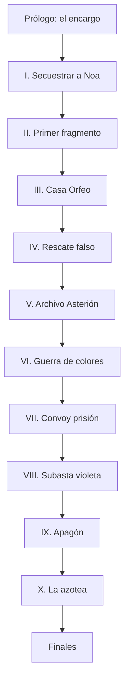

# Historia completa 02 — Treinta y seis horas antes del apagón violeta

> **Mundo:** Cyberpunk — Ciudad Lucerna
>
> **Formato:** historia curada, cerrada y completamente predefinida
>
> **Género:** acción criminal, mafia, secuestro y thriller tecnológico
>
> **Modo comercial:** contenido base sin participación de IA
>
> **Participación de IA durante la partida:** ninguna
>
> **Interacción:** opciones diseñadas, gates, tiradas deterministas y copy authored

---

## 0. Cómo utilizar este documento

Este archivo define una historia interactiva completa para el modo **Historia Pre-armada** de `GDD-RPG-Narrativo-IA.md`. Mantiene el mismo contrato estructural de `Historia-Completa-01-El-Ultimo-Tren-No-Espera-a-los-Vivos.md`, adaptado a un mundo cyberpunk con Street Cred, RAM, créditos, implantes, persecuciones, sigilo digital y conflictos mafiosos.

No es una campaña híbrida. No existen corredores generativos, acciones escritas por el jugador ni turnos interpretados por un narrador de IA. El runtime no crea diálogos, alternativas ni resultados. Cada escena se resuelve mediante contenido authored identificado por `copy_key`.

El motor:

1. carga el nodo;
2. selecciona texto condicional;
3. muestra opciones cuyo gate se cumple;
4. resuelve costo o tirada;
5. aplica efectos atómicos;
6. muestra la variante de resultado;
7. navega al próximo nodo.

### 0.1 Alcance

El documento contiene:

- protagonista fijo y tres perfiles mecánicos;
- ciudad, tecnología, mafias y corporación;
- reglas de implantes, rastreo, alerta y combate;
- secuestro y estado persistente de la rehén;
- 55 nodos authored;
- prólogo, diez capítulos y epílogo;
- dos rutas de infiltración principales;
- alianzas y traiciones delimitadas;
- texto base y variantes de resultado;
- decisiones irreversibles;
- seis finales principales;
- dos cierres de fracaso;
- epílogos modulares;
- esquema compilable;
- presentación móvil y offline;
- matrices de consecuencias;
- QA y orden de implementación.

No se deja ninguna transición a una IA. Las futuras tareas son conversión a formato ejecutable, corrección, localización y producción audiovisual.

### 0.2 Orden de autoridad

1. resultado del motor;
2. estado persistido;
3. efectos del nodo;
4. canon;
5. copy authored;
6. presentación.

### 0.3 Convenciones

- IDs en `snake_case`.
- `PC` designa a Dante Rivas.
- **[Tirada]** usa d20.
- **[Costo]** consume un recurso sin tirar.
- **[Gate]** controla visibilidad.
- **[Irreversible]** exige confirmación.
- **[Hostage]** puede empeorar el estado de Mila.
- `Heat` es presión policial/mafiosa visible.
- `Trace` es rastreo digital.
- `RAM` es capacidad operativa de implantes.
- “Libro Violeta” es el registro cifrado; no un libro físico.

### 0.4 Métrica de extensión

- mínimo: 20.000 palabras;
- objetivo: 28.000–34.000;
- equivalencia: 450–500 palabras por página;
- mínimo editorial: 40 páginas;
- registrar el conteo en validación.

---

## 1. Visión de la historia

### 1.1 Premisa

Ciudad Lucerna no duerme porque casi toda su luz intenta vender algo.

En la Corona, los edificios proyectan amaneceres privados sobre terrazas que nunca ven el suelo. En el Espectro, trenes magnéticos atraviesan anuncios líquidos. En Bajocielo, debajo de las autopistas, la noche solo cambia de color.

Dante Rivas fue el mejor conductor de fuga de Casa Orfeo. Hace tres años dejó la familia, abrió un taller de mensajería y prometió a su hermana Mila que no volvería a deberle nada a una mafia.

La historia comienza cuando encuentra el taller vacío, sangre sobre una camilla de implantes y un mensaje de Amara Orfeo:

> “Traeme a Noa Serrat antes del apagón violeta. Mila vuelve respirando.”

Noa es auditora de Asterión Cívica, la empresa que administra tránsito, cerraduras de emergencia y vigilancia urbana. Para entregarla, Dante debe secuestrarla de un convoy corporativo.

El secuestro sale bien.

La entrega no.

Noa afirma que Mila fue capturada por ayudarla a robar el **Libro Violeta**, un registro que conecta a Asterión, Casa Orfeo y funcionarios de Lucerna con una operación prevista para dentro de treinta y seis horas. Durante un apagón técnico de once minutos, las cerraduras, cámaras y rutas de emergencia de Bajocielo quedarán bajo control mafioso. Una guerra fabricada obligará a evacuar el distrito. Antes del amanecer, sociedades vinculadas ya tendrán comprados edificios, deudas y contratos de reconstrucción.

Ochenta mil personas viven allí.

Dante dispone de treinta y seis horas para encontrar a Mila, decidir si confía en la mujer que secuestró, sobrevivir a tres grupos que quieren el Libro y escoger quién controlará la ciudad cuando todas sus luces se vuelvan violetas.

### 1.2 Gancho

**Una familia mafiosa secuestra a tu hermana y exige que robes a una auditora; cuando lo hacés, descubrís que ambas intentaban impedir que la ciudad venda un distrito entero durante once minutos sin cámaras.**

### 1.3 Fantasía del jugador

- conducir a velocidad imposible entre niveles urbanos;
- hackear semáforos, drones y cerraduras;
- negociar con mafias en clubes de lujo;
- construir un equipo;
- infiltrarse en una torre corporativa;
- rescatar una rehén de un convoy móvil;
- elegir cuánto implante sobrecargar;
- decidir si utilizar, publicar, vender o destruir información;
- acumular Heat y Street Cred;
- resolver conflictos por fuerza, sistemas, calle o presencia;
- protagonizar un apagón de escala urbana;
- terminar como fugitivo, protector callejero, jefe criminal, agente corporativo o leyenda muerta.

### 1.4 Tema central

**En una ciudad donde todo tiene dueño, la libertad empieza por decidir qué no vas a vender.**

Temas:

- deuda familiar;
- consentimiento;
- violencia privatizada;
- seguridad corporativa;
- lealtad mafiosa;
- gentrificación extrema;
- información como arma;
- identidad frente a reputación;
- poder distribuido o concentrado.

### 1.5 Pregunta dramática

**¿Cuánta ciudad entregarías para recuperar a una persona que amás?**

### 1.6 Tono

Acción rápida, diálogos tensos, tecnología legible y oscuridad colorida. La violencia puede incluir:

- disparos;
- heridas por implantes;
- persecuciones;
- secuestro;
- coerción;
- interrogatorio sin tortura gráfica;
- muertes de adultos;
- explosiones urbanas.

El humor es seco y breve. Nadie bromea durante una muerte.

### 1.7 Lo que no es

- No es una búsqueda de una IA consciente.
- No hay realidad simulada.
- Dante no es un androide.
- Mila no es una víctima pasiva.
- Noa no es inocente de todo.
- Amara no quiere destruir la ciudad.
- La corporación no controla cada decisión.
- El Libro no resuelve el conflicto con un botón.
- No existe final donde publicar datos arregle inmediatamente Bajocielo.
- No hay acción libre.
- No hay IA runtime.

---

## 2. Experiencia objetivo

| Elemento | Objetivo |
|---|---|
| Duración | 7 a 10 horas |
| Turnos | 90 a 125 |
| Estructura | Prólogo + 10 capítulos + epílogo |
| Nodos | 55 |
| Decisiones | 80–105 |
| Tiradas | 40–60 |
| Combates obligatorios | 5 |
| Persecuciones | 3 |
| Infiltraciones | 4 |
| Finales principales | 6 |
| Fracasos | 2 |
| Apoyos seleccionables | 1 de 4 |
| Conexión | ninguna |

### 2.1 Ritmo

| Tramo | Sensación | Función |
|---|---|---|
| Prólogo | golpe y velocidad | secuestro de Mila, encargo |
| I | delito obligado | secuestrar a Noa y escapar |
| II | búsqueda | apoyo, rutas, clínica |
| III | mafia | club, trato y emboscada |
| IV | secuestro | rastrear a Mila y rescate falso |
| V | heist | archivo de Asterión |
| VI | guerra callejera | alianzas y persecución |
| VII | rescate | convoy prisión |
| VIII | preparación | evacuación, torre y subasta |
| IX | apagón | ciudad ciega y batalla |
| X | decisión | destino del Libro |

### 2.2 Contenido sensible

- secuestro;
- amenazas a familiares;
- violencia armada;
- extracción de implantes;
- coerción;
- corrupción;
- desplazamiento forzado;
- muerte opcional del protagonista;
- posible muerte de Mila por acumulación extrema.

Límites:

- no violencia sexual;
- no tortura gráfica;
- no menores dañados en primer plano;
- no mutilación recreada;
- muerte de Mila solo mediante final de fracaso con advertencias acumuladas;
- toda ejecución requiere confirmación.

### 2.3 Mobile y guardado

- una decisión por pantalla;
- 2–4 opciones;
- guardado al entrar, después de tirada y antes de irreversible;
- recap authored por capítulo;
- historial local;
- reanudación sin red.

---

## 3. Canon de Ciudad Lucerna

### 3.1 La ciudad

Lucerna es una megaciudad costera de treinta y dos millones de habitantes. Creció hacia arriba cuando el suelo central se volvió demasiado caro y hacia abajo cuando vivir sin sol resultó más barato.

Capas:

| Capa | Función | Luz |
|---|---|---|
| Corona | corporaciones, residencias | blanco cálido privado |
| Espectro | comercio, transporte | neón saturado |
| Bajocielo | industria, vivienda | anuncios y reflejos |
| Fondo | mantenimiento, refrigeración | emergencia azul |

### 3.2 El apagón violeta

Asterión realiza cada seis meses un mantenimiento de once minutos. Antes del corte, toda iluminación autorizada cambia a violeta.

Durante el apagón:

- cámaras civiles quedan en buffer local;
- tránsito pasa a prioridad manual;
- drones policiales regresan a estaciones;
- ascensores se bloquean en pisos seguros;
- cerraduras contra incendio aceptan control de emergencia;
- la red pública se segmenta.

Casa Orfeo compró credenciales para controlar segmentos de Bajocielo.

### 3.3 Operación Palimpsesto

Plan:

1. cortar vigilancia;
2. abrir corredores a fuerzas mafiosas;
3. cerrar rutas de evacuación;
4. fabricar enfrentamiento entre pandillas;
5. declarar Bajocielo zona irrecuperable;
6. ejecutar compras automáticas de deudas y propiedades;
7. reconstruir un distrito de datos.

No pretende matar a 80.000 personas. Acepta miles de heridos y cientos de muertes como costo.

### 3.4 Asterión Cívica

Empresa concesionaria de:

- tránsito;
- vigilancia;
- identidad de acceso;
- infraestructura de emergencia;
- mantenimiento del apagón.

No es gobierno, pero escribe protocolos que el gobierno firma.

### 3.5 Casa Orfeo

Mafia con apariencia de empresa cultural. Controla:

- clubes;
- deuda privada;
- falsificación de identidad;
- contrabando de implantes;
- arbitraje criminal.

Su regla: todo favor tiene precio registrado.

### 3.6 Cardenales de Vidrio

Mafia rival que controla armas, puertos aéreos y seguridad de convoyes. Quiere el Libro para desplazar a Orfeo, no para proteger Bajocielo.

### 3.7 Sindicato Nueve

Red de talleres, clínicas y bandas barriales. No es una sola organización. Puede evacuar Bajocielo si recibe datos y tiempo.

### 3.8 Libro Violeta

Registro cifrado con:

- contratos de Palimpsesto;
- credenciales del apagón;
- pagos;
- rutas;
- firmas;
- compras futuras;
- nombres de informantes.

Está dividido en tres fragmentos:

1. `ledger_financial` en implante de Noa;
2. `ledger_access` copiado por Mila;
3. `ledger_witness` insertado en Ghostline de Dante sin su conocimiento.

Los tres permiten controlar o exponer el plan. Dos permiten sabotaje limitado. Uno solo es prueba incompleta.

### 3.9 Ghostline

Implante de Dante. Predice rutas durante 2,7 segundos usando tránsito local. No ve el futuro. Consume RAM y puede sobrecalentarse.

Mila ocultó el fragmento de testigo durante una reparación.

### 3.10 Cronología

| Tiempo | Evento |
|---|---|
| -3 años | Dante abandona Orfeo |
| -6 meses | Noa detecta Palimpsesto |
| -2 meses | contacta a Mila |
| -4 días | Mila copia acceso |
| -1 día | Orfeo secuestra a Mila |
| 36 h | inicia historia |
| 0 h | apagón violeta |
| +11 min | termina ventana |

---

## 4. Reparto

### 4.1 Dante Rivas

Edad 36. Exconductor de fuga. Dueño de Kilómetro Cero.

Rasgos:

- entiende rutas antes que personas;
- paga deudas;
- odia ascensores;
- lleva chaqueta negra con fibra naranja;
- tiene Ghostline;
- ama a Mila;
- dejó Orfeo después de una fuga donde murió su pareja.

### 4.2 Mila Rivas

Edad 31. Técnica de neuroprótesis.

No es pasiva:

- roba fragmento;
- deja señales hápticas;
- sabotea cautiverio;
- puede escapar parcialmente;
- puede negarse a intercambio;
- puede morir solo con `hostage_condition: 4`.

Relación inicial +2.

### 4.3 Noa Serrat

Edad 34. Auditora de riesgo en Asterión.

Diseñó parte del modelo de compra de Palimpsesto creyendo que era renovación. Al descubrir el operativo, buscó a Mila.

Deseo: publicar el Libro.

Temor: que su confesión se pierda entre datos.

Límite: no volver a una custodia corporativa.

Relación inicial -1 porque Dante la secuestra.

### 4.4 Amara Orfeo

Edad 54. Jefa de Casa Orfeo.

Ve Palimpsesto como forma de evitar guerra urbana mayor y obtener control. No miente sobre el secuestro. Cumple tratos literales.

Relación inicial -2.

### 4.5 Santos Kade

Edad 40. Antiguo compañero de Dante, actual ejecutor de Orfeo.

Fue quien secuestró a Mila. Cree que Dante lo abandonó tres años atrás.

Puede desertar, morir o reemplazar a Amara.

Relación inicial 0.

### 4.6 Mako Jin

Edad 27. Hacker de anuncios y tránsito.

Apoyo de Sistemas. Humor rápido. Debe dinero a Dante.

Relación inicial +1.

### 4.7 Inspectora Nerea Sol

Edad 43. Policía de Delitos de Infraestructura.

Ha aceptado pagos por información, pero Palimpsesto supera su tolerancia.

Apoyo de Presencia/autoridad.

Relación inicial 0.

### 4.8 Rook Vega

Edad 32. Enforcer de Sindicato Nueve.

Brazo cinético, lealtad barrial y violencia directa.

Relación inicial 0.

### 4.9 Tadeo Bell

Edad 49. Jefe de Cardenales de Vidrio.

Quiere el Libro para dominar la ciudad. Ofrece liberar a Mila si puede encontrarla.

Relación inicial -1.

### 4.10 Director Cael Ardan

Edad 58. Responsable de Asterión.

Considera Bajocielo una infraestructura fallida. Cree que Palimpsesto permite reconstruir con menos costo que sostener.

Relación inicial -2.

---

## 5. Configuración de Dante

### 5.1 Identidad fija

No cambiar nombre, pasado, vínculo con Mila, Ghostline ni relación con Orfeo.

### 5.2 Perfil

#### Piloto fantasma

```yaml
reflejos: 4
sistemas: 2
calle: 2
presencia: 1
starting_item: pistola_compacta
passive: ruta_imposible
```

Una vez por capítulo, repetir persecución.

#### Cobrador

```yaml
reflejos: 2
sistemas: 1
calle: 4
presencia: 2
starting_item: brazo_cinetico
passive: nombre_conocido
```

Una vez por capítulo, usar Calle en lugar de Presencia.

#### Intruso

```yaml
reflejos: 2
sistemas: 4
calle: 1
presencia: 2
starting_item: aguja_de_brecha
passive: puerta_trasera
```

Una vez por capítulo, reducir Trace 1 tras hackeo.

### 5.3 Recuerdo

- `ficha_orfeo`: moneda de primera fuga;
- `llave_mila`: llave física del taller;
- `foto_azotea`: Dante, Mila y Santos antes de la ruptura.

### 5.4 Postura inicial

“¿Por qué Dante dejó Casa Orfeo?”

- culpa;
- miedo;
- rechazo a Amara;
- proteger a Mila.

Persiste `reason_left_orfeo`.

### 5.5 Estado inicial

```yaml
current_node: p0_perfil
chapter: 0
hours_remaining: 36
health: null
max_health: null
ram: null
max_ram: null
credits: 12
ammo: 3
heat: 0
trace: 0
chrome_stress: 0
street_vs_corp: 0
street_cred: 0
hostage_condition: 0
ledger_fragments: 1
blackout_progress: 0
```

---

## 6. Mecánicas

### 6.1 Atributos

| Atributo | Uso |
|---|---|
| `reflejos` | conducir, disparar, esquivar, moverse |
| `sistemas` | hackear, implantes, drones, electrónica |
| `calle` | mafias, intimidación, contactos, engaño |
| `presencia` | negociar, liderar, contener, confesar |

### 6.2 Chequeo

`d20 + atributo + modificadores` contra DC.

### 6.3 DC

| DC | Nivel |
|---:|---|
| 9 | controlado |
| 12 | profesional |
| 15 | serio |
| 18 | extremo |
| 21 | límite |

### 6.4 Bandas

- falla;
- éxito;
- crítico con 20 o +5 sobre DC.

Cada banda posee `copy_key`.

### 6.5 Salud

`10 + Reflejos`.

Daño 1–4. A mitad: `wounded`. A 0: fracaso o rescate authored.

### 6.6 RAM

`6 + Sistemas × 2`.

Costos:

- hack breve 1;
- control de drone 2;
- Ghostline avanzado 2;
- brecha de grid 3.

Recuperar 3 en refugio o 1 con estimulante.

### 6.7 Créditos

Unidad abstracta:

- soborno menor 1;
- equipo 2;
- identidad falsa 3;
- favor mafioso 4.

### 6.8 Heat

0–6:

- 0 invisible;
- 2 vigilancia;
- 3 patrullas;
- 4 cacería;
- 5 orden letal;
- 6 ciudad cerrada.

### 6.9 Trace

Rastreo digital 0–6.

- 3 identifica distrito;
- 4 identifica vehículo;
- 5 marca implante;
- 6 Asterión puede bloquear Ghostline.

### 6.10 Chrome Stress

Sobreacelerar:

- repetir tirada de implante;
- +2;
- actuar dos veces;
- recuperar RAM 3.

Costo +1 Stress. En 4, lesión neural. En 6, colapso.

### 6.11 Street frente a Corp

Escala -3 a +3.

Positivo:

- compartir datos;
- evacuar;
- proteger talleres;
- rechazar propiedad del Libro.

Negativo:

- contratos;
- vender información;
- priorizar orden corporativo;
- usar credenciales para control.

### 6.12 Estado de Mila

| Valor | Estado |
|---:|---|
| 0 | estable |
| 1 | trasladada |
| 2 | herida |
| 3 | implante en extracción |
| 4 | muerta |

Sube solo en eventos **[Hostage]** visibles o por reloj extremo.

### 6.13 Combate

Guardia:

- enemigo menor 1;
- agente 2;
- cyber-enforcer 4;
- jefe 6–10.

Éxito -1, crítico -2. Armas y chrome modifican.

### 6.14 Persecución

Progreso vs Presión. Las rutas cambian por Reflejos, Sistemas o Calle.

### 6.15 Hackeo

Cada sistema declara:

- ICE;
- Trace;
- progreso;
- daño neural;
- salida física.

No hay hackeo mágico sin conexión.

### 6.16 Falla hacia delante

Consume recursos, aumenta Heat/Trace, empeora rehén, hiere o cambia ruta. Nunca bloquea el Libro principal.

---

## 7. Progresión

### 7.1 Street Cred

+1 nodo, +1 riesgo, +1 decisión con costo. Máximo +3 por nodo.

### 7.2 Rangos

| Cred | Rango | Beneficio |
|---:|---|---|
| 0 | mensajero | perfil |
| 6 | conocido | +2 Salud o RAM |
| 14 | operador | módulo secundario |
| 24 | nombre propio | +1 atributo |
| 36 | leyenda | talento final |

### 7.3 Módulos

- `freno_sinaptico`: reducir Heat tras persecución;
- `icebreaker`: repetir Sistemas;
- `placa_subdermica`: reducir daño;
- `modulador_vocal`: ventaja social.

### 7.4 Talentos finales

- `nadie_me_sigue`: cancelar Trace una vez;
- `la_ciudad_escucha`: transmitir sin infraestructura;
- `deuda_final`: convertir daño a favor de aliado.

---

## 8. Estado persistente

### 8.1 Flags

```yaml
flags:
  mila_kidnapped: false
  noa_abducted: false
  noa_restrained: false
  noa_trusted: false
  noa_betrayed: false
  garage_burned: false
  corporate_shuttle_stolen: false
  viaduct_escape_clean: false
  support_mako: false
  support_nerea: false
  support_rook: false
  support_santos: false
  route_neon_market: false
  route_service_tunnels: false
  mirror_clinic_safe: false
  ghostline_fragment_found: false
  cobalto_deal: false
  amara_offer_accepted: false
  amara_offer_rejected: false
  glass_ambush_survived: false
  santos_defected: false
  santos_hostile: false
  mila_first_location_found: false
  hotel_infiltrated: false
  false_rescue_triggered: false
  mila_haptic_message: false
  asterion_archive_entered: false
  ledger_financial_acquired: false
  ledger_access_acquired: false
  ledger_witness_acquired: false
  full_ledger: false
  ledger_copy_street: false
  ledger_copy_police: false
  ledger_copy_glass: false
  ledger_copy_public: false
  street_war_active: false
  alliance_orfeo: false
  alliance_glass: false
  alliance_nine: false
  alliance_nerea: false
  air_chase_won: false
  betrayal_resolved: false
  prison_convoy_found: false
  mila_rescued: false
  mila_injured: false
  mila_dead: false
  bajocielo_warned: false
  bajocielo_evacuated: false
  lux_tower_mapped: false
  violet_auction_entered: false
  amara_defeated: false
  amara_killed: false
  blackout_started: false
  grid_breached: false
  palimpsest_stopped: false
  final_choice_locked: false
  dante_dead: false
```

### 8.2 Relaciones

```yaml
relationships:
  mila: 2
  noa: -1
  amara: -2
  santos: 0
  mako: 1
  nerea: 0
  rook: 0
  tadeo: -1
  ardan: -2
```

### 8.3 Inventario

- `ghostline`;
- `arma_perfil`;
- `recuerdo`;
- `moto_sable`;
- `llave_taller`;
- `aguja_brecha`;
- `granada_emp`;
- `identidad_espejo`;
- `pulsera_mila`;
- `fragmento_financiero`;
- `fragmento_acceso`;
- `fragmento_testigo`;
- `credencial_asterion`;
- `token_orfeo`;
- `sello_vidrio`;
- `baliza_nueve`;
- `llave_grid`;

### 8.4 Pruebas

```yaml
evidence:
  proof_mila_alive: false
  proof_palimpsest: false
  proof_orfeo_contract: false
  proof_asterion_contract: false
  proof_noa_complicity: false
  proof_mila_consent: false
  proof_santos_kidnapper: false
  proof_ardan_order: false
```

### 8.5 Contadores

```yaml
auxiliary:
  chase_pressure: 0
  hack_pressure: 0
  hostage_condition: 0
  blackout_timer_minutes: 11
  district_population_at_risk: 80000
  civilian_casualties: 0
  selected_support: null
  reason_left_orfeo: null
  session_seed: null
```

---

## 9. Arquitectura narrativa

### 9.1 Runtime

```yaml
runtime:
  narrator_adapter: curated_copy_adapter
  ai_calls: 0
  free_text_input: false
  dynamic_options: false
  offline_bundle: true
```

### 9.2 Grafo general



### 9.3 Índice de nodos

| # | ID | Tipo |
|---:|---|---|
| 1 | `p0_perfil` | configuración |
| 2 | `p1_entrega_rota` | ataque |
| 3 | `p2_mensaje_orfeo` | secuestro |
| 4 | `c1_n01_garage_cero` | investigación |
| 5 | `c1_n02_secuestrar_noa` | acción |
| 6 | `c1_n03_escape_viaducto` | persecución |
| 7 | `c1_n04_pacto_noa` | decisión |
| 8 | `c2_n01_elegir_apoyo` | selección |
| 9 | `c2_n02_mercado_neon` | ruta |
| 10 | `c2_n03_tuneles_servicio` | ruta |
| 11 | `c2_n04_clinica_espejo` | infiltración |
| 12 | `c2_n05_primer_fragmento` | revelación |
| 13 | `c3_n01_club_cobalto` | ingreso |
| 14 | `c3_n02_mesa_orfeo` | negociación |
| 15 | `c3_n03_emboscada_cristal` | combate |
| 16 | `c3_n04_santos_decide` | relación |
| 17 | `c4_n01_rastro_mila` | investigación |
| 18 | `c4_n02_hotel_ascendente` | infiltración |
| 19 | `c4_n03_piso_sin_ventanas` | acción |
| 20 | `c4_n04_rescate_falso` | giro |
| 21 | `c4_n05_mensaje_mila` | revelación |
| 22 | `c5_n01_archivo_asterion` | heist |
| 23 | `c5_n02_infiltracion_vertical` | ruta |
| 24 | `c5_n03_boveda_civica` | hackeo |
| 25 | `c5_n04_libro_violeta` | revelación |
| 26 | `c5_n05_copias` | decisión |
| 27 | `c6_n01_guerra_colores` | caos |
| 28 | `c6_n02_alianza` | facción |
| 29 | `c6_n03_caceria_aerea` | persecución |
| 30 | `c6_n04_traicion` | giro |
| 31 | `c7_n01_prision_movil` | rastreo |
| 32 | `c7_n02_convoy_orfeo` | asalto |
| 33 | `c7_n03_rescate_mila` | rescate |
| 34 | `c7_n04_quien_queda` | costo |
| 35 | `c7_n05_reunion` | vínculo |
| 36 | `c8_n01_preparativos` | hub |
| 37 | `c8_n02_evacuacion_bajocielo` | calle |
| 38 | `c8_n03_torre_lux` | infiltración |
| 39 | `c8_n04_subasta_violeta` | mafia |
| 40 | `c8_n05_amara` | combate |
| 41 | `c9_n01_apagon_violeta` | hito |
| 42 | `c9_n02_ciudad_ciega` | acción |
| 43 | `c9_n03_nucleo_grid` | hackeo |
| 44 | `c9_n04_ultima_persecucion` | persecución |
| 45 | `c10_n01_azotea` | confrontación |
| 46 | `c10_n02_decision_final` | selector |
| 47 | `end_ciudad_abierta` | final |
| 48 | `end_deuda_pagada` | final |
| 49 | `end_nuevo_rey` | final |
| 50 | `end_duenos_noche` | final |
| 51 | `end_cero_violeta` | final |
| 52 | `end_ultimo_conductor` | final |
| 53 | `fail_sin_nombre` | fracaso |
| 54 | `fail_palimpsesto` | fracaso |
| 55 | `epilogo` | epílogo |

---

## 10. Prólogo — La ciudad cobra antes de entregar

### 10.1 `p0_perfil`

**Tipo:** configuración authored.

**Copy — `p0_opening`:**

> A 280 kilómetros por hora, Ciudad Lucerna deja de parecer una ciudad.
>
> Se convierte en líneas: naranja para carriles, azul para rutas corporativas, rojo para zonas donde alguien pagó por no ser visto.
>
> Dante Rivas inclina la moto entre dos transportes. Ghostline dibuja una curva sobre su visión. Dentro de 2,7 segundos, un dron cerrará el carril.
>
> Dante entra antes.
>
> La chaqueta roza el guardarraíl. Abajo hay cuarenta pisos de anuncios.
>
> En la caja trasera transporta un corazón sintético sin registrar. En el auricular, Mila le recuerda que el cliente no paga si llega después de medianoche.

Mostrar perfiles. Al elegir:

```yaml
effects:
  health: "10 + reflejos"
  max_health: health
  ram: "6 + sistemas * 2"
  max_ram: ram
  inventory_add:
    - ghostline
    - arma_perfil
    - recuerdo
    - llave_taller
```

**Copy posterior:**

> —Te quedan noventa segundos —dice Mila.
>
> —Ochenta y seis.
>
> —No era una competencia.
>
> —Entonces no cuentes.

Elegir recuerdo y motivo para dejar Orfeo. No cambia canon.

### 10.2 `p1_entrega_rota`

**Tipo:** persecución tutorial.

**Copy — `p1_delivery_open`:**

> La salida al Espectro explota en luz magenta.
>
> Un transporte de Asterión atraviesa el carril sin señal. Ghostline lo marca demasiado tarde. Dante frena, gira y ve a tres motos negras detrás.
>
> No son policía.
>
> Llevan máscaras con una nota musical partida: Casa Orfeo.
>
> La primera moto dispara al contenedor del corazón.

Conflicto:

```yaml
objective: llegar_al_cliente
progress_required: 3
pressure_limit: 3
```

#### Reflejos

Cruzar carriles DC 12.

- falla: Salud -2, Presión +1;
- éxito: Progreso +1;
- crítico: Progreso +2.

#### Sistemas

Hackear semáforos, costo RAM 1, DC 12.

- falla Trace +1;
- éxito cerrar paso;
- crítico derribar moto sin baja civil.

#### Calle

Entrar ruta de contrabando DC 15.

- éxito evitar cámaras;
- falla Heat +1.

#### Disparar

Instinto se resuelve con Reflejos DC 15, Ammo -1.

- éxito Guardia enemiga -1;
- crítico derriba;
- falla rompe anuncio, Heat +1.

#### Civil en aerotaxi

En Presión 2, una moto empuja un taxi contra vacío.

- salvarlo: Reflejos DC 18, Calle/Street +1;
- ignorar: Progreso automático, street_vs_corp -1;
- usarlo como barrera: éxito automático de escape, Street -2.

**Resultado común:**

> Dante llega al helipuerto. El cliente no está.
>
> Sobre la plataforma hay una caja de pago vacía y un mensaje:
>
> **VOLVÉ AL TALLER.**

El corazón puede:

- entregarse después: +4 Créditos;
- usarse para soborno médico;
- perderse en falla extrema.

### 10.3 `p2_mensaje_orfeo`

**Tipo:** secuestro y gancho.

**Copy — `p2_garage`:**

> Kilómetro Cero tiene el portón abierto.
>
> Dante apaga la moto antes de entrar. Las luces del taller alternan blanco y violeta. Una camilla está volcada. Sobre el suelo hay sangre suficiente para asustar y no tanta para confirmar una muerte.
>
> La prótesis de práctica de Mila cuelga de un cable.
>
> Una pantalla se enciende.
>
> Mila aparece sentada contra una pared negra. Tiene las manos sujetas y un hematoma bajo el ojo. Mira a cámara.
>
> —Dante, no—
>
> La imagen se congela.
>
> Amara Orfeo ocupa la pantalla.
>
> —Noa Serrat saldrá de la Torre Asterión dentro de cuarenta minutos. Traémela viva al Club Cobalto. Treinta y seis horas antes del apagón.

Opciones de respuesta grabada:

1. “Quiero hablar con Mila.” — prueba de vida adicional, `proof_mila_alive`.
2. “No trabajo para vos.” — Amara -1, Mila Pressure +0.
3. “¿Qué robó?” — Amara confirma un acceso, no Libro.
4. aceptar sin hablar — Santos interpreta profesionalismo.

Amara:

> —Si intentás rastrear la llamada, la muevo. Si avisás a la policía, la abro. Si entregás a Serrat, recuperás a tu hermana.
>
> —¿Y mi deuda?
>
> —Eso recupera a Mila. Tu deuda es otra conversación.

Efectos:

```yaml
mila_kidnapped: true
proof_mila_alive: true
hours_remaining: 36
```

---

## 11. Capítulo I — Secuestrar a la persona equivocada

### 11.1 `c1_n01_garage_cero`

**Tipo:** investigación.

El jugador puede revisar tres de cinco zonas.

#### Sangre

Sistemas DC 12.

- éxito: sangre de Mila mezclada con gel médico; herida superficial;
- crítico: sedante Orfeo lote Cobalto;
- falla: consume muestra.

#### Camilla

Técnica/Sistemas DC 15.

- descubrir que Mila insertó datos en Ghostline horas antes;
- todavía cifrados;
- `ghostline_fragment_found` se activa en clínica.

#### Cámaras

Sistemas DC 15, RAM 1.

- éxito: Santos dirigió secuestro;
- crítico: ver vehículo prisión;
- falla Trace +1.

#### Pulsera

Encontrar `pulsera_mila`. Emite patrones hápticos programados.

#### Taller

Recuperar:

- +1 Ammo;
- +2 Créditos;
- `moto_sable`;
- granada EMP si perfil técnico.

#### Decisión

- ir directo a Noa;
- llamar apoyo primero, cuesta 8 minutos;
- rastrear a Santos, cuesta 20 minutos y empeora custodia;
- denunciar anónimamente, Heat +1 y Nerea entra temprano.

### 11.2 `c1_n02_secuestrar_noa`

**Tipo:** secuestro/action set piece.

**Copy — `c1_abduction_open`:**

> Noa Serrat no sale por la puerta.
>
> Asterión la baja dentro de un ascensor blindado hasta un shuttle suspendido. Dos drones escolta abren carril privado. El vehículo despega hacia Corona.
>
> Dante tiene ocho segundos antes de que entre en ruta cerrada.

Enfoques:

#### Embestir el shuttle

Reflejos DC 15.

- falla daño 2, Heat +1;
- éxito fijar moto al lateral;
- crítico cortar escolta.

#### Hackear ruta

Sistemas DC 15, RAM 2.

- falla Trace +2;
- éxito desviar a plataforma;
- crítico bloquear comunicación.

#### Credencial Orfeo

Calle DC 15.

- convencer seguridad de transferencia;
- falla identifica a Dante, Heat +2.

#### Pedir rendición a Noa

Presencia DC 18 por canal.

- éxito ella abre puerta porque esperaba extracción;
- crítico revela nombre de Mila;
- falla activa espuma defensiva.

Dentro, Noa se defiende con aguja neural. Guardia 3.

Opciones:

- inmovilizar no letal;
- disparar a pierna **[Irreversible de lesión]**;
- negociar;
- sedar con gel;
- dejar que conduzca mientras Dante cubre.

**Copy de captura limpia:**

> Noa deja la aguja cuando Dante dice el nombre de Mila.
>
> —Llegaste tarde —responde.
>
> —Ella sigue viva.
>
> —Entonces llegaste justo antes de volverla inútil.

Efectos: `noa_abducted`, relación según violencia.

### 11.3 `c1_n03_escape_viaducto`

**Tipo:** persecución.

**Copy:**

> El shuttle entra al Viaducto Espectral con cuatro drones detrás y una orden de cierre delante.
>
> Los anuncios se apagan para mostrar la cara de Dante.
>
> **SOSPECHOSO DE SECUESTRO.**
>
> Noa mira la pantalla.
>
> —Técnicamente correcto.

Conflicto 4 Progreso, 3 Presión.

Acciones:

- Ghostline, RAM 2, Reflejos DC 15;
- Noa hackea si libre, relación +;
- saltar nivel, Reflejos DC 18;
- ocultarse en anuncio líquido, Sistemas DC 15;
- abrir fuego, Ammo y Heat;
- entregar shuttle y seguir a pie, pierde equipo.

Presiones:

1. drone marca implante, Trace +1;
2. bloqueo;
3. disparo atraviesa cabina, daño.

En éxito limpio: `viaduct_escape_clean`, Heat -1.  
En falla: llegar al refugio con Heat +2 y shuttle dañado.

### 11.4 `c1_n04_pacto_noa`

**Tipo:** decisión de custodia.

Refugio: lavandería automática cerrada bajo Espectro.

**Copy:**

> Dante ata a Noa a una silla o deja sus manos libres.
>
> Las lavadoras proyectan peces tropicales sobre puertas vacías.
>
> —Amara quiere entregarte por Mila.
>
> —Amara quiere los tres fragmentos.
>
> —No sé de qué hablás.
>
> Noa señala la sien de Dante.
>
> —Eso es lo que Mila esperaba.

Noa explica Palimpsesto parcialmente.

#### Opción A — Mantenerla atada

- `noa_restrained`;
- Noa -1;
- más segura;
- hackeos sin su ayuda.

#### Opción B — Liberarla y pactar

Presencia DC 15.

- éxito `noa_trusted`, Noa +1;
- crítico comparte fragmento financiero después;
- falla acepta pero guarda salida.

#### Opción C — Entregarla ya

- `amara_offer_accepted`;
- ir a Club Cobalto temprano;
- Mila no se libera: Amara exige datos;
- Noa -3.

#### Opción D — Contactar Asterión

- Director ofrece inmunidad;
- Street_vs_corp -1;
- Noa -2;
- emboscada corporativa posible.

#### Opción E — Pedir prueba

Noa reproduce compra futura de edificios.

Obtener `proof_palimpsest` parcial.

**Cierre:**

> La pulsera de Mila vibra.
>
> Tres pulsos. Pausa. Dos.
>
> No es una llamada.
>
> Es una coordenada de clínica.

---

## 12. Capítulo II — Nadie se esconde debajo de todos los anuncios

### 12.1 `c2_n01_elegir_apoyo`

Elegir un apoyo.

#### Mako

- Sistemas;
- reduce Trace;
- abre Mercado Neón.

> —Secuestraste una auditora y me llamás después —dice—. Eso hiere.

#### Nerea

- autoridad;
- reduce Heat;
- puede traicionar por ley.

> —Decime que la mujer en las noticias está voluntariamente en tu lavandería.

#### Rook

- combate;
- acceso Sindicato Nueve;
- evacua Bajocielo.

> —Si esto toca mi distrito, no soy apoyo. Soy condición.

#### Santos

- acceso Orfeo;
- conoce a Mila;
- riesgo de traición.

> —Te dieron un encargo simple y ya armaste un equipo. Te extrañaba.

Guardar solo un apoyo principal. No elegidos reaparecen por facción.

### 12.2 `c2_n02_mercado_neon`

**Tipo:** ruta pública.

Mercado Neón es un kilómetro de puestos bajo pantallas.

Objetivo: comprar identidad espejo y llegar a clínica.

Opciones:

- pagar 3 Créditos;
- robar credencial, Calle DC 15;
- hackear kiosco, Sistemas DC 15, Trace;
- pedir a Mako;
- aceptar favor de Cardenales.

Evento:

Un equipo Orfeo reconoce a Noa.

- esconderla en cabina cosmética;
- enfrentar;
- usarla como rehén pública, Street -2;
- dejar que hable.

Éxito: `identidad_espejo`, ruta rápida.  
Falla: Heat +1, persecución corta.

### 12.3 `c2_n03_tuneles_servicio`

**Tipo:** ruta de infraestructura.

Los túneles atraviesan refrigeración y cables.

Riesgos:

- drones obreros;
- calor;
- compuertas;
- sin señal.

Conflicto 3 Progreso, 2 Presión.

- Sistemas para puertas;
- Reflejos para conductos;
- Calle para trabajadores;
- RAM para mapa.

En Presión 2, Mila es trasladada: `hostage_condition: 1`.

Recompensa: `credencial_asterion` de técnico caído, menos Heat.

### 12.4 `c2_n04_clinica_espejo`

**Tipo:** infiltración.

**Copy:**

> La Clínica Espejo cambia rostros legales, no físicos.
>
> Sus clientes entran debiendo dinero y salen debiéndole a otra persona.
>
> La coordenada de Mila señala la camilla siete.

La camilla contiene:

- residuos de Mila;
- puerto de extracción;
- mensaje;
- fragmento de Ghostline.

Guardias Orfeo llegan en tres turnos.

Acciones:

- extraer log, Sistemas DC 15;
- buscar sedante, Técnica DC 12;
- preparar emboscada;
- evacuar pacientes;
- cerrar clínica.

Noa puede revelar que trabajó aquí con Mila.

Decisión sobre pacientes ilegales:

- dejarlos;
- avisar guardias;
- evacuar a Sindicato;
- usar como cobertura.

Impacta Street.

### 12.5 `c2_n05_primer_fragmento`

**Tipo:** revelación.

Mila dejó un algoritmo dentro de Ghostline.

**Copy:**

> Noa conecta el puerto.
>
> Ghostline se apaga.
>
> Durante tres segundos Dante no ve rutas. La ciudad deja de anticiparse y se vuelve inmensa.
>
> Después aparece una memoria que no es suya: Mila copiando contratos, Noa sosteniendo la puerta y Santos entrando a la clínica.

Obtener:

- `ledger_witness_acquired`;
- `ghostline_fragment_found`;
- `proof_santos_kidnapper`;
- `ledger_fragments: 1` ya reconocido.

Mila dice en memoria:

> “Si Dante ve esto, Amara ya me tiene. No le entregues a Noa. No hasta juntar los tres.”

Opciones:

- confiar en Mila y Noa;
- acusar a Noa de usarlo;
- borrar fragmento **[Irreversible]**;
- copiarlo a apoyo.

Borrar:

- pierde prueba;
- reduce Trace;
- cierra final público perfecto;
- Noa -2.

Ataque de clínica:

Guardia 5. Escape según apoyo. Heat/daño.

---

## 13. Capítulo III — En Casa Orfeo, hasta las amenazas tienen recibo

### 13.1 `c3_n01_club_cobalto`

**Tipo:** ingreso mafioso.

**Copy:**

> El Club Cobalto ocupa un ascensor que nunca se detiene.
>
> Cada piso es una sala distinta. Azul para apuestas, oro para contratos, rojo para violencia autorizada.
>
> La mesa de Amara está en el piso que no figura en el panel.

Entradas:

- entregar armas;
- ocultar arma, Calle DC 15;
- hackear ascensor, Sistemas DC 18;
- entrar por mantenimiento;
- usar Noa como entrega.

Vestimenta/identidad influye. Heat externo se suspende dentro.

### 13.2 `c3_n02_mesa_orfeo`

**Tipo:** negociación.

Amara muestra a Mila viva en un cuarto remoto.

Oferta:

- entregar Noa;
- permitir extracción de Ghostline;
- recibir Mila después del apagón.

No cumple intercambio inmediato porque necesita fragmentos.

Opciones:

1. aceptar de forma provisional;
2. exigir intercambio simultáneo;
3. mostrar prueba parcial;
4. fingir que tiene Libro completo;
5. amenazar publicar;
6. rechazar.

#### Intercambio simultáneo

Presencia DC 18.

- éxito: Mila se mueve a hotel accesible;
- crítico: Santos custodia;
- falla Hostage +1.

#### Fingir Libro completo

Calle DC 18.

- éxito Amara entrega token;
- falla detecta falta de fragmentos, Trace +1.

Amara explica su postura:

> —Bajocielo ya está en guerra. Palimpsesto decide quién cobra por terminarla.

### 13.3 `c3_n03_emboscada_cristal`

**Tipo:** combate.

Cardenales de Vidrio atacan el ascensor para robar a Noa.

Arena móvil por pisos.

Enemigos Guardia 7.

Fases:

1. cristal fracturado;
2. gravedad lateral por ascensor;
3. salto entre cabinas.

Acciones:

- cubrir Noa;
- perseguir atacante;
- salvar civiles del club;
- usar EMP;
- dejar que Orfeo luche.

Tadeo ofrece por canal:

> “Entregame a Serrat. Encuentro a Mila antes de que Amara termine su copa.”

Aceptar abre alianza Vidrio. Rechazar batalla.

### 13.4 `c3_n04_santos_decide`

**Tipo:** relación.

Después del ataque, Santos queda herido y separado de Orfeo.

**Copy:**

> Santos apoya la espalda contra un anuncio de perfume.
>
> La sangre le baja por el implante mandibular.
>
> —Mila me pidió que la dejara terminar la copia —dice—. Después me apuntó con un soldador.

Revela que retardó extracción.

Opciones:

- tratarlo, costo;
- abandonarlo;
- capturarlo;
- matarlo **[Irreversible]**;
- pedir que traicione a Amara;
- devolverlo a Orfeo.

Deserción requiere:

- relación +1;
- foto de azotea o verdad sobre abandono;
- Presencia DC 15.

Éxito `santos_defected`.  
Falla `santos_hostile`.  
Matar cierra reconciliación y facilita Vidrio.

**Cierre:**

La pulsera de Mila vibra con coordenadas de un hotel ascendente.

---

## 14. Capítulo IV — El hotel que cambia de piso

**Ventana temporal:** faltan entre 27 y 24 horas.

**Propósito del capítulo:** convertir la búsqueda de Mila en una operación concreta, demostrar que ella está dejando un rastro deliberado y obligar a Dante a distinguir entre rescatar a su hermana y perseguir la primera oportunidad que se parece a un rescate.

### 14.1 `c4_n01_rastro_mila`

**Tipo:** investigación con límite de tiempo.

Las coordenadas no señalan una habitación. Señalan una posición vertical que cambia cada noventa segundos.

El Hotel Ascendente se levanta en el límite entre Espectro y Corona. Sus plantas son módulos independientes que suben y bajan por una columna central; una suite puede amanecer frente a las nubes y terminar la noche junto a una autopista. La publicidad lo vende como “arquitectura con libertad de movimiento”. Para secuestrar a alguien, significa una celda sin dirección fija.

**Apertura narrativa:**

> La pulsera dibuja un pulso corto, dos largos y otro corto.
>
> Dante conoce ese ritmo. Mila lo usaba de niña para avisarle que su madre venía por el pasillo.
>
> No significa “ven”.
>
> Significa “mira antes de entrar”.

El jugador dispone de **dos acciones de investigación** antes de que el módulo marcado salga de la ruta pública.

#### Acción A — Reconstruir el patrón háptico

Tirada de Sistemas DC 12.

- Éxito: Mila codificó `18-4-9`, la numeración de un elevador de carga, no una habitación. Se obtiene `mila_code_decoded`.
- Falla: se interpreta como habitación 1849; el grupo pierde tiempo y gana `trace +1`.
- Si Dante conserva la pulsera y vio la foto de la azotea: ventaja.

#### Acción B — Comprar la rotación del edificio

Costo: 320 créditos o Calle DC 15.

- Pago: se obtiene el itinerario exacto y `credits -320`.
- Éxito social: una operadora de mantenimiento llamada Sumi entrega la tabla a cambio de una promesa; `sumi_owed = true`.
- Falla: un revendedor vende la consulta a Orfeo; `heat +1`.

#### Acción C — Preguntar en la Clínica Espejo

Disponible si la clínica quedó aliada o si Dante salvó al paciente.

- Sin tirada: la firma médica de Mila apareció en dos bolsas de sedante que salieron hacia el hotel.
- Otorga `hotel_sedative_known`.
- Si la clínica quedó hostil: Presencia DC 15 y costo de 1 favor.

#### Acción D — Usar el contacto elegido

- **Mako:** triangula rebotes de la pulsera. Sistemas DC 12. En éxito descubre un piso duplicado en los planos.
- **Nerea:** consigue manifiestos de seguridad. Presencia DC 12. En falla activa una auditoría y `heat +1`.
- **Rook:** interroga al conductor que llevó los sedantes. Calle DC 12. Si Dante permite violencia, éxito automático y `rook_hardens = true`.
- **Santos:** reconoce el protocolo de traslado de Orfeo. Sin tirada, pero exige que no maten al jefe de custodia.

Con dos éxitos se obtiene `hotel_route_complete`. Con uno, se entra con una complicación. Con cero, la entrada comienza en alarma.

**Elección de aproximación:**

1. **“Entramos como huéspedes.”**  
   Requiere ropa corporativa, 450 créditos o Presencia DC 15. Reduce Heat durante el vestíbulo.

2. **“Usamos el elevador de basura.”**  
   Requiere `mila_code_decoded` o Calle DC 12. Permite llegar cerca del objetivo con penalización por espacio estrecho.

3. **“Subimos por afuera.”**  
   Requiere Reflejos DC 15. Evita cámaras, aumenta Estrés de Cromo en 1.

4. **“Que el edificio venga a nosotros.”**  
   Solo con Mako o Sistemas 3. Se falsea una orden y el módulo baja a Bajocielo. Sistemas DC 18; una falla provoca alarma y daño estructural.

**Salida:** todas las rutas conducen a `c4_n02_hotel_ascendente`, con distintas posiciones iniciales.

### 14.2 `c4_n02_hotel_ascendente`

**Tipo:** infiltración móvil.

El vestíbulo tiene un cielo artificial color coral. Cada vez que una planta cambia de altura, la luz simula un atardecer distinto para que los huéspedes no pierdan la noción del lujo. Las paredes son pantallas translúcidas. Detrás se ven siluetas de ascensores, drones de equipaje y hombres armados que no figuran en la nómina.

La secuencia se divide en tres controles. El motor debe mostrar la posición del módulo objetivo después de cada uno.

#### Control 1 — Acceso

Si entran como huéspedes:

> La recepcionista no mira a Dante. Mira el precio de sus ojos, el historial de su chaqueta y la deuda asociada a su apellido.
>
> —Señor Rivas, su perfil no coincide con ninguna reserva.
>
> Noa se apoya en el mostrador.
>
> —Porque la reserva está a mi nombre.

Presencia DC 15. Con `noa_trust >= 1`, Noa puede asumir el riesgo y reducir la dificultad a 12.

Si entran por servicio:

Un compactador se activa mientras el ascensor asciende. Reflejos DC 12 o `health -1`. Con Santos, el compactador puede detenerse usando un código interno.

Si entran por el exterior:

Dante avanza sobre placas de vidrio electrocrómico mientras la torre cambia de configuración. Tres drones limpiadores se convierten en torretas. Reflejos DC 15 o combate corto.

#### Control 2 — El piso equivocado

El módulo 18-4-9 se acopla durante veinte segundos a una planta ocupada por una boda corporativa. Los invitados llevan máscaras que proyectan rostros famosos. Entre ellos hay custodios de Orfeo.

Opciones:

- mezclarse con la boda;
- provocar una discusión entre familias;
- cortar la música y cruzar durante el pánico;
- tomar de rehén a un custodio;
- esperar la siguiente conexión, perdiendo una ventana temporal.

Mezclarse usa Presencia. Provocar pelea usa Calle. Cortar música usa Sistemas. La violencia directa suma `heat +1` y hace que los invitados graben la cara de Dante.

Un éxito permite robar una llave llamada **Azucena**. `key_azucena = true`.

#### Control 3 — Transferencia de módulo

El pasillo se parte en dos. La mitad de adelante sube; la mitad de atrás baja. Las puertas se cierran como cuchillas.

Tirada grupal:

- Dante: Reflejos DC 15;
- Noa: supera automáticamente si confía en Dante; de lo contrario necesita ayuda;
- contacto: depende de relación.

El jugador debe elegir a quién ayuda si dos personajes quedan separados.

- Ayudar a Noa: `noa_trust +1`.
- Ayudar al contacto: `support_loyalty +1`.
- Priorizar la puerta del objetivo: conserva posición, pero quien quede atrás sufrirá `wounded_support = true` o `noa_wounded = true`.

**Hallazgo:** el módulo marcado no aparece en el panel del edificio. La llave Azucena abre una puerta sin número. Sin ella, Sistemas DC 15 o explosivos.

### 14.3 `c4_n03_piso_sin_ventanas`

**Tipo:** combate e investigación.

La puerta da a un piso más ancho de lo que permiten las medidas exteriores. No tiene ventanas. El aire huele a antiséptico, flores plásticas y ozono.

Hay cuatro habitaciones, una sala de control y nueve guardias distribuidos en patrullas. El jugador puede neutralizar dos elementos antes de que comience la extracción:

- cámaras;
- cerraduras;
- guardias;
- sedante ambiental;
- enlace de alarma con Orfeo.

Cada elemento no neutralizado se convierte en una complicación durante `c4_n04_rescate_falso`.

#### Habitación 1 — Los trajes

Contiene ropa de Mila, sangre sintética, muestras de voz y una prótesis capilar. Sistemas DC 12 revela que prepararon un doble digital para simular una entrega.

`mila_double_known = true`.

#### Habitación 2 — Los deudores

Tres personas están conectadas a sillas de memoria. Son titulares legales de edificios de Bajocielo. Orfeo está extrayendo firmas biométricas para transferir sus propiedades.

El jugador puede:

- liberarlos, consumiendo tiempo;
- copiar los contratos;
- sedarlos para que no activen sensores;
- ignorarlos.

Liberarlos activa `debtors_rescued = true` y aumenta Credibilidad Callejera en 1, pero agrega un guardia al combate final. Copiar contratos da `palimpsest_property_proof = true`.

#### Habitación 3 — El eco

Una proyección de Mila está sentada en la cama.

> —Dante, si ves esto, ya llegaste tarde.
>
> La imagen levanta la vista. El gesto es correcto. La voz también.
>
> —Pero llegar tarde no siempre significa haber perdido.

Con `mila_double_known`, se detecta enseguida que es un guion. Sin esa bandera, el motor ofrece una elección emocional:

- abrazarla;
- interrogarla;
- disparar al proyector;
- buscar la fuente de la señal.

Abrazar no causa daño, pero bloquea puertas y activa una alarma. Interrogar con Presencia DC 12 rompe el bucle. Buscar fuente con Sistemas DC 12 descubre un paquete pendiente.

#### Sala de control

Allí espera **Bram Ochoa**, custodio de Orfeo y antiguo compañero de Dante. Tiene un brazo blindado, una escopeta de inducción y órdenes de entretener, no de matar.

> —La jefa dijo que vendrías rápido.
>
> —Entonces ¿por qué la movieron?
>
> Bram sonríe.
>
> —Porque también dijo que llegarías tarde.

Resoluciones:

- combate directo;
- soborno de 700 créditos;
- recordarle que Orfeo abandonó a su hermano;
- Santos lo convence, si está presente y leal;
- amenazar con publicar los contratos.

Si Bram sobrevive y se rinde, entrega la ruta parcial del convoy. `bram_alive = true`. Si muere, se obtiene su llave, pero `santos_loyalty -1` si Santos pidió clemencia.

### 14.4 `c4_n04_rescate_falso`

**Tipo:** trampa de alto riesgo.

El centro del piso contiene una cápsula médica. Dentro parece estar Mila. Los monitores muestran frecuencia cardíaca, oxígeno y actividad cerebral.

El jugador dispone de pocos segundos antes de que el piso se desacople de la torre.

Opciones iniciales:

1. abrir la cápsula;
2. escanear el cuerpo;
3. aislar el módulo;
4. evacuar a todos;
5. seguir la señal que sale de la cápsula.

Abrir sin escanear activa espuma conductiva y dos torretas. El cuerpo es un maniquí térmico con una máscara de Mila. `health -1`, `trace +1`.

Escanear usa Sistemas DC 12. Éxito identifica el señuelo y una transmisión oculta. Falla consume la mitad del tiempo.

Aislar el módulo usa Sistemas DC 18; con Mako baja a 15. Un éxito impide la caída. Una falla lo deja colgando de un solo riel.

Evacuar salva a deudores y personal médico. Requiere Reflejos o Presencia DC 15. Activa `hotel_civilians_saved = true`.

Seguir la señal revela que el latido simulado transmite datos a un convoy de carga.

Después de la primera acción, el módulo cae.

**Set piece: caída vertical.**

El piso desciende por el exterior de la torre, arrancando pasarelas y anuncios. El combate continúa con gravedad intermitente.

Fases:

1. sujetarse mientras los muebles golpean el techo;
2. desactivar torreta o proteger aliados;
3. abrir una salida hacia un módulo vecino;
4. saltar cuando ambas plantas se cruzan.

Checks base DC 15. Por cada sistema neutralizado en el nodo anterior, una fase se resuelve automáticamente o con ventaja.

Consecuencias:

- tres o cuatro éxitos: todos salen; se conserva equipo;
- dos éxitos: `health -1` y se pierde munición o créditos;
- un éxito: el contacto queda herido y `support_loyalty +1` si Dante regresa por él;
- cero éxitos: final de fallo opcional `fail_sin_nombre` si Salud llega a cero; de lo contrario, pérdida grave y `heat +2`.

El módulo se estrella en un depósito de piscinas holográficas. El agua falsa sigue ondulando sobre el metal aplastado.

Noa pregunta:

> —¿Cuántas veces piensas dejar que te hagan correr detrás de una imagen?

Respuestas:

- “Hasta que encuentre a la persona.” → `noa_trust +1`.
- “Hasta que alguien pague.” → `vengeance +1`.
- “No vuelvas a hablar de ella.” → `noa_trust -1`.
- silencio → sin cambio, pero Dante sufre `chrome_stress +1`.

### 14.5 `c4_n05_mensaje_mila`

**Tipo:** revelación y vínculo.

El paquete oculto se abre únicamente con la huella neural de Dante. Mila sabía que la firma del Ghostline sobreviviría a cualquier escáner.

El mensaje no es una súplica. Mila aparece con un corte en la ceja, las manos libres durante pocos segundos y la voz controlada.

> —Escúchame antes de hacer esa cara.
>
> Yo copié el acceso. Elegí hacerlo. No elegí que Santos me sacara del taller ni que Amara quisiera venderme por partes.
>
> El Libro Violeta no es un archivo. Son tres testigos que deben coincidir. Noa tiene las cuentas. Yo tengo las llaves de propiedad. El tercero está en tu Ghostline.
>
> Mamá no murió porque el sistema de tránsito fallara. Murió porque lo probaron.

La grabación muestra un accidente de once años atrás: un autobús de Bajocielo encerrado por semáforos en una avenida mientras un convoy corporativo cruzaba. La madre de Dante y Mila estaba dentro. El algoritmo piloto se llamaba **Umbral**, antecesor de Palimpsesto. Dante llevaba años culpándose por no haber ido a buscarla.

Mila continúa:

> —No vengas detrás de mí a ciegas. Entra al Archivo de Asterión. Mira qué te pusieron en la cabeza. Después elegí si todavía quieres salvarme de la misma manera.

El mensaje fija:

- `mila_acted_voluntarily = true`;
- `mother_truth_known = true`;
- `asterion_archive_target = true`.

Respuesta de Dante, que se registrará para el reencuentro:

1. **“Voy a sacarte de ahí. Después discutimos.”**  
   `sibling_promise = rescue`.

2. **“Voy a terminar lo que empezaste.”**  
   `sibling_promise = mission`.

3. **“No tenías derecho a usarme.”**  
   `sibling_promise = betrayed`.

4. **“Perdón por tardar once años.”**  
   `sibling_promise = grief`.

Noa reconoce el nombre Umbral. Ella auditó su versión final, aunque no sabía que el ensayo había matado personas. Si Dante la escucha, `noa_confession_heard = true`. Si la amenaza o la acusa, la confesión se posterga y su confianza baja.

**Cierre de capítulo:**

El Archivo Cívico de Asterión ocupa una torre que no toca la calle. Cuelga sobre Corona, sostenido por cuatro puentes magnéticos. La única noche del año en que permite visitantes es esa: la gala de renovación urbana.

Faltan veinticuatro horas para el Apagón Violeta.

---

## 15. Capítulo V — El Libro Violeta

**Ventana temporal:** faltan entre 24 y 19 horas.

**Propósito del capítulo:** realizar el gran golpe de la campaña, revelar la escala de Palimpsesto, poner a prueba la confianza entre Dante y Noa y obligar al jugador a decidir qué copias del secreto pone en circulación.

### 15.1 `c5_n01_archivo_asterion`

**Tipo:** planificación.

Kilómetro Cero queda demasiado expuesto. El grupo se instala en un cine cerrado de Bajocielo. Todavía conserva las butacas; la pantalla tiene una grieta que divide en dos el rostro de cualquier persona proyectada.

Noa despliega la torre de Asterión:

- nivel inferior: embarque por taxis aéreos;
- niveles públicos: gala y exposición de proyectos;
- piel exterior: drones de mantenimiento;
- núcleo: ascensores sin botones;
- nivel suspendido: Archivo Cívico;
- bóveda: refrigerada, sin conexión pública.

El jugador elige **dos preparativos principales** y uno menor.

#### Preparativos principales

1. **Identidades de gala**  
   Costo 600 créditos. Permite acceso social y ropa con compartimentos mínimos.

2. **Arnés magnético**  
   Costo 400 créditos o favor de Sumi. Abre ruta exterior.

3. **Virus de réplica**  
   Sistemas DC 15. Permite copiar archivos durante cuatro segundos de conexión.

4. **Carga de pulso**  
   Consume explosivos. Abre una puerta, pero suma Heat y puede destruir pruebas.

5. **Plano de mantenimiento**  
   Disponible con Mako, Santos o la llave Azucena. Reduce una DC de infiltración.

6. **Equipo de extracción médica**  
   Costo 300 créditos. Mitiga daño neural al leer el fragmento Ghostline.

#### Preparativo menor

- munición adicional;
- 200 créditos limpios;
- inhibidor facial;
- estimulante (`health +1`, luego `chrome_stress +1`);
- credencial de prensa;
- dron araña.

**Discusión de enfoque:**

Noa quiere entrar a la bóveda y copiar todo. El contacto puede proponer:

- Mako: entrar por la red de climatización;
- Nerea: usar una orden de inspección;
- Rook: secuestrar un taxi aéreo;
- Santos: ocupar el lugar de una delegación de Orfeo.

El jugador elige plan base. Los preparativos pueden corregir sus debilidades, pero no reemplazan la elección.

Antes de partir, Noa pregunta qué ocurrirá si el archivo demuestra que ella firmó Palimpsesto.

Respuestas:

- “Lo contás vos antes de que lo cuente otro.” → `noa_truth_public_intent = true`, confianza +1.
- “Depende de cuánto sabías.” → sin cambio.
- “Tu nombre va con el resto.” → confianza -1, ruta pública reforzada.
- “Ayudame a sacar a Mila y desaparece.” → abre posible final de fuga.

### 15.2 `c5_n02_infiltracion_vertical`

**Tipo:** infiltración en tres actos.

#### Acto 1 — Llegar a la torre

**Ruta gala:**

Los invitados cruzan un puente transparente mientras debajo circulan nubes cargadas de anuncios. La muestra central presenta maquetas de Bajocielo sin sus habitantes: plazas blancas, jardines verticales y edificios llamados con números.

Una anfitriona pregunta a Dante qué proyecto representa.

Opciones:

- inversor de seguridad;
- consultor de movilidad;
- comprador de deuda;
- acompañante de Noa;
- no responder y dejar hablar a Noa.

Presencia DC 12, DC 15 si Heat es 4 o más. “Comprador de deuda” da ventaja si se copiaron contratos del hotel.

**Ruta exterior:**

La piel de la torre cambia de color con la música de la gala. Dante debe moverse entre paneles que se vuelven transparentes cada ocho segundos.

Reflejos DC 15. Con arnés, DC 12. Una falla expone su silueta a los invitados y activa drones.

**Ruta oficial:**

Nerea presenta una orden. Asterión acepta la inspección, pero asigna dos escoltas. Presencia DC 15 para separarse de ellos. Si Nerea está herida o su lealtad es baja, la orden incluye en secreto la detención de Noa.

**Ruta Orfeo:**

Santos coloca a Dante como chofer de una delegación. Debe entregar sus armas o esconder una. Calle DC 12. Si Amara está hostil, la delegación es una trampa.

#### Acto 2 — Los ascensores sin botones

Los ascensores leen intención mediante microgestos y antecedentes. No llevan a donde se pide, sino a donde el sistema cree que el pasajero debe estar.

Para llegar al Archivo:

- Sistemas DC 15 para falsear perfil;
- Presencia DC 15 para interpretar a un auditor;
- usar el recuerdo de Umbral almacenado en Ghostline, `chrome_stress +1`;
- seguir a Cael Ardan cuando abandona la gala.

Si siguen a Ardan, se escucha su conversación:

> —No es un desalojo —dice el director—. Es una corrección demográfica.
>
> —Hay ochenta mil residentes.
>
> —Hay ochenta mil anomalías contractuales.

Se obtiene `ardan_voice_recording = true`.

#### Acto 3 — Puente magnético

El Archivo se separa del edificio principal cuando detecta una intrusión. El puente comienza a desarmarse en placas que flotan.

Secuencia:

1. cruzar antes de la separación;
2. sostener una placa para Noa;
3. detener un dron pesado;
4. cerrar la compuerta antes del vacío.

El jugador distribuye tareas. El contacto resuelve una según su especialidad. Dante debe tirar las demás con DC 12–18.

Fracaso parcial produce una herida, pérdida de equipo o `trace +1`. Nunca corta la historia salvo Salud 0.

### 15.3 `c5_n03_boveda_civica`

**Tipo:** hackeo y defensa por fases.

La bóveda es una esfera negra suspendida en una cámara refrigerada. No tiene bisagras. Las leyes de propiedad de la ciudad están grabadas en filamentos de vidrio dentro de su superficie; cuando cambia un dueño, una línea violeta se desplaza como una vena.

Para abrirla se requieren tres acciones simultáneas:

- Noa certifica una auditoría;
- Dante aporta la firma de Umbral;
- el contacto sostiene el acceso físico o digital.

#### Fase 1 — Declarar una auditoría

Noa debe usar su identidad real. El sistema enumera sus autorizaciones pasadas, incluida su firma en Palimpsesto.

El jugador decide:

- permitir que firme;
- usar una firma robada;
- obligarla bajo amenaza;
- abortar e intentar destrucción física.

Permitirlo aumenta confianza y deja prueba inequívoca de su participación. Firma robada requiere Sistemas DC 18 y reduce valor legal. Amenazar funciona, pero `noa_trust -2`. Destruir abre la bóveda dañando parte del archivo y suma Heat 2.

#### Fase 2 — Extraer el testigo de Dante

El Ghostline proyecta el accidente de la madre como si Dante estuviera conduciendo el autobús.

> El semáforo se pone verde.
>
> Dante acelera.
>
> El semáforo vuelve a rojo.
>
> La avenida abre paso a un convoy negro.
>
> En el asiento trasero, su madre llama por un teléfono que él no atendió.

Tirada de Sistemas o Presencia DC 15, según si enfrenta el código o el recuerdo.

- Éxito: `ghostline_witness_extracted = true`, Estrés +1.
- Falla: Salud -1, Estrés +2 y una memoria se altera. Elegir qué duda queda:
  - si su madre llamó;
  - si Dante conducía;
  - si Mila ya conocía la prueba.

La duda no cambia los hechos, pero modifica narración y diálogo.

Con equipo médico se evita el daño. Si Noa tiene confianza alta, puede guiarlo y dar ventaja.

#### Fase 3 — Defensa

Llegan equipos de Asterión y una célula rival determinada por alianzas:

- si Vidrio fue aceptado: Cardenales intentan robar la esfera;
- si Orfeo sigue negociando: Bram o Santos ordenan entregar a Noa;
- si ninguna mafia domina: seguridad corporativa completa.

Combate de cuatro rondas. Cada ronda el jugador elige entre defender la posición o acelerar la copia.

- Defender: reduce enemigos.
- Copiar: aumenta `archive_copy_progress`.
- Proteger a Noa: evita interrupción y aumenta relación.
- Proteger al contacto: preserva apoyo para el capítulo VI.
- Sobrecargar cromo: acción extra, Estrés +1.

Se necesitan tres puntos de progreso. Con menos, solo se recuperan fragmentos y las DC políticas posteriores aumentan.

### 15.4 `c5_n04_libro_violeta`

**Tipo:** revelación central.

Los tres testigos coinciden durante nueve segundos.

El archivo resultante recibe el nombre interno `VIOLET_BOOK/FINAL`. Contiene:

1. listas de deudores de Bajocielo;
2. propiedades que cambiarán de dueño durante el apagón;
3. rutas de evacuación diseñadas para colapsar;
4. perfiles de personas marcadas como “resistencia probable”;
5. pagos de Asterión a Casa Orfeo y a intermediarios públicos;
6. pólizas que cubren daños por “violencia interbarrial espontánea”;
7. el historial de pruebas de Umbral;
8. un registro de compra del taller Kilómetro Cero, efectivo a medianoche;
9. la orden de extracción neural de Mila;
10. la firma de Noa.

La lectura debe permitir pausas. El jugador puede abrir tres de cinco anexos; los demás quedan resumidos.

#### Anexo: La lista de nombres

Incluye a Sumi, pacientes de Clínica Espejo, trabajadores del Mercado Neón y personajes salvados. Si no fueron conocidos, aparecen civiles genéricos. El diseño debe priorizar nombres ya vistos para hacer personal la amenaza.

#### Anexo: La subasta

Los compradores se reunirán en Torre Lux una hora antes del apagón. No compran edificios: compran paquetes de deudas y permisos de reconstrucción.

`auction_known = true`.

#### Anexo: El ensayo Umbral

Confirma que el accidente fue deliberado. Dante era candidato ideal para recibir Ghostline porque su duelo lo hacía manipulable y su historial como conductor ofrecía datos valiosos.

#### Anexo: La extracción de Mila

El convoy se mueve continuamente por la red logística. A las 05:40 la trasladarán a una prisión clínica bajo un tren de carga.

`mila_convoy_window = true`.

#### Anexo: Los patrocinadores

Incluye jueces, concejales, aseguradoras y dos sindicatos. Publicarlo sin preparar refugios podría disparar una purga.

Noa no intenta excusarse:

> —Yo construí el modelo que decía cuánto valía cada calle vacía.
>
> —¿Y nunca preguntaste cómo iban a vaciarla?
>
> —Pregunté. Me respondieron con una palabra que cabía en una celda: migración.
>
> —Mi madre también cabía en una celda.

Elecciones:

- golpear a Noa;
- escuchar toda su confesión;
- esposarla;
- exigir que grabe una declaración;
- decir que primero rescatarán a Mila.

Golpearla no cancela su función, pero cierra romance implícito y reduce su cooperación. Escuchar revela que ella sacó el primer fragmento porque su pareja, Ivo, aparece en la lista de “resistencia probable”; murió dos días antes en un supuesto robo. Exigir declaración activa `noa_confession_recorded = true`.

**Irreversible:** desde este punto ninguna facción puede afirmar que Dante desconoce Palimpsesto.

### 15.5 `c5_n05_copias`

**Tipo:** decisión estratégica irreversible.

La bóveda se cierra. Hay tiempo para generar **dos copias completas** y **una copia parcial** antes de que Asterión queme las claves.

Una copia completa puede quedar en:

1. **Manos de Noa**  
   Alta validez técnica. Si ella muere o traiciona, puede perderse.

2. **Célula callejera del Sindicato Nueve**  
   Difícil de borrar, baja autoridad institucional. Activa `copy_street = true`.

3. **Inspectoría de Nerea**  
   Valor legal alto si Nerea es leal. Riesgo de confiscación. `copy_law = true`.

4. **Cardenales de Vidrio**  
   Garantiza protección armada y alimenta golpe mafioso. `copy_glass = true`.

5. **Casa Orfeo**  
   Puede forzar a Asterión a negociar; Amara también puede destruirla. `copy_orfeo = true`.

6. **Buzón público temporizado**  
   Se libera durante el apagón. Requiere virus de réplica o Sistemas DC 15. `copy_public = true`.

7. **Implante Ghostline de Dante**  
   No puede ser robada sin abrirle el cráneo. Estrés +2. `copy_dante = true`.

La copia parcial contiene un solo bloque:

- lista de residentes;
- pruebas de propiedad;
- pagos mafiosos;
- ensayo Umbral;
- planos del apagón.

**Regla:** el jugador no puede guardar las tres sin riesgo. Si intenta hacerlo, Sistemas DC 18. Éxito permite una tercera copia completa, pero `trace = 6`. Falla corrompe una copia al azar y activa alarma.

Después de seleccionar destinos, aparece una llamada de Mila en tiempo real. Solo se escucha respiración, un golpe metálico y tres palabras:

> —Tren. Debajo. Cinco.

La transmisión se corta.

**Salida:** `c6_n01_guerra_colores`.

---

## 16. Capítulo VI — La guerra de los colores

**Ventana temporal:** faltan entre 19 y 14 horas.

**Propósito del capítulo:** cobrar las consecuencias de las copias, transformar la ciudad en un tablero en movimiento y fijar la alianza que acompañará a Dante hasta el convoy.

### 16.1 `c6_n01_guerra_colores`

**Tipo:** travesía de acción.

Al salir de Asterión, Lucerna ya cambió.

Las marquesinas rojas de Orfeo marcan puestos de control. Los Cardenales responden proyectando halos azules sobre edificios ocupados. El Sindicato Nueve apaga ambos colores en Bajocielo y pinta un nueve blanco sobre las persianas. Asterión declara una alerta por terrorismo de datos.

El color de una calle ya no es decoración: indica quién puede cruzarla.

La secuencia muestra tres incidentes. El jugador solo puede intervenir plenamente en dos.

#### Incidente A — Mercado Neón

Mercenarios de Vidrio buscan al corredor que vendió el parche de Mila. Orfeo incendia puestos para cerrar salidas.

Opciones:

- salvar comerciantes;
- perseguir al capitán Vidrio;
- recuperar suministros;
- atravesar sin detenerse.

Salvar activa `market_saved = true`, Credibilidad +1 y consume munición. Perseguir obtiene ubicación de Tadeo. Recuperar suma créditos/munición pero baja relación con Rook. Pasar evita Heat, aumenta bajas civiles.

#### Incidente B — Puente San Telmo

Un autobús queda atrapado entre dos barricadas automatizadas, espejo del accidente Umbral.

Opciones:

- tomar el volante;
- hackear semáforos;
- negociar paso;
- usar el autobús como cobertura.

Tomar el volante: persecución Reflejos DC 15; éxito salva a 32 personas y reduce Estrés en 1. Hackear: Sistemas DC 15. Negociar: Presencia DC 18, DC 15 con copia relevante. Usarlo como cobertura es éxito táctico, pero activa `bus_abandoned = true` y afecta el final.

#### Incidente C — Clínica Espejo

Drones corporativos confiscan pacientes con prótesis no registradas.

Salvar requiere combate o engaño. Si la clínica ya era aliada, el médico entrega un estabilizador para Mila. `mila_stabilizer = true`.

Ignorar permite conservar recursos. Destruir la clínica para negar tecnología a Asterión es posible solo con motivación vengativa y causa `clinic_destroyed = true`.

Después de dos incidentes, el tercero se resuelve según aliados:

- Sindicato Nueve ayuda a civiles;
- Orfeo asegura territorio;
- Vidrio roba recursos;
- autoridad corporativa detiene a todos.

### 16.2 `c6_n02_alianza`

**Tipo:** elección de facción.

En la estación abandonada Prisma, cuatro mensajes llegan al mismo tiempo. El jugador debe escoger una alianza principal. Puede conservar relaciones menores, pero solo una facción aportará fuerza al rescate.

#### Opción A — Casa Orfeo

Amara ofrece ubicación exacta del convoy, seis soldados y paso por zonas rojas. Exige una copia completa y que Noa llegue viva a Torre Lux.

Beneficios:

- ventaja táctica en `c7_n02_convoy_orfeo`;
- acceso a la subasta;
- reducción temporal de Heat.

Costos:

- `orfeo_alliance = true`;
- Orfeo conserva capacidad política;
- Rook pierde lealtad;
- Mila reaccionará negativamente.

Si Santos desertó, puede intermediar. Si Dante mató a Bram o humilló a Amara, debe superar Presencia DC 18.

#### Opción B — Cardenales de Vidrio

Tadeo promete motos, explosivos y una ruta de ataque. Exige la copia y la muerte pública de Amara.

Beneficios:

- más potencia de combate;
- atajo durante la persecución;
- apoyo para destronar a Orfeo.

Costos:

- `glass_alliance = true`;
- mayor violencia civil;
- abre final `end_nuevo_rey`;
- Noa confía menos.

Si ya recibieron copia, no hay tirada. Si no, Calle DC 15 o entregar una completa.

#### Opción C — Sindicato Nueve

Rook reúne mecánicos, repartidores, enfermeros y vecinos. No tienen armadura pesada, pero conocen cada salida.

Beneficios:

- evacuación más efectiva;
- refugios y reparaciones;
- alta Credibilidad Callejera;
- abre con fuerza final público.

Costos:

- menos capacidad frontal;
- cualquier combate abierto puede causar bajas entre personajes conocidos;
- requiere prometer que el Libro no se venderá.

Aceptar activa `nine_alliance = true` y `promise_no_sale = true`.

#### Opción D — Nerea / Independientes

Nerea aporta dos inspectores que todavía obedecen y acceso de emergencia. No exige la copia, pero sí cadena de custodia.

Beneficios:

- pruebas legales sólidas;
- acceso a red cívica;
- menos bajas si se evita corrupción.

Costos:

- la operación debe limitar ejecuciones;
- Nerea arrestará a Noa si la confesión no está registrada;
- apoyo de combate reducido.

Activa `law_alliance = true`.

#### Opción E — Nadie

Dante rechaza a todos.

Beneficios:

- libertad total;
- acceso más directo a finales de fuga o control personal.

Costos:

- todas las DC del convoy aumentan en 3;
- no hay reemplazo si el contacto traiciona;
- `independent_route = true`.

La elección es **irreversible**. La interfaz debe indicar: “Esta alianza define quién pelea a tu lado y quién reclamará la ciudad después”.

### 16.3 `c6_n03_caceria_aerea`

**Tipo:** persecución aérea.

La reunión es rastreada. Tres interceptores Asterión atraviesan el techo de la estación. El grupo escapa en un taxi aéreo robado, una camioneta con rotores o dos motos de levitación según la alianza.

La persecución atraviesa:

1. un cañón de anuncios sólidos;
2. una autopista suspendida;
3. turbinas de refrigeración de Corona;
4. lluvia violeta de refrigerante;
5. un ascensor orbital de carga.

En cada fase elegir una maniobra:

- acelerar;
- ocultarse entre tráfico;
- hackear perseguidores;
- disparar;
- tomar un atajo del Ghostline;
- dejar que el aliado actúe.

Resultados se miden con `chase_lead` de -2 a +3.

- Reflejos rige acelerar/atajos.
- Sistemas rige hackeo.
- Calle permite anticipar patrullas.
- Presencia coordina aliados o intimida a otro piloto.

**Complicación Ghostline:** al usarlo dos veces en la misma persecución, Dante ve rutas que todavía no existen y Estrés +1. A Estrés 5, una de esas rutas es falsa; el jugador puede detectarlo recordando el patrón háptico de Mila o con Sistemas DC 15.

Con ventaja final:

- derriban un interceptor;
- recuperan sus códigos;
- llegan antes al punto del convoy.

Con empate:

- escapan, pero `health -1` o pérdida de equipo.

Con desventaja:

- el vehículo cae sobre una plataforma publicitaria;
- `heat = max(heat,5)`;
- el contacto queda aislado, iniciando la traición en posición desfavorable.

### 16.4 `c6_n04_traicion`

**Tipo:** relación; consecuencia adaptativa.

No existe una única traición. El nodo selecciona el conflicto del contacto elegido.

#### Si el contacto es Mako

Asterión compró la deuda médica de su hijo. Mako transmitió la posición de Prisma a cambio de suspender el cobro.

> —No vendí a Mila —dice—. Vendí cinco minutos.
>
> —Con cinco minutos alcanza para matar una ciudad.

Opciones:

- expulsarlo;
- golpearlo;
- darle una oportunidad de borrar la deuda;
- prometer sacar a su hijo;
- entregarlo a la alianza.

Perdonar con condiciones permite `mako_redeemed = true`; dará una acción automática en el núcleo. Expulsarlo mantiene su supervivencia, pero elimina apoyo. Entregarlo a Vidrio u Orfeo puede matarlo.

#### Si el contacto es Nerea

Su superior ordenó detener a Noa y confiscar el Libro. Nerea no transmitió la ubicación, pero bloqueó una salida para obligar al grupo a negociar.

Opciones:

- aceptar custodia legal;
- exigir que rompa su placa;
- esposarla;
- mostrarle la lista de residentes;
- dejar que Noa decida.

Con la lista o confesión grabada, Presencia DC 12 para que Nerea rompa la orden. Sin pruebas, DC 18. Éxito `nerea_defected = true`; falla la vuelve adversaria no letal.

#### Si el contacto es Rook

Rook desvió armas del rescate hacia Bajocielo. Cree que una persona, incluso Mila, no vale dejar indefenso un barrio.

> —Vos querés una hermana viva —dice—. Yo quiero que mañana sigan vivos nueve bloques.

Opciones:

- aceptar menos apoyo;
- exigir las armas;
- retarlo por liderazgo;
- ofrecer el Libro como garantía;
- abandonar el rescate para defender el barrio.

Aceptar aumenta lealtad y reduce potencia del convoy. Exigir requiere Calle DC 15. Ganar el liderazgo abre `rook_subordinate = true`, pero crea resentimiento. Abandonar no termina la historia: Mila es trasladada con condición -1 y se activa una misión breve de defensa narrada antes del convoy.

#### Si el contacto es Santos

Santos recibe una llamada de Amara. Ella tiene a su hija, a quien Dante no sabía que existía. Ordena que entregue a Noa.

Opciones:

- ayudar a rescatar a la hija después;
- intercambiar a Noa;
- desarmar a Santos;
- permitir que hable con Amara;
- matar a Santos antes de que decida.

Si la relación es alta y Dante promete ayudar, `santos_defected = true` se consolida. Con relación baja, Presencia DC 18. Intercambiar a Noa la retira temporalmente y reduce rutas públicas. Matar a Santos da acceso a su credencial, pero Mila condenará la decisión.

#### Si no hay contacto activo

La traición es del vehículo: Asterión activa un bloqueo remoto en los implantes de Dante. Sistemas DC 18 o Salud -1 y Estrés +1. Puede arrancar el módulo Ghostline, perdiendo el testigo implantado salvo que ya exista copia completa.

**Principio de diseño:** ninguna variante reduce al contacto a “era malo”. Cada uno traiciona una prioridad, no necesariamente una amistad. La resolución define `support_loyal`, `support_absent` o `support_hostile`.

**Cierre:**

Los códigos del interceptor y las tres palabras de Mila coinciden. El convoy no circula dentro de un tren. Va colgado debajo del quinto vagón de una línea de carga, oculto entre baterías.

Sale en cuarenta y siete minutos.

---

## 17. Capítulo VII — La prisión que nunca se detiene

**Ventana temporal:** faltan entre 14 y 10 horas.

**Propósito del capítulo:** ejecutar el rescate real, devolver agencia a Mila en pantalla y hacer que el costo del vínculo dependa de decisiones, no de una única tirada.

### 17.1 `c7_n01_prision_movil`

**Tipo:** aproximación táctica.

El tren de carga recorre el anillo exterior de Lucerna sin detenerse. Bajo el quinto vagón cuelga un contenedor clínico negro, sujeto por seis cierres magnéticos. Dentro viajan Mila, dos técnicos cautivos y un cirujano de Asterión.

La alianza determina vehículo y apoyo:

- Orfeo: dos cupés blindados y tiradores;
- Vidrio: motos de levitación y cargas;
- Nueve: furgones de mantenimiento;
- Nerea: transporte de inspección;
- independiente: la vieja **Mantis**, camioneta de Dante.

Antes de atacar se elige objetivo prioritario:

1. **extraer a Mila;**
2. **capturar al cirujano;**
3. **recuperar el fragmento de acceso;**
4. **tomar el contenedor entero.**

La elección cambia los mensajes tácticos. Mila sobrevivirá al inicio, pero su condición puede empeorar si no es prioridad.

El jugador puede realizar un reconocimiento:

- dron: Sistemas DC 12;
- acercamiento por debajo: Reflejos DC 15;
- informante Orfeo: sin tirada si alianza;
- inspección legal: Presencia DC 15;
- disparar un cierre para medir respuesta: éxito automático, alerta inmediata.

Éxito revela:

- dos cierres son falsos;
- hay un inhibidor neural;
- el cirujano posee llave de extracción;
- el sexto vagón está cargado con combustible.

### 17.2 `c7_n02_convoy_orfeo`

**Tipo:** set piece de combate y persecución.

Aunque Asterión custodia el tren, el convoy fue registrado como propiedad de Casa Orfeo; por eso el nodo conserva su nombre incluso si la mafia es enemiga.

La secuencia tiene cinco fases. El motor guarda heridas y daños entre ellas.

#### Fase 1 — Alcanzar el tren

El tren entra en un corredor donde edificios industriales dejan apenas tres metros a cada lado. Dante debe colocar el vehículo bajo el quinto vagón.

Reflejos DC 15. Ventaja con alianza Orfeo o Nueve. Una falla daña vehículo y obliga a gastar una acción posterior en estabilizar.

#### Fase 2 — Subir

Opciones:

- cable magnético;
- salto desde vehículo;
- dron de carga;
- forzar descenso del contenedor;
- usar credencial.

El salto es Reflejos DC 15. El hackeo DC 18, DC 15 con códigos de interceptor. La credencial de Santos/Orfeo evita un cierre, pero alerta a Amara.

**Copy:**

> El asfalto corre a un metro de la espalda de Dante.
>
> Sobre él, las ruedas del tren no hacen ruido. Lo hace el aire, cortado por metal a doscientos kilómetros por hora.
>
> Mila golpea desde adentro: tres veces, pausa, dos.
>
> No pide ayuda. Marca a los guardias.

`mila_tactical_signal = true`.

#### Fase 3 — Combate bajo el vagón

Cuatro custodios descienden por arneses. Uno lleva un escudo; otro controla el inhibidor.

El entorno añade:

- vigas que pasan a centímetros;
- chispas de la red;
- curvas con gravedad lateral;
- civiles en plataformas cercanas.

Acciones especiales:

- obedecer señales de Mila: elimina una emboscada;
- cortar arnés enemigo;
- capturar al controlador;
- disparar al inhibidor;
- sobrecargar Ghostline para anticipar vigas.

Disparar al inhibidor sin Sistemas DC 12 causa retroalimentación y baja `mila_condition -1`. Capturar al controlador conserva clave.

#### Fase 4 — El sexto vagón

El enemigo intenta desprender el vagón de combustible para hacerlo chocar con una estación de Bajocielo.

El jugador elige:

- continuar hacia Mila;
- desviar vagón;
- ordenar al aliado que lo resuelva;
- detonar antes de la estación;
- frenar todo el tren.

Continuar mantiene ventaja de rescate, pero causa bajas si nadie puede resolverlo. Desviar usa Sistemas o Reflejos DC 15. Detonar evita estación, destruye industria y suma bajas laborales. Frenar todo el tren requiere dos éxitos y facilita refuerzos enemigos.

Si Rook desvió armas al barrio, el Sindicato Nueve despeja la estación automáticamente. Si la alianza es Orfeo, sus hombres prefieren proteger a Mila por orden de Amara y no actúan salvo que Dante los convenza.

#### Fase 5 — Desacople

El contenedor se separa y comienza a deslizarse por su propio riel de emergencia. El grupo debe entrar antes de que tome una derivación subterránea.

Se calcula resultado por éxitos acumulados:

- 4–5: entrada controlada, Mila condición sin cambio;
- 2–3: entrada bajo fuego, `health -1` o aliado herido;
- 0–1: choque, `mila_condition -1`, recursos reducidos.

### 17.3 `c7_n03_rescate_mila`

**Tipo:** rescate médico y combate cercano.

Dentro no hay celdas. Hay un quirófano sujeto a amortiguadores. Mila está de pie, con una muñeca esposada y un bisturí de plasma contra la garganta del cirujano.

> —Tardaste —dice.
>
> —El hotel tenía tráfico.
>
> Mila mira a Noa, al contacto y a los hombres armados que hayan entrado.
>
> —Veo que hiciste amigos horribles.

Su fragmento está conectado a una sonda detrás de la oreja. La extracción comenzó, pero Mila revirtió parte del flujo y está copiando las credenciales del cirujano.

La tensión se rompe cuando entra el jefe de seguridad por la compuerta trasera.

Combate corto con objetivos simultáneos:

- proteger a Mila;
- detener al jefe;
- estabilizar la sonda;
- evitar que el cirujano active borrado;
- asegurar la ruta de salida.

Al final debe elegirse cómo retirar la sonda:

1. **Usar la llave del cirujano**  
   Seguro si fue capturado. `mila_condition +1`.

2. **Dejar que Mila termine la copia**  
   Obtiene `master_access_key = true`; condición -1 salvo estabilizador.

3. **Arrancarla de inmediato**  
   Reflejos o Sistemas DC 15. Éxito sin pérdida; falla condición -1 y se daña fragmento.

4. **Pedir a Noa que la retire**  
   Sistemas DC 15; ventaja con equipo médico y confianza alta.

5. **Matar el enlace con EMP**  
   Garantiza que Asterión no conserve copia, pero daña implantes cercanos y Estrés +1.

Mila no acepta que decidan en silencio. Antes de seleccionar, pregunta:

> —¿Querés sacarme viva o querés sacarme intacta? No es lo mismo.

La opción de terminar la copia debe presentarse como su preferencia, no como sacrificio impuesto.

### 17.4 `c7_n04_quien_queda`

**Tipo:** sacrificio limitado.

La derivación termina en un muro de contención. Para cambiarla, alguien debe mantener manualmente dos placas separadas mientras los demás cruzan a un túnel lateral. El mecanismo soltará una descarga y cerrará después de doce segundos.

Posibles voluntarios:

- Dante;
- contacto leal;
- Noa;
- Mila, si condición 2 o más;
- un soldado de la alianza;
- el cirujano obligado.

La elección no mata automáticamente, pero define riesgo.

#### Dante se queda

Reflejos + Cromo DC 18. Éxito cruza a último segundo. Falla `health -2` y cicatriz permanente. A Salud 0, se abre `end_ultimo_conductor` solo mucho después si el jugador mantiene el sacrificio final; aquí un aliado lo arrastra si existe.

#### Contacto se queda

Si `support_loyal`, sobrevive con herida y relación +1. Si su conflicto no fue resuelto, puede huir o cerrar antes, causando daño al grupo.

#### Noa se queda

Sobrevive si confianza 2 o más o si tiene equipo médico. Activa `noa_scarred = true` y fortalece su voluntad de testificar.

#### Mila se queda

Dante puede respetar o negar su decisión.

- Respetarla: `mila_agency_respected = true`; tirada depende de condición.
- Negarla: Dante ocupa su lugar; `sibling_control_conflict = true`.

#### Soldado aliado

La facción paga el costo. Orfeo lo considera una deuda; Vidrio, una pérdida aceptable; Nueve recuerda su nombre; Nerea abre investigación.

#### Cirujano obligado

Éxito práctico, pero el hombre puede morir. Noa y Nerea reaccionan. `forced_sacrifice = true`.

**Resolución visual:**

El contenedor choca contra el muro mientras el grupo salta. El metal se pliega detrás. Quien sostiene las placas queda cubierto por luz blanca; durante dos segundos no se sabe si cruzó.

### 17.5 `c7_n05_reunion`

**Tipo:** escena de vínculo y redistribución de objetivos.

El grupo se refugia en una lavandería automatizada. Miles de sábanas corporativas pasan por rodillos mientras afuera las sirenas buscan el contenedor.

Mila recibe atención según recursos. Su condición final del capítulo:

- 4: estable y plenamente operativa;
- 3: operativa con penalización menor;
- 2: herida, puede hackear pero no combatir;
- 1: crítica, requiere refugio médico;
- 0: muerte; se activa `fail_sin_nombre` o continuación oscura según configuración.

La conversación con Dante recupera `sibling_promise`.

#### Si prometió rescate

> —No soy un paquete, Dante.
>
> —No dije que lo fueras.
>
> —Te pasaste catorce horas tratándome como una dirección.

Puede disculparse, defenderse o acusarla.

#### Si prometió misión

Mila agradece que entendiera, pero pregunta si habría seguido si ella ya estuviera muerta.

#### Si se sintió traicionado

Mila admite que implantó el tercer testigo en Ghostline durante una reparación seis meses atrás.

> —Si te lo decía, Amara podía leerlo en tu miedo.
>
> —Así que elegiste por mí.
>
> —Elegí la única forma en que ambos llegábamos vivos a esta conversación.

#### Si habló desde el duelo

Ambos escuchan por fin el último mensaje de su madre, recuperado del archivo. No se reproduce completo; solo se oye:

> “No corras para llegar. Manejá para volver.”

Decisiones de vínculo:

- perdonar sin negar el daño;
- posponer la discusión;
- romper con Mila después del operativo;
- entregar a Mila la dirección del plan;
- insistir en protegerla.

Estados:

- `mila_trust` entre -2 y +3;
- `mila_leads_plan = true` si se le cede dirección;
- `siblings_reconciled = true` con confianza alta;
- `siblings_broken = true` con conflicto no resuelto.

Mila explica el paso final: Palimpsesto solo puede ejecutarse desde el **Núcleo Grid** durante los once minutos del apagón. Antes, compradores y mafias se reunirán en Torre Lux para recibir llaves de propiedad. Si interrumpen la subasta, los participantes irán al núcleo en persona y quedarán expuestos. Si la dejan continuar, podrán identificarlos a todos.

Noa quiere publicar. Rook quiere evacuar. Nerea quiere arrestos. Santos quiere matar a Amara. Mako quiere entrar al núcleo. Mila quiere primero asegurar que Bajocielo sobreviva.

El jugador no debe escoger todavía el final. Debe escoger qué preparar.

**Cierre:**

Faltan diez horas. Por primera vez desde el mensaje de Orfeo, Mila está al lado de Dante.

La ciudad, en cambio, acaba de marcar a ambos como terroristas.

---

## 18. Capítulo VIII — Una ciudad puesta en venta

**Ventana temporal:** faltan entre 10 horas y 65 minutos.

**Propósito del capítulo:** dar al jugador tiempo limitado para preparar la supervivencia colectiva, mostrar la violencia económica de la subasta y resolver el conflicto con Amara antes de que el apagón reduzca todas las rutas a una sola noche.

### 18.1 `c8_n01_preparativos`

**Tipo:** administración de tiempo.

El grupo dispone de **seis horas operativas**. Cada preparación principal consume dos. El jugador puede completar tres. Las acciones no elegidas no desaparecen: se convierten en problemas durante los capítulos IX y X.

La base temporal cambia según estado:

- Kilómetro Cero, si no fue tomado;
- Clínica Espejo, si es aliada;
- una estación de Sindicato Nueve;
- un estacionamiento de Corona conseguido por Noa;
- un depósito clandestino de la alianza.

Mila coloca sobre una mesa seis fichas físicas. No son hologramas porque Asterión escucha cualquier superficie conectada.

#### Preparación A — Evacuación

Organizar refugios, rutas peatonales y señales analógicas.

Requiere Credibilidad Callejera 2, alianza Nueve o Presencia DC 15. Si se completa:

- `evacuation_prepared = true`;
- bajas civiles reducidas;
- una fase de `c8_n02_evacuacion_bajocielo` se resuelve automáticamente.

Si no se completa, los avisos improvisados pueden causar estampidas.

#### Preparación B — Armas y vehículos

Reparar la Mantis, abastecer munición y montar un cañón de pulso.

Requiere 700 créditos, alianza mafiosa o Calle DC 18. Si se completa:

- `assault_prepared = true`;
- una acción gratuita en subasta o persecución final;
- Munición al máximo.

Si no, cada combate largo exigirá elegir entre cobertura y avance.

#### Preparación C — Llave del Grid

Mila combina su fragmento con códigos del cirujano.

Requiere `master_access_key` o dos de: Mako leal, virus de réplica, `ghostline_witness_extracted`, Sistemas 3.

Tirada Sistemas DC 15.

- Éxito: `grid_key_ready = true`.
- Falla: llave funcional con `trace +2`.
- Si Mila está crítica, Noa o Dante debe asistir; el proceso puede hacerle daño si se fuerza.

Sin llave, entrar al núcleo requerirá destrucción física o alianza corporativa.

#### Preparación D — Emisión pública

Crear un canal que Asterión no pueda apagar durante once minutos.

Requiere copia pública, confesión de Noa, credencial de prensa o Nerea leal. Sistemas/Presencia DC 15.

- Éxito: `broadcast_ready = true`.
- Éxito crítico: además oculta identidades de civiles.
- Falla: el canal existe, pero Asterión podrá rastrear el origen.

Sin emisión, el final público necesita una tirada adicional DC 21.

#### Preparación E — Plano de Torre Lux

Noa conoce el edificio antes de su remodelación; Santos conoce las entradas de Orfeo; Nerea tiene planos de incendio.

Elegir quién prepara el plano define la ruta:

- Noa: acceso de invitados;
- Santos: muelle privado;
- Nerea: escaleras de emergencia;
- Mako: fachada publicitaria;
- Rook: túneles de cocina.

Activa `lux_route_ready = true`. Si no se elige, la infiltración comienza con alarma o costo.

#### Preparación F — Red médica

Distribuir estabilizadores, bancos de sangre sintética y refugios para implantes.

Requiere Clínica Espejo aliada, 500 créditos o favor de Sumi. Activa:

- `medical_network = true`;
- una recuperación de Salud antes del final;
- Mila puede participar con condición 2;
- civiles heridos sobreviven en mayor proporción.

#### Acción personal nocturna

Después de las tres preparaciones, hay una escena breve según vínculo:

- hablar con Mila;
- hablar con Noa;
- reparar con el contacto;
- caminar solo por Kilómetro Cero;
- grabar un mensaje por si Dante muere.

Esta acción no consume horas.

**Hablar con Mila**

Si la relación es alta, ella muestra una pequeña pieza metálica: el botón del abrigo de su madre, recuperado del autobús. Si es baja, pregunta si Dante piensa usar el Libro para convertirse en otro Amara.

**Hablar con Noa**

Puede grabar su confesión si aún no lo hizo. Con confianza alta admite que pensó vender el primer fragmento para huir; cambió de idea cuando vio que Mila seguía trabajando bajo cautiverio.

**Hablar con el contacto**

Permite cerrar una herida no resuelta. No borra la traición, pero puede cambiar `support_absent` a una aparición única en el clímax.

**Caminar solo**

Reduce Estrés en 1 si Dante visita un lugar salvado. Si solo ve consecuencias de violencia propia, aumenta Venganza en 1.

**Grabar mensaje**

El jugador elige destinatario y tono. Se reproduce en `end_ultimo_conductor` o si Dante queda atrapado.

### 18.2 `c8_n02_evacuacion_bajocielo`

**Tipo:** crisis social y defensa.

Aunque se haya preparado, la evacuación debe ejecutarse. Bajocielo alberga demasiada gente para trasladarla por completo. El objetivo real es moverla fuera de edificios marcados y abrir corredores de supervivencia.

La interfaz muestra cuatro sectores:

- **Sector Talleres:** Kilómetro Cero, mecánicos y depósitos de combustible;
- **Sector Prisma:** viviendas verticales y escuela nocturna;
- **Sector Espejo:** clínica y mercado;
- **Sector Ribera:** plantas de agua y refugios sin registro.

El jugador puede visitar personalmente dos. Los otros se resuelven mediante preparativos y aliados.

#### Talleres

Casa Orfeo intenta “proteger” el sector a cambio de que residentes firmen cesiones temporales.

Opciones:

- expulsar a Orfeo;
- aceptar protección sin firmas;
- falsificar firmas;
- evacuar por túneles;
- dejar que Kilómetro Cero funcione como barricada.

Expulsar requiere combate o Calle DC 15. Aceptar da seguridad inmediata y una reclamación futura. Falsificar salva a gente, pero puede debilitar el caso legal. Usar el taller como barricada activa `garage_destroyed = true`.

#### Prisma

Una alerta falsa indica contaminación química y dirige a la población hacia una avenida cerrada.

Opciones:

- desmentir por altavoces;
- cortar carteles;
- guiar a pie;
- revelar parte del Libro;
- dejar actuar a autoridades.

Presencia DC 15 para desmentir. Sistemas DC 12 para carteles. Revelar lista da éxito automático, pero adelanta la guerra informativa y `heat +1`.

#### Espejo

Pacientes conectados no pueden moverse. Drones se acercan.

Opciones:

- defender clínica;
- transportar módulos vitales;
- sobornar piloto de drones;
- apagar implantes y moverlos a oscuras;
- priorizar a Mila si sigue crítica.

La última opción salva a Mila y deja pacientes expuestos; debe conservarse como decisión dolorosa, no castigarse con texto moralizante.

#### Ribera

Las plantas de agua reciben una orden de cierre. Sin presión, los rociadores contra incendio de Bajocielo fallarán durante el apagón.

Opciones:

- ocupar planta;
- hackear válvulas;
- negociar con trabajadores;
- transportar agua;
- abandonar y advertir del riesgo.

Éxito activa `water_secured = true`.

#### Resolución de sectores no visitados

- `evacuation_prepared`: un sector se salva;
- `nine_alliance`: Nueve salva uno;
- `medical_network`: Espejo se salva;
- `law_alliance`: Prisma se ordena sin estampida;
- `orfeo_alliance`: Talleres queda protegido, con deuda;
- `glass_alliance`: Ribera queda tomada por Vidrio;
- sin apoyo: el sector sufre pérdidas.

Se calcula `district_safety` de 0 a 4.

- 4: evacuación ordenada;
- 3: bajas limitadas;
- 2: caos contenido;
- 1: desastre local;
- 0: Palimpsesto ya está ganando antes del apagón.

**Escena fija de humanidad:**

Una niña se niega a dejar un kiosco porque espera a su padre. Dante puede perder diez minutos buscándolo, obligarla a irse, dejar un aliado o prometer que volverá.

Si busca, encuentra al padre atrapado bajo una persiana y puede salvarlo con Reflejos DC 12. Esta escena no otorga objeto ni ventaja mayor; existe para medir qué clase de urgencia está construyendo el jugador.

### 18.3 `c8_n03_torre_lux`

**Tipo:** infiltración previa al clímax.

Torre Lux fue un banco. Ahora es un club privado donde el suelo proyecta el valor por metro cuadrado de todo lo que se pisa. Al entrar, cada invitado ve cuánto aumentaría la zona si las personas pobres dejaran de vivir allí.

La subasta ocupa el piso 88. Las rutas dependen del plano preparado:

#### Ruta de invitados

Noa regresa como auditora. Dante figura como seguridad personal. Deben pasar un escáner de intención que pregunta:

> “¿Está usted dispuesto a beneficiarse de una pérdida de vidas previsible?”

El dispositivo no detecta mentiras; registra aceptación legal.

Opciones:

- aceptar;
- rechazar y falsificar;
- destruir escáner;
- hacer que Noa responda;
- usar identidad de un comprador.

Aceptar crea `dante_signed_auction = true`, evidencia que puede usarse contra él. Falsificar Sistemas DC 15. Noa respondiendo confronta su culpa.

#### Ruta del muelle

Vehículos de Orfeo descargan cajas de armas disfrazadas de vino. Santos puede introducir al grupo; sin él hay combate silencioso.

Se puede:

- robar armas;
- colocar rastreador;
- liberar conductores deudores;
- sabotear salida de Amara.

#### Ruta de emergencia

Nerea abre una escalera presurizada. En el piso 61 aparece un equipo de inspectores leales a Asterión. Puede identificarse, neutralizarlos o convencerlos mostrando prueba.

#### Ruta de fachada

La pantalla de Torre Lux reproduce una mujer de cien metros bebiendo perfume azul. Dante trepa entre sus píxeles mientras drones buscan anomalías.

Reflejos/Sistemas DC 15. Una falla hace que el anuncio muestre durante un instante el rostro real de Dante a toda la avenida.

#### Ruta de cocina

Rook conduce entre trabajadores explotados. Puede iniciar una huelga, comprar silencio o cruzar usando carros térmicos.

Iniciar huelga distrae guardias y pone civiles en peligro durante el tiroteo.

Sin plano, el jugador elige una ruta, pero empieza con una complicación y `heat +1`.

**Punto de convergencia:** todos llegan a un corredor donde se exhiben reliquias de barrios demolidos. Entre ellas está el letrero original de Kilómetro Cero, comprado esa tarde. Dante puede recuperarlo, destruirlo o dejarlo.

### 18.4 `c8_n04_subasta_violeta`

**Tipo:** infiltración social que puede convertirse en combate.

La sala es circular. Los compradores se sientan alrededor de una maqueta luminosa de Bajocielo. Cuando alguien puja, un edificio cambia al color de su corporación.

Participantes:

- Cael Ardan, Asterión;
- Amara Orfeo;
- Tadeo Bell, Cardenales de Vidrio;
- tres fondos inmobiliarios;
- aseguradora Halcyon;
- concejal Varo;
- dos intermediarios sin rostro;
- Noa, si entra con identidad real;
- Dante oculto o presentado como activo.

La subastadora explica:

> —Los lotes incluyen infraestructura, deuda privada y contingencias de población.
>
> Nadie pregunta qué significa la última parte.

El jugador dispone de **tres turnos de subasta** antes de que se entreguen llaves.

Acciones posibles:

1. identificar compradores;
2. copiar ofertas;
3. reemplazar un lote;
4. bloquear fondos;
5. proyectar evidencia;
6. colocar explosivo;
7. señalar a Tadeo u Orfeo;
8. pujar con créditos falsos;
9. evacuar personal civil;
10. iniciar combate.

#### Identificar compradores

Presencia o Sistemas DC 12. Cada éxito añade `buyers_exposed +1`, máximo 3.

#### Copiar ofertas

Sistemas DC 15. Refuerza prueba financiera.

#### Reemplazar un lote

Convierte un paquete de viviendas en una transferencia hacia una cooperativa. Requiere `master_access_key` y Sistemas DC 18. Éxito activa `one_block_freed = true`; falla alarma.

#### Bloquear fondos

Noa puede congelar una cuenta si todavía conserva autorización. Permite eliminar recursos de una facción durante el combate. Su firma queda expuesta.

#### Proyectar evidencia

Si emisión preparada, se muestra a invitados y guardias. No publica todavía, pero divide lealtades. Presencia DC 15.

#### Pujar

Dante puede usar una copia como garantía o falsificar capital. Si gana, obtiene temporalmente llaves de parte de Bajocielo y abre una ruta hacia `end_duenos_noche` o `end_cero_violeta`.

#### Iniciar combate

El jugador elige objetivo inicial:

- Ardan;
- Amara;
- Tadeo;
- servidores de llaves;
- luces y puertas.

El objetivo cambia quién escapa.

**Resultado de tres turnos:**

- sigilo intacto: se llega cerca de Ardan y Amara;
- sospecha: guardias separan a Noa/Mila;
- alarma: comienza tiroteo;
- control financiero: Dante posee `auction_keys`;
- evidencia completa: `auction_recorded = true`.

Entonces las luces se vuelven violeta. Todavía falta una hora para el apagón: es una prueba ceremonial.

Amara reconoce a Dante, aunque lleve otro rostro.

> —Siempre frenabas medio segundo antes de lo necesario —dice desde el otro lado de la maqueta—. Era tu forma de avisarme que todavía tenías conciencia.

### 18.5 `c8_n05_amara`

**Tipo:** jefe social o combate.

Amara ordena vaciar la sala. Asterión intenta mantener protocolo, Vidrio prepara una traición y los compradores huyen por ascensores. La escena selecciona acompañantes según infiltración.

Amara lleva un exoesqueleto de duelo escondido bajo un vestido negro. No busca sobrevivir a cualquier costo; busca conservar el apellido Orfeo como dueño de la noche.

Su oferta:

- Mila queda libre y recibe tratamiento;
- Dante recupera Kilómetro Cero;
- Noa desaparece con identidad nueva;
- Asterión paga;
- Casa Orfeo conserva Bajocielo como “protector”;
- Dante entrega o quema el Libro.

> —No te estoy pidiendo que confíes en mí —dice Amara—. Te estoy ofreciendo elegir al monstruo que conoce tu calle.

Respuestas:

1. **Aceptar provisionalmente.**  
   `amara_deal = true`. Amara acompaña o facilita acceso al núcleo, pero exigirá el Libro en la azotea.

2. **Exigir que Orfeo abandone Bajocielo.**  
   Presencia DC 18, DC 15 con prueba de traición de Asterión. Éxito divide a sus soldados.

3. **Entregar copia falsa.**  
   Sistemas/Presencia DC 18. Éxito la engaña hasta el final; falla inicia combate con desventaja.

4. **Arrestarla.**  
   Requiere Nerea, prueba legal y vencer guardias.

5. **Matarla.**  
   Inicia combate directo.

6. **Dejar que Mila decida.**  
   Si `mila_agency_respected` y confianza alta, Mila exige las rutas de evacuación, no venganza. Si relación baja, interpreta que Dante vuelve a colocarle el costo.

7. **Ofrecerle hundir a Asterión juntos y resolver después.**  
   Calle DC 15. Abre alianza temporal sin perdón.

#### Combate de Amara

Tres fases:

**Fase 1 — La mesa de la ciudad**

Amara usa la maqueta como cobertura y controla torretas empotradas. El jugador puede destruir lotes para cortar energía, arriesgando llaves.

**Fase 2 — Gravedad de lujo**

La sala inclina su suelo para evacuar invitados. Muebles y cadáveres deslizan hacia ventanales. Reflejos DC 15. Se puede salvar al concejal/compradores para testimonio o dejarlos caer.

**Fase 3 — Cuerpo a cuerpo**

El exoesqueleto pierde armas y aumenta fuerza. Amara conoce los movimientos de Dante por años de entrenamiento. Repetir una misma táctica tiene desventaja.

Resoluciones:

- matarla;
- dejarla herida;
- desactivar exoesqueleto;
- exponerla en vivo;
- aceptar trato cuando pierde;
- permitir que Santos ejecute;
- permitir que Tadeo la capture.

Consecuencias:

- `amara_dead`: Orfeo se fragmenta; Vidrio gana fuerza.
- `amara_arrested`: caso legal fuerte, riesgo de rescate mafioso.
- `amara_spared`: puede aparecer en azotea o epílogo.
- `amara_allied`: apoyo en núcleo, deuda política.
- `amara_humiliated`: sus soldados desertan, ella busca venganza.

Ardan escapa durante la resolución con la **Llave Ejecutiva**, salvo que el jugador haya identificado y bloqueado su salida. Se dirige al Núcleo Grid.

El cielo de Lucerna pasa de azul petróleo a violeta puro.

Faltan sesenta y cinco minutos.

---

## 19. Capítulo IX — Once minutos sin dueño

**Ventana temporal:** desde 65 minutos antes hasta el minuto 10 del apagón.

**Propósito del capítulo:** hacer converger evacuación, Libro, alianzas y recursos en una carrera contra tiempo real narrativo. El apagón no es ausencia de tecnología: es un período en que solo quienes prepararon sistemas independientes conservan poder.

### 19.1 `c9_n01_apagon_violeta`

**Tipo:** transición dinámica.

Durante la última hora, la ciudad emite avisos tranquilizadores:

> “La pausa violeta optimiza Lucerna.”
>
> “Permanezca en su zona de consumo.”
>
> “Los servicios esenciales no serán interrumpidos.”

El grupo abandona Torre Lux. El Núcleo Grid se encuentra debajo de la Plaza de los Fundadores, a doce kilómetros y cinco niveles de altura de distancia. Asterión cierra vías.

El jugador escoge ruta:

1. autopista aérea;
2. metro de mantenimiento;
3. calles de Bajocielo;
4. canales de refrigeración;
5. convoy aliado;
6. atajo Ghostline.

Cada ruta recupera una consecuencia:

- autopista: interceptores si persecución previa fue mala;
- metro: deudores liberados pueden ayudar;
- Bajocielo: estado de evacuación;
- canales: red de agua;
- convoy: lealtad de facción;
- Ghostline: Estrés y verdad Umbral.

**Evento de cuenta regresiva:**

A diez segundos, toda publicidad adopta el mismo violeta. La gente cuenta, algunos por tradición y otros porque los altavoces obligan.

> Diez.
>
> Los ascensores se detienen en planta segura.
>
> Nueve.
>
> Las patrullas corporativas bloquean ruedas.
>
> Ocho.
>
> Mila aprieta el botón del abrigo de su madre.
>
> Siete.
>
> Noa abre el canal.
>
> Seis.
>
> Las luces de Bajocielo no esperan a cero.

Al llegar a cero, Corona conserva iluminación de emergencia dorada. Espectro queda en penumbra. Bajocielo se vuelve negro, salvo por señales analógicas preparadas.

Palimpsesto inicia.

`violet_blackout_started = true`.

### 19.2 `c9_n02_ciudad_ciega`

**Tipo:** bifurcación moral de acción.

El sistema detecta incendios simultáneos en dos rutas de evacuación. También detecta a Ardan cruzando hacia el Núcleo. El jugador tiene tiempo para una prioridad.

#### Prioridad A — Salvar corredores

Dante desvía su ruta para abrir paso a civiles.

Escena:

Un túnel está bloqueado por vehículos autónomos inmóviles. Detrás, el fuego avanza por cables. Dante debe conducir manualmente una columna de autobuses a oscuras.

Tres maniobras Reflejos/Calle DC 12–18. Con `evacuation_prepared`, una es automática. Con `water_secured`, el fuego avanza más lento. Con red médica, las fallas no son mortales.

Éxito:

- `district_safety +1`, máximo 4;
- Credibilidad +1;
- Ardan gana ventaja en núcleo.

#### Prioridad B — Perseguir a Ardan

El grupo mantiene la carrera. Se enfrenta a drones y barricadas, pero llega antes.

- `final_time +2`;
- civiles sufren según `district_safety`;
- Rook puede abandonar si apoyo leal pero el barrio está en nivel 1 o menos.

#### Prioridad C — Dividir el grupo

Dante continúa y envía a Mila/contacto.

Requiere relación/alianza suficiente. Si el enviado está herido o desleal, la defensa puede fallar. Si Mila está crítica, enviarla puede causar su muerte. Éxito conserva tiempo y seguridad, pero el personaje no estará en la primera fase del núcleo.

#### Prioridad D — Difundir instrucciones

Con emisión preparada, Noa guía evacuación mientras avanzan. Sistemas/Presencia DC 15. Éxito parcial en ambos frentes; falla revela posición.

**Consecuencia narrativa:** la ciudad debe reflejar lo que el jugador salvó. Nombres conocidos llaman por radio. Si un sector cayó, no usar estadísticas abstractas únicamente: describir la persiana del Mercado Neón fundida, la camilla vacía de Clínica Espejo o el letrero de Kilómetro Cero ardiendo.

### 19.3 `c9_n03_nucleo_grid`

**Tipo:** infiltración final y hackeo por fases.

El acceso al Núcleo se oculta bajo un monumento: cuatro fundadores de Lucerna sosteniendo una ciudad de bronce. Durante el apagón, la estatua se abre y revela un ascensor cilíndrico.

Guardianes posibles:

- seguridad Asterión;
- remanentes Orfeo;
- Cardenales si Tadeo obtuvo copia;
- inspectores corruptos;
- ninguno, si Amara aliada bloqueó la entrada.

La Llave Ejecutiva de Ardan ya abrió el primer sello.

#### Fase 1 — Descenso

El ascensor no baja: la plataforma cae en vacío controlado. Francotiradores disparan desde anillos de mantenimiento.

Acciones:

- devolver fuego;
- cortar luces;
- usar caída para adelantar;
- proteger a Mila/Noa;
- bloquear freno del enemigo.

Reflejos/Sistemas DC 15. Preparación de asalto da acción gratuita.

#### Fase 2 — Sala de propietarios

Miles de cápsulas de vidrio contienen llaves legales. Durante Palimpsesto cambian de color y de nombre.

El jugador puede detenerse para:

- restaurar un bloque;
- copiar propietarios;
- destruir cápsulas;
- tomar control;
- continuar.

Cada acción consume `final_time -1`. Con `auction_keys`, restaurar o tomar es automático. Destruir activa ruta `end_cero_violeta`, pero puede borrar propiedad legítima si no existe copia.

#### Fase 3 — Cortafuegos físico

Una pared de drones se ensambla como una criatura de múltiples patas. Es el jefe mecánico del capítulo, diseñado por Asterión para operar sin red.

Debilidades descubiertas según campaña:

- códigos de interceptor: abre articulaciones;
- virus de réplica: confunde objetivos;
- carga de pulso: rompe núcleo;
- señal de Mila: predice patrón;
- Mako redimido: desactiva una fase;
- Orfeo: fuego pesado;
- Vidrio: explosivos;
- Nueve: corta alimentación;
- Nerea: protocolo de emergencia.

Combate en tres turnos. Una falla no obliga a muerte; consume Salud, aliado o tiempo.

#### Fase 4 — Palimpsesto

El núcleo es una esfera de conexiones violetas. Cada línea termina en una escritura de propiedad, una póliza o una cerradura de calle.

Mila conecta su fragmento. Noa conecta las cuentas. Dante debe conectar Ghostline o una copia.

Si falta un componente:

- sin Mila: usar llave dañada, Sistemas DC 21;
- sin Noa: usar confesión/archivo, DC 18;
- sin Ghostline: usar copia completa, DC 18;
- sin llave Grid: abrir físicamente, combate y `final_time -2`.

El hackeo tiene tres decisiones, no una tirada única.

**Decisión 1 — Qué autenticar**

- residentes;
- propietarios originales;
- deuda cero;
- control de Dante/facción;
- nulidad total.

**Decisión 2 — Qué hacer con vigilancia**

- apagar once minutos;
- entregarla a ciudadanía;
- conservarla;
- destruirla;
- usarla contra mafias.

**Decisión 3 — Qué hacer con evidencia**

- emitir;
- guardar;
- vender;
- cifrar y repartir;
- borrar.

Las combinaciones habilitan finales. Tiradas determinan costo y calidad, no sustituyen intención.

Ardan aparece en la pasarela superior con Llave Ejecutiva y dos guardias supervivientes.

> —Usted cree que la ciudad es la gente que vive en ella —dice.
>
> Dante observa las líneas violetas.
>
> —¿Y vos qué creés?
>
> —Que es la gente que puede permitirse que siga funcionando.

Ardan intenta sobrecargar Ghostline con todos los accidentes evitados por Umbral: miles de posibles muertes inundan la visión de Dante.

Presencia DC 18 para conservar identidad; Sistemas DC 18 para cortar flujo; Mila puede anclarlo si confianza no es negativa; Noa puede asumir parte del flujo y quedar herida.

Resultado:

- éxito: Palimpsesto queda bajo control del jugador;
- fallo parcial: se controla, pero Estrés llega a 6 y Dante pierde una memoria elegida;
- fallo grave: Ardan recupera 60 segundos de ejecución; ir a persecución con desventaja.

### 19.4 `c9_n04_ultima_persecucion`

**Tipo:** persecución final terrestre, vertical y aérea.

Ardan extrae la Llave Ejecutiva y huye hacia la azotea de Torre Helio, donde una antena puede completar o revertir la emisión. Según estado, huye con:

- una copia del Libro;
- Noa como rehén;
- Mila como rehén, solo si crítica o grupo dividido;
- la llave sin rehén;
- Amara/Tadeo como aliado.

No se debe forzar secuestro si las decisiones lo impiden. La variante sin rehén mantiene tensión mediante cuenta regresiva.

La persecución atraviesa cuatro entornos:

#### Tramo 1 — El anillo del núcleo

Pasarelas giratorias sobre la esfera. Combate cercano con guardias.

#### Tramo 2 — Plaza apagada

Miles de personas cruzan a oscuras. Disparar tiene riesgo civil. Calle o Presencia permite abrir camino; Reflejos permite persecución por encima de vehículos.

#### Tramo 3 — Ascensor exterior

Ardan sube en plataforma. Dante puede:

- saltar;
- hackear freno;
- trepar cables;
- tomar dron;
- usar vehículo aliado contra fachada.

#### Tramo 4 — Cielo violeta

Si Ardan toma aeromoto, comienza un duelo aéreo entre torres. Ghostline muestra tres rutas:

- corta y mortal;
- larga y segura;
- imposible, disponible con Estrés alto.

La ruta imposible atraviesa un cartel sólido que parpadea; existe solo medio segundo de cada dos. Reflejos DC 21, DC 18 con perfil Piloto fantasma. Éxito llega primero a azotea; falla Salud -2 y aliado debe rescatar.

**Intervención de consecuencias:**

- Mako redimido bloquea aeronave;
- Nerea desertora cierra espacio aéreo;
- Rook leal abre paso desde grúa;
- Santos leal derriba guardia;
- Amara aliada dispara a Tadeo/Asterión;
- deudores liberados activan ascensor de servicio;
- Sumi cobra favor y mueve un módulo de Torre Ascendente como puente;
- Bram vivo da código Orfeo;
- niña/padre salvados no intervienen: aparecen entre quienes miran, recordatorio de lo que está en juego.

La persecución termina en `c10_n01_azotea`.

---

## 20. Capítulo X — La última luz de Lucerna

**Ventana temporal:** últimos 90 segundos del apagón y primera hora posterior.

**Propósito del capítulo:** resolver antagonistas y convertir las decisiones sistémicas en una elección final explícita. La última decisión no pregunta “bueno o malo”; pregunta quién debe poseer la verdad y qué costo acepta Dante para impedir que vuelva a concentrarse.

### 20.1 `c10_n01_azotea`

**Tipo:** confrontación adaptativa.

La azotea de Torre Helio no tiene barandas. Una antena de transmisión emerge del centro, rodeada por jardines corporativos que sobreviven con agua traída desde Bajocielo. El cielo todavía es violeta. Las luces de Lucerna comienzan a regresar por sectores.

El antagonista principal se selecciona así:

1. **Cael Ardan**, si vive y conserva Llave Ejecutiva.
2. **Amara Orfeo**, si traicionó acuerdo o tomó la llave.
3. **Tadeo Bell**, si Vidrio domina la subasta.
4. **Jefa de seguridad Asterión**, si los tres anteriores fueron neutralizados.
5. **Conflicto interno**, si no queda antagonista: la facción aliada exige pago y el tiempo se agota.

Puede haber un rehén:

- Noa, si fue separada;
- Mila, si condición crítica y no se aseguró;
- contacto, si apareció para redimirse;
- grupo de técnicos;
- ninguno.

#### Primera ronda — La oferta

Cada antagonista ofrece algo distinto.

**Ardan:**

> —Déme el Libro y puedo revertir las muertes de esta noche en los registros. Subsidios, identidades, compensaciones. La verdad no alimenta a nadie.

Ofrece estabilidad y borrado.

**Amara:**

> —Dame las llaves. Bajocielo tendrá una dueña que recuerda sus nombres.

Ofrece protección mafiosa.

**Tadeo:**

> —Los viejos dueños ya perdieron. La única pregunta es si vas a cobrar con nosotros.

Ofrece poder compartido.

**Aliado:**

Rook exige publicación, Nerea custodia, Mako distribución técnica, Santos venganza.

El jugador puede aceptar, ganar tiempo, rechazar o hacer contraoferta. Presencia DC 15–18 puede liberar rehén o acercarse.

#### Segunda ronda — La violencia

Si no hay acuerdo, combate final. Variables:

- `assault_prepared`: ventaja inicial;
- aliado presente: una acción adicional;
- Salud de Dante;
- condición de Mila;
- confianza de Noa;
- Estrés de Cromo;
- ruta de persecución.

Acciones del entorno:

- girar antena;
- romper jardín y liberar agua;
- cortar hologramas;
- usar cable de transmisión;
- saltar entre plataformas;
- emitir confesión durante combate;
- entregar copia falsa;
- disparar a Llave Ejecutiva.

**Daño y violencia:** este combate puede ser más crudo que los anteriores. Un disparo de inducción atraviesa protección; una caída desde la azotea es fatal. Aun así, las muertes nombradas deben resultar de decisiones o fallos acumulados, no de azar sin aviso.

#### Tercera ronda — El borde

El antagonista o rehén queda en el borde. El jugador elige:

- salvarlo;
- dejarlo caer;
- usarlo para recuperar la llave;
- sacrificar la llave para salvarlo;
- permitir que otro decida.

Consecuencias específicas:

- salvar a Ardan refuerza caso público;
- dejarlo caer satisface venganza, debilita juicio;
- salvar a Amara crea deuda personal;
- dejar que Santos la mate define su futuro;
- salvar a Tadeo puede evitar guerra sucesoria;
- sacrificar llave limita finales de control, no el público si emisión ya comenzó.

Cuando termina la confrontación, quedan entre 30 y 60 segundos.

### 20.2 `c10_n02_decision_final`

**Tipo:** selector de final con filtros transparentes.

Mila conecta el último cable o guía a Dante por radio. Noa sostiene la emisión. La alianza espera. Debajo, la ciudad recupera sus luces.

La interfaz presenta únicamente finales válidos, pero puede mostrar opciones bloqueadas con causa si el diseño de producto lo permite.

#### Opción final A — Abrir la ciudad

**Texto de elección:** “Publicar el Libro, las identidades de los compradores y las llaves para que nadie pueda enterrarlo.”

Requisitos mínimos:

- una copia completa o tres fragmentos;
- Noa, Mila o evidencia equivalente;
- emisión preparada o Sistemas/Presencia DC 21;
- Palimpsesto detenido.

Mejor resultado con:

- `district_safety >= 3`;
- copia calle/legal;
- confesión de Noa;
- compradores identificados;
- Ardan vivo para juicio.

Destino: `end_ciudad_abierta`.

#### Opción final B — Pagar la deuda y marcharse

**Texto de elección:** “Cambiar el Libro por una salida segura para Mila y desaparecer antes de que vuelva la luz.”

Requisitos:

- Mila viva;
- una facción o Ardan dispuesto a comprar;
- copia no publicada.

Variantes según comprador. Destino: `end_deuda_pagada`.

#### Opción final C — Elegir un nuevo rey

**Texto de elección:** “Entregar las llaves a quien pueda derribar a Orfeo y aceptar el precio.”

Requisitos:

- alianza Vidrio o Tadeo vivo;
- copia/llaves;
- Orfeo debilitada.

Destino: `end_nuevo_rey`.

#### Opción final D — Ser dueños de la noche

**Texto de elección:** “Conservar el Grid, las cámaras y las llaves. Nadie volverá a usar la ciudad contra nosotros.”

Requisitos:

- `grid_key_ready` o `auction_keys`;
- control del núcleo;
- Dante o aliado con capacidad técnica;
- no haber destruido infraestructura.

Variantes de gobierno personal, con Mila/Noa o facción. Destino: `end_duenos_noche`.

#### Opción final E — Cero Violeta

**Texto de elección:** “Destruir el mecanismo de propiedad y vigilancia, aunque nadie pueda heredar el control.”

Requisitos:

- acceso al núcleo;
- carga de pulso, llave maestra o Sistemas DC 18;
- aceptar pérdida de registros no respaldados.

Mejor resultado con copias distribuidas y evacuación. Destino: `end_cero_violeta`.

#### Opción final F — El último conductor

**Texto de elección:** “Mantener la ruta abierta desde adentro. Que todos los demás salgan.”

Requisitos:

- Palimpsesto inestable o sobrecarga;
- civiles/aliados atrapados;
- Dante vivo.

Siempre disponible como alternativa de sacrificio si el núcleo colapsa. Destino: `end_ultimo_conductor`.

#### Fallo final

Si el tiempo llega a cero con Palimpsesto activo y sin control:

- `fail_palimpsesto`.

Si Mila murió, Dante perdió identidad neural y no existe copia:

- `fail_sin_nombre`.

**Último copy común:**

> La ciudad vuelve a encenderse de arriba hacia abajo.
>
> Corona primero.
>
> Espectro después.
>
> Bajocielo espera.
>
> Dante tiene la mano sobre el último comando cuando las primeras ventanas de su barrio recuperan luz.
>
> Violeta, todavía.

---

## 21. Finales principales

Los finales son nodos authored completos. Cada uno contiene una columna vertebral fija y módulos condicionales. El motor no debe improvisar párrafos ni combinar frases sin contrato: selecciona bloques escritos según prioridades indicadas en 23.

### 21.1 `end_ciudad_abierta` — La ciudad abierta

**Tema:** la verdad distribuida es desordenada, peligrosa y más difícil de poseer.

**Entrada fija:**

> Dante pulsa **PUBLICAR**.
>
> Durante un segundo no ocurre nada.
>
> Después, todos los anuncios de Lucerna muestran la misma planilla.
>
> Nombres.
>
> Precios.
>
> Edificios.
>
> Probabilidades de muerte escritas con dos decimales.

Noa aparece en el canal si está viva y disponible. No pide inocencia. Da nombre, cargo y fecha; explica qué calculó y qué eligió no preguntar. Si su confesión fue grabada, la señal alterna su voz con documentos. Si está ausente, Mila presenta la evidencia técnica. Si ambas faltan, Dante narra con menor fuerza institucional.

La lista de compradores ocupa las fachadas de sus propias torres. Las personas fotografían pantallas antes de que regresen los filtros. Copias callejeras saltan por redes locales. Inspectores honestos reciben paquetes con cadena de custodia. En Bajocielo, las impresoras de los talleres producen contratos y rutas en papel.

#### Con emisión preparada y al menos dos copias independientes

Asterión intenta cortar el canal y descubre que ya no existe un origen único.

> La verdad no viaja como una bala.
>
> Viaja como vidrio roto bajo una rueda: una vez esparcido, nadie puede recogerlo sin dejar sangre.

Se suspenden las transferencias. Un juez dicta una cautelar antes del amanecer. No es una victoria limpia; hay disturbios, cuentas congeladas y jefes que desaparecen. Pero Palimpsesto no puede presentarse como accidente.

#### Sin emisión preparada

Dante debe sostener manualmente la antena mientras Mila y Noa repiten la carga. Tirada final DC 21 ya resuelta en el nodo anterior.

En éxito, la publicación llega por fragmentos y tarda horas en verificarse. En fallo parcial, se conocen los nombres principales, pero parte de la lista de residentes queda expuesta y algunas familias deben ocultarse. El final sigue siendo `ciudad_abierta`, con costo `witnesses_at_risk = true`.

#### Si `district_safety >= 3`

La gente sale de los refugios al amanecer. Las calles están dañadas, no vacías. Los proyectos inmobiliarios pierden la condición que los hacía rentables: ausencia de habitantes.

Rook pinta sobre una pared:

> AQUÍ NO HABÍA LOTES. HABÍA GENTE.

#### Si `district_safety <= 2`

La verdad llega demasiado tarde para varias cuadras. Se publican los nombres de los muertos junto a quienes habían calculado sus muertes. La historia no presenta la exposición como reparación suficiente.

Dante recorre los sectores perdidos. La niña del kiosco, si fue salvada, deja una vela frente a la persiana. Si no, otro vecino ocupa su lugar y Dante no pregunta por qué.

#### Destino de Ardan

- Vivo y capturado: su audiencia comienza seis semanas después. Intenta convertir el juicio en debate técnico. La grabación de la subasta impide que borre la intención.
- Muerto: Asterión lo llama empleado desviado. La evidencia puede condenar a la empresa, pero algunos patrocinadores escapan.
- Fugado: transmite desde una jurisdicción orbital que Palimpsesto evitó un colapso futuro. Sigue siendo antagonista potencial, pero la campaña está cerrada: no recupera el plan.

#### Destino de Orfeo

- Amara muerta: Casa Orfeo se parte en siete grupos. Sindicato Nueve debe defender barrios durante meses.
- Amara arrestada: dirige parte de la mafia desde prisión hasta que sus cuentas se publican.
- Amara viva y aliada temporal: pretende atribuirse la filtración. Dante puede desmentirla si hay grabación.
- Amara perdonada: entrega rutas de trata para negociar condena. Mila no confunde cooperación con redención.

#### Dante y Mila

Con reconciliación:

> Kilómetro Cero abre tres meses después.
>
> Mila coloca el botón del abrigo de su madre sobre la caja registradora.
>
> Dante cuelga el letrero recuperado de Torre Lux. Está quemado en una esquina.
>
> —Quedó torcido —dice Mila.
>
> —La ciudad también.
>
> —Entonces combina.

Con vínculo roto, Mila dirige una cooperativa de seguridad neural y Dante reconstruye rutas. Se ven en reuniones públicas, hablan de trabajo y no fingen que el perdón llegó con el amanecer.

#### Noa

Con confianza alta, Noa acepta arresto voluntario y entrega todas sus claves. Recibe una condena menor por cooperación, no absolución. Con confianza baja, desaparece después de publicar; deja una copia y una frase: “No confundas testimonio con valentía”. Si murió, su confesión se vuelve pieza central del juicio.

**Última imagen:**

> Al año siguiente no hay Apagón Violeta.
>
> A la hora señalada, la ciudad deja todas las luces encendidas.
>
> Bajocielo instala focos nuevos apuntando hacia arriba.
>
> Por primera vez, Corona tiene que mirar.

**Estado final:** `ending = ciudad_abierta`.

### 21.2 `end_deuda_pagada` — Todo lo que pudimos llevar

**Tema:** salvar a la persona amada puede ser una elección legítima y, a la vez, dejar intacta una máquina injusta.

El comprador del Libro depende del pacto activo:

- Ardan compra silencio y salida;
- Amara compra control;
- Tadeo compra una guerra futura;
- fondo Halcyon compra impunidad;
- Nerea puede custodiar evidencia a cambio de protección, variante menos corrupta.

**Entrada:**

> La barra de transferencia llega al cien por ciento.
>
> Del otro lado de la azotea, una puerta se abre.
>
> Mila sigue viva.
>
> Dante recuerda que, treinta y seis horas antes, eso era todo lo que quería.

El jugador debe confirmar una última vez:

- entregar original;
- entregar copia y conservar secreto;
- intentar engaño;
- cancelar y volver a selector, si el tiempo permite.

La versión canónica del final supone que el intercambio se completa.

#### Si compra Ardan

Un transporte sin matrícula saca a Dante, Mila y hasta dos acompañantes de Lucerna. Asterión borra sus deudas, pero también sus identidades públicas. En las pantallas, Palimpsesto es descrito como una operación antiterrorista frustrada parcialmente.

Ardan no cumple todo: Kilómetro Cero es demolido y varias familias pierden sus casas. Sin embargo, la copia que compró evita una purga abierta porque demasiadas personas saben que existió.

#### Si compra Amara

Casa Orfeo detiene los incendios en sectores que controla. Mila recibe tratamiento en una clínica privada. Dante recupera el taller con una escritura nueva que lleva el sello de Orfeo.

> —Te lo devolvió —dice Mila.
>
> Dante mira la firma.
>
> —No. Me lo vendió de nuevo.

La familia puede quedarse como protegida o salir. Si se queda, Dante trabaja conduciendo para Amara una vez más, ahora con capacidad de negarse solo hasta cierto punto.

#### Si compra Tadeo

Los Cardenales garantizan un corredor de escape. Detrás, Vidrio usa el Libro para ocupar negocios de Orfeo. La guerra que sigue no es parte jugable, pero el epílogo muestra sus consecuencias sin prometer una secuela necesaria.

#### Si custodia Nerea

Nerea coloca el Libro bajo protección internacional. Dante y Mila entran en un programa de testigos. No hay publicación inmediata. Asterión conserva operaciones, pero Palimpsesto queda suspendido y algunas propiedades se congelan. Es el desenlace más esperanzador de esta ruta y el menos definitivo políticamente.

#### Copia secreta

Si Dante conservó una copia no detectada, el motor añade:

> Durante el viaje, Mila apoya dos dedos detrás de la oreja de Dante.
>
> —Decime que no hiciste una estupidez.
>
> —Hice una copia.
>
> —Esa era exactamente la estupidez.

La copia no cambia el final ni reabre campaña. Queda cifrada y distribuida meses después en fragmentos sin nombres de residentes. Palimpsesto no se juzga por completo, pero sus responsables nunca vuelven a confiar en el silencio.

#### Vínculo

- Con confianza alta, Mila acepta que Dante priorizó su vida, aunque no acepta que la usara para justificar todo.
- Con confianza baja, ella se marcha una vez recuperada: “Me salvaste para poder elegir. Esta es mi elección”.
- Si Dante negó repetidamente su agencia, Mila destruye la copia secreta o se la lleva.

#### Bajocielo

`district_safety` define cuántos pudieron salir. El texto nunca afirma que Dante causó todas las muertes, pero sí que eligió no usar su única ventaja para exponerlas.

**Última imagen:**

> El tren abandona Lucerna al amanecer.
>
> Desde la ventanilla, las torres se vuelven agujas violetas.
>
> Mila duerme con la cabeza contra el vidrio.
>
> Dante no mira la ciudad que dejó.
>
> Mira el reflejo para comprobar que ella sigue respirando.

**Estado final:** `ending = deuda_pagada`.

### 21.3 `end_nuevo_rey` — La corona de vidrio

**Tema:** derribar a un poder mediante otro poder deja una corona disponible.

Dante entrega llaves y Libro a Tadeo Bell o a un sucesor de los Cardenales. La transmisión muestra los crímenes de Orfeo, pero omite o retrasa los compradores que benefician a Vidrio.

**Entrada:**

> Tadeo sostiene la llave entre dos dedos.
>
> Bajo la luz violeta parece una astilla.
>
> —Amara gobernó con miedo —dice—. Nosotros vamos a gobernar con memoria.
>
> Mila escupe sangre en el suelo.
>
> —Todos dicen algo nuevo antes de sentarse en la misma silla.

Los Cardenales liberan rutas de Bajocielo y atacan puestos Orfeo. Si la evacuación fue buena, las batallas encuentran calles más vacías. Si fue mala, los civiles quedan entre colores.

#### Amara muerta

Tadeo coloca el exoesqueleto roto de Amara en el Club Cobalto y cobra entrada para verlo. Dante puede exigir que lo retire; Presencia/Calle según relación. Si lo hace, Tadeo concede una vez y recuerda la deuda.

#### Amara viva

La transmite arrodillada o la obliga a firmar la cesión. Si Dante pidió no ejecutarla, Tadeo cumple literalmente: la encierra en una habitación sin red desde donde no puede ordenar. Si no hubo condición, su muerte se escucha fuera de plano, no se celebra.

#### Papel de Dante

Puede:

- aceptar un asiento en la nueva mesa;
- quedarse como conductor independiente;
- tomar Kilómetro Cero y pagar tributo;
- marcharse;
- intentar convertirse en freno interno.

Con alta Venganza o Credibilidad, Tadeo le ofrece el anillo rojo de Orfeo, ahora recubierto de vidrio.

Si acepta:

> El anillo pesa menos de lo que Dante esperaba.
>
> Eso lo preocupa más.

Se convierte en segundo de Vidrio y evita algunas atrocidades, pero autoriza otras. La narración no lo llama villano; muestra pequeñas concesiones acumuladas: un deudor intimidado, un cargamento que no conviene revisar, una calle protegida porque paga.

Si rechaza, Tadeo respeta el gesto hasta que deja de ser útil.

#### Mila

- Si se respetó su agencia, ella se niega a trabajar para Vidrio y crea una red independiente. Puede mantener relación con Dante si él no toma asiento.
- Si Dante acepta poder, Mila deja el taller. En vínculo alto promete seguir discutiéndole; en vínculo bajo desaparece de sus canales.
- Si está crítica, Vidrio paga tratamiento y usa esa deuda como cadena.

#### Noa

Tadeo quiere que legitime nuevas transferencias. Con confianza alta, ella huye o publica una copia parcial contra Vidrio. Con baja, puede aceptar para sobrevivir. Si Nerea está activa, rescata a Noa y se vuelve oposición.

#### Ciudad

Palimpsesto se detiene porque Vidrio no quiere que Asterión posea el barrio que acaba de conquistar. Algunas deudas son quemadas en público. Otras cambian de cobrador.

Durante seis meses hay menos secuestros aleatorios y más desapariciones selectivas. Los Cardenales pintan de azul los puestos antes rojos.

**Última imagen:**

> Una noche, Dante conduce por la avenida del autobús.
>
> Todos los semáforos se abren para él.
>
> No sabe si Tadeo quiere honrarlo o recordarle quién controla la ruta.
>
> En el retrovisor, la ciudad es azul.
>
> Desde cierto ángulo, parece violeta.

**Estado final:** `ending = nuevo_rey`.

### 21.4 `end_duenos_noche` — Los dueños de la noche

**Tema:** usar una herramienta de opresión para proteger puede funcionar; el problema empieza cuando funciona demasiado bien.

Dante conserva el Núcleo Grid. La variante depende de quién comparte acceso.

#### Gobierno con Mila

Los hermanos convierten el sistema en una red de defensa vecinal. Ninguna transferencia de propiedad se ejecuta sin validación local. Cámaras corporativas son redirigidas para registrar desalojos y movimientos mafiosos.

Mila impone tres reglas:

1. ninguna identidad en manos de una sola persona;
2. ningún acceso permanente;
3. cada uso queda público después de siete días.

Si Dante acepta, el final es protector con tensión. Si intenta una puerta personal, Mila la descubre en el epílogo.

#### Gobierno con Noa

Noa conoce cómo usar finanzas para castigar patrocinadores. Congela cuentas, redirige seguros y compra deudas por centavos para cancelarlas.

> —Esto también es Palimpsesto —dice Dante.
>
> —Sí.
>
> —Solo que ahora elegimos nosotros.
>
> —Ese es siempre el argumento.

Con confianza alta establecen auditoría callejera. Con baja, ambos se vigilan y el sistema se vuelve un empate armado.

#### Gobierno con Sindicato Nueve

El acceso se divide entre nueve nodos comunitarios. Es la versión más distribuida, pero las asambleas son lentas. En una crisis, Dante puede conservar una llave de emergencia.

Si `promise_no_sale` se cumplió, Rook acepta. Si Dante entregó copias a mafias, Nueve exige destruir la llave o rompe alianza.

#### Gobierno con Orfeo o Vidrio

El sistema reduce violencia desorganizada y fortalece a la mafia elegida. Calles protegidas prosperan; calles rebeldes pierden energía o transporte. Dante puede intentar moderar desde dentro, pero el texto deja claro que se volvió administrador de una frontera.

#### Gobierno personal

Disponible si ruta independiente y Sistemas/Calle suficientes.

Dante programa semáforos para que ambulancias siempre tengan paso. Cierra cuentas de traficantes. Encuentra niños desaparecidos con cámaras. Durante semanas, cada uso parece justificable.

Luego descubre que un hombre que golpeó a un mecánico intenta salir de la ciudad.

La interfaz ofrece una última microelección epilogal:

- dejarlo ir y entregar registro;
- bloquearlo hasta que llegue Nerea;
- cerrar su vehículo en un túnel;
- borrar su identidad.

Esta elección no cambia `ending`, pero determina el último tono.

#### Consecuencias generales

Asterión pierde control operativo, no necesariamente existencia. El consejo de Lucerna declara al nuevo Grid ilegal. La gente de Bajocielo lo llama **La Guardia Negra**. Algunos agradecen; otros preguntan quién vigila.

Si el barrio sufrió muchas bajas, el poder llega demasiado tarde para parecer triunfo. Si se salvó, la red impide represalias y acelera reconstrucción.

#### Vínculo con Mila

Con reconciliación, ella comparte carga, pero conserva un interruptor físico que Dante no puede anular. Con vínculo roto, intenta robar o destruir la llave; Dante puede dejarla hacerlo o detenerla. El epílogo cierra en esa acción.

**Última imagen favorable:**

> A las tres de la mañana, un semáforo de Bajocielo cambia a verde.
>
> No viene ningún convoy corporativo.
>
> Cruza una ambulancia.
>
> Dante observa el punto moverse por el mapa y, por una vez, no toca nada.

**Última imagen oscura:**

> Desde el Núcleo, cada ventana de Lucerna es un dato.
>
> Dante puede abrirlas, apagarlas o mirar.
>
> Cuando Mila pregunta si sigue ahí, tarda demasiado en responder.

**Estado final:** `ending = duenos_noche`.

### 21.5 `end_cero_violeta` — Cero Violeta

**Tema:** destruir el trono puede liberar a la ciudad y también quemar las herramientas que la sostienen.

Mila arma la sobrecarga. Dante debe mantener la llave girada mientras Noa selecciona qué respaldos salvan antes de que el núcleo se funda.

**Entrada:**

> Las líneas violetas se vuelven blancas.
>
> Cada escritura, deuda y cámara aparece por última vez.
>
> —Cuando lo apague —dice Mila—, no hay deshacer.
>
> —Ese es el punto.
>
> —No. Ese es el costo.

El jugador elige hasta dos respaldos si preparó copias:

- identidades civiles;
- propiedad original;
- historias médicas;
- pruebas criminales;
- infraestructura;
- nada.

Lo no respaldado se pierde o queda fragmentado.

#### Con copias calle y legal

La destrucción no produce vacío completo. Los barrios reconstruyen registros con papeles y copias independientes. Los tribunales tardan años, pero ninguna corporación puede presentar la base central como verdad indiscutible.

#### Sin copias

Durante semanas, nadie puede demostrar que posee nada. Bancos y mafias intentan ocupar por fuerza. Sindicato Nueve protege manzanas; Corona contrata ejércitos privados. Es una libertad áspera, no una utopía.

#### Secuencia de destrucción

El núcleo intenta aislar sectores. Dante/Mila deben completar tres acciones:

1. liberar cerraduras de evacuación;
2. apagar vigilancia;
3. romper motor de propiedad.

Cada preparación pertinente resuelve una. Fallas provocan daño y pueden exigir que alguien quede, derivando a `end_ultimo_conductor`.

Si todo se completa, una onda sin sonido cruza Lucerna. Pantallas se apagan. Vehículos frenan. Puertas corporativas quedan abiertas.

No hay música durante varios párrafos. Solo sonidos humanos: generadores, gritos, herramientas, lluvia.

#### Reacción de la ciudad

Corona llama al evento **Ataque Cero**. Bajocielo lo llama **Cero Violeta**. Espectro vende camisetas antes de que termine la semana.

Los hospitales recuperan sistemas desde respaldos. El agua funciona si fue asegurada. Los semáforos quedan manuales y Dante enseña a jóvenes a dirigir tránsito con luces portátiles.

#### Dante y Ghostline

La sobrecarga quema el implante. Dante pierde su ventaja de conducción y las rutas superpuestas desaparecen.

> Por primera vez en once años, mira una avenida y ve una sola calle.

Puede conservar recuerdos si la extracción fue estable. Con Estrés 6, olvida un detalle: la voz de su madre, el primer taller, el rostro de Amara joven o la noche que Mila implantó el testigo. Mila escribe lo perdido, sin afirmar que escribirlo lo devuelve.

#### Noa

Ayuda a reconstruir registros y se somete a juicio comunitario o legal según alianza. Si confianza baja, se marcha porque ya no tiene sistema con el que negociar.

#### Mafias

Sin cámaras y deudas centrales, pierden palancas, no armas. Orfeo/Vidrio pueden intentar tomar calles. Con alta evacuación y Nueve, son contenidos. Con baja, se inicia un período violento resumido con nombres y costos.

**Última imagen:**

> Un mes después, Mila instala un semáforo mecánico frente a Kilómetro Cero.
>
> Tiene tres bombillas y una palanca.
>
> —Es horrible —dice Dante.
>
> —No te escucha, no te puntúa y no puede vender tu ruta.
>
> Dante mueve la palanca.
>
> La luz cambia a verde.

**Estado final:** `ending = cero_violeta`.

### 21.6 `end_ultimo_conductor` — El último conductor

**Tema:** sacrificio como acción concreta para abrir una salida, no como castigo automático.

Este final solo aparece cuando el Núcleo está sobrecargado o una ruta permanece cerrada. Dante entiende que alguien debe sostener el enlace Ghostline desde dentro para guiar evacuaciones durante el colapso.

**Entrada:**

> —Podemos sacarte —dice Mila.
>
> Dante mira el mapa.
>
> —Si me sacan, se cierran tres túneles.
>
> —Entonces buscamos otra forma.
>
> —Eso hice toda la noche.

El jugador confirma el sacrificio. Si existe otro voluntario, puede rechazar y regresar a una opción diferente; el juego no debe convertir un clic accidental en final.

#### Despedida con Mila

Según vínculo:

- reconciliados: Mila no lo perdona por quedarse, pero obedece porque él respetó sus decisiones antes;
- control conflictivo: le grita que vuelve a elegir por ella;
- vínculo roto: no hay reconciliación súbita; Dante le da el botón del abrigo;
- Mila crítica: Dante la carga hasta el ascensor antes de volver.

> —Mamá dijo que manejaras para volver.
>
> —No estoy manejando para irme.
>
> —Siempre encontrás una trampa en las palabras.

#### Despedida con Noa

Si está presente, Noa promete publicar y cumplir condena. Dante le exige que no convierta su muerte en una cifra útil. Si confianza baja, solo intercambian la copia.

#### Despedida con contacto

Cada variante recibe una línea:

- Mako: “Esta vez no vendas los cinco minutos.”
- Nerea: “Escribí el nombre correcto en el informe.”
- Rook: “Que el taller sea de quien lo abra mañana.”
- Santos: “Sacá a tu hija antes de cobrar otra deuda.”

#### La última ruta

Dante conecta Ghostline a la ciudad. Ve ambulancias, autobuses y personas corriendo. El jugador realiza tres elecciones finales de prioridad:

- Hospital Espejo o convoy de refugiados;
- planta de agua o archivo de pruebas;
- salida de Mila o captura de Ardan.

No son tiradas. Son el legado concreto.

El daño neural aumenta con cada cambio de ruta. Dante oye a su madre, no como fantasma real sino como recuerdo mezclado por el implante.

> No corras para llegar.
>
> Manejá para volver.

Él abre el último túnel. El Núcleo se cierra.

#### Variante cuerpo recuperado

Con red médica y Mako/Mila expertos, encuentran a Dante con actividad mínima. Sobrevive con pérdida de memoria y movilidad reducida. El final conserva el nombre porque el conductor que era no vuelve.

Mila le enseña el taller. Dante no reconoce el letrero, pero sabe cómo ajustar una rueda al tocarla.

#### Variante muerte

El mensaje grabado en preparativos se reproduce. No hay funeral corporativo. Los barrios alinean vehículos y encienden faros durante once minutos.

Si el distrito fue mal salvado, la fila tiene huecos. Si fue bien salvado, se extiende desde Bajocielo hasta Espectro.

#### Legado político

Depende de lo que Dante dejó:

- copia pública: juicio y reformas;
- Nueve: red comunitaria;
- mafia: protección con deuda;
- cero violeta: infraestructura libre;
- sin copia: su sacrificio salva vidas, pero los culpables conservan relato.

El texto debe permitir que un final heroico sea políticamente incompleto.

**Última imagen:**

> Años después, los conductores de Bajocielo apagan el piloto automático al cruzar la avenida Umbral.
>
> No es una ley.
>
> Es una costumbre.
>
> Durante una cuadra, cada persona elige su propia ruta.

**Estado final:** `ending = ultimo_conductor`.

---

## 22. Finales de fallo

Los fallos no aparecen por una sola tirada adversa. Requieren Salud/condiciones agotadas, decisiones acumuladas o no completar el clímax. Deben ser poco frecuentes, legibles y coherentes.

### 22.1 `fail_sin_nombre` — Sin nombre

**Condiciones posibles:**

- Mila muere con condición 0, Dante pierde el testigo y no existe copia;
- Dante llega a Estrés 6, falla el anclaje y nadie puede sostener su identidad;
- el grupo destruye todas las copias antes de autenticar;
- Salud 0 en rescate sin aliado capaz de extraerlo.

**Narrativa:**

> El Ghostline intenta proteger a Dante.
>
> Borra rutas, rostros y nombres para dejar espacio a funciones básicas.
>
> Cuando termina, sabe conducir.
>
> No sabe por qué estaba conduciendo.

Si Mila murió, su última acción puede haber dejado una señal incompleta. Dante la ve como una vibración sin significado. Asterión recupera el implante o Dante despierta en Clínica Espejo según aliados.

Noa puede conservar parte de la prueba, pero sin coincidencia de testigos se considera material manipulado. Nerea abre una investigación que se archiva. Orfeo/Vidrio difunden versiones contradictorias.

Palimpsesto puede quedar dañado, no necesariamente completo. Este fallo trata de pérdida de identidad y verdad, no de muerte masiva automática.

Variantes:

- Con barrio seguro, las personas sobreviven pero desconocen por qué fueron atacadas.
- Con barrio inseguro, los muertos quedan registrados como víctimas de guerra mafiosa.
- Con Mila viva pero Dante sin identidad, ella lo saca de Lucerna. Él la llama por un nombre equivocado.

**Última imagen:**

> En la carretera exterior, Dante pregunta dónde aprendió a manejar.
>
> Mila tarda en responder.
>
> —En casa.
>
> Él mira la ciudad violeta en el espejo.
>
> —¿Vivíamos ahí?

`ending = fail_sin_nombre`.

### 22.2 `fail_palimpsesto` — La ciudad corregida

**Condiciones:**

- termina la cuenta regresiva con Palimpsesto activo;
- Ardan conserva control y no hay emisión/copia capaz de detener transferencias;
- Dante entrega todas las pruebas y la facción compradora permite ejecución;
- el Núcleo cae antes de autenticar residentes.

**Narrativa:**

A las 00:11 el sistema vuelve. Los registros indican que miles de contratos cambiaron durante una emergencia. Las aseguradoras certifican daños. Drones de seguridad declaran inhabitables los sectores marcados.

> Al amanecer llegan las máquinas de limpieza antes que las ambulancias.

El destino de Bajocielo depende de `district_safety`:

- 3–4: mucha gente escapó y forma campamentos; Palimpsesto obtiene tierra, no silencio.
- 1–2: barrios quedan separados y las mafias cobran por corredores.
- 0: la operación logra el vacío esperado.

Mila:

- viva: huye con fragmento inútil o es recapturada si no fue rescatada;
- crítica: sobrevive solo con red médica;
- muerta: Asterión niega custodia.

Dante puede seguir combatiendo, pero la campaña está cerrada porque el objetivo inmediato fracasó. El epílogo muestra que la resistencia posterior existe sin venderla como próxima misión obligatoria.

Noa publica una confesión sin documentos o desaparece. Nerea es suspendida. Rook organiza campamentos. Mako protege identidades. Santos vuelve a una Orfeo fortalecida o muere en represalia.

Ardan inaugura nueve meses después el distrito **Lucerna Sur Renovada**. En el discurso agradece a víctimas de “violencia imprevisible”. Los edificios tienen jardines, vidrio blanco y nombres de conceptos: Equilibrio, Horizonte, Raíz.

Si Dante sigue libre, entra al acto como conductor de reparto. Puede ver que el lugar donde estaba Kilómetro Cero es una estación de carga.

> En el pavimento nuevo hay una falla.
>
> Una línea de pintura roja emerge desde debajo y cruza el blanco.
>
> Alguien la dejó.
>
> O la ciudad no terminó de aceptar la corrección.

`ending = fail_palimpsesto`.

---

## 23. Epílogo modular — `epilogo`

El nodo `epilogo` ensambla un cierre de entre 900 y 1.600 palabras a partir del final y del estado. No se genera texto en ejecución. Todos los módulos deben estar almacenados como contenido authored.

### 23.1 Orden de ensamblaje

1. bloque fijo del final;
2. estado de Bajocielo;
3. destino de Mila;
4. destino de Noa;
5. destino del contacto;
6. destino de las mafias;
7. Kilómetro Cero;
8. memoria/Chrome de Dante;
9. imagen final.

Nunca incluir dos variantes del mismo grupo.

### 23.2 Módulos de Bajocielo

#### `district_4`

> Bajocielo no sale ileso. Sale habitado.
>
> Los mapas de daños muestran incendios, puentes rotos y una clínica sin fachada. Los mapas de Asterión esperaban espacios vacíos. En su lugar hay vecinos contando personas, cocinas improvisadas y mecánicos devolviendo energía edificio por edificio.

#### `district_3`

> Tres sectores conservan su gente. En el cuarto, las ventanas negras permanecen como dientes ausentes. Nadie acepta que el balance general vuelva equivalentes a los que salieron y a los que no.

#### `district_2`

> La mitad de Bajocielo despierta detrás de barricadas. Las listas de desaparecidos crecen durante una semana. La victoria, si alguien se atreve a llamarla así, tiene que pasar todos los días frente a esas listas.

#### `district_1`

> Sobrevivió una ruta. Por ella salieron miles y por ella vuelven quienes buscan nombres. El resto del distrito es zona de disputa, olor a plástico quemado y drones que preguntan por permisos.

#### `district_0`

> La ciudad guardó once minutos de silencio y Bajocielo pagó cada uno. Los sobrevivientes no permiten que se hable de “evacuación insuficiente”. Dicen los nombres de las calles y quién cerró sus puertas.

### 23.3 Módulos de Mila

#### `mila_reconciled`

> Mila no dice que todo está perdonado. Dice que puede volver al taller al día siguiente. Para los Rivas, esa es una promesa más seria.

#### `mila_independent`

> Mila instala su laboratorio a seis cuadras de Kilómetro Cero. No acepta dinero de Dante. Le envía cada tanto una pieza imposible de conseguir y nunca firma el paquete.

#### `mila_critical_recovers`

> La recuperación tarda nueve meses. Aprende a usar de nuevo su mano izquierda y se niega a que Dante convierta cada movimiento en una celebración. El fragmento deja una cicatriz detrás de la oreja que no intenta ocultar.

#### `mila_dead`

> Dante guarda la pulsera háptica en una caja de herramientas. A veces vibra cuando una batería cercana pierde carga. Siempre la abre. Nunca es un mensaje.

#### `mila_leader`

> Cuando las asambleas preguntan quién desarmó Palimpsesto, Mila señala a toda la sala. Cuando preguntan quién lo descubrió, permite que su nombre quede escrito.

### 23.4 Módulos de Noa

#### `noa_testifies`

> Noa declara durante siete horas. Cada vez que un abogado dice “modelo neutral”, ella responde con la dirección de una persona que iba a ser expulsada. No pide que olviden su firma.

#### `noa_fugitive`

> Los mensajes de Noa llegan desde nodos distintos. Nunca incluyen saludo. Siempre incluyen un balance, una cuenta o el nombre de alguien que creyó estar a salvo.

#### `noa_imprisoned`

> Desde prisión, Noa corrige informes financieros para cooperativas. Cobra un crédito por trabajo porque se niega a que la llamen voluntaria.

#### `noa_dead`

> Su confesión termina con cuatro segundos en los que parece buscar cómo cerrar. No encuentra una frase perfecta. Respira y corta. Esa imperfección convence a más gente que cualquier discurso.

#### `noa_hostile`

> Noa y Dante aparecen en lados distintos de la reconstrucción. Ella quiere instituciones; él recuerda quién cerró las puertas. Trabajan sobre el mismo mapa sin volver a confiar.

### 23.5 Módulos de contacto

#### `mako_redeemed_ep`

> Mako recupera a su hijo y pasa dos años reparando identidades borradas. Cada expediente lleva una marca de cinco minutos: el tiempo que vendió y que decidió no olvidar.

#### `mako_lost_ep`

> Nadie vuelve a ver a Mako. Su terminal sigue conectándose una vez al mes para pagar una pequeña deuda médica.

#### `nerea_defected_ep`

> Nerea conserva la placa, aunque la mitad de la fuerza se niega a reconocerla. La usa para entrar a archivos y para sostener puertas. Dice que ambas cosas son trabajo policial.

#### `nerea_hostile_ep`

> El informe de Nerea acusa a Dante de nueve delitos y a Asterión de ciento doce. No recomienda retirar ninguno.

#### `rook_loyal_ep`

> Rook gana una votación del Sindicato Nueve y pierde la siguiente. Lo considera prueba de que el sistema funciona.

#### `rook_broken_ep`

> Rook protege su bloque y no vuelve a cruzar por Kilómetro Cero. Cuando alguien insulta a Dante, cambia de tema.

#### `santos_redeemed_ep`

> Santos saca a su hija de Orfeo y trabaja conduciendo ambulancias sin insignia. Nunca le cuenta cuántas veces practicó la ruta hacia el hotel.

#### `santos_dead_ep`

> Casa Orfeo no entrega el cuerpo de Santos. Su hija recibe una llave de la Mantis y una nota sin firma.

### 23.6 Módulos de Kilómetro Cero

#### `garage_survives`

> Kilómetro Cero reabre con el mismo pozo en la entrada. Los vehículos autónomos siguen evitándolo. Los conductores humanos aprenden a reducir la velocidad.

#### `garage_destroyed_rebuilt`

> Del taller queda una pared. Dante levanta el nuevo techo alrededor de ella. Mila pregunta por qué no la derriba. Él responde que necesita saber dónde estuvo el principio.

#### `garage_lost`

> El terreno de Kilómetro Cero pertenece en papeles a otra persona. El letrero viaja con Dante. Cada lugar donde lo cuelga dura un poco más que el anterior.

#### `garage_collective`

> El taller deja de llevar apellido. En la puerta hay nueve llaves y ninguna abre sola.

### 23.7 Módulos de memoria

#### `memory_intact`

> Dante recuerda el mensaje de su madre sin que Ghostline lo reproduzca. No lo escucha todos los días. Esa también es una forma de sanar.

#### `memory_voice_lost`

> Recuerda las palabras, no la voz. Mila intenta imitarla una vez y ambos terminan riéndose por lo mal que sale.

#### `memory_route_lost`

> La avenida del accidente deja de superponerse a cada calle. Dante sabe qué ocurrió porque otros se lo cuentan. El cuerpo ya no intenta conducir hacia atrás.

#### `ghostline_retained`

> Ghostline sigue ofreciendo rutas. Dante desactiva las recomendaciones y conserva solo el mapa. Hay herramientas que no merecen confianza y todavía pueden servir.

#### `ghostline_burned`

> Sin el implante, Dante frena tarde durante meses. Ningún accidente ocurre. Descubre que la prudencia también puede aprenderse sin una voz dentro de la cabeza.

### 23.8 Reglas de prioridad

- La muerte reemplaza cualquier variante de relación del personaje.
- Un sacrificio reemplaza destino profesional.
- `siblings_broken` tiene prioridad sobre `siblings_reconciled` si ambos quedaron por migración defectuosa; QA debe impedir esa coexistencia.
- El final fija imagen final; módulos no pueden añadir otra después.
- Máximo un módulo de duelo seguido para evitar acumulación melodramática.
- Si `district_safety = 0`, no utilizar lenguaje de celebración sin contraste.
- Si Dante se sacrifica, usar mensaje grabado antes del bloque de memoria.
- Si el final es `deuda_pagada`, omitir juicio completo aunque exista copia legal; puede mencionarse investigación.

---

## 24. Matriz de consecuencias

Esta sección normaliza las consecuencias narrativas descritas en los capítulos. Cuando una bandera de esta sección difiera de una etiqueta explicativa usada en el cuerpo, prevalece el nombre canónico de la columna **Estado persistido**.

### 24.1 Decisiones de largo alcance

| Decisión | Estado persistido | Cobro inmediato | Cobro tardío |
|---|---|---|---|
| salvar aerotaxi del prólogo | `prologue_civilian_saved` | pierde progreso | testimonio a favor, Cred +1 |
| conservar corazón sintético | `synthetic_heart_kept` | no cobra entrega | soborno o recurso médico |
| tratar bien a Noa | `noa_trust >= 1` | exige tiempo/recursos | ayuda en Ghostline y testimonio |
| sujetar/amenazar a Noa | `noa_coerced` | control inmediato | DC social mayor, posible fuga |
| elegir Mako | `selected_support: mako` | sistemas fuertes | deuda de su hijo y posible traición |
| elegir Nerea | `selected_support: nerea` | autoridad | orden de confiscación |
| elegir Rook | `selected_support: rook` | combate/calle | prioriza barrio sobre Mila |
| elegir Santos | `selected_support: santos` | acceso Orfeo | Amara usa a su hija |
| salvar paciente de Espejo | `mirror_patient_saved` | gasta tiempo | clínica aliada, estabilizador |
| aceptar trato de Amara | `early_orfeo_deal` | información | presión para entregar a Noa |
| matar a Santos | `santos_dead` | evita traición | cierra credencial viva y afecta a Mila |
| liberar deudores | `debtors_rescued` | combate más difícil | apoyo en metro y prueba de propiedad |
| salvar civiles del hotel | `hotel_civilians_saved` | salida más difícil | testigos y Cred |
| escuchar confesión de Noa | `noa_confession_heard` | tensión | confesión grabable, mejor publicación |
| copiar Libro a la calle | `copy_street` | riesgo mafioso | verdad difícil de borrar |
| copiar a policía | `copy_law` | posible confiscación | cadena legal |
| copiar a Vidrio | `copy_glass` | apoyo armado | fortalece nuevo rey |
| copiar a Orfeo | `copy_orfeo` | negociación | Amara gana palanca |
| preparar buzón público | `copy_public` | Trace | final público más accesible |
| guardar copia neural | `copy_dante` | Estrés +2 | evidencia resistente, riesgo de identidad |
| aliar Orfeo | `primary_alliance: orfeo` | convoy fácil | protección mafiosa |
| aliar Vidrio | `primary_alliance: glass` | poder de fuego | guerra sucesoria |
| aliar Nueve | `primary_alliance: nine` | evacuación | promesa de no vender |
| aliar ley | `primary_alliance: law` | protocolo | límites a ejecuciones |
| ir independiente | `primary_alliance: independent` | libertad | DC +3 en convoy |
| respetar decisión de Mila | `mila_agency_respected` | riesgo de sonda/placas | confianza y liderazgo |
| negarle la decisión | `sibling_control_conflict` | Dante absorbe riesgo | relación más dura |
| preparar evacuación | `evacuation_prepared` | consume 2 h | un sector salvado |
| preparar asalto | `assault_prepared` | consume 2 h | acción gratuita |
| preparar llave | `grid_key_ready` | posible Trace | entrada estable al núcleo |
| preparar emisión | `broadcast_ready` | exposición | publicación sin DC extrema |
| preparar Torre Lux | `lux_route_ready` | pierde otra preparación | infiltración limpia |
| preparar red médica | `medical_network` | recursos | supervivencia de Mila/civiles |
| salvar corredores en apagón | `blackout_priority: civilians` | Ardan gana tiempo | seguridad de distrito +1 |
| perseguir a Ardan | `blackout_priority: ardan` | bajas posibles | tiempo final +2 |
| tomar llaves de subasta | `auction_keys` | exposición | final de control/destrucción |
| perdonar a Amara | `amara_spared` | riesgo | testimonio o traición |
| matar a Amara | `amara_dead` | Orfeo cae | Vidrio se fortalece |
| salvar antagonista en azotea | `final_antagonist_alive` | puede perder llave | juicio/testimonio |

### 24.2 Registro canónico de estado

El registro de 8.1 ofrece el conjunto inicial. La implementación debe añadir estas propiedades; juntas forman el esquema v1 completo.

```yaml
story_state_v1:
  # Investigación y pruebas
  mila_code_decoded: false
  hotel_route_complete: false
  hotel_sedative_known: false
  key_azucena: false
  mila_double_known: false
  debtors_rescued: false
  palimpsest_property_proof: false
  bram_alive: false
  hotel_civilians_saved: false
  mila_acted_voluntarily: false
  mother_truth_known: false
  noa_confession_heard: false
  noa_confession_recorded: false
  ardan_voice_recording: false
  ghostline_witness_extracted: false
  auction_known: false
  mila_convoy_window: false
  buyers_exposed: 0
  auction_recorded: false

  # Copias del Libro
  copy_noa: false
  copy_street: false
  copy_law: false
  copy_glass: false
  copy_orfeo: false
  copy_public: false
  copy_dante: false
  partial_copy_subject: null
  copy_corrupted: false

  # Vínculos y apoyos
  selected_support: null
  support_loyalty: 0
  support_status: active
  support_loyal: false
  support_absent: false
  support_hostile: false
  mako_redeemed: false
  nerea_defected: false
  rook_subordinate: false
  santos_defected: false
  santos_dead: false
  sibling_promise: null
  mila_trust: 0
  mila_agency_respected: false
  sibling_control_conflict: false
  siblings_reconciled: false
  siblings_broken: false
  mila_leads_plan: false
  noa_trust: -1
  noa_coerced: false
  noa_truth_public_intent: false

  # Facciones
  primary_alliance: null
  promise_no_sale: false
  amara_deal: false
  amara_dead: false
  amara_arrested: false
  amara_spared: false
  amara_allied: false
  amara_humiliated: false
  tadeo_alive: true
  ardan_alive: true
  final_antagonist_alive: false

  # Rescate y condición
  mila_condition: 4
  mila_stabilizer: false
  master_access_key: false
  mila_tactical_signal: false
  noa_wounded: false
  support_wounded: false
  mila_rescued: false
  forced_sacrifice: false

  # Preparativos y distrito
  preparation_slots: 3
  evacuation_prepared: false
  assault_prepared: false
  grid_key_ready: false
  broadcast_ready: false
  lux_route_ready: false
  medical_network: false
  water_secured: false
  garage_destroyed: false
  market_saved: false
  clinic_destroyed: false
  bus_abandoned: false
  sector_talleres_safe: false
  sector_prisma_safe: false
  sector_espejo_safe: false
  sector_ribera_safe: false
  district_safety: 0

  # Subasta y Grid
  dante_signed_auction: false
  one_block_freed: false
  auction_keys: false
  violet_blackout_started: false
  blackout_priority: null
  final_time: 0
  grid_controlled: false
  surveillance_choice: null
  property_choice: null
  evidence_choice: null
  memory_lost: null

  # Final
  final_choice_locked: false
  ending: null
```

### 24.3 Alias obligatorios

Para compatibilidad con prototipos:

| Alias anterior | Campo canónico |
|---|---|
| `ledger_copy_street` | `copy_street` |
| `ledger_copy_police` | `copy_law` |
| `ledger_copy_glass` | `copy_glass` |
| `ledger_copy_public` | `copy_public` |
| `alliance_orfeo` | `primary_alliance == orfeo` |
| `alliance_glass` | `primary_alliance == glass` |
| `alliance_nine` | `primary_alliance == nine` |
| `alliance_nerea` | `primary_alliance == law` |
| `hostage_condition` | `mila_condition` |
| `blackout_started` | `violet_blackout_started` |
| `palimpsest_stopped` | `grid_controlled && property_choice != corporate` |

Al cargar una partida anterior se migran alias una sola vez. No persistir ambos campos después de la migración.

### 24.4 Invariantes

```yaml
invariants:
  - exactly_one_selected_support_after_c2_n01
  - exactly_one_primary_alliance_after_c6_n02
  - preparation_count_lte_3
  - district_safety_between_0_and_4
  - mila_condition_between_0_and_4
  - heat_between_0_and_6
  - trace_between_0_and_6
  - chrome_stress_between_0_and_6
  - final_choice_locked_implies_ending_not_null
  - amara_dead_excludes_amara_arrested
  - siblings_reconciled_excludes_siblings_broken
  - support_loyal_excludes_support_hostile
  - copy_count_matches_selected_destinations
  - ending_main_requires_grid_resolution
  - no_runtime_ai_calls
```

### 24.5 Reglas de reloj

El reloj es authored, no simulado minuto a minuto.

| Hito | Horas restantes |
|---|---:|
| mensaje de Orfeo | 36 |
| pacto con Noa | 32 |
| Club Cobalto | 29 |
| hotel | 27 |
| Archivo Asterión | 24 |
| guerra de colores | 19 |
| convoy | 14 |
| reencuentro | 10 |
| preparativos completos | 4 |
| Torre Lux | 2 |
| salida subasta | 1,08 |
| apagón | 0 |

Las fallas cambian complicaciones, no deben restar horas arbitrarias salvo que el nodo declare `time_cost`. La condición de Mila empeora en hitos visibles, nunca porque el usuario tardó en leer.

---

## 25. Contrato de contenido curado

### 25.1 Esquema de nodo

```yaml
node:
  id: string
  chapter: integer
  type: enum
  entry_gate: expression | null
  checkpoint: boolean
  clock_value: number | null
  presentation:
    background_key: string
    music_key: string
    ambience_key: string
    portrait_keys: [string]
  copy:
    opening_key: string
    conditional_blocks:
      - gate: expression
        copy_key: string
        priority: integer
  encounter:
    kind: none | check | combat | chase | hack | timed_choice
    config_key: string | null
  options:
    - option_id: string
      label_key: string
      short_consequence_key: string | null
      gate: expression | null
      disabled_reason_key: string | null
      confirmation_key: string | null
      resolution:
        kind: direct | cost | check | contest | sequence
        attribute: string | null
        dc: integer | null
        resource_cost: object | null
      outcome_bands:
        - result: success | critical | failure | partial
          result_copy_key: string
          effects: [atomic_effect]
          next_node: string
  fallback_option_id: string | null
```

### 25.2 Efectos atómicos permitidos

```yaml
atomic_effects:
  - set_flag
  - clear_flag
  - set_enum
  - add_counter
  - clamp_counter
  - set_relationship
  - add_relationship
  - add_item
  - remove_item
  - add_evidence
  - spend_resource
  - restore_resource
  - apply_damage
  - apply_condition
  - set_checkpoint
  - unlock_ending
  - lock_final_choice
```

No ejecutar expresiones arbitrarias desde contenido. Las fórmulas deben compilarse a operaciones conocidas.

### 25.3 Ejemplo compilable — rescate

```yaml
id: c7_n03_rescate_mila
chapter: 7
type: rescue
entry_gate: "mila_condition > 0"
checkpoint: true
clock_value: 11.5
presentation:
  background_key: bg_convoy_operating_room
  music_key: mx_convoy_heartbeat
  ambience_key: amb_train_metal
  portrait_keys: [mila_injured, dante, noa]
copy:
  opening_key: c7_rescue_open
  conditional_blocks:
    - gate: "mila_tactical_signal"
      copy_key: c7_rescue_mila_expected_you
      priority: 20
    - gate: "sibling_promise == 'betrayed'"
      copy_key: c7_rescue_betrayal_tension
      priority: 10
encounter:
  kind: sequence
  config_key: enc_convoy_clinic_close_quarters
options:
  - option_id: use_surgeon_key
    label_key: opt_use_surgeon_key
    gate: "inventory.has('surgeon_key')"
    resolution:
      kind: direct
    outcome_bands:
      - result: success
        result_copy_key: res_probe_safe
        effects:
          - {type: add_counter, key: mila_condition, value: 1}
          - {type: set_flag, key: mila_rescued, value: true}
        next_node: c7_n04_quien_queda
  - option_id: finish_copy
    label_key: opt_respect_mila_finish_copy
    resolution:
      kind: check
      attribute: sistemas
      dc: 15
    outcome_bands:
      - result: success
        result_copy_key: res_master_key_clean
        effects:
          - {type: set_flag, key: master_access_key, value: true}
          - {type: set_flag, key: mila_agency_respected, value: true}
        next_node: c7_n04_quien_queda
      - result: failure
        result_copy_key: res_master_key_cost
        effects:
          - {type: set_flag, key: master_access_key, value: true}
          - {type: add_counter, key: mila_condition, value: -1}
          - {type: clamp_counter, key: mila_condition, min: 0, max: 4}
        next_node: c7_n04_quien_queda
```

**Nota de coherencia:** en narrativa temprana la condición 4 significaba “muerta” en `hostage_condition`; en la segunda mitad `mila_condition` se usa como vitalidad, donde 4 es estable y 0 muerte. La migración debe convertir:

```text
mila_condition = 4 - hostage_condition
```

Desde `c7_n01` solo se usa la escala de vitalidad. La UI debe cambiar etiqueta de “Riesgo de Mila” a “Estado de Mila” para evitar inversión invisible.

### 25.4 Ejemplo compilable — preparación limitada

```yaml
id: c8_n01_preparativos
type: multi_select_ordered
selection_limit: 3
options:
  - {id: prep_evacuation, sets: evacuation_prepared}
  - {id: prep_assault, sets: assault_prepared}
  - {id: prep_grid, sets: grid_key_ready}
  - {id: prep_broadcast, sets: broadcast_ready}
  - {id: prep_lux, sets: lux_route_ready}
  - {id: prep_medical, sets: medical_network}
completion:
  requires_exact: 3
  confirmation_key: confirm_preparations_irreversible
  next_node: c8_n02_evacuacion_bajocielo
```

En móvil, no presentar seis botones juntos. Usar lista con tarjetas y contador `0/3`, luego confirmación.

### 25.5 Ejemplo compilable — final

```yaml
ending_selector:
  node_id: c10_n02_decision_final
  entries:
    - ending: ciudad_abierta
      gate: "full_ledger && grid_controlled && (broadcast_ready || talent_la_ciudad_escucha)"
      label_key: final_open_city
      next_node: end_ciudad_abierta
    - ending: deuda_pagada
      gate: "mila_condition > 0 && any_buyer_available && !copy_public_released"
      label_key: final_pay_debt
      next_node: end_deuda_pagada
    - ending: nuevo_rey
      gate: "primary_alliance == 'glass' && tadeo_alive && (auction_keys || copy_glass)"
      label_key: final_new_king
      next_node: end_nuevo_rey
    - ending: duenos_noche
      gate: "grid_controlled && (grid_key_ready || auction_keys)"
      label_key: final_own_night
      next_node: end_duenos_noche
    - ending: cero_violeta
      gate: "grid_controlled && can_destroy_grid"
      label_key: final_zero_violet
      next_node: end_cero_violeta
    - ending: ultimo_conductor
      gate: "grid_unstable && evacuation_routes_trapped && health > 0"
      label_key: final_last_driver
      next_node: end_ultimo_conductor
  fallback:
    gate: "blackout_timer_minutes <= 0 && !grid_controlled"
    next_node: fail_palimpsesto
```

### 25.6 Copy keys

Formato:

```text
{node_id}.{segment}.{variant}
```

Ejemplos:

- `c4_n04.opening.default`;
- `c4_n04.result.module_saved`;
- `c6_n04.mako.confession`;
- `c7_n05.mila.promise_betrayed`;
- `end_ciudad_abierta.district_4`;
- `epilogo.noa.testifies`.

No interpolar párrafos completos. Variables permitidas dentro de copy:

- nombre de perfil;
- recurso numérico;
- horas/minutos;
- nombre de apoyo;
- nombre de alianza;
- cantidad de sectores;
- pronombres localizados definidos.

### 25.7 Tiradas y semilla

- La semilla se crea al iniciar partida.
- La misma acción desde el mismo guardado produce el mismo resultado.
- Cambiar equipo/consumible antes de tirar puede cambiar modificadores, no la tirada base ya comprometida.
- Al seleccionar una opción con tirada, guardar `roll_committed`.
- Al reanudar, mostrar resultado comprometido.
- Los críticos naturales no ignoran gates narrativos.

### 25.8 Irreversibles

Requieren pantalla de confirmación:

- matar personaje nombrado;
- entregar copia completa;
- elegir alianza;
- elegir tres preparativos;
- arrancar sonda sin llave;
- sacrificar persona;
- destruir Grid;
- bloquear final.

Copy estándar:

> Esta decisión cambiará rutas futuras y no podrá deshacerse desde el guardado automático.

No usar el aviso para opciones reversibles, o perderá significado.

---

## 26. Catálogo de navegación

### 26.1 Adyacencia principal

| Nodo | Siguiente normal | Alternativas |
|---|---|---|
| `p0_perfil` | `p1_entrega_rota` | — |
| `p1_entrega_rota` | `p2_mensaje_orfeo` | fallo recuperable, mismo destino |
| `p2_mensaje_orfeo` | `c1_n01_garage_cero` | — |
| `c1_n01_garage_cero` | `c1_n02_secuestrar_noa` | — |
| `c1_n02_secuestrar_noa` | `c1_n03_escape_viaducto` | alarma o sigilo |
| `c1_n03_escape_viaducto` | `c1_n04_pacto_noa` | — |
| `c1_n04_pacto_noa` | `c2_n01_elegir_apoyo` | Noa aliada/coaccionada |
| `c2_n01_elegir_apoyo` | ruta seleccionada | `c2_n02` / `c2_n03` |
| `c2_n02_mercado_neon` | `c2_n04_clinica_espejo` | — |
| `c2_n03_tuneles_servicio` | `c2_n04_clinica_espejo` | — |
| `c2_n04_clinica_espejo` | `c2_n05_primer_fragmento` | — |
| `c2_n05_primer_fragmento` | `c3_n01_club_cobalto` | — |
| `c3_n01_club_cobalto` | `c3_n02_mesa_orfeo` | ingreso violento/social |
| `c3_n02_mesa_orfeo` | `c3_n03_emboscada_cristal` | trato/rechazo |
| `c3_n03_emboscada_cristal` | `c3_n04_santos_decide` | — |
| `c3_n04_santos_decide` | `c4_n01_rastro_mila` | Santos vivo/muerto/desertor |
| `c4_n01_rastro_mila` | `c4_n02_hotel_ascendente` | cuatro aproximaciones |
| `c4_n02_hotel_ascendente` | `c4_n03_piso_sin_ventanas` | posición favorable/desfavorable |
| `c4_n03_piso_sin_ventanas` | `c4_n04_rescate_falso` | Bram vivo/muerto |
| `c4_n04_rescate_falso` | `c4_n05_mensaje_mila` | `fail_sin_nombre` en Salud 0 |
| `c4_n05_mensaje_mila` | `c5_n01_archivo_asterion` | — |
| `c5_n01_archivo_asterion` | `c5_n02_infiltracion_vertical` | cuatro planes |
| `c5_n02_infiltracion_vertical` | `c5_n03_boveda_civica` | — |
| `c5_n03_boveda_civica` | `c5_n04_libro_violeta` | copia completa/parcial |
| `c5_n04_libro_violeta` | `c5_n05_copias` | Noa confiesa o es coaccionada |
| `c5_n05_copias` | `c6_n01_guerra_colores` | destinos de copia |
| `c6_n01_guerra_colores` | `c6_n02_alianza` | dos incidentes elegidos |
| `c6_n02_alianza` | `c6_n03_caceria_aerea` | cinco alianzas |
| `c6_n03_caceria_aerea` | `c6_n04_traicion` | ventaja/empate/desventaja |
| `c6_n04_traicion` | `c7_n01_prision_movil` | apoyo leal/ausente/hostil |
| `c7_n01_prision_movil` | `c7_n02_convoy_orfeo` | prioridad de rescate |
| `c7_n02_convoy_orfeo` | `c7_n03_rescate_mila` | Mila pierde condición |
| `c7_n03_rescate_mila` | `c7_n04_quien_queda` | `fail_sin_nombre` si condición 0 |
| `c7_n04_quien_queda` | `c7_n05_reunion` | sacrificio limitado |
| `c7_n05_reunion` | `c8_n01_preparativos` | vínculo |
| `c8_n01_preparativos` | `c8_n02_evacuacion_bajocielo` | 20 combinaciones de tres |
| `c8_n02_evacuacion_bajocielo` | `c8_n03_torre_lux` | seguridad 0–4 |
| `c8_n03_torre_lux` | `c8_n04_subasta_violeta` | cinco rutas |
| `c8_n04_subasta_violeta` | `c8_n05_amara` | social/combate/control |
| `c8_n05_amara` | `c9_n01_apagon_violeta` | Amara muerta/presa/aliada |
| `c9_n01_apagon_violeta` | `c9_n02_ciudad_ciega` | seis rutas |
| `c9_n02_ciudad_ciega` | `c9_n03_nucleo_grid` | prioridad |
| `c9_n03_nucleo_grid` | `c9_n04_ultima_persecucion` | `fail_palimpsesto` por tiempo |
| `c9_n04_ultima_persecucion` | `c10_n01_azotea` | rehén/llave |
| `c10_n01_azotea` | `c10_n02_decision_final` | antagonista adaptable |
| `c10_n02_decision_final` | final válido | dos fallos |
| seis finales | `epilogo` | módulos |
| dos fallos | `epilogo` | módulos limitados |
| `epilogo` | fin | nueva partida / menú |

### 26.2 Reglas de convergencia

- Las rutas del capítulo II convergen en Clínica Espejo conservando contacto y recursos.
- El hotel siempre es falso rescate; las decisiones cambian vidas, prueba y preparación.
- El Archivo siempre revela Palimpsesto; el rendimiento cambia calidad/cantidad de copias.
- Mila puede ser rescatada con distintas condiciones; su muerte solo ocurre con acumulación advertida.
- Los tres preparativos no crean capítulos separados: inyectan resolución en nodos posteriores.
- Toda alianza llega al convoy y al apagón, pero cambia quién absorbe costos.
- La azotea siempre ocurre; antagonista, rehén y posición inicial varían.
- El selector final nunca muestra una opción que el estado no pueda resolver.

### 26.3 Fallbacks

Cada nodo debe tener al menos una opción sin requisito de inventario.

| Contexto | Fallback |
|---|---|
| sin créditos | tirada o costo social |
| RAM 0 | ruta física |
| munición 0 | cobertura, huida o cuerpo a cuerpo |
| apoyo ausente | Dante asume acción con DC +3 |
| Noa ausente | copia/confesión grabada |
| Mila crítica | refugio o guía por radio |
| sin plano Lux | entrada con alarma |
| sin llave Grid | brecha física |
| sin emisión | transmisión DC 21 |
| sin copia completa | sabotaje limitado o deuda pagada |
| Salud crítica | aliado absorbe una fase si leal |

No existe estado válido sin al menos un final accesible. Si Palimpsesto se detuvo pero no se cumple ningún final principal por corrupción de flags, habilitar `end_cero_violeta` con variante de destrucción parcial y registrar error de telemetría local.

---

## 27. Dirección audiovisual y de interfaz

### 27.1 Paleta

| Uso | Color | Hex |
|---|---|---|
| Ciudad / apagón | violeta eléctrico | `#8A2BFF` |
| Orfeo | rojo ópera | `#E42B4F` |
| Cardenales | azul vidrio | `#39B8FF` |
| Sindicato Nueve | blanco sucio | `#E7E1D6` |
| Asterión | oro pálido | `#EBCB75` |
| Ghostline | naranja ruta | `#FF7A2F` |
| peligro | magenta ácido | `#FF2E93` |
| Bajocielo | grafito | `#151820` |

No saturar todas las pantallas. El color debe señalar poder y estado. Fondos oscuros, acentos controlados.

### 27.2 Claves de fondo mínimas

- `bg_lucerna_highway_night`;
- `bg_kilometro_cero`;
- `bg_noa_convoy`;
- `bg_viaduct_holograms`;
- `bg_neon_market`;
- `bg_service_tunnels`;
- `bg_mirror_clinic`;
- `bg_club_cobalto`;
- `bg_ascending_hotel_lobby`;
- `bg_windowless_floor`;
- `bg_asterion_gala`;
- `bg_civic_vault`;
- `bg_prisma_station_war`;
- `bg_air_chase`;
- `bg_convoy_under_train`;
- `bg_laundry_refuge`;
- `bg_bajocielo_evacuation`;
- `bg_lux_auction`;
- `bg_violet_blackout`;
- `bg_grid_core`;
- `bg_helio_rooftop`;
- `bg_kilometro_rebuilt`.

### 27.3 Retratos

Cada personaje principal necesita:

- neutral;
- presión;
- herido;
- hostil;
- vulnerable;
- final, cuando aplique.

Mila requiere además cautiva, sonda y recuperación. Amara requiere gala, exoesqueleto y derrotada. Dante puede usar silueta parcial si la app evita retrato cerrado del protagonista.

### 27.4 Sonido

Leitmotivs:

- Dante/Ghostline: percusión seca con pulso de señalero;
- Mila: tres golpes, pausa, dos;
- Noa: sintetizador frío con ruido de papel;
- Orfeo: cuerda grave y respiración de club;
- Vidrio: campanas digitales;
- Asterión: tono limpio que pierde afinación;
- Bajocielo: herramientas, motores y voces;
- Apagón: retirada progresiva de capas.

En el minuto cero, cortar música durante 3–5 segundos. No usar silencio total en combate por accesibilidad; conservar ambiente y señales.

### 27.5 UI de recursos

Barra persistente compacta:

```text
SALUD 09/14 | RAM 06/10 | MUNICIÓN 2 | HEAT 3 | TRACE 2 | CROMO 1
```

Indicadores contextuales:

- “Mila: trasladada / herida / extracción / estable”;
- “Tiempo: 14 h”;
- “Apagón: 08:42” durante capítulo IX;
- “Preparativos: 2/3”;
- “Seguridad de Bajocielo: 3/4”.

No mostrar `street_vs_corp` como moralidad. Puede visualizarse como reputación:

```text
CALLE ←────●────→ SISTEMA
```

### 27.6 Presentación de opciones

Máximo cuatro opciones visibles por pantalla. Si hay más:

- agrupar por enfoque;
- abrir submenú;
- mantener botón de volver antes de comprometer;
- conservar consecuencias cortas.

Ejemplo:

```text
[Entrar como huéspedes]
Presencia · Riesgo medio · cuesta identidad

[Usar elevador de basura]
Calle · Riesgo bajo si descifraste la señal

[Trepar por fuera]
Reflejos · Riesgo alto · +Estrés
```

No ocultar costos conocidos. Sí pueden permanecer ocultas consecuencias narrativas que el personaje no podría prever.

### 27.7 Accesibilidad

- subtítulos completos;
- vibración háptica acompañada de patrón visual;
- colores siempre reforzados por icono/facción;
- opción de reducir destellos en apagón y anuncios;
- opción de reducir movimiento en persecuciones;
- texto escalable;
- resumen de tirada;
- confirmación para violencia irreversible;
- glosario offline;
- recap al reanudar después de 24 horas reales.

---

## 28. Biblia de tono y copy

### 28.1 Voz narrativa

Tercera persona cercana a Dante, presente o pasado narrativo consistente según adaptación. La versión española de este documento usa presente para aumentar velocidad.

La narración conoce:

- lo que Dante percibe;
- datos de HUD visibles;
- recuerdos que el estado habilita;
- consecuencias públicas observables.

No conoce:

- pensamientos privados de Noa, Mila, Amara o apoyos;
- planes enemigos no descubiertos;
- resultados futuros;
- intención “verdadera” más allá de acción y diálogo.

### 28.2 Principios de escritura

1. **La tecnología hace algo.**  
   No decorar frases con términos sin función. Un ascensor predictivo cambia la infiltración; una sonda altera el rescate; el neón marca territorio.

2. **El color pertenece a alguien.**  
   Rojo no es solo ambiente: Orfeo. Azul: Vidrio. Violeta: control cívico. Cuando se mezclan, el texto señala disputa.

3. **La ciudad se entiende por oficio.**  
   Dante mira curvas, frenos y salidas. Mila mira interfaces y cuerpos. Noa mira contratos. Rook mira quién defiende una puerta.

4. **La exposición aparece durante acción.**  
   El jugador conoce Palimpsesto al cruzar una bóveda bajo fuego, no mediante una conferencia aislada.

5. **Las frases cortas se reservan para impacto.**  
   Si todo párrafo usa una línea por oración, el recurso pierde peso.

6. **Nadie es portavoz del documento.**  
   Los personajes sostienen intereses, contradicciones y puntos ciegos.

7. **La violencia deja logística.**  
   Después del tiroteo hay munición perdida, heridas, testigos, rutas cerradas y personas que limpian.

8. **El duelo no es una pista.**  
   La madre de Dante explica Umbral y el implante, pero no existe solo para resolver un acertijo.

9. **Mila tiene verbos propios.**  
   Copia, miente, golpea, decide, repara, lidera. Evitar describirla únicamente como “la hermana secuestrada”.

10. **La oscuridad no cancela legibilidad.**  
    Mantener geografía clara en combates: objetivo, obstáculo, riesgo y salida.

### 28.3 Diálogo por personaje

#### Dante

- breve;
- concreto;
- usa metáforas de conducción solo cuando está bajo presión;
- evita explicar sentimientos;
- puede mostrar humor seco.

Correcto:

> —¿Tenés un plan?
>
> —Tengo una salida.
>
> —No pregunté eso.

Incorrecto:

> —Como conductor experto, sé que toda situación tiene una ruta alternativa.

#### Mila

- precisa;
- impaciente con paternalismo;
- humor íntimo con Dante;
- explica tecnología en términos físicos;
- no pronuncia discursos de víctima.

Correcto:

> —La sonda no me está leyendo. Estamos discutiendo.

Incorrecto:

> —A pesar de ser una rehén, sigo siendo fuerte e independiente.

#### Noa

- formula como auditoría;
- corrige palabras;
- cuando confiesa, no busca consuelo;
- puede ser fría sin carecer de miedo.

Correcto:

> —No firmé una orden de muerte. Firmé el modelo que hacía barata la muerte. La diferencia me servía más ayer.

#### Amara

- hospitalaria durante amenazas;
- nunca levanta la voz sin perder control;
- habla de deuda, familia y posesión;
- cumple literalidad.

Correcto:

> —Prometí que Mila volvería respirando. No prometí que iba a perdonarte.

#### Santos

- usa pocas palabras;
- recuerda detalles viejos como acusación;
- no pide absolución;
- protege a su hija antes que ideología.

#### Mako

- velocidad verbal;
- chistes al comienzo, no en duelo;
- traduce sistemas a estafas y apuestas.

#### Nerea

- lenguaje de procedimiento que se rompe bajo presión;
- distingue legal de correcto;
- nombra delitos incluso al ayudar.

#### Rook

- plural comunitario;
- mide decisiones por calles, no símbolos;
- acepta violencia de frente y desconfía del heroísmo individual.

#### Tadeo

- seductor, ceremonial;
- se presenta como cambio;
- jamás dice “quiero ser rey”.

#### Ardan

- términos técnicos y demográficos;
- no insulta;
- cree que una cifra es más honesta que una promesa;
- su crueldad surge de lo que considera aceptable.

### 28.4 Palabras a limitar

Evitar repetición de:

- “de repente”;
- “sin previo aviso”;
- “un escalofrío”;
- “no pudo evitar”;
- “en ese momento”;
- “más que nunca”;
- “todo cambió”;
- “era solo el comienzo”;
- “algo oscuro”;
- “una mezcla de”.

Evitar cierres que prometen continuación si el final ya está cerrado.

### 28.5 Densidad

Por pantalla narrativa:

- 80–180 palabras en acción;
- 140–260 en conversación;
- 40–90 antes de una tirada;
- 25–80 para resultado;
- hasta 350 en revelaciones divididas;
- máximo dos nombres nuevos por pantalla.

Los capítulos pueden subdividir nodos en pantallas internas sin alterar grafo.

### 28.6 Ejemplo de resultado de tirada

**Opción:** “Cruzar cuando el módulo se desprenda.”

**Antes:**

> La junta magnética parpadea. Dante tiene una ventana de menos de dos segundos. Debajo, cuarenta pisos.

**Tirada:**

```text
Reflejos +4 · DC 15
d20 9 + 4 + arnés 2 = 15
ÉXITO
```

**Después:**

> Salta cuando el metal todavía cree que sigue unido.
>
> La bota golpea el borde contrario. Noa atrapa su muñeca y ambos entran mientras el pasillo se parte detrás.

No escribir “tu tirada fue exitosa” dentro de la ficción.

### 28.7 Recaps authored

Cada recap incluye:

- objetivo actual;
- reloj;
- estado de Mila;
- apoyo/alianza;
- dos decisiones de mayor consecuencia;
- riesgo inmediato.

Ejemplo tras capítulo VI:

> **Hasta ahora:** Mila dejó una señal bajo el quinto vagón de carga. Entregaste una copia del Libro al Sindicato Nueve y prometiste no venderla. Mako confesó que reveló tu posición para proteger a su hijo; decidiste darle una oportunidad. Asterión cerró tu Ghostline y faltan catorce horas para el Apagón Violeta.

No enumerar inventario completo en recap.

---

## 29. QA narrativo y mecánico

### 29.1 Pruebas estructurales automáticas

1. existen exactamente 55 IDs únicos;
2. ningún `next_node` apunta a ID inexistente;
3. todos los nodos salvo `epilogo` tienen salida;
4. cada nodo interactivo tiene fallback;
5. cada opción tiene `copy_key` de etiqueta y resultado;
6. cada gate referencia campo registrado;
7. cada efecto usa operación permitida;
8. los contadores se limitan al rango;
9. exactamente un apoyo después de capítulo II;
10. exactamente una alianza después de capítulo VI;
11. exactamente tres preparativos confirmados;
12. cada partida válida alcanza selector o fallo;
13. cada final llega a `epilogo`;
14. no hay llamadas a modelo/IA;
15. bundle funciona sin red.

### 29.2 Pruebas de continuidad

- Dante no conoce Palimpsesto antes de `c2_n05`.
- No conoce Umbral/madre antes de `c4_n05`.
- No sabe que el testigo está en Ghostline antes del mensaje de Mila.
- Noa no actúa como aliada voluntaria si sigue coaccionada sin transición.
- Mila no aparece físicamente antes del convoy, salvo proyección/registro.
- Santos no aparece vivo después de `santos_dead`.
- Amara no dirige Orfeo en epílogo si murió.
- Tadeo no ofrece final nuevo rey si murió.
- El Libro completo requiere tres testigos o una copia completa ya creada.
- `copy_public` no significa “publicado” hasta la decisión/emisión.
- Rescatar a Mila no detiene Palimpsesto.
- Destruir el Grid sin respaldo afecta registros.
- El final público no absuelve a Noa.
- El final de mafia no se narra como liberación plena.
- `district_safety = 0` afecta todos los finales.

### 29.3 Pruebas de rehén y vitalidad

Casos críticos:

1. `hostage_condition 0` → conversión `mila_condition 4`;
2. `hostage_condition 3` → conversión `mila_condition 1`;
3. extracción con llave aumenta o mantiene vitalidad, nunca supera 4;
4. terminar copia sin estabilizador puede bajar 1;
5. EMP no mata automáticamente;
6. condición 0 exige resolución de fallo o módulo de muerte explícito;
7. red médica puede estabilizar, no resucitar;
8. Mila crítica no combate en Torre Lux;
9. Mila ausente puede guiar por radio solo si viva y comunicada;
10. su agencia nunca se representa mediante una opción que el jugador no ve.

### 29.4 Pruebas de recursos

- Perfil Intruso siempre dispone de ruta física con RAM 0.
- Perfil Piloto no necesita Reflejos para todas las soluciones.
- Perfil Cobrador puede completar Archivo mediante aliados/credenciales.
- Créditos 0 no bloquean hotel.
- Munición 0 no bloquea convoy.
- Salud 1 ofrece advertencia antes de sobrecarga.
- Trace 6 aplica bloqueo Ghostline y ruta de limpieza/soporte.
- Heat 6 altera entradas sin cerrar historia.
- Estrés 6 conduce a anclaje, pérdida de memoria o fallo authored.

### 29.5 Pruebas de rutas completas

#### Ruta A — Pública, alta supervivencia

```yaml
profile: intruso
support: mako
copies: [street, law, public_partial]
alliance: nine
rescue: finish_copy_with_stabilizer
preparations: [evacuation, broadcast, medical]
blackout_priority: split_group
final: ciudad_abierta
expected:
  district_safety: ">=3"
  mila_alive: true
  noa_can_testify: true
```

Validar que Mako puede redimirse, la emisión funciona y no se requiere `auction_keys`.

#### Ruta B — Rescate personal

```yaml
profile: piloto_fantasma
support: santos
copies: [orfeo, dante, property_partial]
alliance: orfeo
rescue: immediate_extraction
preparations: [assault, lux, medical]
final: deuda_pagada
```

Validar que Mila vive, Amara puede comprar y la copia neural no fuerza publicación.

#### Ruta C — Nuevo rey violento

```yaml
profile: cobrador
support: rook
copies: [glass, noa, payments_partial]
alliance: glass
amara: dead
preparations: [assault, evacuation, lux]
final: nuevo_rey
```

Validar que Rook puede romper relación, Tadeo vive y el epílogo no describe Vidrio como emancipación.

#### Ruta D — Control comunitario

```yaml
profile: intruso
support: nerea
copies: [street, law, plans_partial]
alliance: nine
preparations: [grid, evacuation, medical]
property_choice: residents
surveillance_choice: citizen
final: duenos_noche
```

Validar que Nueve acepta solo si `promise_no_sale` y que falta de emisión no bloquea control.

#### Ruta E — Cero Violeta costoso

```yaml
profile: piloto_fantasma
support: mako
copies: [street, noa, identity_partial]
alliance: independent
preparations: [grid, medical, assault]
district_safety: 2
final: cero_violeta
```

Validar pérdida de registros no respaldados, Ghostline quemado y tono agridulce.

#### Ruta F — Sacrificio

```yaml
profile: cualquiera
support: loyal
grid_unstable: true
evacuation_routes_trapped: true
recorded_message: true
final: ultimo_conductor
```

Validar doble confirmación y que el mensaje corresponda al destinatario elegido.

#### Ruta G — Sin nombre

```yaml
mila_condition: 0
copy_count: 0
chrome_stress: 6
anchoring_available: false
final: fail_sin_nombre
```

Validar que no se llame a epílogo de reconciliación y que el fallo no sea causado por una sola tirada.

#### Ruta H — Palimpsesto

```yaml
district_safety: 4
grid_controlled: false
timer: 0
final: fail_palimpsesto
```

Validar que un distrito evacuado reduce muertes aunque el plan legal triunfe.

### 29.6 Pruebas combinatorias prioritarias

Matriz mínima:

- 3 perfiles;
- 4 apoyos;
- 5 alianzas;
- 20 combinaciones de preparativos;
- 6 finales principales;
- 2 fallos;
- 5 estados de Mila;
- 5 niveles de seguridad distrital.

No es necesario recorrer producto cartesiano completo de forma manual. Usar:

- pruebas unitarias de gates;
- generación de estados válidos;
- property-based testing de invariantes;
- 24 recorridos manuales dirigidos;
- una partida de regresión por final en cada release.

### 29.7 QA editorial

Buscar:

- cambios de tratamiento entre voseo y tuteo;
- género/número en interpolaciones;
- tecnicismos sin glosario;
- opciones que prometen otra consecuencia;
- violencia sin confirmación;
- diálogos que repiten exposición;
- frases idénticas en apoyos;
- falsa agencia: opciones distintas con mismo texto/efecto;
- epílogos incompatibles;
- referencias a “IA” dentro de la ficción;
- cliffhangers después de cierres.

Norma de español: voseo rioplatense ligero en diálogo de Lucerna (`tenés`, `querés`, `decime`), español internacional en interfaz y especificación. Localización puede neutralizarlo, pero no mezclar en una misma voz.

### 29.8 Criterios de aceptación de jugabilidad

- Un lector entiende objetivo en los primeros diez minutos.
- No pasan más de tres pantallas sin decisión o revelación interactiva.
- Cada capítulo contiene una consecuencia de uno anterior.
- Cada apoyo resuelve al menos tres situaciones y complica una.
- Mila realiza al menos cinco acciones no ordenadas por Dante.
- Noa posee una acción indispensable y una responsabilidad explícita.
- Amara tiene una oferta racional sin volverse correcta.
- Todas las rutas presentan al menos dos combates.
- Todas presentan al menos una persecución.
- Al menos tres finales pueden alcanzarse sin build perfecto.
- La ruta pública no requiere matar.
- La ruta violenta no requiere traicionar cada relación.
- El texto completo puede cargarse offline.

---

## 30. Plan de implementación

### 30.1 Paquetes de contenido

```text
/campaigns/curated_cyberpunk_02/
  manifest.yaml
  state_schema.yaml
  chapters/
    prologue.yaml
    chapter_01.yaml
    chapter_02.yaml
    chapter_03.yaml
    chapter_04.yaml
    chapter_05.yaml
    chapter_06.yaml
    chapter_07.yaml
    chapter_08.yaml
    chapter_09.yaml
    chapter_10.yaml
    endings.yaml
    epilogue.yaml
  copy/
    es-AR.json
  encounters/
    combats.yaml
    chases.yaml
    hacks.yaml
  media/
    media_manifest.yaml
  tests/
    golden_paths.yaml
    invariants.yaml
```

### 30.2 Orden recomendado

1. implementar esquema y migraciones;
2. cargar 55 nodos vacíos y validar grafo;
3. incorporar prólogo y capítulo I como vertical slice;
4. implementar tiradas, Heat, Trace y Stress;
5. incorporar capítulos II–IV y soporte adaptativo;
6. implementar heist/copia/alianza;
7. implementar condición de Mila y convoy;
8. implementar preparativos y sectores;
9. implementar temporizador authored del apagón;
10. incorporar selector y epílogo modular;
11. cargar audiovisual;
12. ejecutar rutas doradas y QA editorial;
13. generar bundle offline;
14. bloquear versión 1.0.0.

### 30.3 Vertical slice

Debe incluir:

- selección de perfil;
- persecución inicial;
- inspección de taller;
- secuestro de Noa;
- escape por viaducto;
- pacto;
- guardado/reanudación;
- un check de cada atributo;
- un costo;
- un irreversible;
- recap.

Objetivo: validar tono, densidad móvil y contrato sin producir toda la campaña.

### 30.4 Telemetría respetuosa

En free tier y offline, la historia funciona sin telemetría. Si el usuario consiente sincronización, registrar solo:

- nodo alcanzado;
- opción ID;
- resultado de tirada;
- final;
- abandono por capítulo;
- errores de gate;
- tiempo de lectura agregado.

No registrar texto personal porque no existe entrada libre. No subir historial completo por defecto.

### 30.5 Guardado

Slots:

- autoguardado actual;
- checkpoint de capítulo;
- partida terminada;
- hasta tres partidas manuales si producto lo permite.

El checkpoint previo a irreversible se conserva hasta que el nodo siguiente confirme integridad. El usuario no puede rebobinar desde UI base después de confirmar, pero una partida terminada puede iniciar `New Game+` cosmético:

- glosario completo;
- galería de finales vistos;
- colores de interfaz;
- estadísticas;
- ninguna ventaja mecánica que invalide balance.

### 30.6 Localización

Separar:

- copy narrativo;
- etiquetas;
- costos;
- términos;
- formatos numéricos;
- patrones hápticos descritos.

“Street Cred” puede localizarse como “Credibilidad callejera” en interfaz larga y “Cred” en HUD. `Heat` como “Alerta”; `Trace` como “Rastro”; `Chrome Stress` como “Estrés de cromo”.

Los nombres propios no se traducen. “Libro Violeta” sí tiene key localizada.

### 30.7 Rendimiento offline

- texto comprimido en bundle;
- fondos WebP/AVIF con fallback;
- música por streaming opcional, versión base comprimida local;
- ningún video obligatorio;
- precarga del siguiente nodo y variantes probables;
- no precargar media de finales no habilitados;
- checksum del bundle;
- recuperación si una key falta: mostrar texto de error localizado y opción segura, nunca invocar IA.

### 30.8 Definición de terminado

La campaña está lista cuando:

- el grafo compila;
- las ocho rutas doradas pasan;
- no hay copy faltante;
- no hay estado imposible;
- los 55 nodos tienen presentación;
- todos los finales fueron leídos en contexto;
- el bundle funciona en modo avión;
- guardado sobrevive cierre forzado;
- accesibilidad pasa revisión;
- el conteo editorial supera 40 páginas equivalentes;
- diseño y narrativa aprueban la misma versión.

---

## 31. Resumen canónico y checklist de producción

### 31.1 Resumen completo para equipo

Dante Rivas, exconductor de Casa Orfeo, recibe treinta y seis horas para secuestrar a Noa Serrat a cambio de su hermana Mila. Tras capturar a Noa descubre que la auditora y Mila robaron partes del Libro Violeta, prueba de una operación de Asterión y Orfeo para vaciar Bajocielo durante el Apagón Violeta.

Dante elige un apoyo, obtiene un primer fragmento en Clínica Espejo y negocia con Amara en Club Cobalto. Una emboscada de Cardenales de Vidrio revela que varias mafias quieren la información. El rastro de Mila conduce al Hotel Ascendente, donde Orfeo montó un rescate falso. Mila deja un mensaje: el tercer testigo está oculto en Ghostline y el accidente que mató a su madre fue una prueba del mismo sistema.

El grupo asalta el Archivo Cívico de Asterión, recompone el Libro y decide dónde distribuir copias. La filtración parcial inicia una guerra de colores. Dante elige alianza y resuelve la traición particular de su apoyo. Luego ataca una prisión clínica colgada bajo un tren de carga, rescata a Mila y decide si respeta su agencia al terminar la copia maestra.

Con diez horas restantes, el jugador escoge tres preparativos: evacuación, asalto, llave del Grid, emisión, plano de Torre Lux o red médica. Ejecuta la evacuación de Bajocielo y se infiltra en una subasta donde corporaciones compran deudas y “contingencias de población”. Enfrenta a Amara y persigue a Cael Ardan.

Durante los once minutos de apagón, decide entre salvar corredores o ganar tiempo. En el Núcleo Grid autentica residentes, vigilancia y evidencia, enfrenta a Ardan y corre hasta una azotea para completar la transmisión. Finalmente puede abrir la ciudad, cambiar el Libro por Mila, elegir un nuevo rey mafioso, conservar control, destruir el sistema o sacrificarse. Los fallos posibles son perder identidad y evidencia o permitir que Palimpsesto concrete el vaciamiento.

### 31.2 Checklist narrativo

- [x] Premisa clara.
- [x] Protagonista fijo configurable mecánicamente.
- [x] Hermana secuestrada con agencia.
- [x] Auditora culpable y útil.
- [x] Antagonista mafiosa racional.
- [x] Antagonista corporativo legible.
- [x] Ciudad futurista vertical con identidad.
- [x] Colores vinculados a poder.
- [x] Acción, mafia, secuestro y suspenso.
- [x] Cinco combates obligatorios o adaptativos.
- [x] Tres persecuciones principales.
- [x] Cuatro infiltraciones.
- [x] Diez capítulos.
- [x] Seis finales.
- [x] Dos fallos.
- [x] Epílogo modular authored.
- [x] Cierre completo sin promesa obligatoria de continuación.

### 31.3 Checklist de motor

- [x] 55 IDs definidos.
- [x] Sin acciones libres.
- [x] Sin IA runtime.
- [x] Copy por clave.
- [x] Gates declarativos.
- [x] Efectos atómicos.
- [x] d20 y DC.
- [x] Falla hacia delante.
- [x] Estado de rehén/vitalidad.
- [x] Heat, Trace, RAM y Stress.
- [x] Relaciones y facciones.
- [x] Preparativos limitados.
- [x] Reloj authored.
- [x] Irreversibles confirmados.
- [x] Fallbacks.
- [x] Guardado determinista.
- [x] Offline.

### 31.4 Inventario de producción pendiente

Estas tareas no son huecos narrativos; son producción derivada:

- convertir copy a JSON/YAML;
- asignar cada párrafo a `copy_key`;
- balancear DC con playtests;
- fijar cantidades finales de créditos/munición;
- ilustrar fondos y retratos;
- producir música y ambiente;
- localizar a otros idiomas;
- ejecutar lectura de sensibilidad sobre desplazamiento urbano;
- corregir estilo;
- validar accesibilidad;
- empaquetar.

No se requiere inventar escenas, elecciones, consecuencias, antagonistas ni finales para implementar v1.

### 31.5 Criterio de páginas

Markdown no conserva una paginación fija. Para aceptación editorial se usa:

```text
páginas equivalentes = palabras / 500
```

El mínimo de 40 páginas exige 20.000 palabras. El objetivo de este documento es superar 28.000 antes del cierre de versión. El conteo exacto se registra en 31.7.

### 31.6 Declaración de completitud

Esta es una historia **completa, cerrada y predefinida**. La aplicación puede permitir que el jugador seleccione opciones visibles, perfiles, rutas, apoyos, alianzas y finales habilitados. No puede aceptar una elección escrita, solicitar continuación generativa ni pedir a una IA que complete transiciones.

Toda variación descrita:

- se obtiene de estado determinista;
- utiliza copy authored;
- tiene salida definida;
- conserva canon;
- puede probarse offline.

### 31.7 Registro de validación

Completar con herramientas al cerrar el archivo:

```yaml
validation:
  utf8: true
  word_count: 30096
  equivalent_pages_at_500_words: 60.19
  equivalent_pages_at_450_words: 66.88
  heading_count: 32
  authored_node_ids_declared: 55
  main_endings: 6
  failure_endings: 2
  ai_runtime_calls: 0
  free_text_actions: 0
  status: passed
```

### 31.8 Cierre autoral

El corazón de la campaña no es descubrir que una corporación es mala ni decidir si Dante ama a su hermana. Ambas cosas están claras muy pronto.

La historia pregunta qué hace con ese amor cuando la vida de Mila y la de un barrio entero dejan de apuntar en la misma dirección. Le permite equivocarse sin volverlo absurdo, usar violencia sin fingir que no deja administración detrás y alcanzar poder sin asegurarle que será distinto por ocuparlo él.

Lucerna llama mantenimiento a once minutos en los que suspende sus propias reglas. Dante gana cuando consigue que esos once minutos dejen de pertenecerle a una sola persona, aunque su respuesta sobre quién debe recibirlos cambie en cada partida.

La última luz no es la de una torre.

Es la que alguien, abajo, puede volver a encender.
